# Sketch Plan: A Prototype System for Interpreting Hand-Sketched Floor Plans

Akio Shio and Yasuhiro Aoki

NTT Human Interface Laboratories, Nippon Telegraph and Telephone Corporation, Musashino, Japan 180-8585

# SUMMARY

which is expected to contribute a great deal to mutual understanding between architect and customer.

A system (Sketch Plan) is proposed that offers recognition of scanned floor plans (sketched by hand without use of rulers or other tools), and automatic conversion of walls, stairs, doors, and other architectural elements. Reported in the present paper are input conditions for the proposed system, an algorithm for recognition and interpretation of drawings, and results of performance evaluation. With the algorithm, line elements and area elements are processed separately, and then integrated, which ensures stable recognition of hand-sketched plans with robustness against inaccuracy. Performance tests using actual hand-sketched drawings offered a recognition rate of $93 \%$ . In addition, with the proposed system, input time (including confirmation and correction of recognition results) is one-ninth that for mouse-based manual input. $\circledcirc$ 2000 Scripta Technica, Syst Comp Jpn, 31(6): 10–18, 2000

However, to produce 3D images of a completed building, floor-plan data must be converted into a CAD format, using a mouse or other device, to be then processed in terms of 3D computer graphics. Such data conversion used to consume a lot of time and effort because the attributes of each architectural element must be specified (type of element, starting point, direction, size, and so on). Therefore, reduction of floor plan input cost is necessary for wide-range implementation of home design presentation systems.

Key words: Floor plan; architectural drawing; drawing interpretation; feature extraction; pattern recognition.

In this paper, a system for interpreting hand-sketched floor plans, called Sketch Plan, is described. With this system, floor plans are read through a scanner while architectural elements are recognized and interpreted automatically, which allows large-scale reduction of input cost. Many studies have been carried out in the field of drawing recognition [1–6]; the two main approaches are (1) generalpurpose vectorization to approximate actual line segments by straight lines, arcs, and other geometric elements, and (2) special-purpose drawing recognition systems that retrieve the attributes of every element of the drawing under processing [7]. As to manual vectorization, it is suitable for refinement of drawings but it cannot provide acquisition of the attributes of architectural and other elements; hence, one cannot expect considerable reduction of input cost. On the other hand, existing systems for drawing recognition are not intended for floor plans, hence they can hardly be employed for labor saving in drawing input.

# 1. Introduction

Recently, home design presentation systems using computer graphics have drawn the attention of architects. Such systems offer virtual 3D images of a completed exterior and interior as early as the stage of floor-plan design,

In this void, the authors, aiming at large-scale cost reduction in floor-plan input, developed a drawing interpreting system [8] that supports recognition and interpretation of scanned hand-sketched drawings, and automatic acquisition of attributes of architectural elements that are necessary for further processing, such as 3D computer graphics. The input conditions for this system are described in Section 2. Section 3 presents the recognition algorithm. In Section 4, the results of performance evaluation are reported, and a comparison with manual input is given in terms of processing time.

# 2. Input Conditions

Two methods of labor saving in drawing data input are available, each offering valuable features.

(1) Online recognition input: the drawing is recognized while being sketched on a tablet. (2) Offline recognition input: a hand-sketched drawing is recognized offline.

With online recognition [9], an architect or technician draws a plan on a tablet so that drawing and recognition progress simultaneously. Therefore, there is no need for another person to input data, which contributes to cost reduction. In addition, if architectural elements are recorded beforehand, input takes less time as compared to hand sketching. Another benefit of online recognition is that the movement of the pen’s tip is treated by the computer as time-series data so that implementation of online recognition is rather easy in technical terms. However, the working place is restricted to the office because a tablet is necessary for drawing and recognition. Besides, some architects believe that use of a tablet will hinder their creativity. In other words, there seems to be a certain resistance to replacing a traditional sheet of paper with a graphic tablet.

Therefore, the authors decided to examine the feasibility of labor saving in offline recognition while retaining conventional on-paper design. With offline recognition as compared to online techniques, information about the pen’s tip movement is not available, which implies possible ambiguity in extraction of drawing elements when lines cross or adjoin each other. In addition, recognition results have to be confirmed and corrected, hence labor saving is not practicable as long as the recognition rate is low. Therefore, the authors set the following conditions concerning design paper, drawing tools, drawing techniques, and the like.

# 2.1. Design paper

Normally, architects sketch floor plans with pencils or other writing tools on a design paper with preprinted grid. An example of such drawing is shown in Fig. 1. The example presents a sketch at 1/100 scale, which is most common; gridlines are preprinted in light blue or another not too conspicuous color (in the diagram, shown by dotted lines). The grid pitch corresponds to 1/2 of a conventional module in Japanese home design, namely, 3 shaku (910 mm), so that partitions and other architectural elements are drawn along the gridlines. A similar pattern is employed in the proposed system, and an example of A4 design paper at 1/100 scale is given in Fig. 2. Bold lines correspond to the normal module length (pitch of $9 . 1 \mathrm { m m }$ ). Below this pitch is referred to as a “unit.” In real space, one unit corresponds to $9 1 0 ~ \mathrm { m m }$ . Since drawings are scanned at a resolution of $4 0 0 \mathrm { d p i }$ , one unit is about 143 pixels.

Position of gridlines is important as a reference for architects as well as in recognition processing. In the latter case, however, processing would become complicated if drawn lines coincide with the grid. Hence, gridlines are printed in a color that is not read by the scanner (dropout color) while four marks are printed in the corners of the form; these marks provide automatic alignment in recognition processing.

The paper form adopted in the proposed system is of A4 size, 1/100 scale, with light-blue gridlines preprinted, being very similar to conventional design paper. The only difference is the aforementioned corner marks.

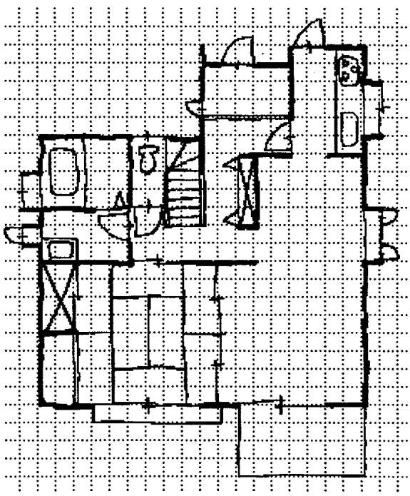  
Fig. 1. Example of hand-sketched floor plan.

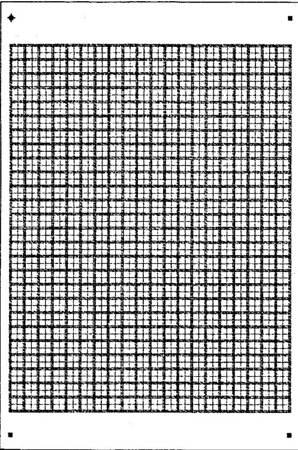  
Fig. 2. Floor-plan form.

Actually, the architect has a free choice of drawing tools such as mechanical pencils, pencils, crayons, and many others. Since the proposed system restricts the use of drawing tools to mechanical pencil and design pen, some architects might feel somewhat uncomfortable, being deprived of their favorite tools. Such restrictions, however, seem quite justifiable considering that the proposed system aims at maintenance of recognition accuracy level while reducing input cost.

# 2.3. Objects to be recognized, and their representation

This system is intended to recognize relatively accurate hand-sketched drawings, though not implying that a ruler or other tools must be used. The drawing is assumed to be sketched by a professional architect or draftsman. Actually, notation of floor plans has not been unified com

# 2.2. Drawing tools

Two kinds of drawing tools with rather stable linewidth were utilized to ensure an acceptable level of recognition accuracy:

x mechanical pencil with linewidth of $0 . 5 \mathrm { m m }$ x design pen with linewidth of $1 \mathrm { m m }$

Architects use a variety of drawing tools for their sketches but most common tools are likely to be pencils and mechanical pencils that allow using erasers. In particular, mechanical pencils are beneficial in that a stable linewidth is supported. That is the reason a mechanical pencil was chosen here as one of the drawing tools.

When drawing a floor plan, most elements are drawn in thin lines; in the case of walls, however, borders are first drawn, and then the inside space is filled or hatched. In the proposed system, a design pen with a linewidth of $1 \mathrm { m m }$ is employed to draw such elements. Such a linewidth is big enough to ensure reliable discrimination with lines drawn by mechanical pencil, which is important in recognition processing. However, lines drawn by design pen cannot be deleted with eraser, hence erroneous lines must be removed using correction fluid or some other means.

Table 1. Architectural elements and their glyphs   

<table><tr><td rowspan=1 colspan=2>Architectural elements</td><td rowspan=2 colspan=1>Examples ofnotation</td></tr><tr><td rowspan=1 colspan=1>Classes</td><td rowspan=1 colspan=1>Subclasses</td></tr><tr><td rowspan=1 colspan=1>Wall</td><td rowspan=1 colspan=1>Full wallHalf wall</td><td rowspan=1 colspan=1>Wall   Half wall</td></tr><tr><td rowspan=1 colspan=1>Slidingstormdoors</td><td rowspan=1 colspan=1></td><td rowspan=1 colspan=1></td></tr><tr><td rowspan=1 colspan=1>Slidingelements</td><td rowspan=1 colspan=1>Two-leafsliding elementThree-leafsliding elementFour-leafsliding element</td><td rowspan=1 colspan=1>Two-leaf sliding elementThree-leaf sliding element</td></tr><tr><td rowspan=1 colspan=1>Foldingelements</td><td rowspan=1 colspan=1>Two-foldelementFour-foldelementOthers</td><td rowspan=1 colspan=1>∇∇Four-fold element</td></tr><tr><td rowspan=1 colspan=1>Swingingelements</td><td rowspan=1 colspan=1>Single-swingDouble-leafDifferent-double-leaf</td><td rowspan=1 colspan=1>Double-leaf   Different-double-leaf</td></tr><tr><td rowspan=1 colspan=1>Closet</td><td rowspan=1 colspan=1></td><td rowspan=1 colspan=1>区</td></tr><tr><td rowspan=1 colspan=1>Japaneseroom</td><td rowspan=1 colspan=1>3 to 12 jo(a unit ofarea about1.5m2)</td><td rowspan=1 colspan=1></td></tr><tr><td rowspan=1 colspan=1>Stairs</td><td rowspan=1 colspan=1>Straight portionCurved portion</td><td rowspan=1 colspan=1>  四Straight Curvedportion portion</td></tr></table>

pletely, and individual features may well be present. The possibility of multiple representations for the same architectural element would make recognition more uncertain, and hence would impair the recognition rate. Therefore, with the proposed system, a unique notation for each architectural element is defined. Architectural elements to be recognized using the proposed system are listed in Table 1 along with their representations.

The notation in Table 1 was developed as a result of polling many architects. Of course, it is possible that some architects normally use different glyphs. However, the proposed notation is not unusual, so that hardly any professional would not be able to understand it, and it would only take light training to get accustomed to it.

# 3. Algorithm

Architectural elements involved in floor plans may be divided into two groups. The first group includes line elements represented by single or double lines (walls, storm doors, sliding elements, and openings of folding elements in Table 1). Such line elements serve to partition floor space, hence they are drawn along the gridlines. Elements of the second group are closed areas confined by line elements (triangular parts of folding elements, swinging elements, closets, Japanese rooms, and stairs in Table 1).

With the proposed system, precise recognition of elements of the two types is achieved in the following way. As input and preprocessing are completed, elements of each type are put through separate procedures of feature extraction, that is, line elements and area elements are processed in parallel as shown in Fig. 3. With line element extraction, attributes of segments on gridlines and attributes of crossings are extracted, while with area element extraction, the shape of closed areas confined by line segments is found through pattern matching. The results are then integrated and converted into architectural elements using a knowledge base.

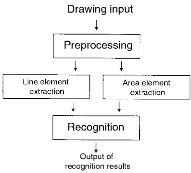  
Fig. 3. Processing flow.

The above-mentioned processing stages are explained below.

# 3.1. Preprocessing

After a drawing is input via image scanner, the image data are put through preprocessing that includes noise removal, slant correction, grid alignment detection, and so forth. First, general preprocessing is performed, such as removal of isolated noise and recovery of line breaks. Then slant correction is performed by detection of the corner marks on the design paper, and the grid is aligned using the four marks.

# 3.2. Line extraction

Since line elements refer to partitions, such elements are drawn along the gridlines which correspond to the conventional Japanese module of 3 shaku $( 9 1 0 \mathrm { m m } )$ , or its half. Therefore, line elements, even though shifted slightly, can be corrected by alignment with the gridlines, which provides robustness against fluctuations in hand-sketching. This is implemented in line extraction processing to obtain attributes of line segments and crossings.

# 3.2.1. Extraction of line attributes

In line extraction, the following attributes are dealt with: positions of segment terminals, direction, and line type (single/double, bold/thin). Conventional methods are normally based on vectorization using line thinning [1, 2]. Such an approach, however, is not adequate in our case because of a number of problems: noise is likely to occur near crossings and branch points, line contacts cannot be processed reliably, and information about linewidth cannot be acquired easily. For this reason, the authors adopted another approach that involves finding line attributes by scanning through a rectangular window.

As shown in Fig. 4, a scanning window of fixed size (across line: 64 bit, along line: 8 bit) is moved successively along horizontal and vertical gridlines to acquire pixel data. With these pixel data being input data, projections along the gridlines are found as shown in Fig. 5, and then binarized using a certain threshold (in our experiments, the threshold was set to 4). From the binary data, width data $t _ { k }$ (00: no line, 01: thin line, 02: bold line, 03: other) are found for up to three line segments $1 \leq k \leq 3$ , and represented as a code pattern $( t _ { 1 } , t _ { 2 } , t _ { 3 } )$ .

In the example shown in Fig. 5, a double line (thin– bold) is extracted, therefore the code pattern is (01, 10, 00). In such code patterns obtained at very small intervals, some noise is inevitable; hence, smoothing is performed through integration of associated patterns and removal of outliers.

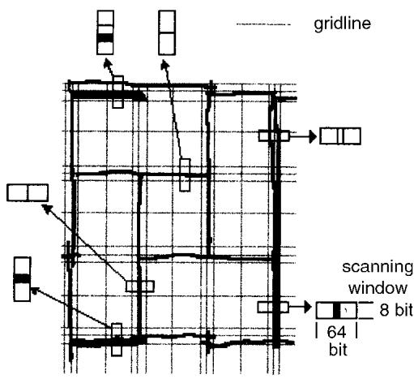  
Fig. 4. Line feature extraction.

# 3.2.2. Extraction of crossing attributes

With line attribute extraction as described above, stable processing is ensured generally but false results are often obtained at line crossings. This is because a horizontal line may be noise when seeking attributes of a vertical line, and vice versa. Therefore, with the proposed system, attributes of line segments at grid nodes are ignored, and crossing attributes are set so that line segments are not discontinuous.

Since four line segments may exist near a crossing (upper and lower vertical segments, right and left horizontal segments), crossing attributes vary depending on the presence and width of such segments. In the example shown in Fig. 6, thin line segments are present to the right and to the left, and one bold line segment is present at the top. Therefore, the crossing attribute is “inverted T-branch with bold vertical.”

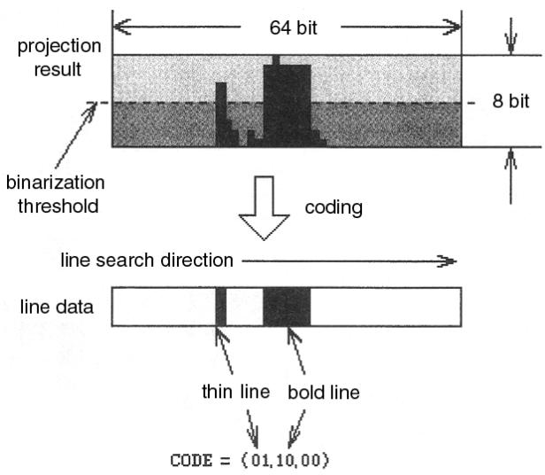  
Fig. 5. Line attribute extraction.

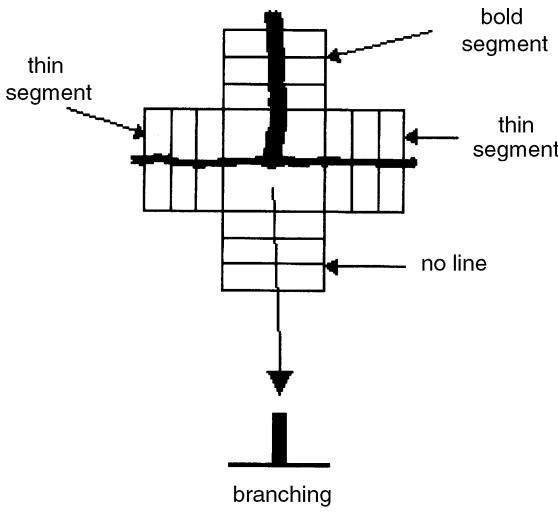  
Fig. 6. Crossing attribute extraction.

# 3.3. Area extraction

With most existing techniques for drawing recognition, black areas (that is, line segments) are employed. When such an approach is applied to area elements, an element may be converted into multiple line segments combined with a linear array of feature points such as crossing points, branching points, or bending points, and then matched to a set of models. Normally, when input data are of poor quality, extraction of such feature points becomes difficult, and model matching does not proceed smoothly.

On the other hand, if white areas, that is, background parts, are employed, one deals with certain configurations of one or more basic patterns (e.g., rectangle, triangle, fan-shaped). For example, a closet is composed of four triangles with one common vertex in the middle, while a Japanese room is a certain combination of rectangles. Thus, when using background areas, one can avoid unstable extraction of feature points; in addition, model matching becomes very simple. This approach was adopted in this study.

The concept of area extraction is shown in Fig. 7. First, contours of closed areas (confined by line segments) are found through tracing white pixels adjoining the borders from inside. After that, the inside area is filled. Finally, the filled shape is normalized by size, and recognized by matching with prerecorded basic patterns. The basic patterns are squares, triangles, circles, and other primitive shapes that make up architectural elements as shown in Fig. 8.

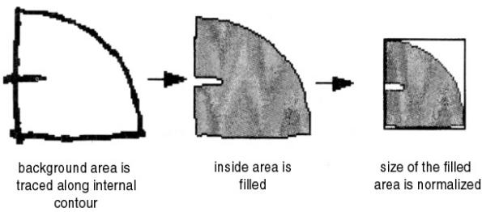  
Fig. 7. Closed area extraction.

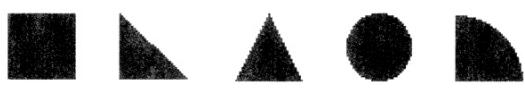  
Fig. 8. Basic pattern shapes.

With such area extraction, line segments that describe an area element are assumed to make a closed loop. Otherwise, recognition is impossible. Therefore, prior to area extraction, preprocessing is performed to fill line breaks of $2 \mathrm { m m }$ or less.

# 3.4. Recognition of elements

Line elements and area elements extracted as explained above are used for recognition; in so doing, notation rules (knowledge) are applied to each architectural element. Since lines and areas are extracted independently, there is a possibility that contradictory results are obtained for the same location. In such cases, basically, area elements are given priority while line elements are corrected or removed. The basic rules for recognizing architectural elements are listed in Table 2. It should be noted that certain size constraints are also imposed. For example, one fan-shaped component of a swing element is to be $1 . 5 \times 1 . 5$ unit or smaller, and triangles making a folding door are to be $1 \times$ 1 unit or smaller.

First of all, “walls” are defined using line attributes obtained in line feature extraction. All other architectural elements are defined through a combination of results obtained in line and area extraction. For example, in the case of swinging elements, processing starts as soon as a fanshaped component is found in the course of area extraction.

Initially, a “single-swing” is assumed, and this assumption is then confirmed if both ends adjoin walls. If two or more fan-shaped components are detected, “double-leaf” or “different-double-leaf” is assumed, and then both ends are checked on adjoining walls; if the conditions are not satisfied, then such an element is disregarded.

In the case of sliding elements, any element with both ends adjacent to walls (except for swinging elements and folding elements) is considered. In so doing, double-cross connections are checked, and depending on their number, a distinction is made between two-leaf, three-leaf, and four-leaf elements.

# 4. Evaluation Experiments

First, recognition performance was evaluated using actual hand-sketched drawings to prove the validity of the algorithm. The efficiency of the proposed algorithm in terms of labor saving in offline data input was also estimated by comparison with a commercial CAD system.

# 4.1. Evaluation of recognition performance

In evaluation of recognition performance, five types of floor plans (five sets of first floor and second floor plans) drawn by three persons (not professionals) five times each (a total of 150 sketches) were used. The sketches were drawn freehand, without templates or rulers.

Figure 1 presents an example of such a sketch. In the diagram, there are some architectural elements that are not yet supported by the proposed system, such as the kitchen set at the top right, the bathtub at the top left, or the dresser below it. Such home equipment appears inevitably on floor plans, and however instructed, architects would likely draw those elements unconsciously. Such elements beyond the recognition range cause errors, but they were not eliminated purposely in evaluation experiments, because they are likely to appear in actual operation. An example of recognition results is shown in Fig. 9; as seen, errors occurred with the unauthorized elements (shown in circles). On the other hand, walls and door elements are used most frequently, constituting 63 and $2 5 \%$ , respectively, of all architectural elements in the mentioned 150 sketches.

In the evaluation tests, the following figures were counted: “total” (all elements to be recognized), “recognized” (elements recognized in terms of type, position, and orientation), “misrecognized” (elements not recognized in an appropriate way so that manual correction was applied), and “error” (erroneous output results that had to be deleted).

Listed in Table 3 are average figures per set (two floor plans) of the above-mentioned 150 drawings (total of 9838 elements). As seen, $9 3 . 1 \%$ of all elements were recognized correctly, with the other $6 . 9 \%$ misrecognized, and errors constituted $1 6 . 5 \%$ of the total. The average number of misrecognized elements and errors (that is, number of elements to be corrected) was about 9 and 22, respectively, per set of floor plans. The misrecognition rate was highest with half walls $( 2 6 . 6 \% )$ , followed by sliding storm doors $( 1 6 . 9 \% )$ . As to half walls, the reason is that thin line triangles at curved portions of stairs may be easily misinterpreted as double lines. In the case of sliding storm doors, the main reason for misrecognition is the failure to recognize sliding elements located nearby. The high error rate is related to the presence of unauthorized elements, as explained above.

Table 2. Basic rules for architectural elements   

<table><tr><td colspan="3">Architectural elements</td></tr><tr><td>Classes</td><td>Basic rules Subclasses</td><td></td></tr><tr><td rowspan="3">Wall Sliding storm doors</td><td>Full wall</td><td>&quot;single bold segment&quot;</td></tr><tr><td>Half wall</td><td>&quot;double thin segment&quot;</td></tr><tr><td>Two-leaf</td><td>&quot;&#x27;double thin/bold segment&quot; and &quot;&#x27;next to a sliding element&#x27;&quot; &quot;two thin segments connected by double cross&#x27; and &quot;both ends</td></tr><tr><td rowspan="4"></td><td></td><td>adjacent to walls&quot; &quot;three thin segments connected by double cross&#x27;&quot; and &quot;both ends</td></tr><tr><td>Three-leaf</td><td>adjacent to walls&quot;</td></tr><tr><td>Four-leaf</td><td>&quot;four thin segments connected by double cross&#x27;&quot; and “both ends adjacent to walls&#x27;&quot;</td></tr><tr><td>Two-fold</td><td>&quot;thin segment&quot; and &quot;a triangle at one end&quot; and &quot;both ends adjacent to walls&#x27;&quot;</td></tr><tr><td rowspan="5">Swinging elements</td><td>Four-fold</td><td>&quot;&#x27;thin segment&#x27;&quot; and &quot;&#x27;triangles at both ends&#x27;&quot; or &quot;&#x27;two triangles at one end&quot; and &quot;both ends adjacent to walls&#x27;&quot;</td></tr><tr><td>Other</td><td>&quot;thin segment&#x27;&quot;&#x27; and &quot;three or more triangles at one end or at both ends&#x27;&quot; and &quot;both ends adjacent to walls&quot;</td></tr><tr><td>Single-swing</td><td>&quot;fan-shaped element&#x27;&quot; and &quot;both ends adjacent to walls&#x27;&quot; &quot;&#x27;two adjacent fan-shaped elements of nearly same size&quot; and</td></tr><tr><td>Double-leaf</td><td>&quot;both ends adjacent to walls&quot;</td></tr><tr><td>Different-double-leaf</td><td>&quot;two adjacent fan-shaped elements of different size&quot; and &quot;both ends adjacent to walls&#x27;&quot;</td></tr><tr><td rowspan="4">Closets Japanese room Stairs</td><td></td><td>&quot;four triangles with common vertex&quot;</td></tr><tr><td>3 j0, 4.5 jo, 6 jo, 8 jo, 10 jo, 12 jo</td><td>&quot;&#x27;specific arrangement of rectangles 1 × 2 unit&quot;</td></tr><tr><td>Straight</td><td>&quot;three or more adjacent rectangles 1–1.5 unit&#x27;&quot; and &quot;both ends</td></tr><tr><td>Curved</td><td>adjacent to walls or half walls&quot; &quot;&#x27;two or more triangles within 1.5 × 1.5 unit&quot;</td></tr></table>

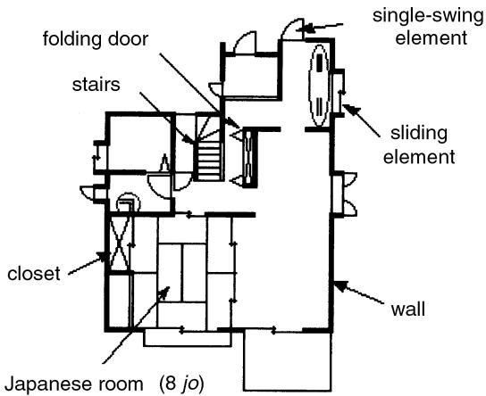  
Fig. 9. Example of recognition results.

Table 3. Results of recognition performance test   

<table><tr><td></td><td>Total Recognized</td><td>Mis- recognized</td><td>Error</td></tr><tr><td>No. of 131.2 elements</td><td>122.1</td><td>9.1</td><td>21.7</td></tr><tr><td>(percentage) (100.0%)</td><td>(93.1%)</td><td>(6.9%)</td><td>(16.5%)</td></tr></table>

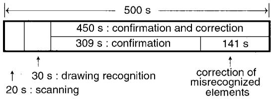  
Fig. 10. Time breakdown for automatic input.

# 4.2. Input time

To confirm the labor-saving effect provided by the offline recognition system described in the paper, input time was compared (1) for drawings recognized automatically by the system and then checked and corrected, and (2) for manual mouse input using a commercial CAD software. The CAD software used for comparison was not a general-purpose package but a special-purpose package suitable for floor-plan input (offering a library of architectural elements and other features). In both cases, drawing time was excluded from comparison (10 to 20 minutes is needed to sketch a plan).

When measuring input time, one set (two plans) of each aforementioned type was used, that is, a total of 10 sketches. Before the experiments, 8-hour training was given. In the case of automatic input, elements that could not be recognized were then input manually. After a cycle of recognition and correction was completed, all undefined elements in recognition results were assumed to be “errors,” and were deleted all at once.

Presented in Table 4 are average results for input time in the cases of manual input and automatic input. As seen, the average input time with the proposed system is $5 0 0 \mathrm { s } .$ , which is one-ninth that for manual input. Considering that the average number of elements per floor-plan set was 131, the input time per element was about 34.2 s in the case of manual input, and about $3 . 8 \mathrm { s }$ in the case of automatic input. The components of input time for the proposed automatic input are shown in Fig. 10. The time required for scanning and recognition processing (using a Pentium 166 MHz PC) is only $10 \%$ of the total input time (50 s) while $90 \%$ (450 s) is taken up by confirmation and correction of recognition results, namely, 309 s for confirmation and 141 s for correction of misrecognized elements. Thus, confirmation and correction per element takes 2.4 and $1 5 . 5 ~ \mathrm { s }$ , respectively. Confirmation takes less time with the automatic input as compared to the manual input (34.2 s) which may be explained by the ease of locating elements using spatial relations with surrounding elements.

Table 4. Comparison of input time   

<table><tr><td>Method</td><td>Input time per plan</td></tr><tr><td>Manual input</td><td>4447 s (74 min 37 s)</td></tr><tr><td>Input by recognition (automatic)</td><td>500 s (8 min 20 s)</td></tr></table>

# 5. Conclusions

Presented in the paper is a prototype system, Sketch Plan, for interpreting hand-sketched floor plans that supports automatic extraction and recognition of handsketched walls, doors, stairs, and other architectural elements. This system offers robustness to fluctuations (inaccuracy) in hand sketching by means of an algorithm for separate extraction of line segments and area elements, followed by integration. The efficiency of the proposed algorithm was proved through evaluation tests.

Results of performance evaluation confirmed a recognition rate of $93 \%$ which is quite adequate in practical terms. In addition, the proposed system offered an input time one-ninth that for mouse-based manual input. Thus, offline recognition of scanned hand-sketched floor plans was proved efficient.

At the present stage, kitchen sets, bathtubs, and some other architectural elements are beyond the range of recognition. However, such elements can be represented using basic patterns as described in Section 3.3; hence they could be recognized using the same algorithm. The authors plan to report on this in the future, as well as to extend the proposed system to a wider application range.

Acknowledgments. The authors would like to express their gratitude to Dr. Takashi Sakai, former head of Autonomous Robot Systems Lab. at NTT Human Interface Laboratories, and Dr. Kazuyoshi Tateishi, group leader at NTT Human Interface Laboratories, for their help and encouragement, as well as to Dr. Kenji Kogure, head of Autonomous Robot Systems Lab., and Dr. Eiji Mitsuya, former group leader, for their guidance and support.

# REFERENCES

1. Filipski AJ, Flandrena R. Automated conversion of engineering drawings to CAD form. Proc IEEE 1992;80:1195–1209.   
2. Hori O, Shimotsuji S, Hoshino F, Ishii T. Line-drawing interpretation using probabilistic relaxation. Machine Vision Applications 1993;6:100–109.   
3. Lee S-W. Recognizing hand-drawn electrical circuit symbols with attributed graph matching. Structured Document Image Analysis. Springer-Verlag; 1992. p 340–358.   
4. Boatto L, Consorti V, Buono MD, Zenzo SD, Eramo V, Esposito A, Melcarne F, Meucci M, Morelli A, Mosciatti M, Scarci S, Tucci M. An interpretation system for land register maps. Computer   
1992;25:25–33.   
5. Vaxiviere P, Tombre K. Celesstin: CAD conversion of mechanical drawings. Computer 1992;25:46–54.   
6. Dori D, Liang Y, Dowell J, Chai I. Sparse-pixel recognition of primitives in engineering drawings. Machine Vision Applications 1993;6:69–82.   
7. Special Issue: Devices and systems for graphic input. PIXEL No. 130, p 20–23, 1993. (in Japanese)   
8. Aoki Y, Shio A, Arai H, Odaka K. A prototype system for interpreting hand-sketched floor plans. ICPR’96, Vol. 3, p 747–751.   
9. Endo K. T-Board: hand-drawn input system. Preprints of 18th Conference on Construction Information Systems, p 215–227, 1990. (in Japanese)

# AUTHORS (from left to right)

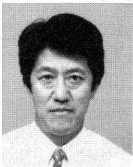

Akio Shio (member) graduated from Hokkaido University (applied physics) in 1974 and completed postgraduate studies in 1976. He then joined NTT, and presently is a senior researcher at NTT Human Interface Laboratories. His research interests are OCR, image processing, and image recognition. In 1989 he was a guest researcher at the University of California, Irvine. He is a member of the Information Processing Society of Japan.

Yasuhiro Aoki (member) graduated from Utsunomiya University in 1987 and completed postgraduate studies in 1989. He then joined NTT, and presently is a researcher at NTT Human Interface Laboratories. His research interest is image recognition systems. He is a member of the Information Processing Society of Japan.