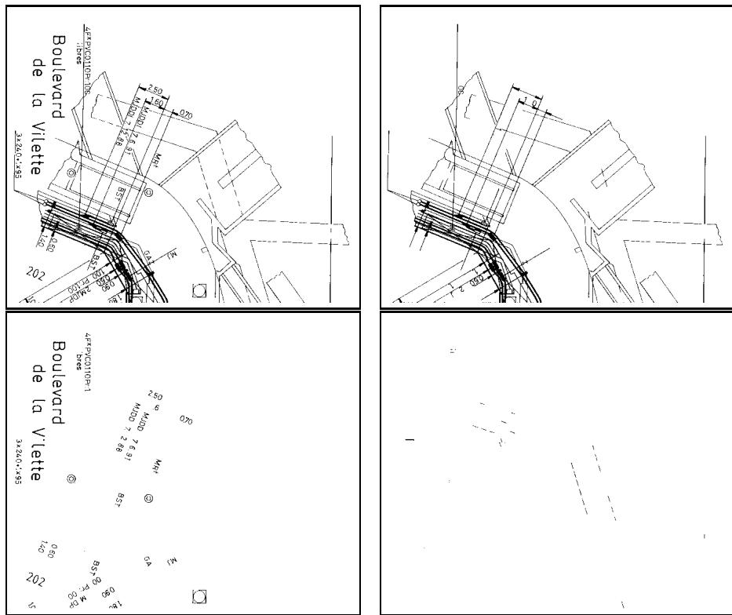
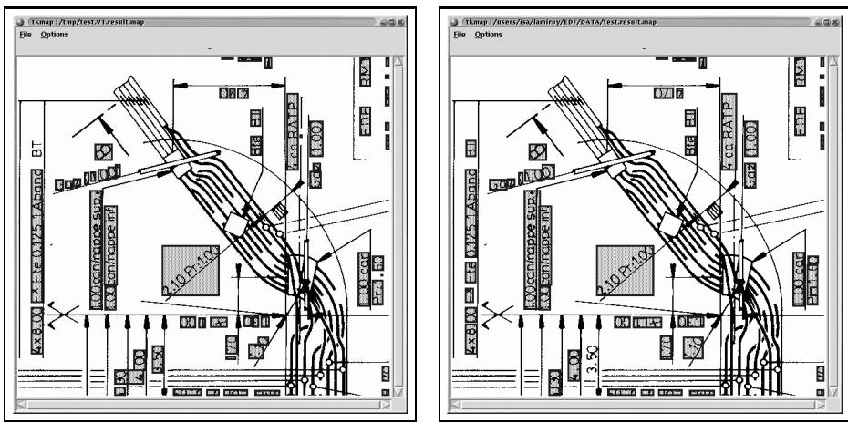
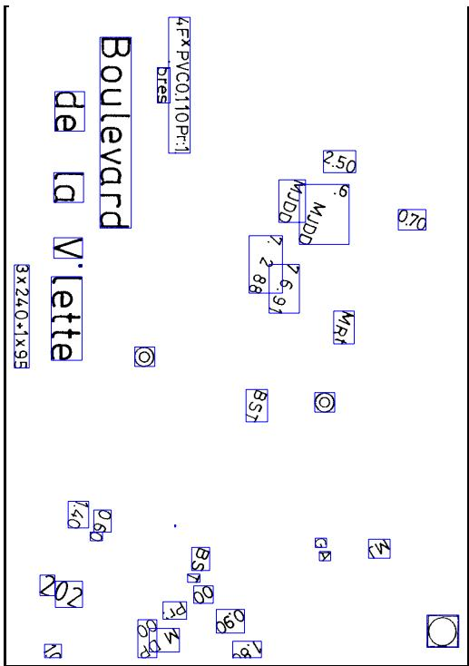
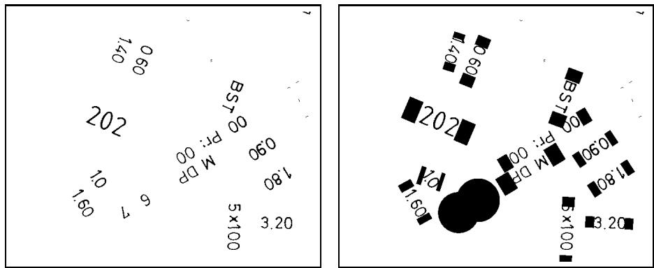
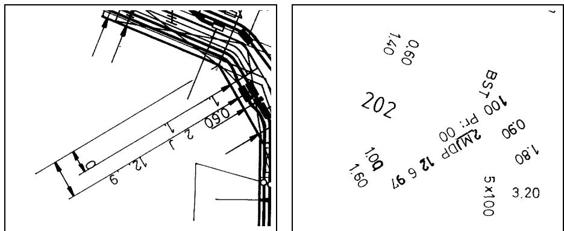
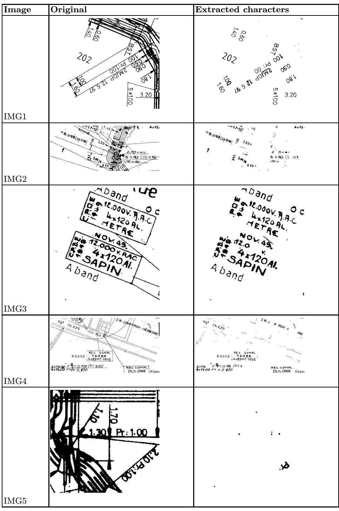

# Text/Graphics Separation Revisited

Karl Tombre, Salvatore Tabbone, Loïc Pélissier, Bart Lamiroy, and Philippe Dosch

LORIA, B.P. 239, 54506 Vandœuvre-lès-Nancy, France

Abstract. Text/graphics separation aims at segmenting the document into two layers: a layer assumed to contain text and a layer containing graphical objects. In this paper, we present a consolidation of a method proposed by Fletcher and Kasturi, with a number of improvements to make it more suitable for graphics-rich documents. We discuss the right choice of thresholds for this method, and their stability. We also propose a post-processing step for retrieving text components touching the graphics, through local segmentation of the distance skeleton.

# 1 Introduction

In document image analysis, the text/graphics separation process aims at segmenting the document into two layers: a layer assumed to contain text—characters and annotations—and a layer containing graphical objects. As the recognition tasks to be performed are quite different between these two layers, most authors perform this separation very early in the document analysis chain, which means that it is usually performed through image processing tools, with limited knowledge about the presence of higher-level objects.

Many methods have been proposed for extracting text from cluttered background and segmenting the document image. One of the best known method is that of Wong, Casey and Wahl [20], with its many adaptations and improvements [12]. However, whereas RLSA filtering has proved its efficiency in segmenting textual documents, its use in graphics-rich documents is less frequent; one of the few methods we are aware of is that of Lu [13]. Other methods used for text-rich documents include those based on white streams [18] and the top-down methods using some kind of X–Y decomposition of the document [1, 16].

In the special case of forms, text often touches the graphics, but the latter are mainly horizontal and vertical lines, which gives the possibility to explicitely look for these kinds of lines, with techniques such as the Hough transform, for instance [10].

But in the general case of graphical documents, lines are more complex and all these approaches are not very efficient. In this case, we are aware of three basic families of methods for separating text and graphics:

Some authors perform directional morphological filtering to locate all linear shapes and thus separate them from the other shapes, which are considered to be text. This works especially well for simple maps [14, 15], although it remains to be seen how scalable the approach is when the complexity of the drawing grows.

Similarly, other authors look for the lines, either on the distance transform [11], or on a vectorization of the document image [7].

A third approach, used by many people, is based on the analysis of the connected components, which are filtered through a set of rules for determining to which layer they belong. One of the best known algorithms for performing this was proposed by Fletcher and Kasturi [9]. This method has proved to scale remarkably well with increasingly complex documents, although it is of course not able to directly separate text which is touching the graphics.

In this paper, we present a consolidation of the method proposed by Fletcher and Kasturi, with a number of improvements to make it more suitable for graphics-rich documents, with discussion about the choice of thresholds, and we propose a post-processing step for retrieving text components touching the graphics.

# 2 Separation through Analysis of Connected Components

Because of the scalability of the Fletcher & Kasturi method, we have chosen to base our own text/graphics separation on it, as we work with many kinds of complex graphics documents [8]. As Fletcher and Kasturi designed their method for mixed text–graphics documents, whereas we work with engineering drawings, maps, etc. we felt the need for adding an absolute constraint on the length and width of a text component; however, this does not add a new parameter to the method, as this constraint is set to $\sqrt { T _ { 1 } }$ (see below).

The method yields good results, but there is still a problem with dashes and other elongated shapes. It is impossible to clearly discriminate, only on image features, $\mathbf { a } \ll \mathbf { I } \gg \mathbf { o r } \ll \mathbf { l } \gg$ character from a dash, for instance. We therefore propose to separate size filtering from shape filtering. As a consequence, we now have three layers at the end of the process, instead of two: small components, assumed to be text, large components, assumed to be graphics, and small elongated components, which are added to a specific layer and used at later stages both by dashed lines detection and by character string extraction.

Of course, another problem remains, that of text touching the graphics; we will come back to this in sections 3 and 4. The modified algorithm is the following—changes to the original Fletcher and Kasturi method are emphasized:

compute connected components of the image, and the histogram of the sizes of the bounding boxes for all black components;   
find most populated area in this histogram, $A _ { m p }$ being the number of components in this area; compute average of histogram and let $A _ { a v g }$ be the number of components having this average size;   
set a size threshold for bounding boxes, $T _ { 1 } = n \times \operatorname* { m a x } ( A _ { m p } , A _ { a v g } )$ , and a maximum elongation threshold for the bounding boxes, $T _ { 2 }$ ;   
filter the black connected components, adding to the text layer all those having an area lower than $T _ { 1 }$ , a $\textstyle { \frac { \mathrm { h e i g h t } } { \mathrm { w i d t h } } }$ ratio in the range $[ \frac { 1 } { T _ { 2 } } , T _ { 2 } ]$ , and both height and width lower than $\sqrt { T _ { 1 } }$ T, the other components being added to the graphics layer; compute   1 of each component labeled as text by previous step;   
set a density threshold $T _ { 3 }$ and an elongation threshold $T _ { 4 }$ ;   
– Compute density of each “text” component with respect to its best enclosing rectangle and the elongation ratio of this rectangle—if the density is greater than $T _ { 3 }$ and the elongation is greater than $T _ { 4 }$ , reclassify the component as “small elongated component”, i.e. add it to the third layer.

Figure 1 illustrates the results of the method on a drawing, with $T _ { 1 } = 1 . 5 \times$ $\operatorname* { m a x } ( A _ { m p } , A _ { a v g } )$ , $T _ { 2 } = 2 0$ , $T _ { 3 } = 0 . 5$ and $T _ { 4 } = 2$ . The small noise components are mp avgpruned by a simple pre-processing step.

  
Fig. 1. A drawing and the three layers obtained by the method.

In such a method, the stability of the thresholds is an important criterion for the robustness of the algorithm. In this case, $T _ { 1 }$ is defined proportionnally to $\operatorname* { m a x } ( A _ { m p } , A _ { a v g } )$ , the $n$ factor being stable provided that there is only one mp avgcharacter size. If the character size is very homogeneous, $n$ can be set to 3, but for irregular sizes a lower value may be necessary for satisfying results. The $T _ { 2 }$ set at 20 yields good results for all the documents we have worked on. The minimum density threshold $T _ { 3 }$ must be set around 0.5 when the character contours are noisy. The minimal elongation factor $T _ { 4 }$ is dependent of the kinds of dashes present in the drawing; in our case a value of 2 has proved to be satisfactory.

# 3 Extracting the Character Strings

Fletcher and Kasturi’s method includes a method for grouping the characters into strings. This classically uses the Hough Transform (HT), working on the center of the bounding boxes of all components classified as text. The main steps are the following:

compute average height $H _ { a v g }$ of bounding boxes in the text layer, and set asampling step of the HT to $c h d r \times H _ { a v g }$ , where chdr is a given parameter;   
avg look for all horizontal, vertical and diagonal alignments by voting in the $( \rho , \theta )$ space;   
$-$ segment each alignment into words: • compute mean height $\bar { h }$ of words in the alignment, • sort characters along main direction, • group into a word all successive characters separated by less than $\mu \times h$ , where $\mu$ is a given factor. We tested two options: 1. process first the highest votes of the HT, and do not consider characters already grouped in a first alignment when processing lower votes; 2. give the possibility to each character to be present in more than one word hypothesis, and wait until all votes are processed before eliminating multiple occurrences, by keeping the longest words.

Surprisingly, as illustrated by Fig. 2, it is difficult to choose a “best” option looking at our experimental results, whereas we expected the second option to be better than the first!

The two parameters of the method are chdr and $\mu$ . chdr adjusts the sampling step of the HT. It is difficult to find a stable value for it. When it is too low, the vote space is split into too many meshes, which may over-segment the strings. On the other hand, when the value gets too high, some separate strings may end up being merged.

$\mu$ adjusts the maximum distance allowed between characters in the same string. Of course, this may also over-segment or under-segment the strings. Our default value is 2.5, and this seems to be much more stable than chdr. Figure 3 illustrates the result with $\mu = 2 . 5$ and $c h d r = 0 . 4$ .

The method has still a number of limitations:

  
Fig. 2. String extraction — options 1 and 2.

  
Fig. 3. String extraction.

Short strings are not reliably detected, as there are not enough “votes” to discriminate them efficiently from artefacts.   
When there are several parallel strings, the method may find artificial diagonal alignments—however, this can be dealt with using heuristics on the privileged directions in the drawing.   
Punctuation signs, points on “i” characters and other accents, are not really aligned with the other characters in the string. To include them in the strings, we have to relax the parameters, thus opening up for wrong segmentations at other places.

However, despite these limitations, the results are sufficiently reliable to be usable as a basis for further processing, and for interactive edition if necessary.

# 4 Finding Characters Connected to the Graphics

One of the main drawbacks of methods based on connected components analysis is that they are unable to extract the characters wich touch the graphics, as they belong to the same connected component. By introducing some extra a priori knowledge, it is possible to actually perform this separation:

If the shape of the lines is known a priori, which is the case in forms or tables, for instance, a specific line finder can extract the lines separating the areas in the table or the form; see for instance a vectorizer such as FAST [4]. If the width of some of the strokes is known–typically, the width of writing on noisy backgrounds, or the width of the graphical lines in the drawing, it is possible to introduce some stroke modeling to retrieve one layer of strokes having a well-known width, thus separating it from other lines and strokes.

In this work, we propose a more general approach, where there is no need for this kind of a priori knowledge. Still, we use some assumptions:

we assume that text is mostly present as strings, and not as isolated characters;   
we also assume that the complete strings are not touching the graphics, but that at least some of the characters have been found by the previous segmentation step.

# 4.1 Extension of the Strings

Our proposition is to start with the strings found by the previous step, and to extend them, looking for additional characters in specific search areas. Of course, as noted, we are aware of the fact that this strategy will not retrieve strings where all the characters are connected with the graphics, as there would be no “seed string” from which we could define a search area. Still, the presence of a single character connected to graphics occurs often enough for our strategy to increase significantly the performances of the segmentation, as we will see.

The HT gave a first idea about the direction of each string; however, as it “votes” for cells, this is not precise enough, and the first step is to determine more precisely the orientation of each string found, by computing the equation of the best line passing through all the characters. If the string has more than 4 points, this can be done through robust regression (median regression); for shorter strings we use linear regression, although we know that this is very sensitive to outliers.

Once the direction is found, we compute the enclosing rectangle of the string, along this direction; this gives us a much better representation of the string’s location than the starting bounding box. From this rectangle, we compute search areas, taking into account the mean width of the characters and the mean spacing between characters in the string. Figure 4 illustrates the search areas defined in this way. When the string has only one character, the search area is a circle, as we have no specific direction for the string.

  
Fig. 4. Starting text layer and search areas for extending the strings.

# 4.2 Segmentation of the Skeleton

We first look in the third layer, that of small elongated shapes. If some of these shapes are included in a search area, they are added to the string.

We then look for possible characters connected to graphics in these search areas. This is done by computing the 3–4 distance skeleton in each search area, using Sanitti di Baja’s algorithm [6]. The basic idea is then to segment the skeleton, reconstruct each part of the skeleton independently, and retrieve those part which are candidates to be characters to be added to the string. This is very similar to the idea proposed by Cao and Tan [2, 3]; another possible approach is to use Voronoi tesselations [19].

For segmenting the skeleton, we based ourselves on a method proposed by Den Hartog [5], which identifies the points of the skeleton having multiple connectivity. However, in our case, this would over-segment the skeleton; therefore, we only segment the skeleton into subsets which are connected to the parts of the skeleton outside the search area by one and only one multiple point2. The multiple points found in this way are the segmentation points of the skeleton. We do not take into account those parts of the skeleton which intersect the border of the search area.

Each part extracted by this segmentation is reconstructed using the inverse distance transform. Figure 5 illustrates the results of the method.

  
Fig. 5. Graphics layer where we segment the skeleton in the search areas defined in figure 4, and result of the string extraction.

Of course, the method has some limitations:

as previously said, the method does not retrieve a string completely connected to the graphics, such as the 0.60 string, as there is no seed string;

when the computed string orientation is not correct (which may happen for short strings, especially, as the regression is not robust in this case), we may miss some characters—in the figure, we fortunately retrieved the second 0 of the 1.00 string, but it might easily have been missed, as the orientation computed for the string is not correct (see Fig. 4), so that the search area is also wrong;

whereas characters such as J in the string 2MJDP are retrieved inside the seed string M DP, it is not the case for the 1 character of string $\mathtt { P r } \colon 1 0 0$ , which intersects the search area both at the top and at the bottom.

# 5 Evaluation and Conclusion

We give here some quantitative measures on extracts from several drawings (Fig. 6). The   column indicates the number of characters counted by an operator, in each image. The $\mathbf { T } / \mathbf { G }$ column shows the number of characters found T/Gby the text/graphics separation method described in Sect. 2, and the percentage of real characters thus found. The  shows the number of characters reRetr.trieved by the method described in Sect. 4, out of the total number of connected characters. The  column shows the total number of characters found after Totalthe retrieval step, and the corresponding percentage. The  column shows Errorsthe number of components errouneously labeled as being text at the end of the whole process. It must be noted that most of these errors stem from the initial segmentation, not from the retrieval step.

<table><tr><td rowspan=1 colspan=1>Imageid</td><td rowspan=1 colspan=1>Nb. ch.</td><td rowspan=1 colspan=1>T/G</td><td rowspan=1 colspan=1>[Rtr(id:</td><td rowspan=1 colspan=1>Total</td><td rowspan=1 colspan=1>Errors</td></tr><tr><td rowspan=1 colspan=1>IMG1</td><td rowspan=1 colspan=1>63</td><td rowspan=1 colspan=1>50(79%)</td><td rowspan=1 colspan=1>8/13</td><td rowspan=1 colspan=1>58 (92%)</td><td rowspan=1 colspan=1>7</td></tr><tr><td rowspan=1 colspan=1>IMG2</td><td rowspan=1 colspan=1>92</td><td rowspan=1 colspan=1>66(72%)</td><td rowspan=1 colspan=1>5/16</td><td rowspan=1 colspan=1>71(77%)</td><td rowspan=1 colspan=1>24</td></tr><tr><td rowspan=1 colspan=1>IMG3</td><td rowspan=1 colspan=1>93</td><td rowspan=1 colspan=1>78(84%)</td><td rowspan=1 colspan=1>3/15</td><td rowspan=1 colspan=1>81(87%)</td><td rowspan=1 colspan=1>5</td></tr><tr><td rowspan=1 colspan=1>IMG4</td><td rowspan=1 colspan=1>121</td><td rowspan=1 colspan=1>95(78%)</td><td rowspan=1 colspan=1>9/26</td><td rowspan=1 colspan=1>104(86%)</td><td rowspan=1 colspan=1>71</td></tr><tr><td rowspan=1 colspan=1>IMG5</td><td rowspan=1 colspan=1>31</td><td rowspan=1 colspan=1>7 (22%)</td><td rowspan=1 colspan=1>0/0</td><td rowspan=1 colspan=1>7 (22%)</td><td rowspan=1 colspan=1>1</td></tr></table>

We see that the string extension process improves the final segmentation by 5 to $1 0 \%$ , in general. The number of false detections in IMG2 and IMG4 stem from the dashed lines. We also included IMG5 to illustrate an extreme case: as previously said, when the whole strings are connected to the graphics, there are no seeds and no gains from the method. . .

We still see room for a number of improvements:

The statistics used in the Fletcher and Kasturi method to analyze the distributions of size and elongation are quite simple, even more or less empirical. This is especially true for threshod $T _ { 1 }$ . It might be interesting to proceed with a finer statistical analysis of the histograms. The elongation criterion we use (thresholds $T _ { 3 }$ and $T _ { 4 }$ ) works on the best enclosing rectangle. Although this is better than using the bounding box of the connected component, it is still a simple rectangle. . . For shapes such as “l” or “t”, or when the boundary of the shape is noisy, the best enclosing rectangle remains a rough feature, so that the elongation criterion is not very efficient. By allowing more computation time at this stage, we may go for better elongation descriptors, such as higher order moments. An interesting alternative to the Hough transform for extracting the character strings (Sect. 3) could be to use the algorithm based on a 3D neighborhood graph of all text components, proposed by Park et al. [17].

# Acknowledgments

This work was supported by a research contract with EDF R&D. We are especially thankful to Raphaël Marc for support and fruitful discussions throughout the work on this contract.

  
Fig. 6. Some images and result of the segmentation.

# References

[1] E. Appiani, F. Cesarini, A. M. Colla, M. Diligenti, M. Gori, S. Marinai, and G. Soda. Automatic document classification and indexing in high-volume applications. International Journal on Document Analysis and Recognition, 4(2):69–83, December 2001.   
[2] R. Cao and C. L. Tan. Separation of Overlapping Text from Graphics. In Proceedings of 6th International Conference on Document Analysis and Recognition, Seattle (USA), pages 44–48, September 2001.   
[3] R. Cao and C. L. Tan. Text/Graphics Separation in Maps. In Proceedings of 4th IAPR International Workshop on Graphics Recognition, Kingston, Ontario (Canada), pages 245–254, September 2001.   
[4] A. K. Chhabra, V. Misra, and J. Arias. Detection of Horizontal Lines in Noisy Run Length Encoded Images: The FAST Method. In R. Kasturi and K. Tombre, editors, Graphics Recognition—Methods and Applications, volume 1072 of Lecture Notes in Computer Science, pages 35–48. Springer-Verlag, May 1996.   
[5] J. E. den Hartog, T. K. ten Kate, and J. J. Gerbrands. An Alternative to Vectorization: Decomposition of Graphics into Primitives. In Proceedings of Third Symposium on Document Analysis and Information Retrieval, Las Vegas, April 1994.   
[6] G. Sanniti di Baja. Well-Shaped, Stable, and Reversible Skeletons from the (3,4)- Distance Transform. Journal of Visual Communication and Image Representation, 5(1):107–115, 1994.   
[7] D. Dori and L. Wenyin. Vector-Based Segmentation of Text Connected to Graphics in Engineering Drawings. In P. Perner, P. Wang, and A. Rosenfeld, editors, Advances in Structural and Syntactial Pattern Recognition (Proceedings of 6th International SSPR Workshop, Leipzig, Germany), volume 1121 of Lecture Notes in Computer Science, pages 322–331. Springer-Verlag, August 1996.   
[8] Ph. Dosch, K. Tombre, C. Ah-Soon, and G. Masini. A complete system for analysis of architectural drawings. International Journal on Document Analysis and Recognition, 3(2):102–116, December 2000.   
[9] L. A. Fletcher and R. Kasturi. A Robust Algorithm for Text String Separation from Mixed Text/Graphics Images. IEEE Transactions on PAMI, 10(6):910–918, 1988.   
[10] J. M. Gloger. Use of Hough Transform to Separate Merged Text/Graphics in Forms. In Proceedings of 11th International Conference on Pattern Recognition, Den Haag (The Netherlands), volume 2, pages 268–271, 1992.   
[11] T. Kaneko. Line Structure Extraction from Line-Drawing Images. Pattern Recognition, 25(9):963–973, 1992.   
[12] D. X. Le, G. R. Thoma, and H. Wechsler. Classification of binary document images into textual or nontextual data blocks using neural network models. Machine Vision and Applications, 8:289–304, 1995.   
[13] Z. Lu. Detection of Text Regions From Digital Engineering Drawings. IEEE Transactions on PAMI, 20(4):431–439, April 1998.   
[14] H. Luo and I. Dinstein. Using Directional Mathematical Morphology for Separation of Character Strings from Text/Graphics Image. In Shape, Structure and Pattern Recognition (Post-proceedings of IAPR Workshop on Syntactic and Structural Pattern Recognition, Nahariya, Israel), pages 372–381. World Scientific, 1994.   
[15] Huizhu Luo and Rangachar Kasturi. Improved Directional Morphological Operations for Separation of Characters from Maps/Graphics. In K. Tombre and A. K. Chhabra, editors, Graphics Recognition—Algorithms and Systems, volume 1389 of Lecture Notes in Computer Science, pages 35–47. Springer-Verlag, April 1998.   
[16] G. Nagy and S. Seth. Hierarchical Representation of Optically Scanned Documents. In Proceedings of 7th International Conference on Pattern Recognition, Montréal (Canada), pages 347–349, 1984.   
[17] H.-C. Park, S.-Y. Ok, Y.-J. Yu, and H.-G. Cho. A word extraction algorithm for machine-printed documents using a 3D neighborhood graph model. International Journal on Document Analysis and Recognition, 4(2):115–130, December 2001.   
[18] T. Pavlidis and J. Zhou. Page Segmentation and Classification. CVGIP: Graphical Models and Image Processing, 54(6):484–496, November 1992.   
[19] Y. Wang, I. T. Phillips, and R. Haralick. Using Area Voronoi Tessellation to Segment Characters Connected to Graphics. In Proceedings of 4th IAPR International Workshop on Graphics Recognition, Kingston, Ontario (Canada), pages 147–153, September 2001.   
[20] K. Y. Wong, R. G. Casey, and F. M. Wahl. Document Analysis System. IBM Journal of Research and Development, 26(6):647–656, 1982.