# A general approach for multi-oriented text line extraction of handwritten document

Nazih Ouwayed, Abdel Belaïd

# To cite this version:

Nazih Ouwayed, Abdel Belaïd. A general approach for multi-oriented text line extraction of handwritten document. International Journal on Document Analysis and Recognition, 2011, 14 (4), ff10.1007/s10032-011-0172-6ff. ffinria-00635363

# HAL Id: inria-00635363

# https://inria.hal.science/inria-00635363v1

Submitted on 25 Oct 2011

HAL is a multi-disciplinary open access archive for the deposit and dissemination of scientific research documents, whether they are published or not. The documents may come from teaching and research institutions in France or abroad, or from public or private research centers.

L’archive ouverte pluridisciplinaire HAL, est destinée au dépôt et à la diffusion de documents scientifiques de niveau recherche, publiés ou non, émanant des établissements d’enseignement et de recherche français ou étrangers, des laboratoires publics ou privés.

# A General Approach for Multi-oriented Text Line Extraction of Handwritten Documents

Nazih Ouwayed $\ast$ Abdel Bela¨ıd

Received: date / Accepted: date

Abstract The multi-orientation occurs frequently in ancient handwritten documents where the writers try to update a document by adding some annotations in the margins. Due to the margin narrowness, this gives rise to lines in different directions and orientations. Document recognition needs to find the lines everywhere they are written whatever their orientation. This is why we propose in this paper a new approach allowing us to extract the multi-oriented lines in scanned documents. Because of the multi-orientation of lines and their dispersion in the page, we use an image meshing allowing us to progressively and locally determine the lines. Once the meshing is established, the orientation is determined using the Wigner-Ville distribution on the projection histogram profile. This local orientation is then enlarged to limit the orientation in the neighborhood. Afterwards, the text lines are extracted locally in each zone basing on the follow-up of the orientation lines and the proximity of connected components. Finally, the connected components that overlap and touch in adjacent lines are separated. The morphology analysis of the terminal letters of Arabic words is here considered. The proposed approach has been experimented on 100 documents reaching an accuracy of about $9 8 . 6 \%$ .

Keywords Multi-oriented handwritten Arabic documents $\cdot$ Text line segmentation $\cdot$ Projection profile $\ast$ Skew angle estimation $\cdot$ Cohen’s class distributions $\cdot$ Overlapping and touching lines.

# 1 Introduction

The ancient handwriting is inherently complex because of its irregularity due to the manual aspect of the script. Rarely, the writers used line support (or layer) to write, resulting in sinuous lines of writing. Moreover, because of the calligraphic style of the writing, ligatures are easily introduced between the parts of words and attachment occurred between the words of the successive rows. Add to this that as the document existed only on paper, updating was done directly on the text itself, which led either to extend the lines in the margins, or adding entire blocks of lines in these margins.

All these artifacts complicate the problem of line segmentation which is essentially contextual in old documents, although most segmentation techniques of modern document are rather ”natural”, seeking essentially parallel alignments of connected components. The problem with this ”contextual” segmentation is new and complex, which is the challenge in research over the last decade.

A further difficulty arises when dealing with Arabic, corresponding mostly to the calligraphic aspect more accentuated in the case of Arabic. Figure 1 shows different document classes with different kinds of orientation.

The literature suggests haphazardly a lot of techniques for extracting lines. Some are more suited than others to the former. We will expose, in the first part of this paper, a classification of these techniques. The second section will be devoted to our approach for text lines extraction of ancient Arabic documents. Some experimental results are presented in section 4 and some conclusions and future trends of this work will be given in section 5.

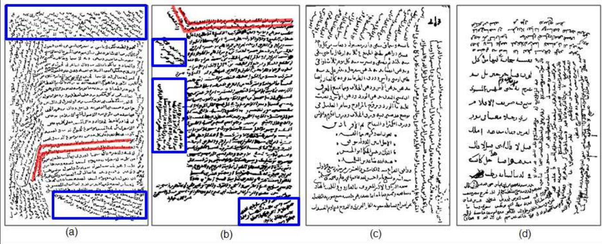  
Fig. 1 Samples of four multi-oriented Arabic handwritten documents. The orientations in the margins are of two types: extension of the main lines (lines in the middle of the document) (in red) or new lines (in blue).

# 2 Previous work

Concerning the methods, they can be divided into three mains classes: top down, bottom up and hybrid.

# 2.1 Top down methods

Top down methods start from the whole image and iteratively subdivide it into smaller blocks to isolate the desired part. They use either an a priori knowledge on the documents such as interline or inter column spaces, or a document model to separate the documents into blocks and blocks into lines.

Projection based methods: Localization of white separations is generally done by analyzing the projection histogram profile. When the projection angle fits well the document orientation, we can consider an important difference between two successive values in the histogram as a boundary between two blocks of text. The problem is the estimation of significant differences in the histogram. In general, one uses a priori knowledge about the document being scanned (number of columns, margins, etc.) to locate more easily separations.

Bennasri et al. [3] have proposed a method involving the study of the histogram in vertical stripes. The starting points of all lines are detected by using the minimum of the partial projection profile of each column. Then, a contour tracking part of each line is done: first in the sense of writing, then in the opposite direction.

Nicolaou and Gatos [17] make the assumption that for each text line, there exists a path from one side of the image to the other that traverses only one text line. For that, they propose a segmentation technique by shredding the line surface with local minima tracers.

In [29], each minimum in the projection histogram profile is considered as separator between lines of text. A vector distance between potential points is then constructed to find the distance the most common, considered as the threshold for segmentation. When two potential neighbor points have a very close distance from the threshold, the connected components between these two points form the line of text.

The global projection cannot handle skewed documents, or documents with curved and sinuous lines. To cope with these artifacts, one uses Hough transform that considers the whole image composed of straight lines. It creates a space observation in which local maxima are assumed representing text lines. Nevertheless, Hough transform is enable to detect curved text lines. In Shapiro et al. [24] the orientation angle of the document is first estimated by Hough transform, then used to make projections. The number of maxima of the projection profile gives the line number. The local maxima are rejected by comparing their values with those of the highest peaks.

Document model based methods: In several areas, the a priori knowledge is highly structured and many segmentation problems (mostly related to the density of information) have not yet been solved by conventional methods presented in the literature.

Couassnon et al. [5] proposed a method called DMOS (Description and Modification of Segmentation), consisting of a grammatical formalism position to model knowledge, and an associated parser authorizing a dynamic change of the structure analysis. This change allows them to introduce the context (symbolic level) in the segmentation phase (digital level), to improve recognition.

In [28], Zheng et al. present a model based approach to detect broken lines in noisy textual documents. They use directional single-connected chain, a vectorization based algorithm, to extract the line segments. Then, they instantiate the line model with three parameters: the skew angle, the vertical line gap, and the vertical translation. From the model, they can incorporate the high level contextual information to enhance detection results.

Nicolas, Paquet and Heutte [18] propose a method based on AI problem solving framework using production systems. The hypotheses management procedure of the production system allows them to analyze all the segmentation possibilities and to retain the most valuable one.

# 2.2 Bottom up methods

To deal with noise problems and writing variation, most meth ods of line extraction in handwritten documents are bottomup. Bottom-up approaches are based on low-level elements of the image as pixels or related components. The connected component based methods are the mainstay of the bottom up approaches. They are clustered into bigger elements such as words, lines and blocks. In each research, simple rules are used in a different way. These rules are based on the geometric relationship between neighboring blocks, such as distance, overlap, and size compatibility. The difference between the different works lies in their capabilities to cope with space variation and influence of the script and the writer peculiarities.

Several approaches for clustering connected components have been proposed in the literature, such as :

– K NN   
– Hough transform   
– Smoothing   
– Repulsive-attractive Network   
– Minimal Spanning Tree

K NN: Clustering methods related to the notion of mutual neighborhood have been considered in the clustering literature.

Zahour et al [27] proposes such a method for line extraction in ancient Arabic documents. The document is first divided in vertical columns having the same size. Then, in each column three kinds of columns are considered $:$ small corresponding to the diacritics, average related to the word bodies, and large representing the word overlapped between successive lines. The Euclidean distance is finally operated to reassemble the close bocks and hence form lines. An improved version of this approach is published in [59]. Here, the method deals with the problems of overlapping and multitouching text-lines extraction.

Likforman-Sulem et al. proposed in [11] an approach based on perceptual grouping of connected components. The grouping is based on the ”Gestalt theory” which principles, such as proximity, similarity and continuity, allow the human eye to perceive elements. To cope with conflicts, the method integrates a refinement procedure combining a global and a local analysis.

Feldbach and Tonnies proposed in [7] a grouping method ¨ based on the text line alignments. First, the minima of the skeletons are performed leading the baseline extraction. Then, the text line centers are estimated using the orientation of the baselines and the endpoints in the skeletons. These alignments are then grouped according to the size, the distance between lines and the line orientation. A correction step of conflicts between the alignments is applied to improve the rate of segmentation.

Kumar et al. proposed in [58] a graph-based method for text lines extraction from Arabic documents. The method starts by computing the local orientation of each primary component to build a similarity graph. Then, a shortest path algorithm is used to compute the similarities between nonneighboring components. From this graph, the text lines are obtained using two estimates based on the Affinity propagation and Breadth-first search.

Hough transform: Hough transform is also used in bottom up approaches. The main questions are related to the voting points, the most representative of the text lines.

In [12], the voting points correspond to the center of gravity of connected components. They are first used for line orientation detection. Then, from these proposed lines, a validation is operated to eliminate the erroneous alignments using contextual information on connected components such as proximity and direction continuity.

In Pu and Shi [21], the voting points correspond to the minima of the connected components, located in a vertical strip on the left side of the image. The alignments are searched by grouping cells in the Hough space in six directions. These alignments correspond to the sequences of related components that begin each line. Then, a sliding window is associated with each alignment algorithm that allows to follow the remaining connected component, using the proximity of connected components and initial orientation found by Hough.

Louloudis et al. proposed in [13] a block-based Hough transform for the detection of potential text lines accompanied by a post processing phase to correct possible false alarms. The block sizes are estimated from the average of the character sizes in the document.

Saha et al. proposed in [57] a technique based on the Hough transform for text line and word extraction from multiscript documents. The dataset is composed of printed and handwritten text lines with variety in script and line spacing in single document image.

Smoothing: The smoothing technique (Run Length Smoothing or RLS), is to darken the small spaces between the consecutive black pixels in horizontal direction, which leads to connect them. The boxes which include the successive connected components in the image, form the lines.

In [25], a fuzzy run length algorithm is used. The alignments hence created are analyzed according to several heuristics to form lines of text. Alignments of a size not exceeding a predetermined value are deleted.

In [4], lines are extracted by applying RLSA, adapted to a gray scale image. Instead of connecting a series of white and black pixels, the gradient of the image is expanded in the horizontal direction with a tilt angle that varies between 30. The process can be applied in several directions if necessary.

Repulsive-attractive network: The repulsive attractive network is a dynamic system to minimize energy, which interacts with the textual image by attractive and repulsive forces defined on the components of the network and the document image. Experimental results indicate that the network can successfully extract the baselines under significant noise in the presence of overlaps between the ascending and descending parts of characters in two lines.

Oztop et al. proposed in [30], an equivalent approach based on the same principle. Initially, the baselines are built by scanning the image from top to bottom ordered by grouping neighboring pixels. These lines are the repulsive forces and the pixels are the attractive forces for the network. To extract lines, the relationship between pixels and the baselines are studied from the forces in this network. The pixels that form the true line of text are kept, while the other pixels are deleted.

Minimal spanning tree (MST): Considering the connected components in a document as the vertices of a graph, we can obtain a complete undirected graph. A spanning tree of a connected graph is a tree that contains all the vertices of this graph. A minimal spanning tree of a graph is that spanning tree for which the sum of the edges is minimal among all the spanning trees of this graph. A minimal spanning tree of a graph can be generated with Kruskal algorithm. In this algorithm, the tree is built by inserting the remaining unused edge with the smallest cost until all the vertices are connected.

In Yin and Liu [31], from a distance defined to better characterize the nearby connected components (two consecutive CCs on the same line will be considered closer than two CCs on different lines), Kruskal’s algorithm combines two to two pairs of the closest CCs. Then, this distance is applied to pairs of nodes to encompass all nodes, and so on.

# 2.3 Hybrid methods

The hybrid schemes combine top-down and bottom-up algorithms to yield better results. In this class, we find the methods based on the deformable contour model. The deformable model is an analytical approach which can act interactively on the modeling. It allows to change (in time and space) the representation of the model towards the solution of the minimization problem introduced in the modeling. Concretely, this leads to introduce a term of time evolution in the minimization criterion, which allows, each time, to influence the prior model when necessary, and to readjust to a better solution. Early work in this area are those of Kass, Witkin and Terzopoulos [32]. In the case of a 2D image, the deformable contour model is used to find an existing object. The process is iterative. From an initial contour, a mechanism of deformable contour is applied to change this form so that it is the target area. The evolution mechanism is an energy function. The target area will be found by minimizing this energy. Several deformable contour models exist in the literature. Here are a few examples: the parametric active contour model (snake [32]), the geometric snake [33], the Level Set method [34, 35,23], the B-spline or B-snake [10] and the Mumford-Shah model [36].

The use of each model depends on the specific application and the type of processed images. In the field of line extraction of handwritten documents, one used three models: the snake set, the method of Level Set and Mumford-Shah model.

The parametric snake: In the formulation of Kass et al. [32], the best snake position was defined as the solution of a variational problem requiring the minimization of the sum of internal and external energies integrated along the length of the snake.

Bukhari et al. proposed in [37, 60] a parametric snake based method for the extraction of handwritten document lines. The initial snake is the central line of text lines. This line is estimated based on the intensity values in a gray scale document image. Then, the mechanism of snake energy minimization is applied to find text lines.

The Level Set: Unlike deformable model, level set approach is geometrical. The basic idea of the level set method is to evolve the boundary by its partial derivatives and an external vector field (i.e. the gradient). Li et al. proposed in [38] such a technique for extracting complex lines of handwritten documents. The method starts by applying a Gaussian filter with an anisotropic kernel to estimate the pixel density. Then, a probability map is constructed giving the probability that a pixel belongs to a line of text. Finally, the model of Level Set is applied to deform the contour in order to find lines.

The Mumford-Shah: The Mumford-Shah model [39] deforms the contours by minimizing the following energy function :

$$
E ( u , C ) = \int _ { \Omega } { \left| u - u _ { 0 } \right| ^ { 2 } } d x d y + \mu \int _ { \Omega \backslash C } { \left| \nabla u \right| ^ { 2 } } d x d y + \nu . { \left| C \right| }
$$

where $u _ { 0 }$ is the initial image, $u$ the smoothed image after the use of a gaussian filter, $C$ the set of the initial curves (or snakes), $| C |$ the set of curve lengths, $\varOmega$ the image domain, $\varOmega \backslash C$ the image domain without the curves, $\nabla \boldsymbol { u }$ the image gradient $u$ and $\mu$ and $\nu$ the parameters that balance the effect of other terms in this equation.

In Du et al. [40] the authors use piecewise constant approximation of the MS model to segment handwritten text images. The segmentation result does not depend on the number of evolution steps. In addition, they use the morphing to remove overlaps between neighboring text lines and connect broken text lines.

# 2.4 Method discussion

Table 1 summarizes all the methods mentioned, divided according to 15 criteria: lines types (straight, oriented and cursive), types of materials (printed, manuscript, Multi-oriented, interval orientation (IO), Latin, Chinese, Indian, Arabic, Persian, Urdu), nature of content (C: Color, G: Gray and B: Binary) and meshing. All these approaches are either too general, proceeding by projection or by alignment search, or too local, operating by connected component following. They find here their limits facing to the poor quality and multi-orientation of documents. Most of these techniques have been applied to documents with a single orientation. The adaptation of these approaches is impossible if we want to extract all directions.

# 3 Overview of the proposed system

Given the failure of traditional methods, we propose a novel method for line extraction in multi-oriented documents. The technique has been studied for Arabic documents but can be generalized to any other script that writing is linear. The method is based on an image meshing that allows it to detect locally and safely the orientations. These orientations are then extended to larger areas. The only assumption is that initially the central part of the paper is horizontal. The orientation calculation uses the energy distribution of Cohen’s class, more accurate than the projection method. Then, the method exploits the projection peaks to follow the connected components forming text lines. The approach ends with a final separation of connected lines, based on the exploitation of the morphology of terminal letters.

# 3.1 Image meshing

In this step, the document image is partitioned into small meshes of $\left( w \times h \right)$ size. This size is generated, based on the idea that a mesh must approximately contain 3 lines, so as to produce a projection histogram profile that is representative of the writing orientation. The projection profile is representative of the orientation when it contains three peaks and two valleys then three lines.

This follows several steps. First, an initial mesh of arbitrarily size ( $1 5 \times 1 5$ pixels) is placed in the middle of the image (see Figure 2.a). The location choice is based on the assumption that the initial document is horizontally filled at the page center. To find the lines, we apply the active contour model (or snake) technique that will be presented in section 3.1.1. The mesh size is enlarged until the snake provides at least 3 lines. Once the lines found, the average line height $\bar { h }$ is performed as well as the average gap $\bar { g }$ between them. The gap distance is calculated using the convex hullbased metric described in [14] (see Figure 2.b). The final mesh size is equal to $\left( w \times h \right)$ where $w = h = 3 \times \bar { h } + 2 \times \bar { g }$ .

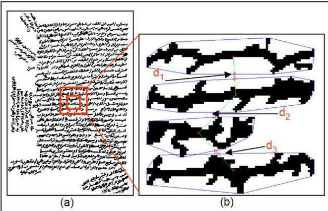  
Fig. 2 Automatic meshing algorithm $( d _ { 1 } , d _ { 2 }$ and $d _ { 3 }$ are the gap widths). a) shows the initial mesh extended by 15 pixels in a second iteration, (b) 4 lines found with their convex hulls.

# 3.1.1 Active Contour Model (snake)

The snake [8] is parametrically defined as $\nu ( s ) = \{ x ( s ) , y ( s ) \}$ where $s \in [ 0 , 1 ]$ is the coordinate indice or order, $x ( s )$ and $y ( s )$ are $x$ and $y$ co-ordinates along the contour. The functional energy to be minimized is:

Table 1 Line segmentation bibliography.   

<table><tr><td rowspan=2 colspan=1>SSEIO</td><td rowspan=2 colspan=1>Category</td><td rowspan=2 colspan=1>Authors</td><td rowspan=1 colspan=3>adL auT</td><td rowspan=1 colspan=11>L </td><td rowspan=2 colspan=1>S</td></tr><tr><td rowspan=1 colspan=1></td><td rowspan=1 colspan=1></td><td rowspan=1 colspan=1>aAIsno</td><td rowspan=1 colspan=1></td><td rowspan=1 colspan=1>n.m</td><td rowspan=1 colspan=1></td><td rowspan=1 colspan=1>0</td><td rowspan=1 colspan=1></td><td rowspan=1 colspan=1>an</td><td rowspan=1 colspan=1>uerpui</td><td rowspan=1 colspan=1>y</td><td rowspan=1 colspan=1></td><td rowspan=1 colspan=1></td><td rowspan=1 colspan=1></td></tr><tr><td rowspan=7 colspan=1>umoq-doL</td><td rowspan=4 colspan=1>Projection based</td><td rowspan=1 colspan=1>[Bennasri et al. 99]</td><td rowspan=1 colspan=1>X</td><td rowspan=1 colspan=1>X</td><td rowspan=1 colspan=1></td><td rowspan=1 colspan=1></td><td rowspan=1 colspan=1>X</td><td rowspan=1 colspan=1></td><td rowspan=1 colspan=1></td><td rowspan=1 colspan=1></td><td rowspan=1 colspan=1></td><td rowspan=1 colspan=1></td><td rowspan=1 colspan=1>X</td><td rowspan=1 colspan=1></td><td rowspan=1 colspan=1></td><td rowspan=1 colspan=1>B</td><td rowspan=1 colspan=1>X</td></tr><tr><td rowspan=1 colspan=1>[Nicolaou et al. 09]</td><td rowspan=1 colspan=1>X</td><td rowspan=1 colspan=1>X</td><td rowspan=1 colspan=1></td><td rowspan=1 colspan=1></td><td rowspan=1 colspan=1>X</td><td rowspan=1 colspan=1></td><td rowspan=1 colspan=1></td><td rowspan=1 colspan=1>X</td><td rowspan=1 colspan=1></td><td rowspan=1 colspan=1></td><td rowspan=1 colspan=1></td><td rowspan=1 colspan=1></td><td rowspan=1 colspan=1></td><td rowspan=1 colspan=1>G,B</td><td rowspan=1 colspan=1></td></tr><tr><td rowspan=1 colspan=1>[Shapiro et al. 93]</td><td rowspan=1 colspan=1>X</td><td rowspan=1 colspan=1>X</td><td rowspan=1 colspan=1></td><td rowspan=1 colspan=1></td><td rowspan=1 colspan=1>X</td><td rowspan=1 colspan=1></td><td rowspan=1 colspan=1></td><td rowspan=1 colspan=1>X</td><td rowspan=1 colspan=1></td><td rowspan=1 colspan=1></td><td rowspan=1 colspan=1></td><td rowspan=1 colspan=1></td><td rowspan=1 colspan=1></td><td rowspan=1 colspan=1>B</td><td rowspan=1 colspan=1></td></tr><tr><td rowspan=1 colspan=1>[Antonacopoulos et al.04]</td><td rowspan=1 colspan=1>X</td><td rowspan=1 colspan=1></td><td rowspan=1 colspan=1></td><td rowspan=1 colspan=1>X</td><td rowspan=1 colspan=1></td><td rowspan=1 colspan=1></td><td rowspan=1 colspan=1></td><td rowspan=1 colspan=1>X</td><td rowspan=1 colspan=1></td><td rowspan=1 colspan=1></td><td rowspan=1 colspan=1></td><td rowspan=1 colspan=1></td><td rowspan=1 colspan=1></td><td rowspan=1 colspan=1>B</td><td rowspan=1 colspan=1></td></tr><tr><td rowspan=3 colspan=1>Document Model</td><td rowspan=1 colspan=1>[Coüasnon et al. 02]</td><td rowspan=1 colspan=1>X</td><td rowspan=1 colspan=1>X</td><td rowspan=1 colspan=1></td><td rowspan=1 colspan=1>X</td><td rowspan=1 colspan=1></td><td rowspan=1 colspan=1></td><td rowspan=1 colspan=1></td><td rowspan=1 colspan=1>X</td><td rowspan=1 colspan=1></td><td rowspan=1 colspan=1></td><td rowspan=1 colspan=1></td><td rowspan=1 colspan=1></td><td rowspan=1 colspan=1></td><td rowspan=1 colspan=1>B</td><td rowspan=1 colspan=1></td></tr><tr><td rowspan=1 colspan=1>[Zheng et al. 03]</td><td rowspan=1 colspan=1>X</td><td rowspan=1 colspan=1></td><td rowspan=1 colspan=1></td><td rowspan=1 colspan=1></td><td rowspan=1 colspan=1>X</td><td rowspan=1 colspan=1></td><td rowspan=1 colspan=1></td><td rowspan=1 colspan=1></td><td rowspan=1 colspan=1></td><td rowspan=1 colspan=1></td><td rowspan=1 colspan=1>X</td><td rowspan=1 colspan=1></td><td rowspan=1 colspan=1></td><td rowspan=1 colspan=1>B</td><td rowspan=1 colspan=1>X</td></tr><tr><td rowspan=1 colspan=1>[Nicolas et al. 04]</td><td rowspan=1 colspan=1>X</td><td rowspan=1 colspan=1>X</td><td rowspan=1 colspan=1></td><td rowspan=1 colspan=1></td><td rowspan=1 colspan=1>X</td><td rowspan=1 colspan=1></td><td rowspan=1 colspan=1></td><td rowspan=1 colspan=1>X</td><td rowspan=1 colspan=1></td><td rowspan=1 colspan=1></td><td rowspan=1 colspan=1></td><td rowspan=1 colspan=1></td><td rowspan=1 colspan=1></td><td rowspan=1 colspan=1>B</td><td rowspan=1 colspan=1></td></tr><tr><td rowspan=13 colspan=1>dn-unog</td><td rowspan=5 colspan=1>KNN</td><td rowspan=1 colspan=1>[Zahour et al. 04]</td><td rowspan=1 colspan=1>X</td><td rowspan=1 colspan=1>X</td><td rowspan=1 colspan=1>X</td><td rowspan=1 colspan=1></td><td rowspan=1 colspan=1>X</td><td rowspan=1 colspan=1></td><td rowspan=1 colspan=1></td><td rowspan=1 colspan=1></td><td rowspan=1 colspan=1></td><td rowspan=1 colspan=1></td><td rowspan=1 colspan=1>X</td><td rowspan=1 colspan=1></td><td rowspan=1 colspan=1></td><td rowspan=1 colspan=1>B</td><td rowspan=1 colspan=1></td></tr><tr><td rowspan=1 colspan=1>[Boussellaa et al. 10]</td><td rowspan=1 colspan=1>x</td><td rowspan=1 colspan=1>X</td><td rowspan=1 colspan=1>X</td><td rowspan=1 colspan=1></td><td rowspan=1 colspan=1>X</td><td rowspan=1 colspan=1></td><td rowspan=1 colspan=1></td><td rowspan=1 colspan=1></td><td rowspan=1 colspan=1></td><td rowspan=1 colspan=1></td><td rowspan=1 colspan=1>X</td><td rowspan=1 colspan=1></td><td rowspan=1 colspan=1></td><td rowspan=1 colspan=1>B</td><td rowspan=1 colspan=1></td></tr><tr><td rowspan=1 colspan=1>[Kumar et al. 10]</td><td rowspan=1 colspan=1>X</td><td rowspan=1 colspan=1>X</td><td rowspan=1 colspan=1></td><td rowspan=1 colspan=1></td><td rowspan=1 colspan=1>X</td><td rowspan=1 colspan=1></td><td rowspan=1 colspan=1></td><td rowspan=1 colspan=1></td><td rowspan=1 colspan=1></td><td rowspan=1 colspan=1></td><td rowspan=1 colspan=1>X</td><td rowspan=1 colspan=1></td><td rowspan=1 colspan=1></td><td rowspan=1 colspan=1>B</td><td rowspan=1 colspan=1></td></tr><tr><td rowspan=1 colspan=1>[Likforman-Sulem et al.1994]</td><td rowspan=1 colspan=1>X</td><td rowspan=1 colspan=1>X</td><td rowspan=1 colspan=1>X</td><td rowspan=1 colspan=1></td><td rowspan=1 colspan=1>X</td><td rowspan=1 colspan=1></td><td rowspan=1 colspan=1></td><td rowspan=1 colspan=1>X</td><td rowspan=1 colspan=1></td><td rowspan=1 colspan=1></td><td rowspan=1 colspan=1></td><td rowspan=1 colspan=1></td><td rowspan=1 colspan=1></td><td rowspan=1 colspan=1>G,B</td><td rowspan=1 colspan=1></td></tr><tr><td rowspan=1 colspan=1>[Feldbach et al. 01]</td><td rowspan=1 colspan=1>X</td><td rowspan=1 colspan=1>X</td><td rowspan=1 colspan=1></td><td rowspan=1 colspan=1></td><td rowspan=1 colspan=1>X</td><td rowspan=1 colspan=1></td><td rowspan=1 colspan=1></td><td rowspan=1 colspan=1>X</td><td rowspan=1 colspan=1></td><td rowspan=1 colspan=1></td><td rowspan=1 colspan=1></td><td rowspan=1 colspan=1></td><td rowspan=1 colspan=1></td><td rowspan=1 colspan=1>G</td><td rowspan=1 colspan=1></td></tr><tr><td rowspan=4 colspan=1>Hough Transform</td><td rowspan=1 colspan=1>[Likforman-Sulem et al.95]</td><td rowspan=1 colspan=1>X</td><td rowspan=1 colspan=1>X</td><td rowspan=1 colspan=1></td><td rowspan=1 colspan=1></td><td rowspan=1 colspan=1>X</td><td rowspan=1 colspan=1></td><td rowspan=1 colspan=1></td><td rowspan=1 colspan=1>X</td><td rowspan=1 colspan=1></td><td rowspan=1 colspan=1></td><td rowspan=1 colspan=1></td><td rowspan=1 colspan=1></td><td rowspan=1 colspan=1></td><td rowspan=1 colspan=1>B</td><td rowspan=1 colspan=1></td></tr><tr><td rowspan=1 colspan=1>[Pu et al. 98]</td><td rowspan=1 colspan=1>X</td><td rowspan=1 colspan=1>X</td><td rowspan=1 colspan=1>X</td><td rowspan=1 colspan=1></td><td rowspan=1 colspan=1>X</td><td rowspan=1 colspan=1></td><td rowspan=1 colspan=1></td><td rowspan=1 colspan=1>X</td><td rowspan=1 colspan=1></td><td rowspan=1 colspan=1></td><td rowspan=1 colspan=1></td><td rowspan=1 colspan=1></td><td rowspan=1 colspan=1></td><td rowspan=1 colspan=1>B</td><td rowspan=1 colspan=1></td></tr><tr><td rowspan=1 colspan=1>[Louloudis et al. 09]</td><td rowspan=1 colspan=1>X</td><td rowspan=1 colspan=1>X</td><td rowspan=1 colspan=1>X</td><td rowspan=1 colspan=1>X</td><td rowspan=1 colspan=1>X</td><td rowspan=1 colspan=1></td><td rowspan=1 colspan=1></td><td rowspan=1 colspan=1>X</td><td rowspan=1 colspan=1></td><td rowspan=1 colspan=1></td><td rowspan=1 colspan=1></td><td rowspan=1 colspan=1></td><td rowspan=1 colspan=1></td><td rowspan=1 colspan=1>G,B</td><td rowspan=1 colspan=1></td></tr><tr><td rowspan=1 colspan=1>[Saha et al. 09]</td><td rowspan=1 colspan=1>X</td><td rowspan=1 colspan=1>X</td><td rowspan=1 colspan=1></td><td rowspan=1 colspan=1>x</td><td rowspan=1 colspan=1>x</td><td rowspan=1 colspan=1></td><td rowspan=1 colspan=1></td><td rowspan=1 colspan=1>X</td><td rowspan=1 colspan=1></td><td rowspan=1 colspan=1></td><td rowspan=1 colspan=1></td><td rowspan=1 colspan=1></td><td rowspan=1 colspan=1>X</td><td rowspan=1 colspan=1>G,B</td><td rowspan=1 colspan=1></td></tr><tr><td rowspan=2 colspan=1>Smoothing</td><td rowspan=1 colspan=1>[Shi et al. 04]</td><td rowspan=1 colspan=1>X</td><td rowspan=1 colspan=1>x</td><td rowspan=1 colspan=1></td><td rowspan=1 colspan=1></td><td rowspan=1 colspan=1>X</td><td rowspan=1 colspan=1></td><td rowspan=1 colspan=1></td><td rowspan=1 colspan=1></td><td rowspan=1 colspan=1></td><td rowspan=1 colspan=1></td><td rowspan=1 colspan=1></td><td rowspan=1 colspan=1></td><td rowspan=1 colspan=1></td><td rowspan=1 colspan=1>B</td><td rowspan=1 colspan=1></td></tr><tr><td rowspan=1 colspan=1>[Bourgeois et al. 01]</td><td rowspan=1 colspan=1>X</td><td rowspan=1 colspan=1>X</td><td rowspan=1 colspan=1></td><td rowspan=1 colspan=1>X</td><td rowspan=1 colspan=1>X</td><td rowspan=1 colspan=1></td><td rowspan=1 colspan=1></td><td rowspan=1 colspan=1></td><td rowspan=1 colspan=1></td><td rowspan=1 colspan=1></td><td rowspan=1 colspan=1></td><td rowspan=1 colspan=1></td><td rowspan=1 colspan=1></td><td rowspan=1 colspan=1>G</td><td rowspan=1 colspan=1></td></tr><tr><td rowspan=1 colspan=1>Repulsive-attractive</td><td rowspan=1 colspan=1>[Oztop et al. 99]</td><td rowspan=1 colspan=1>X</td><td rowspan=1 colspan=1>X</td><td rowspan=1 colspan=1>X</td><td rowspan=1 colspan=1></td><td rowspan=1 colspan=1>X</td><td rowspan=1 colspan=1></td><td rowspan=1 colspan=1></td><td rowspan=1 colspan=1>X</td><td rowspan=1 colspan=1></td><td rowspan=1 colspan=1></td><td rowspan=1 colspan=1>X</td><td rowspan=1 colspan=1>X</td><td rowspan=1 colspan=1></td><td rowspan=1 colspan=1>G</td><td rowspan=1 colspan=1></td></tr><tr><td rowspan=1 colspan=1>MST</td><td rowspan=1 colspan=1>[Yin et al. 08]</td><td rowspan=1 colspan=1>X</td><td rowspan=1 colspan=1>X</td><td rowspan=1 colspan=1></td><td rowspan=1 colspan=1></td><td rowspan=1 colspan=1>X</td><td rowspan=1 colspan=1></td><td rowspan=1 colspan=1></td><td rowspan=1 colspan=1></td><td rowspan=1 colspan=1>X</td><td rowspan=1 colspan=1></td><td rowspan=1 colspan=1></td><td rowspan=1 colspan=1></td><td rowspan=1 colspan=1></td><td rowspan=1 colspan=1>B</td><td rowspan=1 colspan=1></td></tr><tr><td rowspan=3 colspan=1>p.qAH</td><td rowspan=1 colspan=1>Snake</td><td rowspan=1 colspan=1>[Bukhari et al. 09 and 10]</td><td rowspan=1 colspan=1>X</td><td rowspan=1 colspan=1>X</td><td rowspan=1 colspan=1>X</td><td rowspan=1 colspan=1>X</td><td rowspan=1 colspan=1>X</td><td rowspan=1 colspan=1>X</td><td rowspan=1 colspan=1></td><td rowspan=1 colspan=1>X</td><td rowspan=1 colspan=1></td><td rowspan=1 colspan=1></td><td rowspan=1 colspan=1>X</td><td rowspan=1 colspan=1></td><td rowspan=1 colspan=1>X</td><td rowspan=1 colspan=1>G,B</td><td rowspan=1 colspan=1></td></tr><tr><td rowspan=1 colspan=1>Level set</td><td rowspan=1 colspan=1>[Li et al. 08]</td><td rowspan=1 colspan=1>X</td><td rowspan=1 colspan=1>X</td><td rowspan=1 colspan=1>X</td><td rowspan=1 colspan=1>X</td><td rowspan=1 colspan=1>X</td><td rowspan=1 colspan=1>X</td><td rowspan=1 colspan=1></td><td rowspan=1 colspan=1>X</td><td rowspan=1 colspan=1>X</td><td rowspan=1 colspan=1>X</td><td rowspan=1 colspan=1>X</td><td rowspan=1 colspan=1></td><td rowspan=1 colspan=1></td><td rowspan=1 colspan=1>B</td><td rowspan=1 colspan=1></td></tr><tr><td rowspan=1 colspan=1>Mumford-Shah</td><td rowspan=1 colspan=1>[Xiaojun et al. 09]</td><td rowspan=1 colspan=1>X</td><td rowspan=1 colspan=1>X</td><td rowspan=1 colspan=1>X</td><td rowspan=1 colspan=1></td><td rowspan=1 colspan=1>X</td><td rowspan=1 colspan=1>X</td><td rowspan=1 colspan=1></td><td rowspan=1 colspan=1>X</td><td rowspan=1 colspan=1></td><td rowspan=1 colspan=1></td><td rowspan=1 colspan=1></td><td rowspan=1 colspan=1></td><td rowspan=1 colspan=1></td><td rowspan=1 colspan=1>G</td><td rowspan=1 colspan=1></td></tr></table>

$$
\begin{array} { r l r } {  { E _ { \mathrm { s n a k e } } ^ { * } = \int _ { 0 } ^ { 1 } E _ { \mathrm { s n a k e } } ( \nu ( s ) ) d s } } \\ & { } & { = \displaystyle \int _ { 0 } ^ { 1 } [ E _ { \mathrm { i n t } } \big ( \nu ( s ) \big ) + E _ { \mathrm { i m a g e } } \big ( \nu ( s ) \big ) + E _ { \mathrm { c o n } } \big ( \nu ( s ) \big ) ] d s } \end{array}
$$

– The internal energy, $E _ { \mathrm { i n t } }$ , is the force that serves to regulate the snake shape in terms of elasticity and regularity. It is supposed to be minimal when the snake has a shape close to the shape of the sought object. The internal spline energy can be written as follows:

$$
E _ { \mathrm { i n t } } = \int _ { 0 } ^ { 1 } \alpha ( s ) { \lvert \frac { d \nu } { d s } \rvert } ^ { 2 } d s + \int _ { 0 } ^ { 1 } \beta ( s ) { \lvert \frac { d ^ { 2 } \nu } { d s ^ { 2 } } \rvert } ^ { 2 } d s
$$

where $\alpha ( s )$ and $\beta ( s )$ specify the elasticity and stiffness of the snake. Note that setting $\beta ( s _ { k } )$ at a point $s _ { k }$ allows the snake to become second-order discontinuous at that point, and develop a corner.

– The external energy, $E _ { \mathrm { i m a g e } }$ , is the external force which attracts the snake to the contour. It is supposed to be minimal when the snake is at the object boundary position.

The image forces, $E _ { \mathrm { i m a g e } }$ , are derived from the image data over which the snake lies. The original snake formulation by Kass et al. [8] considers different terms that respectively attract the active contour model to the previously segmented image lines, edges and termination pixels. Thus, the image energy $E _ { \mathrm { i m a g e } }$ was formulated as:

$$
E _ { \mathrm { i m a g e } } = \omega _ { \mathrm { l i n e } } E _ { \mathrm { l i n e } } + \omega _ { \mathrm { e d g e } } E _ { \mathrm { e d g e } } + \omega _ { \mathrm { t e r m } } E _ { \mathrm { t e r m } }
$$

The snake behavior may be controlled by adjusting the weights $\omega _ { \mathrm { l i n e } }$ , $\omega _ { \mathrm { e d g e } }$ and $\omega _ { \mathrm { t e r m } }$ . The simplest useful image functional is the image intensity: $E _ { \mathrm { l i n e } } = I ( x , y )$ . Depending on $\omega _ { \mathrm { i n e } }$ , the snake is attracted to dark or light lines.

The edge-based functional $E _ { \mathrm { e d g e } } = - | \Delta I ( x , y ) | ^ { 2 }$ where $\varDelta I ( x , y )$ is the gradient value at the point $I ( x , y )$ , attracts the snake to contours with large image gradients, that is, to locations of strong edges. The termination functional can be obtained by a function checking the curvature of level lines in a slightly smoothed image. Line terminations and corners may influence the snake using a weighted energy functional $E _ { \mathrm { t e r m } }$ .

The traditional external energy has some limitations such as the edge initialization near the contour and the poor convergence to regions with concavities. For that reason, Xu et al. [26] developed a new kind of external energy that allows the snake to start far from the object, and forces it into boundary concavities. This energy is named gradient vector flow, or GVF. GVF is computed as a diffusion of the gradient vectors of a gray-level or binary edge map derived from the image. The resultant field has a large capture range, which means that the active contour can be initialized far away from the desired boundary.

Formally speaking, GVF is defined as the vector field $V ( x , y ) = ( u ( x , y ) , \upsilon ( x , y ) )$ that minimizes the functional energy:

$$
\varepsilon = \int \int \mu ( u _ { x } ^ { 2 } + u _ { y } ^ { 2 } + \upsilon _ { x } ^ { 2 } + \upsilon _ { y } ^ { 2 } ) + | \nabla f | ^ { 2 } | V - \nabla f | ^ { 2 } d x d y
$$

where $\begin{array} { r } { u _ { x } = \frac { d u } { d x } } \end{array}$ , $\begin{array} { r } { u _ { y } = \frac { d u } { d y } } \end{array}$ , $\textstyle v _ { x } = { \frac { d \upsilon } { d x } }$ , $\begin{array} { r } { v _ { y } = \frac { d v } { d y } } \end{array}$ . $V$ can be determined by the Euler equations:

$$
\begin{array} { r } { \mu \nabla ^ { 2 } u - ( u - f _ { x } ) ( { f _ { x } } ^ { 2 } + { f _ { y } } ^ { 2 } ) = 0 } \\ { \mu \nabla ^ { 2 } \upsilon - ( \upsilon - f _ { y } ) ( { f _ { x } } ^ { 2 } + { f _ { y } } ^ { 2 } ) = 0 } \end{array}
$$

where $\mu$ is a regularization parameter governing the trade off between the first term and the second one, $\nabla ^ { 2 }$ is the Laplacian operator and $f ( x , y )$ denotes the image gray level at image location $( x , y )$ . Xu et al. proposed in [26] several kinds of implementation of $u$ and $\upsilon$ .

– The constraint energy, $E _ { \mathrm { c o n } }$ , expresses some additional constraints that may be imposed by the user to the snake he wants to get. They can be higher-order constraints on global strategies such as relations with other objects in an image such as repulsion or attraction of a particular region.

In our application, the major axis (equal to the first harmonic of the Fourier descriptor [42]) of the connected components is used as the initial snake. We use GVF as external energy and a null internal energy. To detect the alignments, some morphological operations such as dilation and erosion are first applied to the initial image (see Figure 3.b) to expand the edges. Then, the major axis of each connected component is determined using the Fourier descriptors (see Figure 3.c). Finally, the energy minimization mechanism is operated on the snake to deform and push it to the text edge, more or less similar to the connected component skeleton (see Figure 3.d). To ensure that the lines will be detected, we increment the size of the major axis by a threshold equal to the quarter of the average width of the connected components. This threshold is obtained by experiments. Finally, the connected components that belong to the same line are grouped to form the lines (see Figure 3.e). Figure 18.b shows the results of the automatic meshing of the document presented in the Figure 2.a.

In order to reduce the running speedup, we discard the meshes containing few pixels because their inclination is insignificant. If a mesh contains some text (i.e. few connected components) and thus no noise, it is automatically merged with the neighbor meshes.

# 3.2 Orientation area extraction

# 3.2.1 Orientation estimation

As the lines are wavy, the orientation is first searched in small meshes where it is more likely to have pieces of straight lines. Then the meshes are enlarged to neighbors having similar orientation until the delimitation of real sizable orientation zones will be effective. Traditionally, the projection histogram profile is employed along different orientation angles to determine the local orientation. Each projection histogram profile contains several peaks. More the peaks are sharp and the valleys carved more the histogram reflects a good orientation. Figure 4.a shows only one horizontal line for which there is only one sharp peak on the projection histogram computed for an angle equal to $0 ^ { \circ }$ . This is not the case for the projection along $+ 3 0 ^ { \circ }$ or $- 3 0 ^ { \circ }$ (see Figure 4.b).

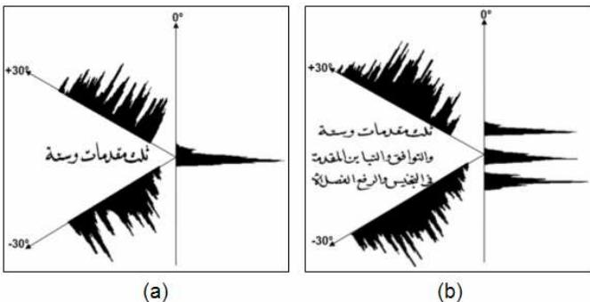  
Fig. 4 Depth and sharpness of the histogram profile computed for projection angles of $+ 3 0 ^ { \circ }$ , $0 ^ { \circ }$ and $- 3 0 ^ { \circ }$ , for one line (a) and three lines (b).

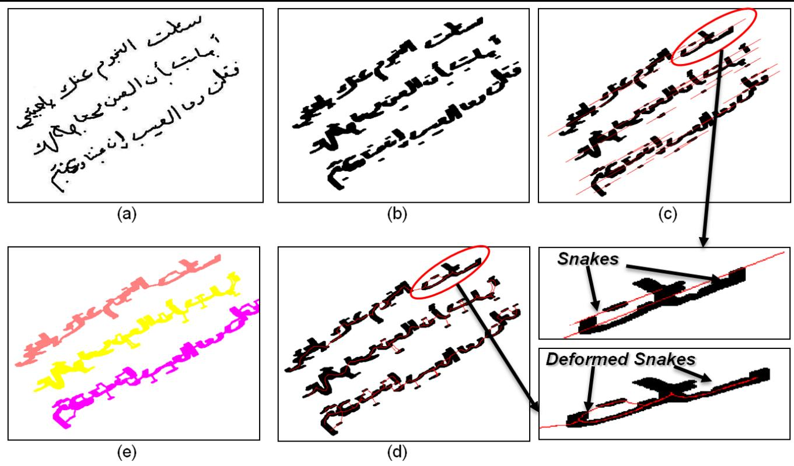  
Fig. 3 Application of the snake for line detection, (a) initial image, (b) dilation and erosion of the image, (c) major axis drawn for each connected component of the lines. The ellipse encapsulates the initial connected component of (b). (d) shows the distorted snake of (c). (e) gives the final result showing the connected components gathered in each line.

Usually, to determine the skew angle from the projection profile, the average difference between peaks and valleys is performed [1, 53–55] and the profile having the maximum difference reflects the maximum skew angle. However, this method does not always succeed because of line distortions and variabilities creating false maxima and minima (see Figure 5). In the case of Arabic script, this phenomenon is very common. In fact, Arabic presents a very changing morphology depending on the writing style. Some ligatures between characters are vertical whereas others are oblique which can affect the calculation of the word or the line orientation. Furthermore, the individual PAWs (Parts of Arabic Words) composing the words can also have oblique or vertical orientations which are often opposite to the global word orientation (see Figure 6).

To face this problem, we have examined other features to better analyze the histogram profile function. We then used the energetic time-frequency distributions on the histogram profile considered as a signal.

# 3.2.2 Time-frequency distributions

Traditional approaches of signal processing such as Fourier transform can not study the signal variation over time and frequency. The energetic time-frequency distributions go be

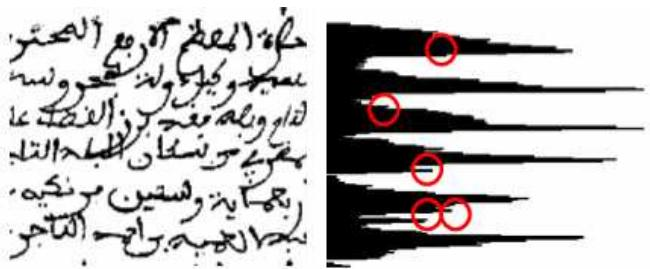  
Fig. 5 Extract of a handwritten ancient Arabic complex document (where the circles designate false maxima).

yond what these approaches allow by analyzing the nonstationarity of a signal and distribute the energy of a signal in time and frequency.

According to [48], the energy $E _ { x }$ of a signal $x ( t )$ is defined as:

$$
E _ { x } = \int _ { - \infty } ^ { + \infty } \left| x ( t ) \right| ^ { 2 } d t = \int _ { - \infty } ^ { + \infty } \left| { \widehat { x } } ( f ) \right| ^ { 2 } d f
$$

where ${ \widehat { x } } ( f )$ is the Fourier transform of the signal $x ( t )$ . The value $E _ { x }$ is quadratic. For this reason, the time-frequency distributions must keep this property.

Cohen’s Class: in 1966, Cohen [44–46] proved that a significant number of time-frequency distributions can be

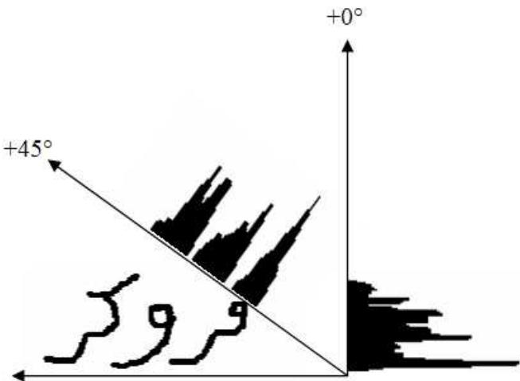  
Fig. 6 Orientation error provided by local PAWs in an Arabic horizontal line.

seen as particular cases of the following general expression:

$$
C _ { x } ( t , f ) = \int _ { - \infty } ^ { + \infty } \int _ { - \infty } ^ { + \infty } \phi _ { d D } ( \tau , \xi ) A _ { x } ( \tau , \xi ) e ^ { j 2 \pi ( t \xi - f \tau ) } d \xi d \tau ,
$$

where $A _ { x } ( \tau , \xi )$ is the ambiguity function defined by:

$$
A _ { x } ( \tau , \xi ) = \int _ { - \infty } ^ { + \infty } x ( t + \tau / 2 ) x ^ { * } ( t - \tau / 2 ) e ^ { - j 2 \pi \xi t } d t
$$

The Cohen’s class contains all the time-frequency distributions that are covariant under time- and frequency-shifts. The members of this class are identified by a particular kernel $\phi _ { d D } ( \tau , \xi )$ , (expressed here in the delay-Doppler plane $d D )$ which determines their theoretical properties [47, 49, 48] and their practical readability.

We want to use these distributions on the signal representing the histogram projection profile in each mesh, in order to estimate its orientation. The Cohen’s class distributions are used to estimate the orientation because when computing the projection histogram of a document along one direction of projection, we obtain, if this direction is the real orientation of the document, a histogram in which each line leads to a clearly localized local maximum. Each block of the document leads in the projection histogram to a succession of periodic peaks and valleys, whose period is relatively constant. This periodic succession is delimited by the block size (”time” support) and oscillates at a frequency determined by the space width between the lines. As all the pixels are accumulated in the same positions, the local maxima have higher energy levels than with other projection directions. This explains why we can estimate the orientation of a document by seeking the projection angle for which the time-frequency distribution localizes a large energy level on a small area of the time-frequency plane. For example, Figure 7 shows the increase of the maximum of the Wigner-Ville distribution when the number of peaks and valleys increases and when the valleys become wider.

# 3.2.3 Implementation details

To estimate the orientation angle, we use the analytic signal $x _ { a } ( t )$ of the centered squared root of the projection histogram $x ( t )$ of the document. The calculation of the squared root of time-frequency representation of projection histogram and not of the projection histograms, as is done in [9, 56], reinforces the significance of representation values and its properties. The analytic signal is the signal $x ( t )$ without its negative frequencies. The histogram $x ( t )$ is determined by projecting each document with a chosen orientation. To calculate all possible projection histograms, we turn the image around its center of gravity (which gives us a point deduced from the image content and not from its size and framing) and we choose the horizontal axis as an arbitrary reference for the zero degree angle (see Figure 9). Then, we compute a time-frequency representation for the squared root of each projection histogram, whose average has been removed. The angle corresponding to the projection histogram with the highest maximum value of its time-frequency representation is chosen as the estimated angle of the document. Figure 10 shows 4 plots of the highest value of the Wigner-Ville distribution, Spectrogram distribution and Fast Fourier Transform obtained from the squared root of projection histograms of the document shown on Figure 8 and the maximum average difference between the maxima and the minima of projection histograms of the same document, as a function of the projection angle. Table 2 shows the estimated skew angle of the document shown on Figure 8, obtained with the methods mentioned below. We can note that the correct value, $+ 1 4 . 7 ^ { \circ }$ , mentioned in Figure 8 is the one found by the Wigner-Ville distribution.

Table 2 Skew angle estimation of the document shown in Figure 8, obtained by two Cohen’s class distributions (Wigner-Ville and Spectrogram) and two skew estimation methods (Projection profile and Fourier transform).   

<table><tr><td rowspan=1 colspan=1>Method</td><td rowspan=1 colspan=1>Estimated Angle</td></tr><tr><td rowspan=1 colspan=1>Wigner-VilleSpectrogram</td><td rowspan=1 colspan=1>+14.7+12.9°</td></tr><tr><td rowspan=1 colspan=1>Projection profi leFast Fourier transform</td><td rowspan=1 colspan=1>+14.9+13.8°</td></tr></table>

# 3.2.4 Orientation area expanding

To extend the areas of orientation, we examine the orientations in neighboring meshes and proceed to an extension or a correction. Considering the writing direction in Arabic, we examine pairs of neighbors along three right-left directions: straight, sloping upward and sloping down. The two neighbor meshes are merged if the orientation of the global mesh is equal to one of them, otherwise the orientations are maintained in both meshs. The operation is repeated for all the document meshes. After this step, the zones will be constructed.

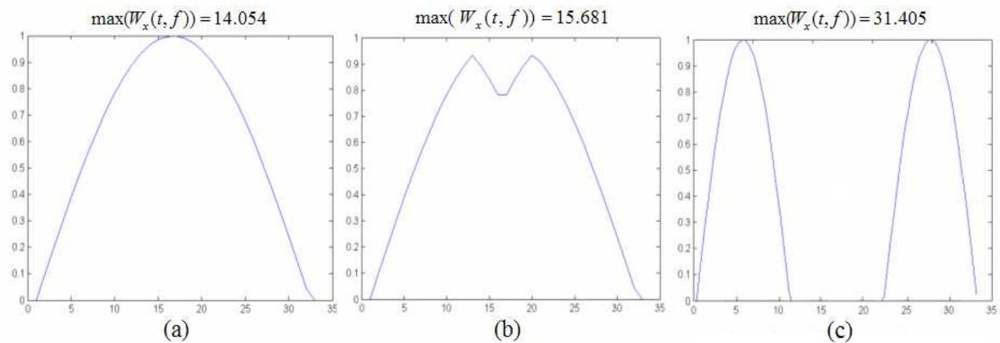  
Fig. 7 Examples of maximum value of the Wigner-Ville distribution obtained for different projection profiles.

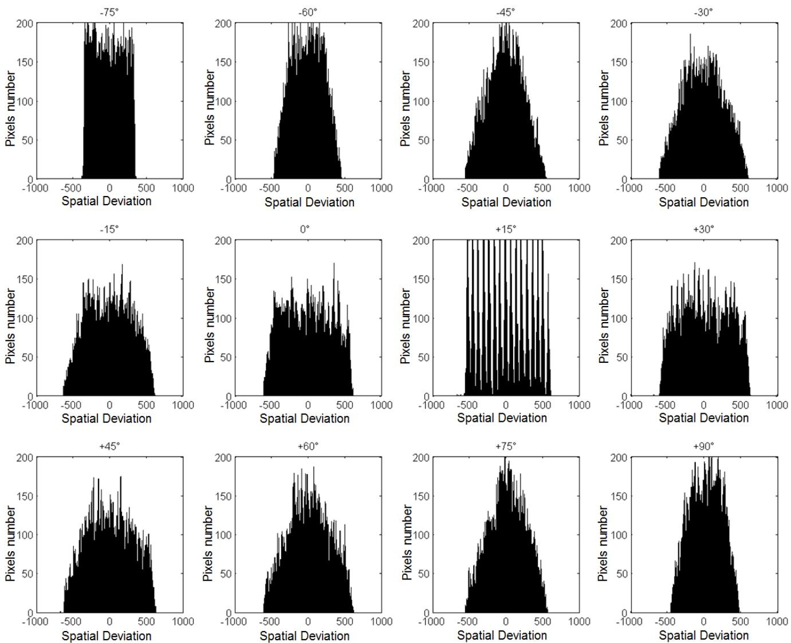  
Fig. 9 Projection histograms profiles of the document of Figure 8 obtained for several projection angles.

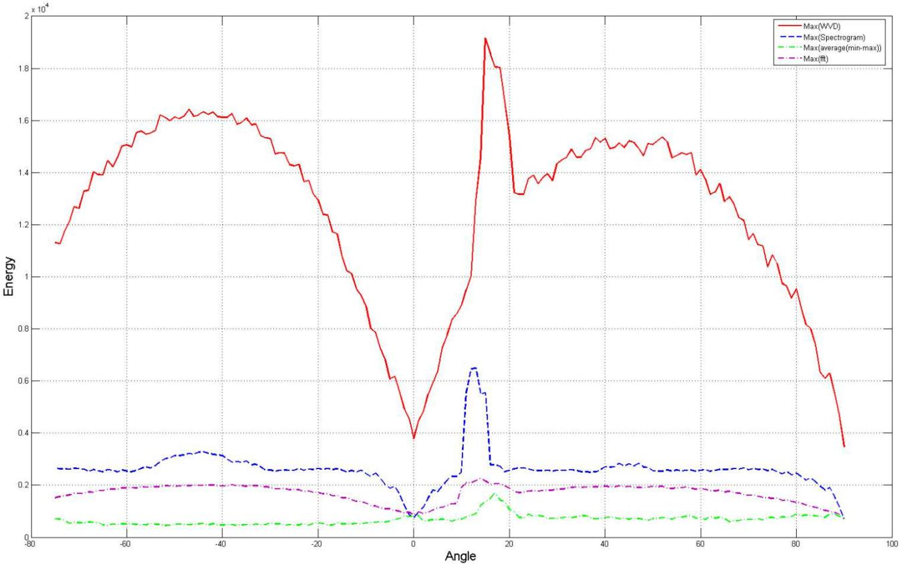  
Fig. 10 The highest energy value of the document of the Figure 8 using the Wigner-Ville distribution is represented in red solid line. The Spectrogram distribution is drawn in blue dotted line. The maximum average difference between maxima and minima of histograms projection (green dotted lines). The Fast Fourier Transform (purple dotted line) of the same document. The true orientation is obtained by the Wigner-Ville distribution and corresponds to $+ 1 4 . 7 ^ { \circ }$ .

two meshes $w _ { l e f t }$ and $w _ { r i g h t }$ (see Figure 11.b). Finally, the $w _ { r i g h t }$ is assigned to the mesh $w \big ( \theta _ { 1 } \big )$ and $w _ { l e f t }$ to $w ( \theta _ { 2 } )$ .

# 3.3 Erroneous inclination

When a mesh contains several orientations, the mesh orientation will be erroneous (see Figure 11). To detect this phenomenon, we observe the orientation of the horizontal (resp. vertical) surrounding meshes which have angles different of $\theta$ , more precisely, when $\theta _ { 1 }$ is different from θ , $\theta _ { 2 }$ is different from $\theta$ and $\theta _ { 1 }$ is different from $\theta _ { 2 }$ . In the Figure 11.a, $\theta = + 6 0 ^ { \circ }$ , $\theta _ { 1 } = 0 ^ { \circ }$ and $\theta _ { 2 } = 9 0 ^ { \circ } ( \mathrm { i . e } ~ \theta _ { 2 }$ can be vertical or oblique). Since this case arises inside the main horizontal writing, the vertical projection profile is used to resolve this case. If this case arises inside the main vertical writing, the horizontal projection profile is used to resolve this case. The first minimum value in the projection profile is looked for from the right representing the end of the first inclination $( I _ { m }$ minimum index). Then the mesh is divided at $I _ { m }$ into

# 3.4 Meshing correction

Being applied automatically, the initial paving edges can cross the connected components creating problems (false maxima) in text line detection (see Figure 12). The incorrect paving exists only in the horizontal and the vertical zones. We need to correct the position of these edges by proceeding a horizontal or vertical shift in order that the local paving covers the local connected components. In the horizontal (resp. vertical) area, the edge that divides two consecutive rows (resp. columns) is moved to the nearest position in these rows (resp. columns) when the horizontal (resp. vertical) projection vector for each of their two consecutive meshes has a minimum value.

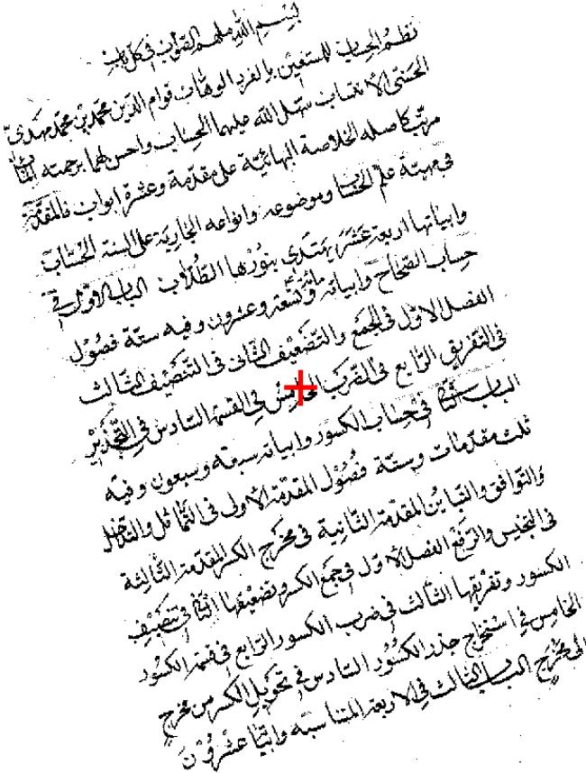  
Fig. 8 Handwritten Arabic document skewed of $+ 1 4 . 7 ^ { \circ }$ . The document centroid position, used to estimate the orientation, is marked with a red cross.

maxima (see Figure 13.a). Each peak represents the starting point $P _ { s }$ of the orientation line $b l _ { j }$ . The ending point $P _ { e }$ of the orientation line is calculated using the $P _ { s }$ , the orientation, the width and the height of each window (see Figure 13.b). The orientation line $b l _ { j }$ is calculated basing on the two points $\left( P _ { s } , P _ { e } \right)$ and the orientation of the window. The connected components that belong to a baseline are looked for construct the text line (see Figure 13.c).

A step of text line correction follows the text line detection to assign the non-detected components and the diacritical symbols to the appropriate text line (see Figure 13.c and d). A distance method is used to address this problem. First, the distance between the centroid of non-detected component or diacritical symbol $C _ { i }$ and the text line is calculated. $C _ { i }$ is assigned to the text line $l _ { j }$ if $d _ { c i , l j } < d _ { c i , l j + 1 }$ else to $l _ { j } + 1$ .

# 3.6 Connected line separation

The connections occur between two successive lines when their characters touch. Often, these connections are made between ascenders in the lower line and descenders in the higher line. Table 3 lists the four categories of connection in Arabic: a) a descender with right loop, connects a vertical ascender, b) a left descender with a loop, touches a vertical ascender, c) a right descender touches the higher part of the loop of a character, and d) a left descender connects the higher part of the lower curve of a letter.

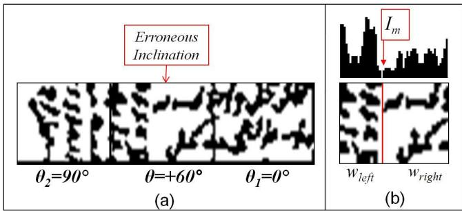  
Fig. 11 (a) Erroneous inclination mesh, (b) the erroneous inclination correction.

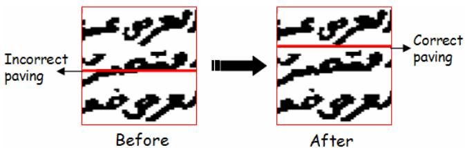  
Fig. 12 Example of incorrect paving in a horizontal zone.

# 3.5 Text line extraction

The text line follow-up starts in the first window on the right side of the page. The algorithm starts by looking for the new

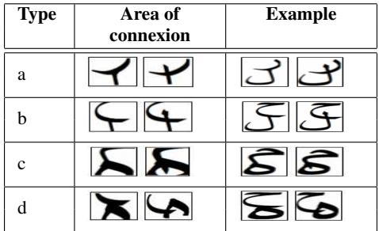  
Table 3 Four types of connexion observed in Arabic handwritten documents.

In all connection cases, we note the presence of a descender connecting a lower end letter. The descenders are grouped into two categories: (a,c) where the descender of the line starts from the right, and (b, d) where the descender of the line starts from the left. To streamline the work, the analysis focuses on the connection areas. (see Figure 14).

The method starts by extracting in the two lines, the connected component created by the connection between the two successive lines (see Figure 15.a). Then, the intersection points of each connected component is detected. An intersection point is a pixel that has at least three neighboring pixels. As in the case chosen, the connection occurs at a single point of intersection $S _ { p }$ close the minimum axis (valley between two lines). Thus, the point $S _ { p }$ is the nearest point of the minimum axis (see Figure 15.b). We then look for the starting point of the ligature, $B _ { p }$ , which is generally the highest point, near the baseline of the top line. Then, from this point, the method is to follow the descending character (i.e. its skeleton, see Figure 15.c). The following continues beyond the intersection point respecting an minimum angular variation corresponding to the curvature of the descending character.

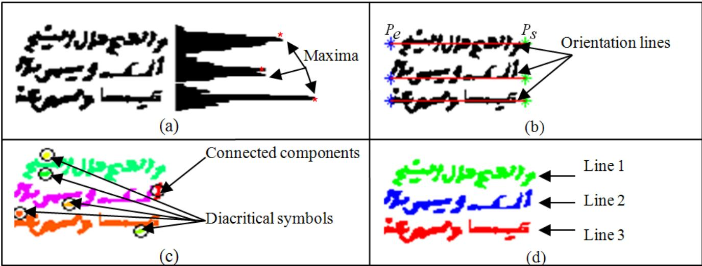  
Fig. 13 Text line detection steps for a window, (a) maxima detection, (b) orientation lines estimation, (c) assignment of each connected component and diacritical symbol to its appropriate line, (d) extracted lines.

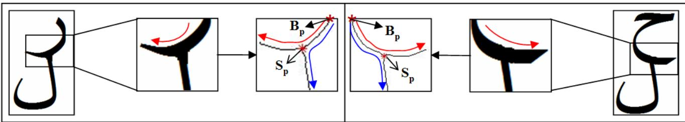  
Fig. 14 Connection areas and direction of descenders (right direction indicated by the red arrow, and the erroneous direction, by the blue arrow).

Due to the symmetry of the curve branches, the value of the orientation angle must always be positive. For example, in Figure 16, the angular variances are Var $( C _ { 1 + 2 } ) = 7 0 3 , 1 9$ , $V a r ( C _ { 1 + 3 } ) = 2 9 9$ and $V a r ( C _ { 1 + 4 } ) = 5 7 2 , 3 7 .$ . In this example, the minimum angular variance $V a r ( C _ { 1 + 3 } )$ is given by the correct direction to follow. Figure 17 illustrates the effectiveness of the algorithm on a representative sample of 12 arbitrarily chosen connected components from 640 occurrences found in 100 documents.

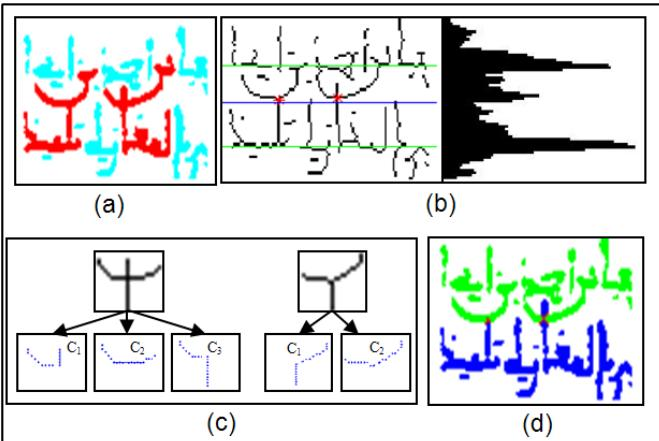  
Fig. 15 Different steps of the separation of connected components.

# 4 Experimental Results and Discussion

To study the effectiveness of our approach, we have experimented on 100 Arabic ancient documents containing 2,500 lines. These documents belong to a database stemmed from web sites of the Tunisian National Library, National Library of Medicine in the USA and National Library and Archives of Egypt. The tests were prepared after a manual areas and lines labeling step of each document. The rotation angle examined during these experiments ranged from $- 7 5 ^ { \circ }$ to $+ 9 0 ^ { \circ }$ . The execution time is measured from the meshing phase until the line separation phase. It depends on the document and the mesh sizes. The tests were performed on a PC with a Intel Core 2 Duo processor $2 . 4 ~ \mathrm { G H z }$ and a cache of 4 GB in Windows XP. The application was developed with MATLAB completed by the time-frequency toolbox tftb [44].

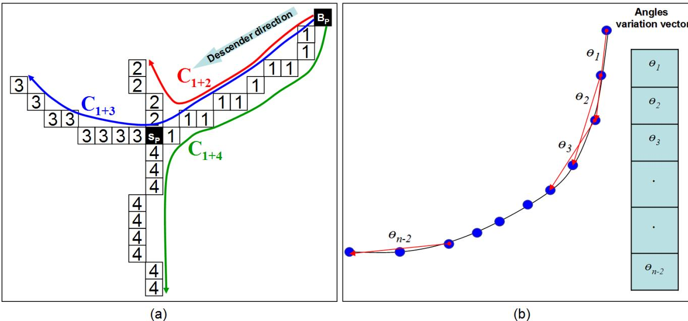  
Fig. 16 (a) Example of Arabic connected components (the Arabic letter ”ra” is connected with the letter ”alif”), (b) estimation algorithm of the angular variation.

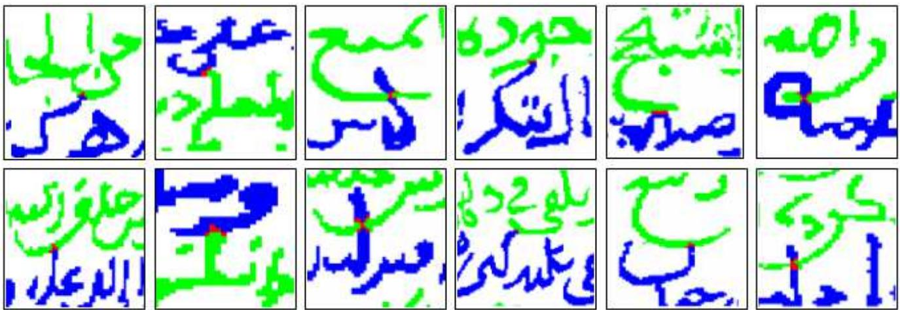  
Fig. 17 Results of some connected lines separation.

The approach is composed of two main steps: multioriented area detection and text line extraction. Our results are measured according to theses algorithms.

The multi-oriented algorithm is composed of three main steps: image meshing, orientation estimation and orientation extension and paving correction. A global accuracy rate of $9 7 \%$ is reached. The $3 \%$ error are shared by the three stages of treatment: $1 \%$ is due to the image paving, $1 . 3 \%$ is due to the orientation estimation and $0 . 7 \%$ is due to the orientation extension and paving correction.

In image meshing, it is just needed at least three text lines to obtain a projection profile representing the orientation in each mesh. So, if this criterion is not obtained by the paving algorithm, some errors may happen for area detection. The error rate of $1 \%$ is divided in two cases: $0 . 7 \%$ is due to the adjacent line connection and $0 . 3 \%$ is due to the small oriented areas. In the first case, the connection between lines is very frequent in ancient Arabic documents. When the active contour model (snake) is applied in a mesh to alignements extract, it is possible that it connect two adjacent lines. This will increase the alignement height and consequently the mesh height. A large mesh may include different oriented areas. In the second case, the oriented areas are composed of few small lines. These areas can be gathered by the paving in other meshes and naturally will not be extracted. The Figure 18 shows the image meshing results of 4 different documents. We can note in these documents the presence at least of three lines in each mesh.

The meshes in our documents have, in some cases, more than one orientation or curved lines. In the two cases, the orientation estimation is wrong and will be wrong for the orientation extension and consequently for the area detection. The error rate of $1 . 3 \%$ is divided in two cases: $0 . 9 \%$ is due to the meshes with multi-orientations (several orientations in the same mesh) and $0 . 4 \%$ error is due to the curved lines in Arabic ancient documents (a mesh with curved lines has a insignificant projection profile that false the orientation estimation). The Figure 20 shows the results of the first orientation estimation of four documents selected in our database. Each color represent an orientation (see Figure 19 for the color legend). We remark in these documents the presence of meshes with erronous orientation (multi-orientations or curved lines (Gray color)).

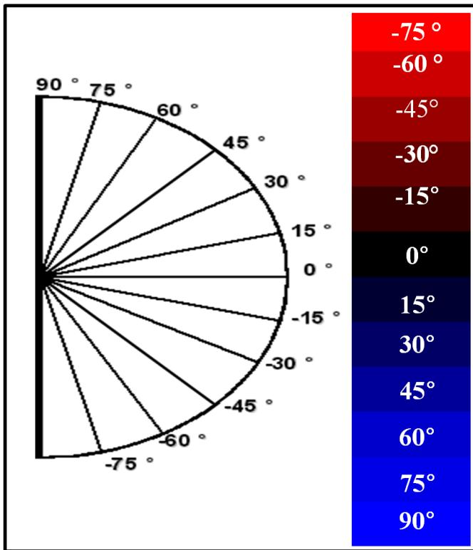  
Fig. 19 Orientation legend (represent an orientation).

Four extension rules are applied for mesh extension having the same orientation. In the extension phase, any error is happened because all possible orientations in the documents are considered. The error rate of $0 . 7 \%$ is due to the paving correction. As this paving is rectangular, the correction can be applied just along the horizontal and vertical directions. In some cases (oblique areas), the paving correction can not be applied that will yield some segmentation errors. This may happen when the vertical or horizontal bars cross some connected components. The Figure 21 shows the results of the multi-oriented areas extraction of the four selected documents. Each area is visualized by a color. In theses documents, all the multi-oriented areas are extracted correctely.

Table 4 summarizes the results of the 4 representative documents chosen arbitrary from the 100 documents selected. These results show the effectiveness and the performance of the multi-oriented area detection algorithm.

For line segmentation, the extraction rate reaches $9 8 . 6 \%$ . This accuracy is defined by (Number of text lines detected / Number of text lines of the document) $\times 1 0 0$ . The $0 . 9 \%$ of non detected lines is due to the detection area algorithm when small areas of few text lines are not extracted. The error rate of $0 . 5 \%$ is due to the presence of diacritical symbols and noise in the beginning of lines that create false maxima. The diacritical symbols are the points of Arabic letters and the noise come from the old age of these documents. Figure 22 illustrates the effectiveness of our algorithm on a sample of 3 documents chosen randomly among the 100 documents processed. To identify the lines, each pair of consecutive lines are presented in two different colors.

# 5 Conclusion

A multi-oriented text line extraction approach is proposed in this paper based on the local orientation estimation. To extract the lines, the approach proceeds first by an image meshing of the document. Then, the orientation in each mesh is estimated, extended and corrected. Finally, the text lines are extracted and separated.

The mesh size is estimated using the active contour model (snake) approach. This size is fixed once three lines in the mesh are extracted. The skew detection approach use the Cohen’s class distributions applied on the projection histogram profile in each mesh and considered as a signal. The Wigner-Ville distribution (WVD) from this class is retained for our application thanks to its interesting properties adapted to the properties of ours signals. The mesh area is extended to similar oriented meshes to obtain largest orientation areas using 4 rules. These rules depends on the orientations presented in these documents. The text lines are extracted in each mesh using a follow-up connected components algorithm. The lines are separated based on the analysis of the terminal Arabic letters.

Experimental results on various types of handwritten Arabic documents show that the proposed method has achieved a promising performance for the text line extraction. This approach will be generalized to other documents types (Latin, Urdu, Farsi etc.) and to heterogeneous documents with text and images.

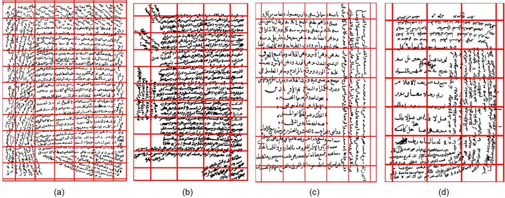  
Fig. 18 Meshing results of 4 different documents.

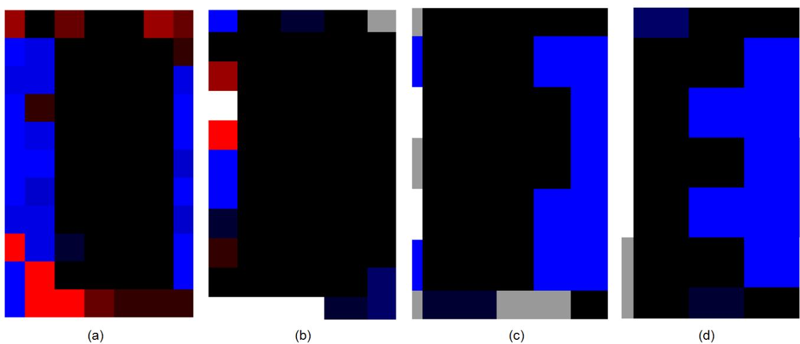  
Fig. 20 Results of the first orientation estimation of the four selected documents.

<table><tr><td>Figure 18</td><td>Document size</td><td>Resolution (dpi)</td><td>w × h of meshing (pixels)</td><td>Execution time (s)</td><td colspan="2">Zone number True Detected</td></tr><tr><td>First document</td><td>572×800</td><td>72</td><td>75×75</td><td>10</td><td>5</td><td>5</td></tr><tr><td>Second document</td><td>410×625</td><td>72</td><td>75×75</td><td>8</td><td>5</td><td>5</td></tr><tr><td>Third document</td><td>750×941</td><td>72</td><td>120×120</td><td>9</td><td>2</td><td>2</td></tr><tr><td>Fourth document</td><td>362×500</td><td>72</td><td>90×90</td><td>7</td><td>2</td><td>2</td></tr></table>

Table 4 Results of the multi-skew estimation for the four documents. The effectiveness of the algorithm is measured by the difference between the detected zones (the zones extracted by the proposed approach) and the true zones (the zones computed manually from each document) number.

# References

1. T. Akiyama and N. Hagita. Automatic entry system for printed documents. Pattern Recognition, 23:1141–1154, 1990.

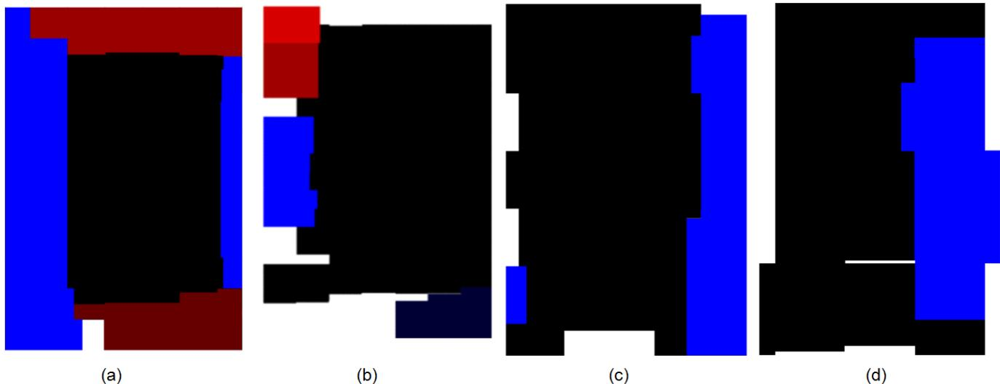  
Fig. 21 Results of the multi-oriented areas of the four selected documents.

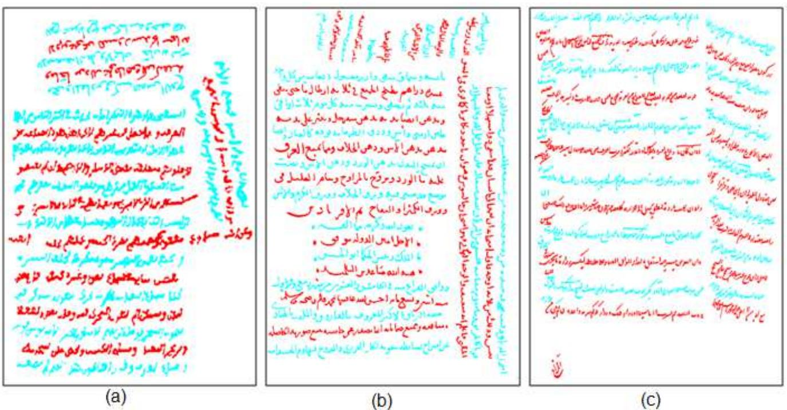  
Fig. 22 Result examples of the text lines extraction.

2. A. Antonacopoulos and D. Karatzas. Document image analysis for world war ii personal records. International Workshop on Document Image Analysis for Libraries, 0:336–343, 2004.   
3. A. Bennasri, A. Zahour, and B. Taconet. Extraction des lignes d’un texte manuscrit arabe. Vision Interface’99, pages 42–48, 1999.   
4. F. Le Bourgeois, H. Emptoz, E. Trinh, and J. Duong. Networking digital document images. International Conference on Document Analysis and Recognition, 0:0379, 2001.   
5. B. Couasnon and J. Camillerapp. Dmos, une m ¨ ethode g ´ en´ erique ´ de reconnaissance de documents : evaluation sur 60 000 formu- ´ laires du xixe sicle. In Colloque International Francophone sur l’crit et le Document (CIFED’02), pages 225–234, 2002.   
6. X. Du, W. Pan, and T. D. Bui. Text line segmentation in handwritten documents using mumford-shah model. Pattern Recogn.,   
42(12):3136–3145, 2009.   
7. M. Feldbach and K. D. Tonnies. Line detection and segmenta- ¨ tion in historical church registers. In ICDAR ’01: Proceedings of the Sixth International Conference on Document Analysis and Recognition, pages 743–748, Washington, DC, USA, 2001. IEEE Computer Society.   
8. M. Kass, A. Witkin, and D. Terzopoulos. Snakes: Active contour models. Proc. 1st ICCV, pages 259–268, June 1987.   
9. E. Kavallieratou, N. Fakotakis, and G. Kokkinakis. Skew angle estimation in document processing using cohen’s class distributions. Pattern Recogn. Lett., 20:11–13, 1999.   
10. F. Leitner and P. Cinquin. From splines and snakes to snake splines. In Selected Papers from the Workshop on Geometric Reasoning for Perception and Action, pages 264–281, London, UK,   
1993. Springer-Verlag.   
11. L. Likforman-Sulem and C. Faure. Extracting lines on handwritten documents by perceptual grouping, in advances in handwiting and drawing: multidisciplinary approach. C. Faure, P. Keuss, G. Lorette, A. Winter (Eds), pages 21–38, 1994.   
12. L. Likforman-Sulem, A. Hanimyan, and C. Faure. A hough based algorithm for extracting text lines in handwritten documents. International Conference on Document Analysis and Recognition,   
2:774–777, 1995.   
13. G. Louloudis, B. Gatos, I. Pratikakis, and C. Halatsis. Text line and word segmentation of handwritten documents. Pattern Recognition, 42(12):3169–3183, 2009.   
14. U. Mahadevan and R. C. Nagabushnam. Gap metrics for word separation in handwritten lines. In ICDAR ’95: Proceedings of the Third International Conference on Document Analysis and Recognition (Volume 1), pages 124–127, 1995.   
15. J. Montagnat, H. Delingette, and N. Ayache. A review of deformable surfaces: topology, geometry and deformation. Image and Vision Computing, 19(14):1023–1040, December 2001.   
16. D. Mumford and J. Shah. Optimal approximation by piecewise smooth functional and associated variational problems. Commun. Pure Appl. Math., 42:577–685, 1989.   
17. A. Nicolaou and B. Gatos. Handwritten text line segmentation by shredding text into its lines. International Conference on Document Analysis and Recognition, 0:626–630, 2009.   
18. S. Nicolas, T. Paquet, and L. Heutte. Text line segmentation in handwritten document using a production system. In Ninth International Workshop on Frontiers in Handwriting Recognition, pages 245–250, 2004.   
19. S. Osher and N. Paragios. Geometric Level Set Methods in Imaging,Vision,and Graphics. Springer-Verlag New York, Inc., Secaucus, NJ, USA, 2003.   
20. C. Pluempitiwiriyawej, J.M.F. Moura, Y. J. L. Wu, and C. Ho. Stacs: new active contour scheme for cardiac mr image segmentation. Medical Imaging, IEEE Transactions on, 24(5):593–603, May 2005.   
21. Y. Pu and Z. Shi. A natural learning algorithm based on hough transform for text lines extraction in handwritten document. In Proc. 6th International Workshop on Frontiers in Handwriting Recognition, pages 637–646, 1998.   
22. R. Ramlau and W. Ring. A mumford-shah level-set approach for the inversion and segmentation of x-ray tomography data. J. Comput. Phys., 221(2):539–557, 2007.   
23. J. A. Sethian. Curvature and the evolution of fronts. Communications in Mathematical Physics, 101(4):487–499, 1985.   
24. V. Shapiro, G. Gluchev, and V. Sgurev. Handwritten document image segmentation and analysis. Pattern Recogn. Lett., 14(1):71–   
78, 1993.   
25. Z. Shi and V. Govindaraju. Line separation for complex document images using fuzzy run length. In Int. Workshop on Document Image Analysis for Libraries, 2004.   
26. C. Xu and J. L. Prince. Gradient vector flow: A new external force for snakes. Proc. IEEE Conf. on Comp. Vis. Patt. Recog. (CVPR), pages 66–71, June 1997.   
27. A. Zahour, B. Taconet, and S. Ramdane. Contribution a la segmen- \` tation de textes manuscrits anciens. In Confrence Internationale Francophone sur l’Ecrit et le Document (CIFED’04), 06 2004.   
28. Y. Zheng, H. Li, and D. Doermann. A model-based line detection algorithm in documents. International Conference on Document Analysis and Recognition, 1:44, 2003.   
29. A. Antonacopoulos and D. Karatzas, Document Image Analysis for World War II Personal Records, International Workshop on Document Image Analysis for Libraries, 2004, pp. 336-343. Repulsive attractive network for baseline extraction on document images, Signal Processing, vol. 75, 1999, pp. 1-10.   
31. F. Yin, C.-L. Liu, Handwritten text line segmentation by clustering with distance metric learning, Proc. 11th ICFHR, 2008, pp. 229- 234.   
32. M. Kass and A. Witkin and D. Terzopoulos, Snakes: Active contour models, Proc. 1st ICCV, 987, pp. 259-268.   
33. V. Caselles and R. Kimmel and G. Sapiro, Geodesic active contours, International Conference on Computer Vision, 1995, pp. 694-699.   
34. C. Pluempitiwiriyawej and J.M.F. Moura and Y. J. L. Wu and C. Ho, STACS: new active contour scheme for cardiac MR image segmentation, IEEE Transactions on Medical Imaging, 2005, vol. 24, n.5, pp.593-603.   
35. S. Osher and N. Paragios, Geometric Level Set Methods in Imaging,Vision,and Graphics, 2003, Springer-Verlag New York, Inc.   
36. R. Ramlau and W. Ring, A Mumford-Shah level-set approach for the inversion and segmentation of X-ray tomography data, J. Comput. Phys., vol. 221, n. 2, pp. 539-557, 2007.   
37. S. S. Bukhari and F. Shafait and T. M. Breuel, Segmentation of Curled Textlines using Active Contours, The Eighth IAPR Workshop on Document Analysis Systems (DAS 2008), pp. 270-277.   
38. Y. Li and Y. Zheng and D. Doermann and S. Jaeger, ScriptIndependent Text Line Segmentation in Freestyle Handwritten Documents, IEEE Transactions on Pattern Analysis and Machine Intelligence, vol. 30, n. 8, 2008, pp. 1313-1329.   
39. D. Mumford and J. Shah, Optimal approximation by piecewise smooth functional and associated variational problems, Commun. Pure Appl. Math., 1989, vol. 42, pp. 577-685.   
40. X. Du and W. Pan and T. D. Bui, Text line segmentation in handwritten documents using Mumford-Shah model, Pattern Recogn., vol. 42, n. 12, 2009, pp. 3136-3145.   
41. C. Xu and J. L. Prince, Gradient Vector Flow: A New External Force for Snakes, Proc. IEEE Conf. on Comp. Vis. Patt. Recog. (CVPR), 1997, pp. 66-71.   
42. J. Montagnat and H. Delingette and N. Ayache, A review of deformable surfaces: topology, geometry and deformation, Journal of Image and Vision Computing, vol. 19, n. 14, 2001, pp. 1023- 1040.   
43. F. Kaiser James and W. Schafer Ronald, On the Use of the Io-Sinh Window for Spectrum Analysis, IEEE Transactions on Acoustics, Speech and Signal Processing, vol. ASSP-28, n. 1, 1980.   
44. F. Auger and C. Doncarli, Quelques commentaires sur des representations temps-fr ´ equence propos ´ ees r ´ ecemment”, Traite- ´ ment du Signal, n. 1, vol. 9, pp. 3-25, 1992.   
45. L. Cohen, Generalized phase-space distribution functions, J. Math. Phys. n. 5, vol. 7, 1966, pp. 781-786   
46. B. Escudie and J. Gr ´ ea, Sur une formulation g ´ en´ erale de la ´ representation en temps et en fr ´ equence dans l’analyse des sig- ´ naux d’energie finie, CR. Acad. Sci. Paris, 1976, vol. 283, pp. ´ 1049-1051.   
47. T.A.C.M. Classen and W.F.G. Mecklenbrauker, The Wigner distribution - A tool for time frequency analysis, Parts I-III, Philips J. Res., 1980, vol. 35, Part I: n3, p. 217-250; Part II n4/5, p. 372-389; Part III: n6, pp. 372-389.   
48. F. Hlawatsch and G. F. Boudreaux-Bartels, Linear and quadratic time-frequency signal representation, IEEE Signal Process. Mag, n. 2, vol. 9, pp. 21-67, 1992.   
49. P. Flandrin, Time-Frequency/Time-Scale Analysis, Academic Press, San Diego, CA, 1999.   
50. E. P. Wigner, On the quantum correction for thermodynamic equilibrium, Phys. Rev., 1932, vol. 40, pp. 749-759.   
51. P. Flandrin and W. Martin, A general class of estimators for the Wigner-Ville spectrum of nonstationary processes, Systems Analysis and Optimization of Systems, Lecture Notes in Control and Information Sciences, A. Bensoussan and J-L. Lions (Ed.), pp. 15- 23. Spri Berlin vol, 62, 1984   
52. E. Kavallieratou, N. Fakotakis, and G. Kokkinakis. Skew angle estimation for printed and handwritten documents using the WignerVille distribution. Image and Vision Computing, 20 :813-824, 2002.   
53. T. Pavlidis and J. Zhou. Page segmentation and classification. Computer Vision Graphics and Image Processing, 54(2):484–496, 1992.   
54. G.S. Peake and T.N. Tan. A general algorithm for document skew angle estimation. IEEE Int. Conf. Image Process., 2:230–233, 1997.   
55. W. Postl. Detection of linear oblique structures and skew scan in digitized documents. In Proceedings of the Eighth International Conference on Pattern Recognition, IEEE CS Press, Los Alamitos, CA, pages 687–689, 1986.   
56. E. Kavallieratou, N. Fakotakis, and G. Kokkinakis. Skew angle estimation for printed and handwritten documents using the wigner-ville distribution. Image and Vision Computing, 20:813– 824, 2002.   
57. S. Saha, S. Basu, M. Nasipuri, and D. Kr. Basu A Hough Transform based Technique for Text Segmentation. In Computing Research Repository, 2010.   
58. J. Kumar, W. Abd-Almageed, L. Kang and D. Doermann Handwritten Arabic Text Line Segmentation using Affinity Propagation. In Document Analysis Systems, pages 135–142, 2010.   
59. W. Boussellaa and A. Zahour and H. Elabed and A.Benabdelhafid and A. M. Alimi, Unsupervised Block Covering Analysis for Text-Line Segmentation of Arabic Ancient Handwritten Document Images, International Conference on Pattern Recognition, pages 1929-1932,2010.   
60. S. S. Bukhari, F. Shafait, and T. M. Breuel, Performance Evaluation of Curled Textlines Segmentation Algorithms, 9th IAPR Workshop on Document Analysis Systems, DAS’10, Boston, MA, USA, 2010.