# A complete system for analysis of architectural drawings

Philippe Dosch, Karl Tombre, Christian Ah-Soon, Gérald Masini

# To cite this version:

Philippe Dosch, Karl Tombre, Christian Ah-Soon, Gérald Masini. A complete system for analysis of architectural drawings. International Journal on Document Analysis and Recognition, 2000, 3 (2), pp.102-116. ff10.1007/PL00010901ff. ffinria-00099391ff

# HAL Id: inria-00099391

# https://inria.hal.science/inria-00099391v1

Submitted on 15 Feb 2024

HAL is a multi-disciplinary open access archive for the deposit and dissemination of scientific research documents, whether they are published or not. The documents may come from teaching and research institutions in France or abroad, or from public or private research centers.

L’archive ouverte pluridisciplinaire HAL, est destinée au dépôt et à la diffusion de documents scientifiques de niveau recherche, publiés ou non, émanant des établissements d’enseignement et de recherche français ou étrangers, des laboratoires publics ou privés.

# A complete system for the analysis of architectural drawings

Philippe Dosch, Karl Tombre, Christian Ah-Soon $\star$ , G´erald Masini

LORIA, Campus Scientifique, B .P. 239, 54506 Vandœuvre-l\`es-Nancy, France; e-mail: Philippe.Dosch@loria.fr

Abstract. In this paper, we present a complete system for the analysis of architectural drawings, with the aim of reconstructing in 3D the represented buildings. We successively describe the graphics recognition algorithms used for image processing and feature extraction, the 2D modeling step, which includes symbol recognition and converts the drawing into a description in terms of basic architectural entities, and a proposed 3D modeling process which matches reconstructed floors. The system also includes a powerful and flexible user interface.

Key words: Graphics recognition – Architectural drawings – Symbol recognition – Vectorization

# 1 Introduction

Graphics recognition techniques have been applied to many kinds of technical documents and drawings. However, surprisingly few teams have been dealing with architectural drawings. There are probably two main reasons for this. First, there has been less demand from the application field than in other domains for systems capable of analyzing paper drawings and yielding a 2D or 3D Cad description of the represented building. Second, architectural design is more or less at the crossroads between engineering and art, which makes precise analysis and reconstruction more difficult.

In recent years, our team has conducted a research project whose aim was to reconstruct 3D models of buildings as automatically as possible, from the analysis of architectural drawings. This paper presents the resulting complete system. We start by presenting the algorithms we chose for the image processing part and the feature extraction from the drawings (Sect. 2). These features allow an initial 2D modeling in terms of basic architectural entities (Sect. 3). We then propose a 3D modeling process (Sect. 4). From the beginning, it was clear that such a system cannot be fully automatic, so we needed a powerful and flexible user interface, which is described in Sect. 5. To implement such a large system, it is essential to define a suitable system architecture, which is detailed in Sect. 6. In Sect. 7, we propose some conclusions and perspectives on this work, with a critical analysis of the results obtained.

# 2 Image processing and feature extraction

Our basic idea was to look for robust algorithms and methods [30], i.e., methods which do not require tuning a lot of parameters. Of course, we are not completely satisfied with the achievements so far, and we indicate at the end of the section what remains to be done.

# 2.1 Tiling

In some cases, the document images on which we have to work are very large, and the memory requirements of our methods exceed what is usually available with a common workstation. We therefore designed a method for dividing the image into tiles, each of them being processed and analyzed independently. The graphical features resulting from the feature extraction process are then merged at the end.

Splitting up the image: the original image is split into partially overlapping tiles. The width of the overlapping zone is chosen so as to allow for good matching of the resulting features [34]. It is set to three times the maximal width of the graphical features present in the document.

Through this splitting, as many tiles are generated as necessary for covering the whole image (Fig. 1).

Merging the tiles: the tiles are merged again after vectorization (Sect. 2.3), by matching the segments extracted in each tile. At vector level, the memory requirements are smaller, so it becomes useful to work on the complete data structure again.

The merging algorithm works as follows:

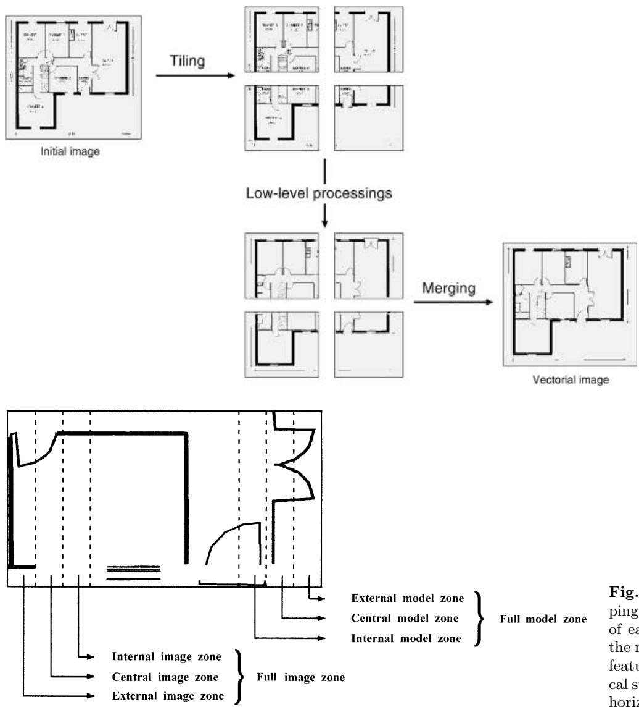  
Fig. 1. Principle of tiling   
Fig. 2. Detail of the different overlapping sub-zones for a tile. The width of each of these zones corresponds to the maximal thickness of the graphical features. Here, we represent the vertical sub-zones; the same process is done horizontally

– For each tile $T$ (here called the model), analyze its neighboring tiles $T _ { a }$ (called the images).

– For each segment $s _ { i }$ in $T$ , look for matching segments $s _ { j } ^ { u }$ , using the Hausdorff distance $H ( r _ { i } , r _ { j } ^ { a } )$ , defined by [27]:

$$
H ( M , I ) = \operatorname* { m a x } ( h ( M , I ) , h ( I , M ) )
$$

with:

$$
h ( M , I ) = \operatorname* { m a x } _ { m \in M } \operatorname* { m i n } _ { i \in I } \left| \left| m - i \right| \right|
$$

where

$- \ M$ represents the model segments (of $T$ ) and $I$ represents the image segments (of the $T _ { a }$ tiles);   
$- \textit { \textbf { m } }$ and $i$ are the vertices of the associated polygon (a segment with a thickness is modeled by a 4- vertex polygon);   
$- \textit { r } _ { i }$ and $r _ { j } ^ { a }$ are the parts of segments $s _ { i }$ and $s _ { j } ^ { a }$ which are contained in the central overlapping zone (Fig. 2).

– Store the match if $H ( r _ { i } , r _ { j } ^ { a } ) < \rho$ (experimentally, we set $\rho = 5 0$ pixels).

– Extract the best candidate match for each feature. This extraction uses propagation, by looking for the matches which verify:

– $H ( r _ { i } , r _ { j } ^ { a } )$ is the smallest distance between $r _ { i }$ and all image segments matched with $r _ { i }$ , – $H ( r _ { i } , r _ { j } ^ { a } )$ is the smallest distance between $r _ { j } ^ { a }$ and all model segments matched with $r _ { j } ^ { a }$ .

– Merge the matched segments, over several tiles when necessary.

The results are very satisfying. As an example, for a $6 0 0 0 \times 1 5 6 0 0$ image, split into 36 tiles of size $2 0 0 0 ~ \times$ 2000 pixels, with an overlapping zone of 120 pixels, the merging process takes approximately 5 s on a Sun Ultra 1 workstation and yields a final set of 3910 segments, with an error rate lower than $1 \%$ .

# 2.2 Segmentation

Our basic choice for text/graphics segmentation was to implement the well-known method proposed by Fletcher and Kasturi [13], while adapting the parameters to our kinds of documents. These thresholds are stable, and the method yields good results (Fig. 3).

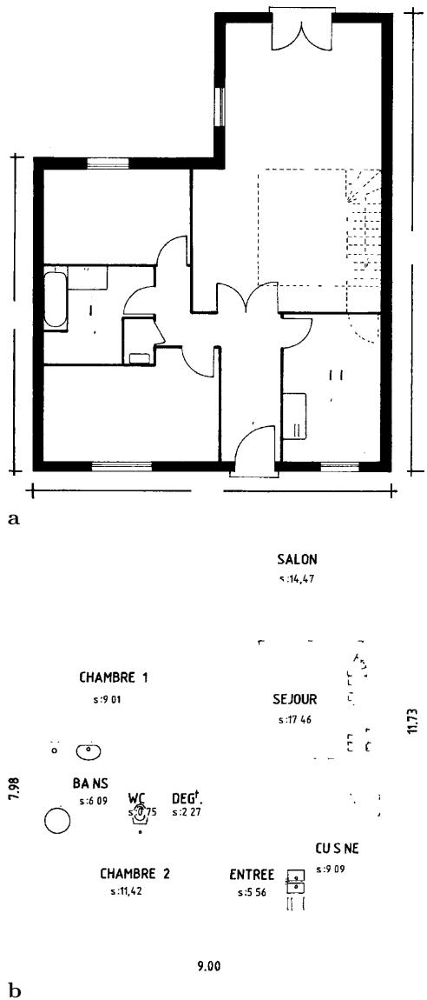  
Fig. 3a,b. Text/graphics separation. a Graphics layer. b Text layer

Of course, such a method, based on analyzing the shape and the size of the connected components, adds many dashes from dashed lines to the character layer. This is interactively corrected with our user interface (see Sect. 5).

The characters are then grouped into strings, using the Hough transform-based approach proposed by Fletcher and Kasturi. The bounding boxes of the strings can be interactively corrected, if necessary (Fig. 4), and their position is then stored, for later character recognition.

The remaining graphics part is further segmented into thin lines and thick lines. For this, we chose morphological filtering [30]. Let $I$ be the image of the graphics part, $w$ be the minimum width of a thick line, and $n$ be $\lfloor \frac { w } { 2 } \rfloor$ . Using a $B _ { n }$ square sized $( 2 n + 1 ) \times ( 2 n + 1 )$ the thick lines can be retrieved through partial geodesic reconstruction ( $n + 1$ iterations):

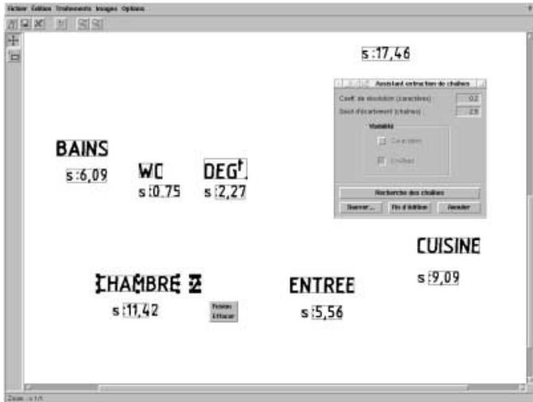  
Fig. 4. Extraction of character strings. The popup menu allows the user to edit the bounding box, merge two strings, or delete a string

$$
K _ { 0 } = J ; K _ { i } = ( K _ { i - 1 } \oplus B _ { 1 } ) \cap I \quad { \mathrm { f o r } } \quad i = 1 \ldots n + 1
$$

This yields two images $I _ { t h i c k } = K _ { n + 1 }$ and $I _ { t h i n } ~ =$ $I - I _ { t h i c k }$ (Fig. 5).

# 2.3 Vectorization

Vectorization is, of course, a central step in the analysis process. We emphasize that it must be as stable and robust as possible [30]. The first step in vectorization is to process the raster image in order to extract a set of lines, i.e., of chains of pixels. The most intuitive definition for these lines is probably that they represent the set of significant medial axes of the original image, considered as a shape. In this section, we will only summarize our choices for vectorization; a more thorough presentation and discussion is available in reference [31].

There are three main families of approaches for this step. The first method which comes to mind is to compute the medial axis, i.e., the skeleton of the raster image. This is the most common approach, and skeletons are known to yield good precision with respect to the positioning of the line. However, they also tend to have lots of barbs when the image is somewhat irregular, so they need some clever heuristics or post-processing steps that weaken their generality and robustness. Another weakness of skeleton-based methods is that they displace the junction points. This is a direct consequence of the fact that the skeleton follows the medial axis of the shape, whereas the position of the junction as envisioned by the draftsman is not on the medial axis of the shape (Fig. 6). Other families of methods are based on matching the opposite sides of the line, or on sparse-pixel approaches.

After a careful study and comparison of the pros and cons of these various methods [31], our current choice is the skeleton-based approach, despite its known weaknesses. Among the possible approaches for computing a skeleton, we have found the distance transform to be a good choice. The skeleton is defined as the set of ridge lines formed by the centers of all maximal disks included in the original shape, connected to preserve connectivity. Distance transforms [6] can be computed in only two passes on the image. To guarantee the precision of the skeleton, we advocate the use of chamfer distances, which come closer to approximating the Euclidean distance. A good compromise between precision and simplicity seems to be the 3–4 chamfer distance transform (Fig. 7), for which a good skeletonization algorithm has been proposed by Sanniti di Baja [7]. A single threshold on the significance of a branch enables correct removal of the smallest barbs.

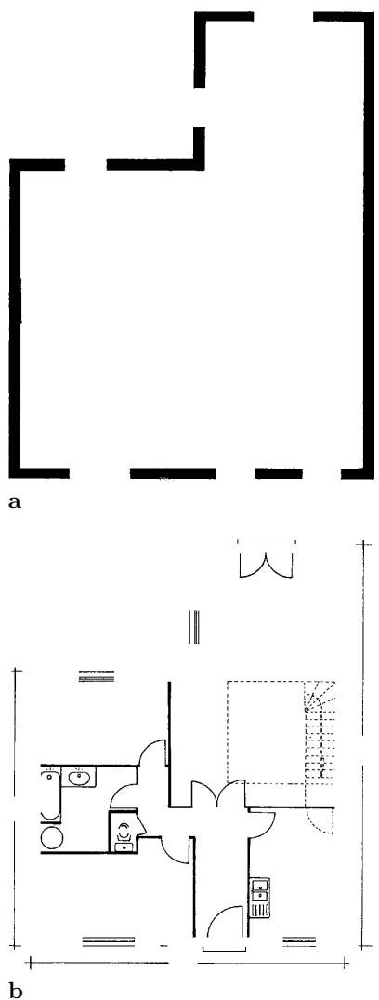  
Fig. 5a,b. Thin/thick separation. a Thick lines. b Thin lines

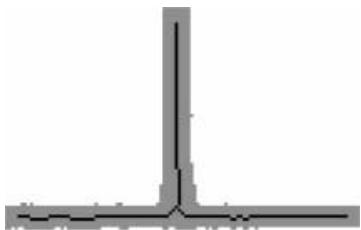  
Fig. 6. Position of the junction point with a skeleton-based method

<table><tr><td rowspan=1 colspan=1>$V2r}$</td><td rowspan=1 colspan=1>V{</td><td rowspan=1 colspan=1>$V4}$</td></tr><tr><td rowspan=1 colspan=1>V1</td><td rowspan=1 colspan=1>X</td><td rowspan=1 colspan=1>$V }$</td></tr><tr><td rowspan=1 colspan=1>$V{$</td><td rowspan=1 colspan=1>V7</td><td rowspan=1 colspan=1>V6</td></tr></table>

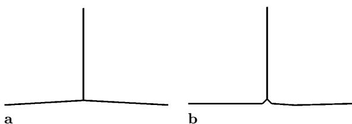  
Fig. 7. Computing the 3–4 distance transform in two passes over the image, the first from left to right and from top to bottom, the second from right to left and from bottom to top. Sanniti di Baja’s algorithm performs some post-processing on this distance transform, such as changing labels 6 to 5 and 3 to 1; see [7] for details   
Fig. 8a,b. Comparison of two polygonal approximation methods applied to Fig. 6. a Wall and Danielsson. b Rosin and West

After extracting the skeleton, the result of the process is a set of pixels considered as being the medial axes of the lines in the drawing. This set must be linked, to extract the chains making up the lines. A detailed algorithm for this linking process is given in [31].

The lines extracted from the skeletonization step are to be represented by a set of segments. This is done by polygonal approximation, regarding which many methods exist. In our experiments, we have basically used two approximation methods. The first, based on recursive split-and-merge, was proposed by Rosin and West [26]; it has the advantage that it does not require any usergiven threshold or parameter. The principle is to recursively split the curve into smaller and smaller segments, until the maximum deviation is 0 or there are only three (or less) points left. Then, the “tree” of possible segments is traversed and the method keeps those segments maximizing a measure of significance, which is defined as a ratio between the maximum deviation and the length of the segment. Rosin has also proposed other possible measures of significance [25], and we plan to explore this further.

We have also used for many years an iterative method, that of Wall and Danielsson [35], enhanced by our team with a direction-change marking procedure to preserve the angular points. This method only needs a single threshold, on the ratio between the algebraic surface and the length of the segments. It is fast and efficient, but not as precise as the former. On the other hand, Rosin and West’s method tends to split up the lines around a junction into too many small segments (see Fig. 8). This is a direct consequence of its preciseness and of the previously mentioned displacement of junction points by skeleton-based methods.

# 2.4 Arc detection

The arc detection method we have designed [12] is basically inspired by that of Rosin and West [26], but we have included two ideas proposed by Dov Dori [9]: a better method for computing the center of the arc, and the use of polylines instead of simple segments. We also added some improvements of our own to these basic ideas. The most important of these is the computation of the error associated with an arc hypothesis, not with respect to the polygonal approximation, but with respect to the original chain of skeleton pixels. In order to achieve this, each set of segments delivered by the polygonal approximation step of our vectorization process is associated with the pixel chain that the segments approximate. Segments are grouped into polylines, each polyline being the approximation of a complete chain. The original linked chain corresponding to a polyline can be retrieved using a simple index.

Our arc detection algorithm works in two phases: the generation of arc hypotheses, and the validation of the hypotheses. The hypotheses are built from the polygonal approximation. We maintain a list of connected segments $( S _ { 1 } , . . . , S _ { n } )$ , described by their extremities $( P _ { 1 } , . . . , P _ { n + 1 } )$ , such that they contain a minimum number of points (four points are necessary to build a relevant hypothesis), and that the successive angles $\widehat { S _ { i } S _ { i + 1 } }$ and ${ \widehat { S _ { i + 1 } } } { \widehat { S _ { i + 2 } } }$ are approximately equal.

Arc detection is performed on each of these hypotheses. If an arc is not detected for a given hypothesis, we decrease the number of segments of the hypothesis and test again, until we reach a valid arc or until there are too few points to build a significant hypothesis. The test phase is performed using least squares minimization. The error measure is not done on the segments of the polygonal approximation, but on the subchain of points.

This method also detects full circles. When working on a closed loop of successive segments, we eliminate one of the segments and apply the previously described method. If a unique arc is detected, including all the segments, we test the presence of a circle by checking the validity of the last segment.

Figure 9 illustrates results obtained on an architectural drawing. There are still several possible improvements to the method. One of them is to test arc hypotheses on more than one polyline, as the skeleton linking algorithm starts new chains at each junction. This would lead to the possibility of recognizing a single arc, even when it is crossed by another line, or to recognize two full arcs whenever they share short segments. The main difficulty here is not with the method, but with the computational complexity of the implementation.

We also still have thresholds in the method, especially for the similarity between two angular measures. A possible improvement would be to extend Rosin’s work on significance measures [25] to arc detection.

# 2.5 Stability, robustness and possible improvements

As mentioned pnoireviously, our aim is to have stable and robust methods, with few and well-defined parameters and thresholds. The stability of our current processes is varying. The tiling process and subsequent matching of vectors in the different tiles (Sect. 2.1) relies on well-defined parameters and can be considered as stable. The same can be said of most segmentation steps (Sect. 2.2), although it remains hard to stabilize the thresholds for character grouping into strings. We have implemented vectorization methods which rely on nearly no parameter (Sect. 2.3), and this is, in our opinion, an important factor of robustness. The same cannot be said yet of arc detection (Sect. 2.4), which remains dependent on too many parameters, which are relatively hard to master.

In addition to continuing work on the stability aspect, we also need to improve the precision of vectorization. As we have seen, an important remaining problem is that of the processing of junctions, where we end up having to find a “compromise” between the number of segments and the precision of the vectorization. This problem is annoying as it has an impact on the quality and robustness of all the following steps, including symbol recognition (Sect. 3.3) and 3D reconstruction (Sect. 4). We are currently investigating several possible improvements, including a post-processing process where the exact position of the junction would be recomputed after a first vectorization [24,15], and complementary approaches where the skeleton is not computed, but the lines searched for directly on the image [32].

# 3 2D modeling

When the basic features have been extracted from the document image, the next step consists in recognizing elements which can be used when building a 2D model of a floor of the building.

# 3.1 Detection of dashed lines

In architectural drawings, many lines are dashed. We therefore needed a detection method to recognize them as such. This can be either done directly on the pixel image, using image processing tools such as directional mathematical morphology operators [1], or on the vectors yielded by the raster-to-vector conversion. We chose the latter approach and adapted to our case a method first proposed by Dori [8]. This algorithm relies on some characteristics common to all dashed lines:

– They have a minimum number of dashes having approximately the same length.   
They are regularly spaced.   
– They follow a virtual line.

The method starts by extracting the segments which are smaller than a given threshold and which have at least one free extremum, i.e., which is not connected to another segment or arc. All such segments which have not yet been included in a potential dashed line are called keys. The main loop consists in choosing a key as the start of a new dashed line hypothesis, and in trying to extend this hypothesis in both directions, by finding other segments belonging to the same virtual line. This search is done in an area whose width is the double of the current key width, and whose length is the maximal distance allowed between two segments belonging to a same dashed line (Fig. 10).

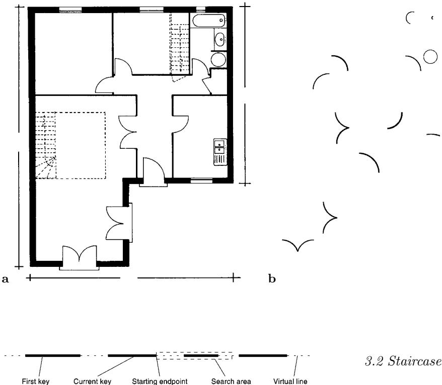  
Fig. 10. Search area for dashed lines extraction   
Fig. 9a,b. Results of arc detection. a Original image. b Detected arcs

If there is more than one key contained in this search area, we choose the one closest to the extremum of the current key. To reduce computation times in this searching process, we use a data structure of buckets [4], by dividing the image into meshes. The new key must be aligned with the keys already detected. It is then added to the current dashed line hypothesis, and the search is continued from the new current key, until it is not possible to add any new key.

Only hypotheses with at least three dashes are kept; the corresponding keys are erased and replaced by the corresponding line segments, with a “dashed” attribute. Figure 11 presents the results of the method.

We have added some improvements to this method. For instance, we need to recompute the precise connections of the dashed line segments found with the other segments and arcs of the vectorization. This is done through a post-processing step which tries to prolongate the dashed segments until meeting other segments. The maximum length which is added to a segment extremity is the maximum distance between two dashes. Figures 12 and 13 illustrate the results of this improved method.

Staircases are useful modeling elements, both for representing the layout of a floor and as matching features when reconstructing the 3D model (Sect. 4). They can usually be considered as a kind of texture, where the individual stairs are regularly repeated (Fig. 14).

We chose to use a structural texture analysis process designed by G. S´anchez [28]. The method is based on searching for regular polygonal structures. For this, a graph of all the polygons extracted from the vectorization is built [16]. This graph is used to perform structural texture segmentation, using a pyramidal approach [19]. In this process, we need the ability to compute a similarity measure between two polygons; for this, a distance is defined, based on the difference between the areas of the polygons.

Among the various textures detected by this approach (Fig. 15), we must then recognize those corresponding to staircases. As there is no unique standard for representing stairs, we use simple heuristics, based on the number and size of stairs. Therefore, we simply filter the result of the previous texture detection process, keeping the regions having between five and 30 texture elements. Although this is a very crude and simplistic rule, it extracts most staircases without adding much noise. Thus, it is easy and not costly in time to interactively adapt the result with the user interface (Sect. 5).

Figure 16 presents some of our results, before user interaction. Despite some strange results, the recognition rate is surprisingly good, given the simplicity of the filtering process.

# 3.3 Symbol recognition

A number of symbols must be recognized as such in the drawing. One problem with architectural symbols is that many models are “increments” of simpler models (Fig. 17a), and the recognition method must be able to recognize the most extended symbol. In our system, symbol recognition is performed using the method designed in our group by Christian Ah-Soon, on the basis of previous work by Pasternak [23] and by Messmer [21]. The details of the method are described elsewhere [3]; we will only summarize it here.

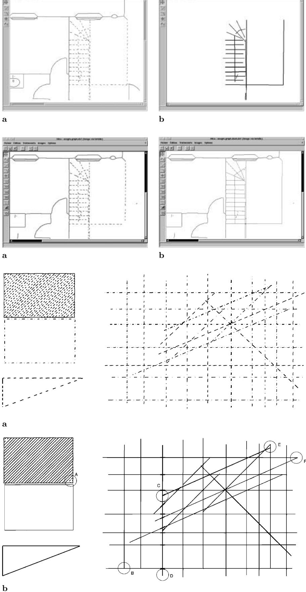  
Fig. 11a,b. Dashed lines detection. a Source image. b Detected dashed lines   
Fig. 12a,b. Detection and correction of dashed lines. a Original drawing. b Detected dashed lines   
Fig. 13. a Original vectorized image. b Detection of dashed and dotted lines on an example from the Grec’95 contest [18]. A. Line not recognized (not enough keys) B. Corrected line C. Corrected line D. Line not corrected (too long) E. Wrong correction F. Corrected lines

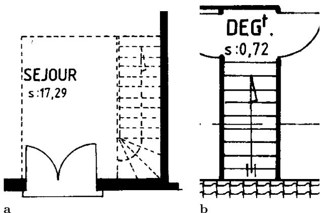  
Fig. 14. Staircases in a typical architectural drawing. a First floor. b Second floor

The models of possible symbols are described in terms of elementary features and of geometric and topological constraints between these features, using a simple description language. The descriptions are stored in a text file, readable by a simple parser. Figure 17b shows an excerpt from such a file, to give an idea of the kind of constraints used.

The network of constraints used in our method tries to factorize the similarities of the different models. The basic principle of the recognition method is that the features yielded by vectorization (segments and arcs) are input into a network of constraints. The search for symbols works through propagation of these segments and arcs through the network. The network is made of five kinds of nodes : NNSegment, NNArc, NNMerge, NNCondition, and NNFinal. These nodes are connected through fatherson links; each node can have at most two fathers, but can have several sons. Each node tests some constraints, and can thus be seen as a “filter”, which only transmits to its sons the features (defined as sets of segments and arcs) which verify the tested constraints. These features, created only once by each node, can be used by all the sons of the node. At the end, the segments and arcs of the features which have “trickled” down to the terminal nodes of the network represent the corresponding symbols.

For each network, there is only one NNSegment node and one NNArc node; they correspond to the inputs of the network. These nodes initialize the recognition process, create a one-segment or one-arc feature for each segment or arc, and send it to all their sons. A NNCondition node has only one father. It tests the constraint on the features sent to it by its father. If the constraint is satisfied, the node propagates the feature to its sons. A NNMerge node has two father nodes, and gathers the features sent by its fathers, if they verify a connection constraint. The resulting merged feature, if any, is sent to the sons of the node. The NNFinal nodes are the terminal nodes. Each of these nodes corresponds to one of the symbols which have to be recognized. When a feature reaches such a node, it has gone through a number of NNMerge and NNCondition nodes and has verified their constraints. To get the actual symbol, it is therefore sufficient to get the set of features stored in the NNFinal node.

Although we only perform recognition on the vectorization of the thin lines layer (Sect. 2.2), there are still errors due to noise and to the approximation of curves by polylines. We therefore use an error measure, which quantifies the deviation between the searched symbol and the candidate features. When a node receives a feature, it computes the resulting error if the segments of the feature do not exactly verify the constraint. This error is accumulated from one node to the other, and when it exceeds a given threshold, the feature is not transmitted anymore. We are working on having more adaptive thresholds, instead of the fixed ones currently in use.

A great advantage of the recognition method is that nearly the same algorithms used for recognition are also used when building the network, through input of model symbols and incrementally adding new nodes whenever new constraints are detected [3]. An example of recognition results is given in Fig. 18.

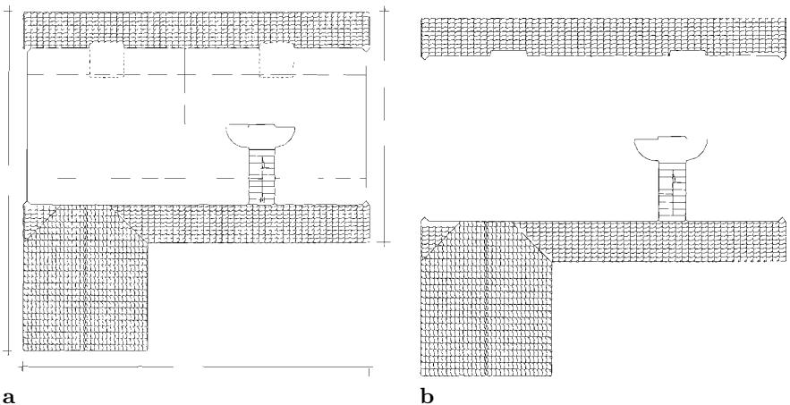  
Fig. 15a,b. Some textures detected by S´anchez’ texture analysis method [28]. a Original image. b Detected textures

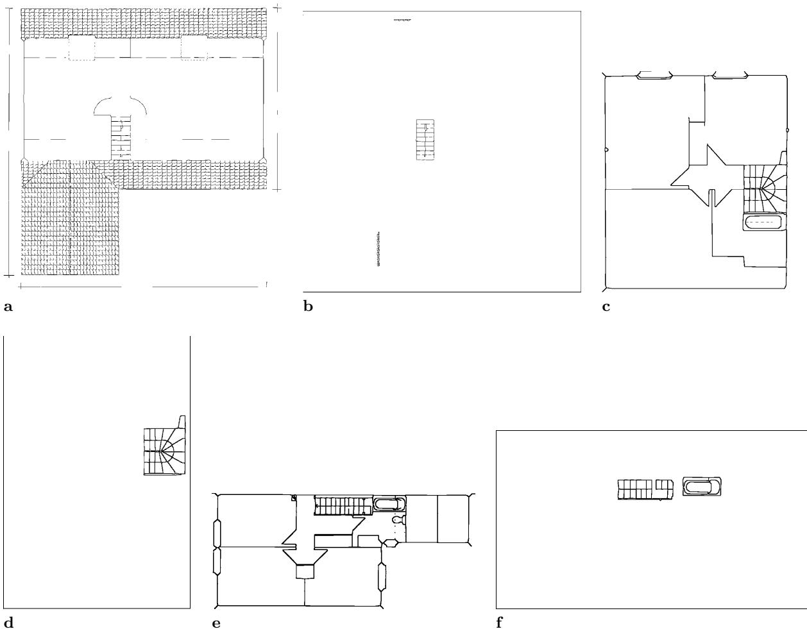  
Fig. 16a–f. Vectorized drawings (a, c, e) and recognized staircases (b, d, f)—before user interaction and correction

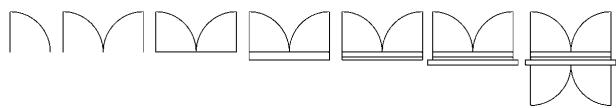

# 4 3D modeling

At the end of the 2D modeling process, we have a description of each floor in terms of architectural symbols. In our present system, there are seven families of such symbols: windows, French windows, doors, bearing walls, dividing walls, staircases, and symbols describing vertical elements such as chimneys or pipes – we will call these symbols “pipes” in the following, for the sake of simplicity.

The 3D structure of a particular floor is obtained from its 2D structure by elevating the walls at the adequate height, which is supposed to be known a priori (Fig. 19). The elevation of windows and other standard symbols is given as a parameter of the system. The full 3D structure of the building is then obtained by building a “stack” of these 3D floor structures. For this, we must be able to match two consecutive floors, using features selected from their 2D geometrical description.

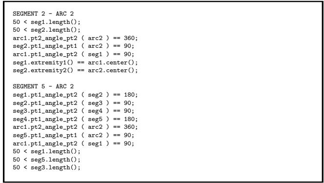  
Fig. 17a,b. Describing architectural symbols. a Increasingly complex symbols. b Extract from a symbol description file

# 4.1 Choice of features

We studied various architectural drawings to determine the kind of features to be taken into account in this matching process [11]. Four categories were finally selected:

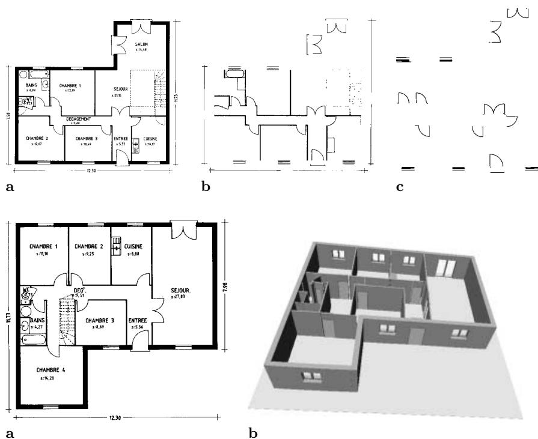  
Fig. 18a–c. Symbol recognition for a simple drawing ( $1 7 0 0 \times 1 6 0 0$ pixels) vectorized in about 300 segments and arcs. a A drawing. b Thin lines. c Symbols   
Fig. 19a,b. 3D reconstruction of a floor through elevation. a A floor. b 3D elevation

– Corners: they are relevant features whenever the shape of the floors is quite stable. Corners are determined using a method described by Jiang and Bunke [16]: among the pairs of connected segments representing bearing walls, corners are supposed to form angles close to $\frac { \pi } { 2 }$ radians. We are aware that this may sometimes not be true, especially in modern architecture!

– Staircases: they infallibly are available on maps of multi-level buildings, although corresponding staircases on two floors can have quite different shapes (see Fig. 14). Some of them may include an arrow to discriminate between up and down staircases. This would help for the matching, but the recognition of such arrows often fails due to the complexity of the surrounding symbol they belong to.

– Pipes: their shape is always invariant and is usually symmetric (square or circle), and can be consequently matched in several different ways.

– Bearing walls: these features are oriented and, by definition, their location is generally invariant. However, there are at least two reasons why they are not reliable features. First, the nature and disposition of pieces of joinery (doors and windows) may differ from one level to the other. Secondly, a wall recognized as a single segment on a given floor may be split into several segments on another floor, because of the noise from the image and from the vectorization process. A single feature may therefore have to be matched with several correspondents, and reciprocally.

# 4.2 The matching method

We then had to choose the matching algorithm to use. As maps may be drawn using different scales and are scanned from separate sheets, the matching of features requires the computation of the transformation (a combination of a translation, a rotation and a scaling) that aligns a map with the other. The sets of features of the different floors being generally very dissimilar, it seemed appropriate to represent a floor as a relational model: a feature is characterized by the relative locations of a fixed minimum number $ { \mathcal { N } } _ { \mathrm { m i n } }$ of neighboring stable features.

As there are relatively few features to match and that each feature is associated with a small number of simple attributes, sophisticated matching methods are not necessary. Our choice went to an approach similar to the Local Feature Focus method proposed by Bolles and Cain [5], where objects are characterized by simple features and their relative positions. The hypothesis of matches between the features of the model and the features extracted from the image are represented by nodes in a compatibility graph. An edge between two nodes expresses that the corresponding hypothesis are consistent. The largest maximal clique, i.e., the largest totally connected set of nodes, represents the best match between the model and the image.

A reliable match between a pair of given floors, ${ \mathcal { F } } _ { 1 }$ and ${ \mathcal { F } } _ { 2 }$ , must rely on a minimum number of robust features. The relevant features are selected among the sets of all the available features according to the following principles:

– A priority order is defined on the categories of features, depending on the invariance of their locations and shapes: pipes, staircases, corners, and bearing walls, in decreasing order. Location stability prevails over shape stability, since the former allows more precise matches, and thus a more precise computation of the transformation relating ${ \mathcal { F } } _ { 1 }$ and ${ \mathcal { F } } _ { 2 }$ .

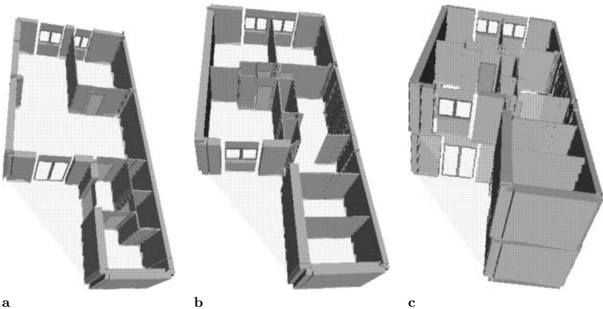  
Fig. 20a–c. 3D reconstruction of a private house from the architectural drawings of its floors. a First floor 3D. b Second floor 3D. c Whole building 3D

– Let $f _ { \mathrm { m i n } }$ (value experimentally defined) be the minimal number of features required for a reliable match. Let $c _ { \mathrm { m i n } } ^ { i }$ be the minimum of the numbers of features from category $\mathcal { C } _ { i }$ available in ${ \mathcal { F } } _ { 1 }$ and in ${ \mathcal { F } } _ { 2 }$ . This corresponds to the maximum number of consistent matches that can be performed for this category. The categories $c _ { i }$ are successively considered in their priority order, summing the corresponding $c _ { \operatorname* { m i n } } ^ { i }$ . When the total reaches $f _ { \mathrm { m i n } }$ , the possibly remaining categories are ignored and the others are selected for the global matching process.

Such principles ensure that noisy or non-reliable features are not used whenever the set of relevant features is large enough, and subsequently do not disturb the matching. Of course, the neighboring features used to characterize a given feature are picked up in the selected categories.

Each feature is assimilated to a point: the gravity center of the polygon representing the contours of a staircase or a pipe, the intersection of the two segments forming a corner, the middle of the segment representing a bearing wall. The relative orientation of two features is computed as the direction of the segment joining their two representative points.

Two features $f _ { 1 } \in \mathcal { F } _ { 1 }$ and $f _ { 2 } \in \mathcal { F } _ { 2 }$ are associated in a matching hypothesis if that confidence rate $\varDelta ( f _ { 1 } , f _ { 2 } )$ is lower than a fixed threshold. $\varDelta$ is defined as the sum of the minimum distances $\delta$ between a neighbor of the first feature and the neighbors of the second feature:

$$
\varDelta ( f _ { 1 } , f _ { 2 } ) = \sum _ { i = 1 } ^ { i = {  { \mathcal { N } } _ { \mathrm { m i n } } } } \operatorname* { m i n } _ { j = 1 } \delta ( f _ { 1 . i } , f _ { 2 . j } )
$$

where $f _ { p . q }$ represents the q-th neighbor of feature $f _ { p }$ . $\delta$ expresses the difference between the relative orientations of the two considered neighboring features. If these features do not belong to the same category, $\delta$ returns a value which makes any match between the two features impossible.

Let $f _ { 1 } ^ { a } { : } f _ { 2 } ^ { i }$ and $f _ { 1 } ^ { b } { : } f _ { 2 } ^ { j }$ be two matching hypotheses. An edge relates the two corresponding nodes in the graph if they represent consistent hypotheses, i.e.:

$- \ a \ \ne \ b$ and $i \neq j$ (the same feature from ${ \mathcal { F } } _ { 1 }$ obviously cannot match two different features from ${ \mathcal { F } } _ { 2 }$ , and reciprocally);   
$- \ \theta ( f _ { 1 } ^ { a } ) - \theta ( f _ { 2 } ^ { i } ) \approx \theta ( f _ { 1 } ^ { b } ) - \theta ( f _ { 2 } ^ { j } )$ , where $\theta$ represents the absolute direction of a corner or a wall: the direction of the bisector of the angle formed by the corner, and the direction of the segment representing the wall, respectively. In other terms, the rotation induced by the first match must be the same as that induced by the second match.

The largest maximal clique, i.e., the largest completely connected subgraph that can be extracted from the compatibility graph, represents the best match between the two current floors. Computing maximal cliques is a well-known NP-complete problem, and a lot of more or less sophisticated algorithms have been developed to use this technique for all kinds of applications. However, in our case we do not need any sophisticated method, as the size of our compatibility graph is generally small. A simple and straightforward algorithm, like the one described by Bolles and Cain [5], has proved its efficiency on various applications, for example, stereo-vision [14], so we implemented this algorithm.

A confidence rate is assigned to each clique, defined as the sum of the $\varDelta$ confidence rates of all the elements of the clique. It is used when several largest cliques of the same size are supplied: the clique having the lowest rate is supposed to represent the best match.

The resulting clique is finally used to compute the transformation that aligns floor $\mathcal { F } _ { 1 }$ to floor ${ \mathcal { F } } _ { 2 }$ . The coordinates of the points of floor ${ \mathcal { F } } _ { 2 }$ , according to the coordinates of points in floor ${ \mathcal { F } } _ { 1 }$ , are computed through least squares minimization of the error on the transformation. The precision of the solution increases with the number of available matched points.

Figure 20 shows some experimental results obtained with a small building – a private house two stories high. The 3D reconstruction has been generated from the architectural drawings of the first and second floor.

The 3D structures of the two floors conform to the drawings. The different construction components (bearing walls, dividing walls, doors, and windows) have been correctly recognized and precisely located (Figs. 20.a and 20.b).

The upper floor has been aligned to the lower floor thanks to the transformation computed after matching the floors. The result does not seem very precise: the upper floor is slightly misplaced on the lower floor, generating a step on the surface of the outer walls, which is particularly visible on the angles of the front part of the house. Actually, the matching itself is not the reason for these problems. As mentioned previously (Sect. 2.5), the distorsion of junction points by the vectorization process is the main reason for the poor alignment.

The first floor contains 79 architectural entities and the second 125, from which 53 and 51 features have been selected, respectively. A compatibility graph with 15 nodes and 36 edges gave a largest maximal clique of five nodes. The whole process, from the determination of the features to the generation of the full 3D structure, takes less than 0.3 s on a Sun Ultra 1 workstation.

# 5 The user interface

Any particular application has to deal with many problems such as noise, the many ways of representing architectural components (doors, windows, etc.), and, of course, the very limitations of the methods that are applied. In this context, we have to consider the whole analysis process as a human-computer cooperation. Our system must be able to offer interactions, thus allowing the user to correct the intermediate results of the automatic processes. It must also be able to provide help by proposing contextual options according to the progress of the analysis. Thus, all the processes presented in the previous sections are incorporated into a user interface, called Mica, providing visual feedback on the working of the graphics processes. Mica typically allows the user to:

– Backtrack to any previous step of the analysis to expedite processing with a different tuning, and easily compare the different results obtained.

Figure 21 shows an example of data manipulation with Mica, to interactively correct the results of the segmentation process (Sect. 2.2).

# 6 Software architecture

We have also focused on the software architecture of the system, as it is an essential consideration in order to integrate a set of stable software components, reusable from one application to the other, and to add flexibility to the analysis of various architectural drawings.

For the data stream, we have chosen a “batch sequential” architectural style [29], where all graphics recognition applications are independent programs, communicating through files. The interface is added as a layer, calling these independent application programs with the right files, in a unified framework for file naming and parameter passing. Despite a relatively poor interactivity between the different application modules, this choice gives us great flexibility for replacing some parts with more up-to-date algorithms or applications. As intermediate results are stored in files, it is easy to come back to the results of any analysis step.

The system includes three layers (Fig. 22): a library of C++ classes, called Isadora, implementing basic graphics recognition methods, a set of graphics recognition modules (GRMs), implementing useful graphics recognition applications designed from Isadora components, and the Mica interface, to monitor the analysis of an image of a drawing, and to take corrective action whenever necessary. Each step of the analysis can easily be performed by a GRM.

The interface is designed to be independent of the analysis processes. It is connected to the graphical recognition modules through simple links, which are used to transmit the values of the parameters to the processing modules: names of images to process, options, thresholds, etc. A processing module can be directly invoked by a command line and parameters are set with default values which can be customized by the user [10]. In this way, a graphical recognition module can be easily substituted for another, or can be upgraded when necessary.

– Display the content of all kinds of files which are handled by the analysis, with common editor functionalities like multi-file editing, zooming, and so on.   
Tune parameter and threshold values, as explained previously, after examination of the results of the current application. Interactively manipulate resulting data, i.e., add missing results, delete or alter erroneous results – in particular, special editing operations are supported for both raster and vector images: cut and paste raster images, creation and modification of components of a vector image, etc.

# 7 Conclusion and perspectives

In this paper, we have presented a complete system built for the analysis of architectural drawings, with the aim of reconstructing in 3D the represented buildings. The system is based on a number of automated graphics recognition processes, integrated through a user interface which “puts humans in the loop” throughout the analysis.

Although we have interesting results on a number of drawings, we are aware of the fact that the different components of the system are not at the same level of achievement:

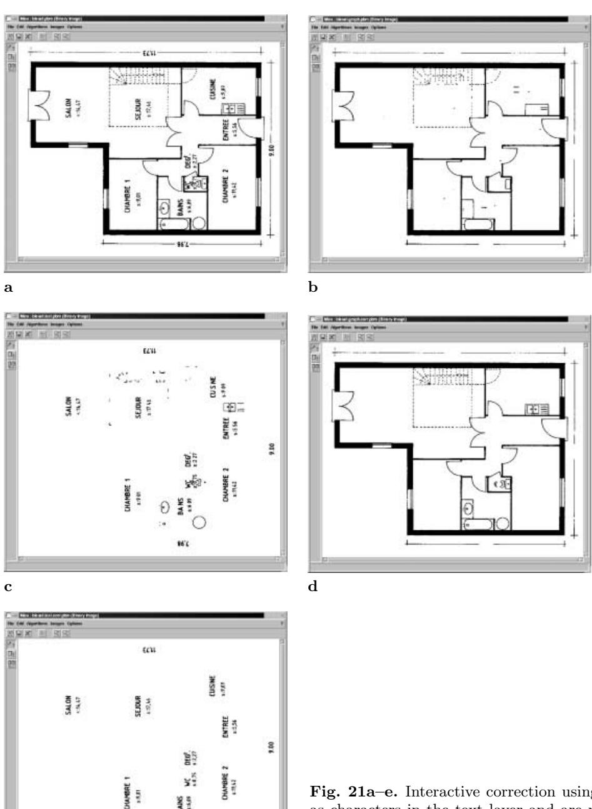  
Fig. 21a–e. Interactive correction using Mica: some dashes are misinterpreted as characters in the text layer and are moved to the graphics layer by the user, and some characters (such as I), misinterpreted as dashes in the graphics layer, are moved to the text layer by the user. a Original image. b Raw graphics layer. c Raw text layer. d Graphics layer after correction. e Text layer after correction

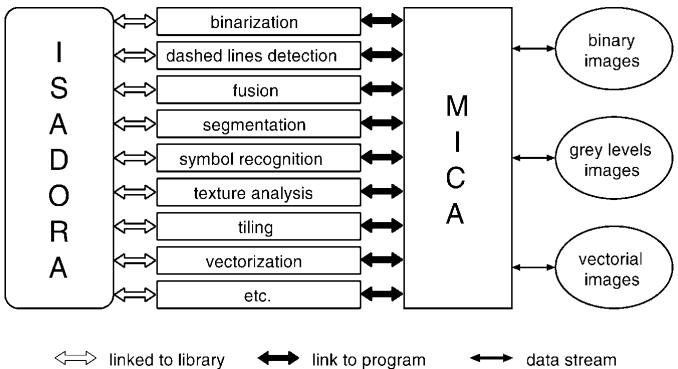  
Fig. 22. Software architecture: a three-layer system

1. The image processing and feature extraction tools are quite mature. They implement, in most cases, stateof-the-art graphics recognition methods. As previously mentioned, there is, of course, still room for improvement, especially with respect to the precision of vectorization and to the robustness and stability of arc detection.

2. Among the 2D modeling methods, the dashed-line extraction must be considered to be quite mature and stable. The staircase recognition relies on very simple, ad hoc rules, but this proves to be sufficient, when coupled with the user interface, for these kinds of specific architectural elements. The main remaining research topic at this level is symbol recognition.

The results of our method are comparable to those of other structural symbol recognition methods [20, 22,33], but have also the same kind of weakness: it is difficult to assess how scalable the approach is, when the number of symbols to recognize grows from 10–15 to 100 or 500. We plan to investigate this scalability issue in the coming years.

3. The 3D reconstruction process works reasonably well, but is, of course, very specific to the kind of drawings we work on. We have still to prove its validity on much larger buildings, where the complexity of the matching process might increase too much for the maximal clique approach to remain reasonable. However, another solution would be to provide a simple interactive method for matching in 3D the reconstructed levels. Also to be proven on larger-scale drawings is the validity of the simple elevation procedure used to reconstruct the single floors. Another possibility would be to match the floor drawing with elevation drawings, as we experimented with some years ago in mechanical engineering [2].

4. In our opinion, the user interface proves the importance of putting humans in the loop in an intelligent way. We plan to continue our parallel development of this interface, which will progressively integrate new graphics recognition modules, whenever they become mature enough.

Acknowledgements. This work was partly funded by a research contract with France Telecom CNET and by financial support from R´egion Lorraine. The authors are also grateful to Gemma S´anchez and Josep Llad´os for giving them access to the structural texture detection method mentioned in Sect. 3.2.

# References

1. G. Agam, H. Luo, I. Dinstein: Morphological approach for dashed lines detection. In: Kasturi and Tombre [17], pp. 92–105   
2. C. Ah-Soon, K. Tombre: A step towards reconstruction of 3-D CAD models from engineering drawings. In: Proc. 3rd Int. Conf. on Document Analysis and Recognition, Montr´eal (Canada), pp. 331–334, August 1995   
3. C. Ah-Soon, K. Tombre: Network-based recognition of architectural symbols. In: A. Amin, D. Dori, P. Pudil, H. Freeman (eds.) Advances in Pattern Recognition (Proc. Joint IAPR Workshops SSPR’98 and SPR’98, Sydney, Australia), LNCS 1451, pp. 252–261, August 1998   
4. T. Asano, M. Edahiro, H. Imai, M. Iri, K. Murota: Practical use of bucketing techniques in computational geometry. In: G.T. Toussaint (ed.) Computational Geometry, pp. 153–195. North-Holland, Amsterdam, The Netherlands, 1985   
5. R.C. Bolles, R.A. Cain: Recognizing and locating partially visible objects: the local-feature-focus method. In: A. Pugh (ed.) Robot Vision, pp. 43–82. IFS, UK/Springer, Berlin, 1983   
6. G. Borgefors: Distance transforms in digital images. Comput. Vision Graph. Image Process., 34: 344–371, 1986 7. G. Sanniti di Baja: Well-shaped, stable, and reversible skeletons from the (3,4)-distance transform. J. Visual Commun. Image Represent., 5(1): 107–115, 1994   
8. D. Dori, L. Wenyin, M. Peleg: How to win a dashed line detection contest. In: Kasturi and Tombre [17], pp. 286–300 9. Dov Dori, Wenyin Liu: Stepwise recovery of arc segmentation in complex line environments. Int. J. Doc. Anal. Recognition, 1(1): 62–71, 1998   
10. P. Dosch, C. Ah-Soon, G. Masini, G. S´anchez, K. Tombre: Design of an integrated environment for the automated analysis of architectural drawings. In: S.-W. Lee and Y. Nakano (eds) Proc. 3rd IAPR Int. Workshop on Document Analysis Systems, Nagano (Japan), pp. 366–375, November 1998   
11. P. Dosch, G. Masini: Reconstruction of the 3D structure of a building from the 2D drawings of its floors. In: Proc. 5th Int. Conf. on Document Analysis and Recognition, Bangalore (India), pp. 487–490, September 1999   
12. P. Dosch, G. Masini, K. Tombre: Improving arc detection in graphics recognition. In: Proc. 15th Int. Conf. on Pattern Recognition, Barcelona (Spain), September 2000   
13. L.A. Fletcher, R. Kasturi: A robust algorithm for text string separation from mixed text/graphics images. IEEE Trans. on PAMI, 10(6): 910–918, 1988   
14. R. Horaud, T. Skordas: Stereo correspondance through feature grouping and maximal cliques. IEEE Trans. on PAMI, 11(11): 1168–1180, 1989   
15. R.D.T. Janssen, A.M. Vossepoel: Adaptive vectorization of line drawing images. Comput. Vision Image Understanding, 65(1): 38–56, 1997   
16. X.Y. Jiang, H. Bunke: An optimal algorithm for extracting the regions of a plane graph. Pattern Recognition Lett., 14: 553–558, 1993   
17. R. Kasturi, K. Tombre: Graphics recognition – methods and applications. In: R. Kasturi, K. Tombre (eds.) LNCS 1072. Springer, Berlin, May 1996   
18. B. Kong, I.T. Phillips, R.M. Haralick, A. Prasad, R. Kasturi: A benchmark: performance evaluation of dashedline detection algorithms. In: Kasturi and Tombre [17], pp. 270–285   
19. S.W.C. Lam, H.H.C. Ip: Structural texture segmentation using irregular pyramid. Pattern Recognition Lett., pp. 691–698, July 1994   
20. J. Llad´os, E. Mart´ı: A graph-edit algorithm for handdrawn graphical document recognition and their automatic introduction into CAD systems. Mach. Graph. Vision, 8(2): 195–211, 1999   
21. B.T. Messmer, H. Bunke: Automatic learning and recognition of graphical symbols in engineering drawings. In: Kasturi and Tombre [17], pp. 123–134   
22. B.T. Messmer, H. Bunke: A new algorithm for errortolerant subgraph isomorphism detection. IEEE Trans. PAMI, 20(5): 493–504, 1998   
23. B. Pasternak: Adaptierbares Kernsystem zur Interpretation von Zeichnungen. Dissertation zur Erlangung des akademischen Grades eines Doktors der Naturwissenschaften (Dr. rer. nat.). Universit¨at Hamburg, April 1996   
24. M. R¨o¨osli, G. Monagan: Adding geometric constraints to the vectorization of line drawings. In: Kasturi and Tombre [17], pp. 49–56   
25. P.L. Rosin: Techniques for assessing polygonal approximation of curves. IEEE Trans. PAMI, 19(6): 659–666, 1997   
26. P.L. Rosin, G.A. West: Segmentation of edges into lines and arcs. Image Vision Comput., 7(2): 109–114, 1989   
27. W.J. Rucklidge: Efficiently locating objects using the hausdorff distance. Int. J. Comput. Vision, 24(3): 251– 270, 1997   
28. G. S´anchez, J. Llad´os, E. Mart´ı: Segmentation and analysis of linial textures in planes. In: Proc. 7th Spanish National Symposium on Pattern Recognition and Image Analysis, Barcelona (Spain), 1: 401–406, 1997   
29. M. Shaw, D. Garlan: Software architecture: perspectives on an emerging discipline. Prentice Hall, Englewood Cliffs, N.J., USA, 1996   
30. K. Tombre, C. Ah-Soon, P. Dosch, A. Habed, G. Masini: Stable, robust and off-the-shelf methods for graphics recognition. In: Proc. 14th Int. Conf. on Pattern Recognition, Brisbane (Australia), pp. 406–408, August 1998   
31. K. Tombre, C. Ah-Soon, P. Dosch, G. Masini, S. Tabbone: Stable and robust vectorization: how to make the right choices. In: Proc. 3rd Int. Workshop on Graphics Recognition, Jaipur (India), pp. 3–16, September 1999. Revised version to appear in a forthcoming LNCS volume   
32. K. Tombre, S. Tabbone: Vectorization in graphics recognition: to thin or not to thin. In: Proc. 15th Int. Conf. on Pattern Recognition, Barcelona (Spain), September 2000   
33. E. Valveny, E. Mart´ı: Application of deformable template matching to symbol recognition in hand-written architectural drawings. In: Proc. 5th Int. Conf. on Document Analysis and Recognition, Bangalore (India), pp. 483– 486, September 1999   
34. A.M. Vossepoel, K. Schutte, C.F.P. Delanghe: Memory efficient skeletonization of utility maps. In: Proc. 4th Int. Conf. on Document Analysis and Recognition, Ulm (Germany), pp. 797–800, August 1997   
35. K. Wall, P. Danielsson: A fast sequential method for polygonal approximation of digitized curves. Comput. Vision Graph. Image Process., 28: 220–227, 1984