# Automatic analysis and integration of architectural drawings

Tong Lu $\cdot$ Huafei Yang $\cdot$ Ruoyu Yang $\cdot$ Shijie Cai

Received: 30 March 2005 / Revised: 28 November 2005 / Accepted: 30 June 2006 / Published online: 26 August 2006   
$\circledcirc$ Springer-Verlag 2006

Abstract Recognition and integration of 2D architectural drawings provide a sound basis for automatically evaluating building designs, simulating safety, estimating construction cost or planning construction sequences. To accomplish these targets, difficulties come from (1) an architectural project is usually composed of a series of related drawings, (2) 3D information of structural objects may be expressed in 2D drawings, annotations, tables, or the composites of above expressions, and (3) a large number of disturbing graphical primitives in architectural drawings complicate the recognition processes. In this paper, we propose new methods to recognize typical structural objects and architectural symbols. Then the recognized results on the same floor and drawings of different floors will be integrated automatically for accurate 3D reconstruction.

Keywords 3D reconstruction $\cdot$ Architectural drawings $\cdot$ Integration $\cdot$ Recognition

# 1 Introduction

Three-dimensional reconstruction from 2D architectural drawings has been an interesting research field. Reconstructed 3D building models are useful across the entire spectrum of architecture, engineering and construction, which provide data for evaluating building designs, simulating safety, estimating construction cost or planning construction sequences [1].

There has been some work on this problem. Tombre [2–4] firstly discussed the challenges of automatic recognition of architectural drawings. He considered architectural drawings had not been given as much attention as other types of drawings, which were more difficult to make precise analysis and reconstruction. In Tombre’s opinion, architectural design was more or less at the crossroads between engineering and art, and few teams had been dealing with architectural drawings. However, architectural drawings represented another very interesting and special area of graphic recognition. Ah-Soon and Tombre [5] analyzed the specificities of architectural drawings and recognized objects from the scanned drawings. They proposed a network-based recognition method [6, 7] to identify symbols, following an idea proposed by Messmer and Bunke [8]. Park and Kwon [9] recognized main walls of apartments in plane architectural drawings using dimension extension lines. Dosch et al. [10, 11] proposed a complete system for analysis of architectural drawings. They successively reconstructed 3D buildings with windows, doors, walls, staircases and pipes. However, above methods are limited by low-level processes, i.e., segmentation, vectorization and detection of arcs from scanned drawings. Architectural entities in such drawings are usually simply identified by connected thin lines in search areas.

Recently reconstruction directly from original AutoCAD drawings becomes more popular. Lewis and Sèquin [1] presented a robust and semi-automatic way to create 3D building models from computer-drawn floor plans, which could be used for computer rendering, visualization, and simulation or analysis programs. Zhi et al. [12] proposed an automatic unit generator, AUG, to transform computer-drawn architectural plans into a building fire evacuation simulator model SGEM. The AUG approach assumed that the whole architectural plan was a combination of units and a unit was a combination of loops. On such basis, the AUG transformed plans into a graph to determine the solutions. Their work is very helpful for automatic recognition of architectural drawings, but still has some limitations. Real-life architectural drafts are usually composed of complicated and severely interfered graphical primitives. The mentioned algorithms will face difficulties when recognize objects from such architectural drawings. Moreover, an architectural project is usually composed of a series of related 2D drawings, i.e., plane drawings, section drawings and tables. Therefore, to reconstruct an accurate building, 3D reconstruction information distributed in different types of 2D drawings needs to be extracted and integrated automatically.

In our previous research, we gave algorithms to search lines, arcs and dimensions from engineering drawings [13–15]. We also proposed a hierarchical SINEHIR model to recognize structural objects from construction structural drawings (CSDs) [16, 17]. CSDs are usually designed to describe the details of structural objects under the mechanic constrains of construction. In this paper, we introduce new methods to analyze architectural working drawings (AWDs), which are usually used to describe design intents of architects, i.e., location of the whole building, orientation of doors and windows, or layout of rooms which are surrounded by walls and beams.

The AWDs are composed of three types of architectural entities: structural, functional and decorative entities. Structural objects are usually used to bear the weight of the whole building by their internal steel and concrete structures. Typical structural objects include shear walls, embedded columns, bearing beams, slabs and various types of foundations. Functional entities provide conveniences for users, like doors, windows, staircases, eaves, lift wells, etc. Typical decorative entities include partition walls, hung ceilings, parapet walls, etc. Sometimes there are no distinct differences between functional entities and decorative entities. Figure 1 shows the differences between architectural and structural entities. Structural, functional and decorative entities are usually drawn in AWDs simultaneously.

Automatic analysis of AWDs is necessary for the target of reconstruction of the whole building. However, direct analysis of AWDs seems to be difficult because there are multiple types of architectural entities exist. We separate it into three steps in this paper: (1) recognize structural entities using a parallel-pair-shape-based method, (2) remove those graphical primitives of the recognized structural objects, and (3) recognize other architectural entities from the simplified drawings using a feature-based symbol recognition method. Since tables are frequently used to explain the semantics of architectural entities, we also discuss the integration of architectural tables and drawings for the target of accurate recognition.

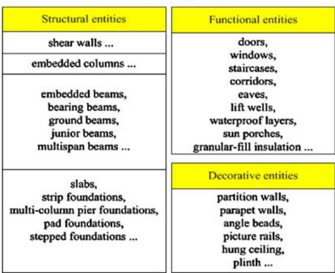  
Fig. 1 Different types of architectural entities

The rest of this paper is organized as follows. Section 2 briefly discusses the characteristics of real-life architectural projects. Then Sect. 3 describes the shape-based method to recognize structural objects in floor plans. Section 4 introduces the feature-based recognition method. Based on these, Sects. 5 and 6 discuss the integration method of architectural tables and different 2D plan drawings, respectively. Section 7 gives the experiment results and Sect. 8 gives our conclusions.

# 2 Characteristics of drawings from real-life architectural projects

There are two main tasks to automatically analyze and reconstruct an architectural project. One is to recognize various types of architectural entities from each real-life complex 2D architectural drawing. The other is to integrate the recognized entities from different architectural drawings into a uniform target digital building.

Recognition of architectural entities is the first step. However, various types of architectural entities and multitude graphical primitives may complicate the recognition process. For instance, when recognize walls, the leading lines and dimension lines are all disturbing graphical primitives. When the number of such primitives increases, the recognition process will become easily disturbed.

Integration of architectural entities usually includes the following three tasks. First, drawings of different floors need to be integrated. A building is usually composed of different floors. On each floor the layout of architectural entities may vary to each other. Designers usually use a series of related CAD drawings to describe architectural entities on different floors.

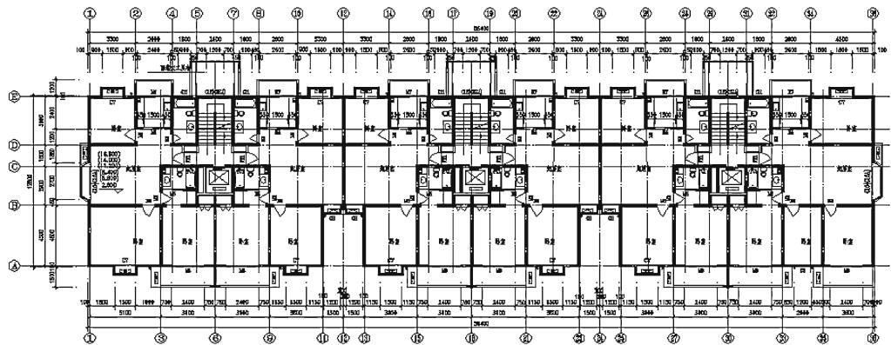  
Fig. 2 An example of architectural floor plan composed of walls, beams, doors, lift wells, staircases, etc

Second, different architectural entities on the same floor need to be integrated. Usually the objects on the same floor still need to be described in different drawings. For example, not all the details of beams, walls, rooms, windows and doors on the same floor are drawn simultaneously in the same floor plan. Instead, designers use a series of drawings, i.e., a beam drawing, a room drawing and a wall drawing, to describe the same floor. That means in the wall drawing, all the details of the rooms are omitted; while in the corresponding room drawing, the details of the walls are omitted except their contours. Similarly, drawings of columns, beams, doors or windows have their own emphasis, respectively.

Third, different representations of architectural entities need to be integrated. Designers have the freedom to draw objects in the forms of 2D drawings, section drawings, tables, or the combination of above expressions. Those drawings may be easily understood by persons, but for automatic recognition and interpretation, extra analysis is necessary.

In a word, architectural drawings have a series of characteristics different from other types of engineering drawings. To simplify the analysis process of such architectural drawings, we assume that a typical plane architectural drawing has the following characteristics:

1. Typical weight-bearing structural objects are represented by parallel lines. For instance, shear walls and bearing beams are absolutely necessary on each floor; while a beam or a wall is usually represented by a series of parallel line pairs in a 2D drawing   
2. Functional entities are usually accessorial or derived parts of structural objects. For instance, windows and doors are used to connect with walls or beams;

rooms, staircases or corridors can be further identified by searching the enclosures surrounded by walls or beams

3. Graphical primitives of decorative entities are not intersected with those of other architectural objects.

Figure 2 shows an example of an architectural floor plan. Automatic analysis and integration of such drawings include the following steps (Fig. 3 refers):

1. Finding out parallel pairs (PPs) of structural entities using a shape-based method. A parallel pair (PP) is a segment of two parallel and overlapped lines.   
2. Identifying the semantics of PPs and create structural objects.   
3. Removing the recognized PPs.   
4. Recognizing functional and decorative entities using a feature-based symbol recognition method.   
5. Analyzing architectural tables and integrating with recognized objects.   
6. Integrating recognized entities on the same floor.   
7. Integrating drawings of different floors.

# 3 Recognition of structural objects in floor plans

Considering shear walls and bearing beams are absolutely necessary on each floor drawing and each wall or beam is represented by a series of parallel lines, we take the analysis of PPs as the first task to recognize a typical floor plan. Figure 4 is a subpart extracted from Fig. 2. In Fig. 4, the PPs of structural entities build up the weightbearing net of the building. Once those PPs of structural entities are recognized, we may find other architectural entities more easily in the rest simplified drawing.

However, there are some difficulties in automatically finding correct PPs of structural entities. First, an architectural drawing is usually composed of a large number of graphical primitives. Not all the parallel line pairs represent structural entities. Second, a PP may be composed of two parallel but partly overlapped lines with different lengths. Finally, disturbing lines, like grid lines and leading lines of annotations, make the analysis of PPs complicated.

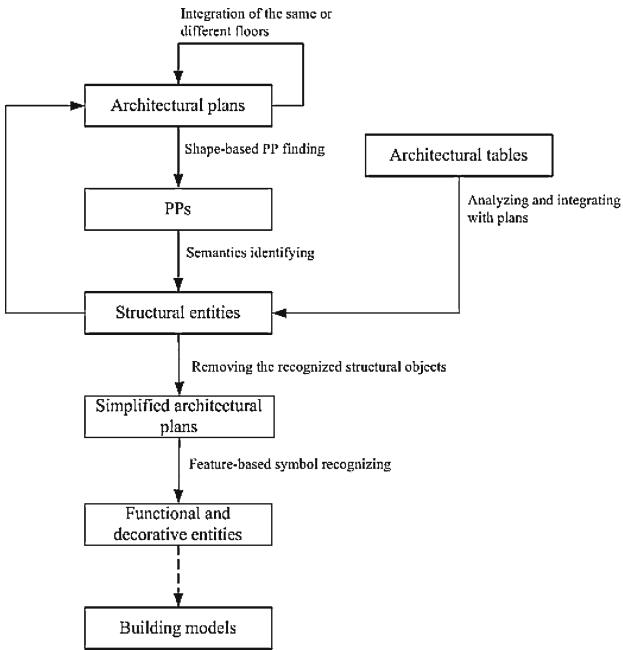  
Fig. 3 The steps related to automatic analysis and integration of architectural floor plans

The shapes of connected parallel line pairs are useful in dealing with accurate identification of PPs. In this section, we will first introduce the method of analyzing elemental shapes from the complex environment, and then describe the method of identification of PPs that represent structural entities based on the recognized shapes.

3.1 Identification of PPs of structural objects

# 3.1.1 Identification entrance

In Sect. 2, we suppose a typical structural object is represented by a series of PP segments. Figure 5 shows an example of a bearing wall, which is extracted from Fig. 4. In Fig. 5, the text “FC1” means that there exists a structural object named “FC1”; while the graphical primitives neighboring to “FC1” imply this object is composed by three PP segments (segment1, segment2 and segment3). The three PP segments are separated by other PP segments; moreover, the second PP segment varies in width. Only after each PP segment of a structural object is identified, can the semantics of the structural object be finally analyzed.

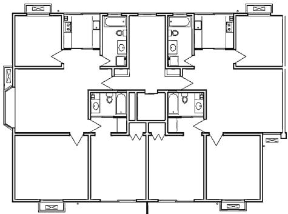  
Fig. 4 A simplified subpart extracted from Fig. 2

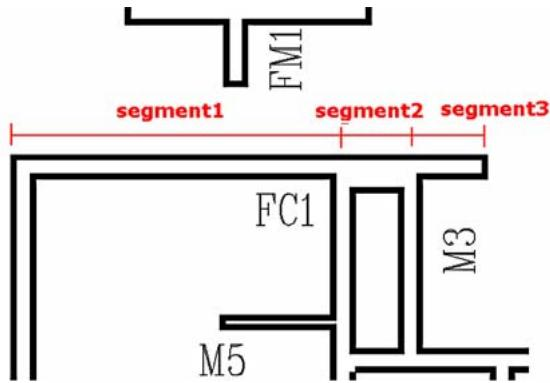  
Fig. 5 The object “FC1” is composed of three PP segments

However, disturbing graphic primitives, i.e., leading lines, dimension lines or grid lines, usually make the identification of PP segments complicated. Figure 6 shows some typical beams extracted from a real-life complex drawing. In Fig. 6, the beam “beam-a” is composed of the graphical primitives of parallel lines $\langle l _ { 1 } , l _ { 6 } \rangle$ and $\langle l _ { 1 } , l _ { 3 } \rangle$ , which implies that (1) “beam-a” is cut off by the other two beams named “beam- $\mathbf { \nabla } \cdot \mathit { b } ^ { \prime \prime }$ (composed of parallel lines $\langle l _ { 7 } , l _ { 8 } \rangle$ and $\langle l _ { 7 } , l _ { 9 } \rangle$ ) and “beam- $\cdot c ^ { \dag }$ (composed of $\left. l _ { 1 0 } , l _ { 1 2 } \right. ,$ ), (2) the width of the beam varies because the distance of the two parallel lines $l _ { 1 }$ and $l _ { 6 }$ is obviously less than that of $l _ { 1 }$ and $l _ { 3 }$ , (3) the two PP segments of the beam may share the same long line $l _ { 1 }$ . Except for these lines, the leading lines $l _ { 1 4 } , l _ { 5 }$ are used to lead out the beam name text “beam- $\cdot a ^ { \prime }$ , $l _ { 1 3 } , l _ { 4 }$ are used to lead out another name “beam- $\cdot d ^ { \dag }$ , while grid lines $l _ { 2 }$ and $l _ { 1 1 }$ are used to locate the beams. These graphical primitives make the recognition processes of beams easily disturbed, i.e., $\langle l _ { 1 2 } , l _ { 1 3 } \rangle , \langle l _ { 1 0 } , l _ { 1 1 } \rangle , \langle l _ { 1 1 } , l _ { 1 2 } \rangle , \langle l _ { 3 } , l _ { 4 } \rangle , \langle l _ { 2 } , l _ { 4 } \rangle$ or $\langle l _ { 5 } , l _ { 1 } \rangle$ may also be recognized as PP segments of beams.

Semantics of disturbing graphical primitives are difficult to be identified before the identification of structural PPs because there is not enough definite information can be used. For example, from the name text “beam- $\cdot d ^ { \dag }$ , we can not judge whether $l _ { 3 }$ or $l _ { 4 }$ is a leading line, or whether there is no such lead lines at all, likes “beam- $\cdot c ^ { \dag }$ .

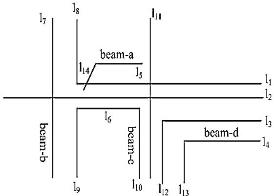  
Fig. 6 Disturbing lines complicate the identification of correct PPs

From the generation processes of PP segments, we can find some hints. As mentioned above, the graphics of a beam or a wall are usually cut off by those of other beams or walls in a 2D drawing. The shapes of such crossing regions can be used as the entrances for the recognition of plane architectural drawings. Once the two end shapes are identified, the segment composed of two parallel lines can be identified, too.

# 3.1.2 Classification of T, X and $L$ shapes

Based on the study of about 200 real-life plane architectural drawings, we classify the most frequently occurring shapes into three types: shape $T$ , shape $X$ and shape $L$ .

We first take a look at the $T$ shapes shown in Fig. 7. Figure 7 (a) shows a $T$ shape composed of three parallel lines $\langle l _ { 1 } , l _ { 2 } \rangle , \langle l _ { 5 } , l _ { 2 } \rangle , \langle l _ { 3 } , l _ { 4 } \rangle$ and two intersections $A$ and $B$ . Denoting the shape by $S _ { T a }$ , two parallel lines $l _ { i }$ and $l _ { j }$ with suitable width by $\langle l _ { i } , l _ { j } \rangle$ , two intersected lines by $\angle ( l _ { i } , l _ { j } ) , S _ { T a }$ is defined by the following filters set:

$$
S _ { T a } = \left\{ \langle l _ { 1 } , l _ { 2 } \rangle ^ { \wedge } \langle l _ { 5 } , l _ { 2 } \rangle ^ { \wedge } \langle l _ { 3 } , l _ { 4 } \rangle ^ { \wedge } \angle ( l _ { 1 } , l _ { 3 } ) ^ { \wedge } \angle ( l _ { 4 } , l _ { 5 } ) \right\}
$$

We define the two separated parallel line pairs, i.e., $\langle l _ { 1 } , l _ { 2 } \rangle$ and $\langle l _ { 5 } , l _ { 2 } \rangle$ in Fig. 7a as the extension subpart of shape $T$ (represented by $E ( S ) _ { , }$ ), while the rest pair, i.e., $\langle l _ { 3 } , l _ { 4 } \rangle$ , as the crossing subpart (represented by $C ( S ) _ { , }$ ). The intersections of the shape are defined as the feature points (represented by $F ( S )$ ). Thus, a $T$ shape can also be described as

$$
S _ { T } = \{ E ( S ) , C ( S ) , F ( S ) \}
$$

As shown in Fig. 7, variations of $S _ { T }$ should also be considered. Fig. 7b shows a variation $S _ { T b }$ where $l _ { 1 } = l _ { 5 }$ :

$$
S _ { T b } = S _ { T a } \sp { \wedge } \{ l _ { 1 } = l _ { 5 } \}
$$

Fig. 7c shows another variation $S _ { T c }$ , which is also a standard shape $T$ appears in 2D drawings. Denoting a

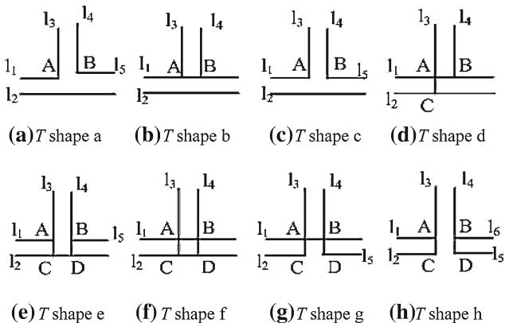  
Fig. 7 Shape $T$ and its variations. a $T$ shape a, b $T$ shape b, c $T$ shape c, d $T$ shape d, e $T$ shape e, f $T$ shape f, $\textbf { g } T$ shape $\mathbf { g }$ , h $T$ shape h

line $l _ { i }$ simultaneously on the extension of another line $l _ { j }$ by $| ( l _ { i } , l _ { j } ) , S _ { T c }$ is defined as

$$
S _ { T c } = S _ { T a } { } ^ { \wedge } \{ | ( l _ { 1 } , l _ { 5 } ) \}
$$

Similarly, Fig. 7d defines a variation with three intersections, and Fig. 7e to Fig. 7f defines variations with four intersections:

$$
\begin{array} { l } { { S _ { T d } = S _ { T b } { } ^ { \wedge } \{ \angle ( l _ { 3 } , l _ { 2 } ) \} } } \\ { { S _ { T e } = S _ { T c } { } ^ { \wedge } \{ \angle ( l _ { 3 } , l _ { 2 } ) { } ^ { \wedge } \angle ( l _ { 4 } , l _ { 2 } ) \} } } \\ { { S _ { T f } = S _ { T e } { } ^ { \wedge } \{ l _ { 1 } = l _ { 5 } \} } } \end{array}
$$

Figures $7 \mathrm { g }$ and h can be considered as the particular cases of Fig. 7e, which are seldom met in plane architectural drawings.

In some instances, two recognized overlapped $T$ shapes, $S _ { T i }$ and $S _ { T j }$ , need to be merged if the following conditions are met:

1. $E ( S _ { T i } ) ~ = ~ E ( S _ { T j } )$ , or $E ( S _ { T i } )$ and $E ( S _ { T j } )$ share the same line. 2. $C ( S _ { T i } )$ is parallel to and overlapped with $C ( S _ { T j } )$ . 3. $C ( S _ { T i } )$ and $C ( S _ { T j } )$ are on the different sides of $E ( S _ { T i } )$ .

Figure 8 shows some examples. In Fig. 8a, there are two overlapped $T$ shapes, $S _ { T i }$ and $S _ { T j }$ , will be found according to definition (3). Then $S _ { T i }$ and $S _ { T j }$ will be merged into a new $X$ shape according the mentioned conditions. Similarly, Figs. 8b–d show other three $X$ shapes merged from corresponding $T$ shapes. Figure 8e is another type of merged $X$ shape because $E ( S _ { T i } )$ and $E ( S _ { T j } )$ share the same line and conditions 2 and 3 are met simultaneously.

In other cases, one of the two recognized $T$ shapes need to be deleted if the following conditions are met:

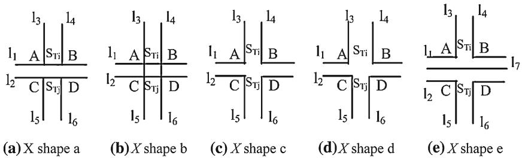  
Fig. 8 Some examples of merged $X$ shapes. a $X$ shape a, b $X$ shape b, c $X$ shape c, d $X$ shape $\mathrm { d }$ , e $X$ shape e

2. $C ( S _ { T i } )$ and $C ( S _ { T j } )$ are on the same side of $E ( S _ { T i } )$ .   
3. $C ( S _ { T i } )$ is parallel to $C ( S _ { T j } )$ .   
4. $C ( S _ { T i } )$ and $C ( S _ { T j } )$ share the same line.

Figure 9 shows an example of removing overlapped $T$ shapes. Figure. 9a is the original graph from the 2D drawing, where altogether $1 0 ~ T$ shapes will be recognized sequentially. According to the mentioned conditions, we reorganize the candidate $T$ shapes and remove those overlapped shapes, i.e., if $S _ { T 1 }$ is reserved, $S _ { T 2 }$ will be removed. Finally, there are six recognized $T$ shapes, as shown in Fig. 9b.

Shape $L$ is defined as two intersected parallel line pairs. Figure. 10 shows some examples. Most other complex shapes are usually composed of the three types of elemental shapes.

# 3.1.3 Identification of PPs of structural entities by T, $X$ and $L$ shapes

There are a large number of parallel line pairs in each architectural drawing, but not all of them represent structural entities. The application of above rules provides an efficient method to recognize the PPs of target structural entities. We first find the candidate related line sets of each line in the drawing, and then visit each line and their related line sets to match the definitions of each possible shape in sequence. Once a new candidate shape is recognized, we check whether it can be merged with any other existing shape. When all the candidate shapes are recognized, we match the corresponding shapes to identify the final target PPs of structural objects.

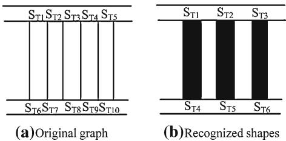  
Fig. 9 An example of deleting overlapped $T$ shapes. a Original graph, b Recognized shapes

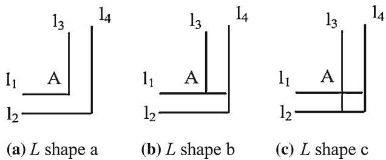  
Fig. 10 Some examples of $L$ shapes. a $L$ shape a, b $L$ shape b, c $L$ shape c

Suppose $\dot { T }$ is the average height of texts in the drawing, $G$ is the given drawing, $P P$ is the target candidate parallel line pair set of structural entities, the algorithm proceeds as follows.

1. Find all the candidate related line sets of each line $l _ { i }$ in $G$ . The related line sets of $l _ { i }$ are defined as following:

(a) $\underline { { P } } ( l _ { i } ) = \{ l _ { j } | j \neq i , \langle l _ { i } , l _ { j } \rangle , \bar { T } / 2 \leq \mathrm { d i s t a n c e } ( l _ { i } , l _ { j } ) \leq$ $\bar { T } , 0 . 4 \ \leq$ overlapscale $( l _ { i } , l _ { j } ) ~ \le ~ 1 \}$ }, where distance $( l _ { i } , l _ { j } )$ is the distance between two parallel lines $l _ { i }$ and $l _ { j }$ , overlapscale $( l _ { i } , l _ { j } )$ is the minimal overlapping scale of $l _ { i }$ and $l _ { j }$ , and 0.4 is an empirical minimal scale for overlapping.   
(b) $E ( l _ { i } ) = \{ l _ { j } | j \neq i , \langle l _ { i } , l _ { j } \rangle$ , distance $( l _ { i } , l _ { j } ) \langle \bar { T } / 2 0$ , overlapscale $( l _ { i } , l _ { j } ) = 0 \}$ .   
(c) $C ( l _ { i } ) = \{ l _ { j } | j \neq i , { \angle } ( l _ { i } , l _ { j } ) \} .$ .

2. Find $T$ shapes according to the definitions of shape $T .$ . For each line $l _ { i }$ , check if there are target related lines nearby to it:

(a) Visit $P ( l _ { i } )$ to find two related parallel lines $l _ { m }$ and $l _ { n }$ .   
(b) For each line $l _ { m i }$ in $C ( l _ { m } )$ and each line $l _ { n j }$ in $C ( l _ { n } )$ , if $l _ { m i } \in P ( l _ { n j } )$ (or $l _ { m j } \in P ( l _ { n i } ) ) , l _ { m i }$ and $l _ { n j }$ are on the same side of $l _ { i }$ , then a candidate shape $S _ { T a i }$ is recognized.   
(c) For each shape in the $T$ shape set $T S$ , if $S _ { T a i }$ can be merged, create a new merged $X$ shape and store it in the $X$ shape set $X S$ ; else store $S _ { T a i }$ in $T S$ . Repeat steps (a) to (c) until all the lines have been considered and no new types of shape $T$ are recognized.

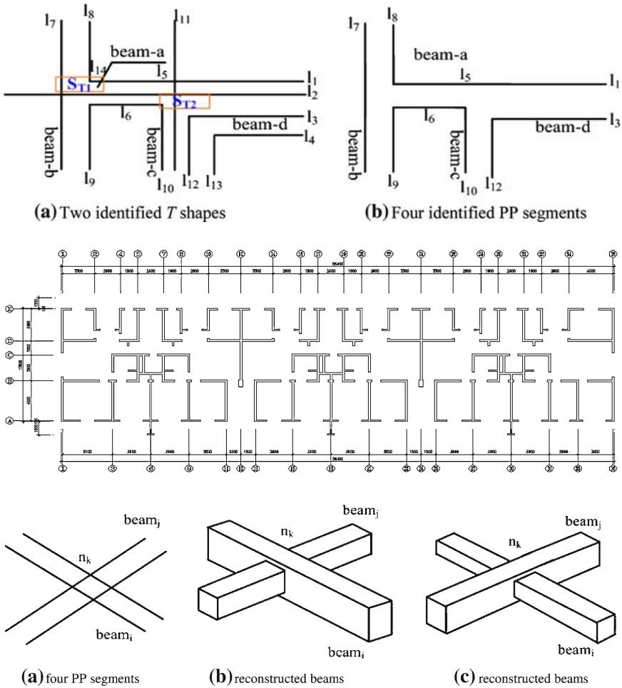  
Fig. 11 Two recognized T shapes from Fig. 6. a Two identified $T$ shapes, b Four identified PP segments   
Fig. 12 Identified shapes and PPs from Fig. 2   
Fig. 13 Two types of reconstructed 3D models from the same plane drawing. a four PP segments, b reconstructed beams, c reconstructed beams

3. Find $L$ shapes in the rest lines according to $L$ shape definitions similarly and store them in $L$ shape set $L S$ .

4. For each two shapes $s _ { i } , s _ { j }$ in $T S , X S$ and $L S$ , if there are two lines $l _ { m }$ and $l _ { n } , l _ { m } \in s _ { i } , l _ { m } \in s _ { j } , l _ { n } \in s _ { i } , l _ { n } \in$ $s _ { j } , l _ { m } \in P ( l _ { n } )$ (or $l _ { n } \in P ( l _ { m } ) ,$ ), add $( l _ { m } , l _ { n } )$ to $P P$ .

Figure 11 shows the results of recognition of $T , X$ or $L$ shapes and parallel line pairs. Figure 11a shows the recognition results from Fig. 6, where the two $T$ shapes, $S _ { T 1 }$ and $S _ { T 2 }$ are finally recognized. Notice that the recognition of $L$ shapes is subsequent to that of $T$ or $X$ shapes, so $\{ \langle l _ { 3 } , l _ { 4 } \rangle , \langle l _ { 1 2 } , l _ { 1 3 } \rangle \}$ will not be recognized as an $L$ shape because of the existence of $S _ { T 2 }$ . After candidate shapes are identified, the PPs will be recognized by connecting two end shapes, i.e., $\langle l _ { 1 } , l _ { 3 } \rangle , \langle l _ { 1 } , l _ { 6 } \rangle , \langle l _ { 7 } , l _ { 8 } \rangle$ and $\langle l _ { 1 0 } , l _ { 1 2 } \rangle$ in Fig. 11b will be recognized as candidate PP segments.

Notice that different identification sequence of $T , X$ or $L$ shapes usually generates completely results. When identifying these shapes, we first recognize candidate $T$ shapes, then merge those $T$ shapes into new $X$ shapes, or remove the false $T$ shapes, and finally recognize $L$ shapes from the rest graphical primitives. $L$ shapes are finally recognized because an $L$ shape will not be disturbed by a $T$ or $X$ shape, while a $T$ or $X$ shape is easily disturbed by an $L$ shape. Figure 12 shows the results of recognized shapes and PPs from Fig. 2.

# 3.2 Semantic analysis of recognized PP segments and identification of structural entities

Semantic analysis is necessary to identify target structural objects after candidate PP segments are recognized. Actually, not all the recognized PP segments represent structural entities; instead, only those PP segments that can be interpreted by semantic analysis are useful for 3D reconstruction. Semantic analysis helps extract exact attributes of each recognized PP segment and simultaneously evaluate the confidence of PP segments to minimize false detections.

The known difficulty of semantic analysis is how to extract the real lapping relations (cf. Fig. 13b,c), which show two possible 3D models reconstructed from the same four crossing PP segments shown in Fig. 13a. $n _ { k }$ is an $X$ shape). Failures in distinguishing the semantics of PP segments will lead to false 3D reconstruction of buildings.

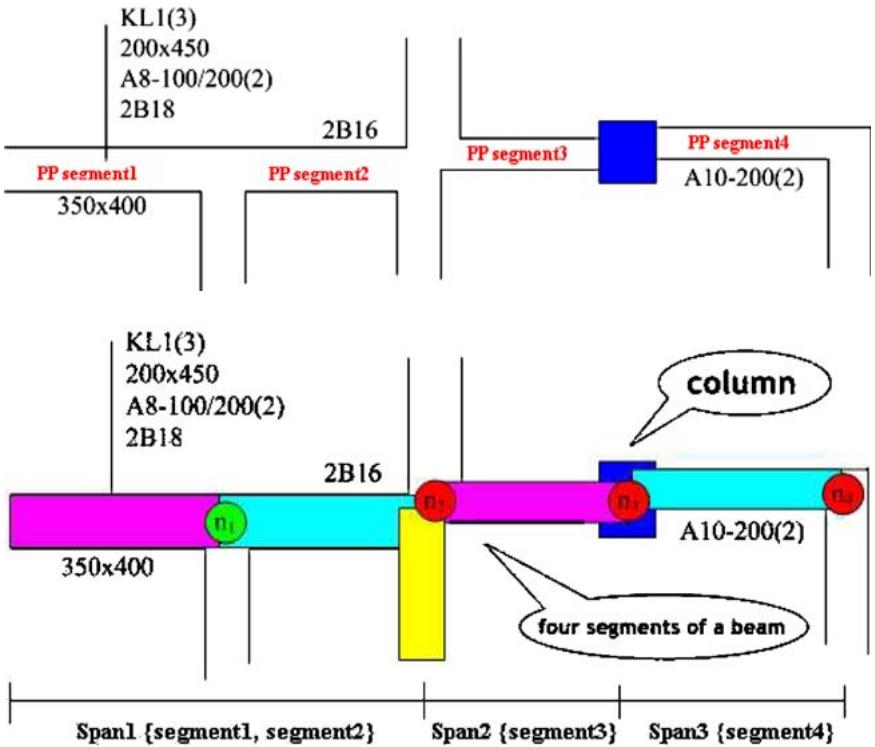  
Fig. 14 Spans and PP segments   
Fig. 15 Results of semantic analysis of recognized PP segments

The first step of semantic analysis processes is to search the related annotations. By the leading lines or the distance of the name texts to a PP segment, we can combine the name of a structural object with its corresponding candidate PP segment. In Fig. 14, segment1 will be found as a part of the beam named $^ { \circ } K L I ( { 3 } ) ^ { \circ }$ . Similarly, other attribute annotations, for instance, the text $\cdot 2 0 0 \times 4 5 0 ^ { 3 }$ which implies the width and the height of the segment, will be found.

The second step is to extend the matched segment to find related segments. Usually a beam (or a wall) has the following semantic characteristics:

1. A beam is composed of a series of related spans, while a span is composed of a series of connected PP segments.   
2. The PP segments of the same span have the same height, width and level; while the PP segments belong to different spans may have different height, width or level.

For instance, in Fig. 14, the name text $" K L I ( 3 ) "$ implies that the beam “KL1” has altogether three spans. PP segment1 has been identified as the first PP segment of the first span. Other spans will be identified by extending the matched segment1 by following rules:

1. If width $( s e g m e n t _ { j + l } ) \ \ne w i d t h ( s e g m e n t _ { j } )$ , then add $s e g m e n t _ { j + I }$ to the next span.

2. If the left or right line of segmen $t _ { j + I }$ deviates that of segmentj, add segmen $t _ { j + I }$ to the next span.   
3. If the end of segmentj is a column, add segmentj to the next span.   
4. If segmentj is the last PP segment, the extension is finished.

Figure 15 shows the results. The $T$ shape $n _ { 1 }$ connects PP segment1 and segment2. According to rule 1–4, $n _ { 1 }$ is not a span shape, therefore both segment1 and segment2 belong to the first span. $n _ { 2 } , n _ { 3 }$ and $n _ { 4 }$ are all span shapes, which connect two segments belong to different spans. Therefore the three spans can be represented as {segment1, segment2}, {segment3} and {segment4}, respectively.

After the relations of the spans and the recognized PP segments are verified, the semantics of each segment can be extracted. In Fig. 15, segment1 and segment2 share the text $5 3 5 0 \times 4 0 0 ^ { 3 }$ , which implies the width of these two segments is $3 5 0 \mathrm { m m }$ , while the height is $4 0 0 \mathrm { m m }$ . segment3 and segment4 share the text $2 0 0 \times 4 5 0 ^ { 3 }$ , which implies they have the same width $2 0 0 \mathrm { m m }$ and height $4 5 0 \mathrm { m m }$ . Table 1 shows the final results of each PP segment for 3D reconstruction from Fig. 14.

In Table 1, the text $^ { * * } A ^ { g } – I O O / 2 O O ( 2 ) ^ { * }$ of segment1 segment2 and segment3 implies a series of $8 \mathrm { m m }$ hooped reinforcement steels distribute along segment1, segment2 and segment3 with the interval $2 0 0 \mathrm { m m }$ in the intermediate part and $1 0 0 \mathrm { m m }$ at the head or tail. The text “A10-200(2)” implies segment4 has $1 0 \mathrm { m m }$ hoped reinforcement steels with the distribute interval $2 0 0 \mathrm { m m }$ . The text $^ { \circ } 2 B I 8 ^ { \circ }$ implies that all the four segments have two straight steels with the diameter $1 8 \mathrm { m m }$ , while only segment2 has the extra two $1 6 \mathrm { m m }$ straight steels according to its text “2B16”.

Table 1 Semantics of each PP segment   

<table><tr><td>No.</td><td>Span no.</td><td>Width (mm)</td><td>Height (mm)</td><td>Steel A</td><td>Steel B</td></tr><tr><td>1</td><td>1</td><td>350</td><td>400</td><td>A8-100/200(2)</td><td>2B18</td></tr><tr><td>2</td><td>1</td><td>350</td><td>400</td><td>A8-100/200(2)</td><td>2B18;2B16</td></tr><tr><td>3</td><td>2</td><td>200</td><td>450</td><td>A8-100/200(2)</td><td>2B18</td></tr><tr><td>4</td><td>3</td><td>200</td><td>450</td><td>A10-200(2)</td><td>2B18</td></tr></table>

# 4 Recognition of architectural symbols

After structural entities are recognized, we remove their graphical primitives from the drawing to simplify the analysis of functional entities and decorative entities. In this paper, we define such entities as architectural symbols. According to the suppositions in Sect. 2, these architectural symbols can be searched under the guide of recognized structural entities. For instance, we only search the connected graphical primitives of walls to find possible doors or windows in a 2D drawing.

Symbol recognition is one of the significant applications in the area of document analysis and pattern recognition. It plays an important role in automatic interpretation of documents like maps, musical scores, cartography, electronics and engineering drawings. Recently, a number of symbol recognition methods and contests have been proposed [18–20].

The interpretation of symbols in architectural plans is one of the most recent activities [21]. Unlike other types of drawings, two difficulties make the recognition of architectural symbols difficult. First, there is no standardized notation and a general framework for the interpretation of various architectural symbols is not a solved issue. Second, variations of architectural symbols usually make the recognition an expensive process, especially when the graphical primitives are difficult to be separated from those of other structural objects.

Generally speaking, architectural symbols have more changeable characteristics, which make the recognition of architectural symbols depends more on synthetical analysis than that of engineering symbols. For example, all the two lights in Fig. 16b and c and the elevation symbol in Fig. 16d have the similar circle, two intersected lines and the filling attribute. But they have different semantic meanings: Fig. 16b shows a waterproof indicator light, Fig. 16c implies a general indicator light, while Fig. 16d describes the elevation of some structural objects. Architectural symbols also have more uncertain characteristics. For example, in Fig. 16e, several concentric circles represent a spray symbol, but the number of the concentric circles is not the crucial proof for the recognition of the symbol. Figure 16f shows two fire hydrant symbols with different directions. That means sometimes the recognition cannot start from the directions of graphic primitives, too.

Therefore, an architectural symbol should not be modeled only by predefined graphical primitives. Instead, the necessary or excusive constraints between the symbol and its environment need to be integrated. Furthermore, considering the performance of analysis of multitude graphical primitives in the whole drawing, there should be some prior or leading conditions to decrease the analysis time in each predefined architectural symbol.

We classify the above characteristics or conditions into a group of features as follows:

1. Geometrical features (GF): the relatively invariant geometric constraints on primitives in a symbol.   
2. Leading features (LF): the most distinguishable features that have the fewest meanings.   
3. Attribute features (AF): attributes of a symbol, like line type and line width.   
4. Relational features (RF): relational constraints on primitives that belong to the same symbol, or constraints between a symbol and its environment.   
5. Transformational features (TF): rotation, distortion or zooming of a symbol.   
6. Exclusive features (EF): the primitives that cannot appear at the same time in a certain area of a symbol.

A target architectural symbol is modeled as a related features set. Such symbol is described as follows:

$$
\begin{array} { r } { \mathrm { s y m b o l \rangle } : = \langle \mathrm { r u l e } \rangle } \\ { \langle \mathrm { r u l e } \rangle : = [ \langle L F \rangle ] \langle G F \rangle [ \langle A F \rangle | \langle T F \rangle ] [ \langle R F \rangle | \langle E F \rangle ] } \end{array}
$$

When recognizing such symbol, its corresponding features will be scanned in a given sequence. Once all the features are identified, a new architectural symbol is recognized and its graphical primitives will be removed from the drawing to decrease the sequent analysis space. Otherwise, there is no such symbol in the plan drawing.

The features set will be scanned prioritized in the following sequence:

1. $L F$ serves as an entrance to the recognition to improve efficiency. In Fig. 16a, the circle of the water pump symbol is a leading feature, which will be rapidly recognized first.

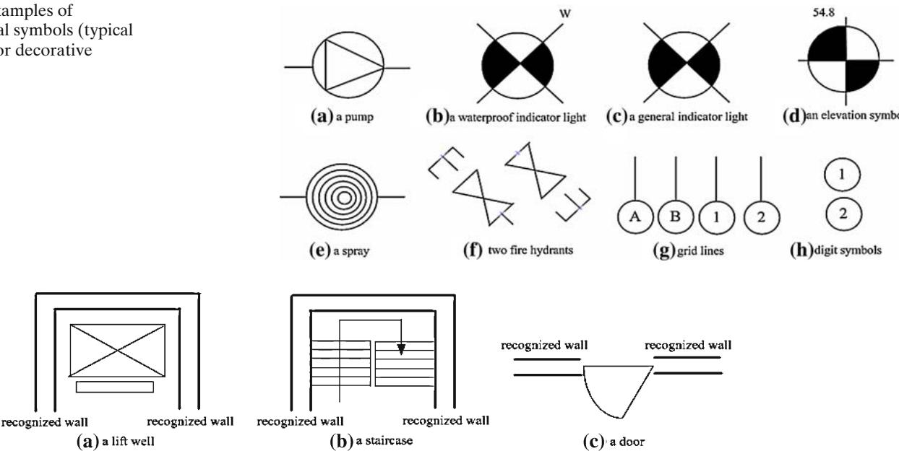  
Fig. 16 Examples of architectural symbols (typical functional or decorative entities)   
Fig. 17 Some architectural entities extracted in Fig. 2

2. Next, $G F$ is matched. For example, to recognize the symbol in Fig. 16a, a triangle (may be a solid triangle or made up of three lines or a polyline) is searched in the enclosure of the circle (the leading feature). During this step, attribute features are used to help reduce the search space. For example, the number of circles in Fig. 16e does not affect the recognition of the spray symbol, hence the circles inside are skipped.

3. Next try to match the $T F .$ . For example, the orientation of the two symbols in Fig. 16f is checked.

4. Then use $R F$ to affirm whether a target symbol exists. For example, the pump symbol in Fig. 16a connects with pipelines; so once the circle and the triangle are recognized, the algorithm searches for two connected lines. If no such lines are found, the recognition of pump symbol fails. Another example refers to Fig. 16g, in which the grid symbol connects to a grid line, and Fig. 16h, in which the slab symbol does not connect to any line.

5. Finally, use the $E F$ to decide on the symbol type. For example, the waterproof indicator light and the general indicator light in Figs. 16b and c, respectively, differ only in the presence of the letter ‘W’. When a general indicator light is to be recognized, the letter ‘W’ is searched around the circle to decide whether it is a waterproof indicator light.

Figure 17 shows some examples recognized from Fig. 2. We search lift wells (Fig. 17a) in the whole drawing by the following steps:

Given a free line $l _ { i }$ , visit $C ( l _ { i } )$ and $E ( l _ { i } )$ to find the leading features of lift wells (the $X$ intersected lines). Search the connected rectangle of the leading feature. • Search a nearby smaller rectangle. Search nearby recognized walls.

Similarly, the arrow in Fig. 17b can be used as the leading feature of a staircase. A group of parallel lines are geometrical features of staircases and connected walls are their relational features. Figure 17c shows a door connected with two wall segments. From its geometrical and relational features, such doors can be easily extracted.

Three methods provide the robustness when the number of target symbol increases: (1) Recognition of symbols is guided by previous structural entities recognition results and architectural domain knowledge. For instance, we will only search staircases and doors nearby recognized walls, or only search a spray symbol in a recognized room with a name text like “bathroom”; (2) The leading features, attribute features and relational features greatly speed up the recognition process; while exclusive features help reduce the meaningless search cost; (3) All the symbol models are organized in a hierarchic structure with the principle from simple to complex. Similar symbol models are distinguished by their corresponding features set distinctly, which greatly decreases the time identifying such symbols.

To summarize, we first find graphic primitives that constitute the leading features, then match the neighboring primitives using geometrical features, transformation features and attribute features, and lastly match relational features and exclusive features.

# 5 Integration of tables and plan drawings

Tables are efficient methods for presenting relational information and table recognition applications include information retrieval, document classification, etc. [22–24].

The details of structural objects, except their name texts, usually do not appear in plane architectural drawings because of the large number of graphical primitives. Instead, the details (i.e., the internal structure of an object in the 2D drawing and its section size) are drawn in an architectural table. Therefore, once the structural objects are recognized from floor 2D drawings, architectural tables need to be analyzed and the results need to be integrated with the recognized structural objects to reconstruct the building.

Figure 18 shows a part of a typical column table. In this table, the details of the section attributes, internal structure, level and steels of each column are listed. For instance, the first row implies that this is a table composed by details of columns. The second row is composed of internal section structure of three columns, and the third row shows the corresponding column names. The fourth to sixth row describe the steels of the columns, and from the seventh row, the details of another three columns are listed.

The targets of analysis of such architectural tables include:

1. Recognize the table structure.   
2. Extract the contents in the table.

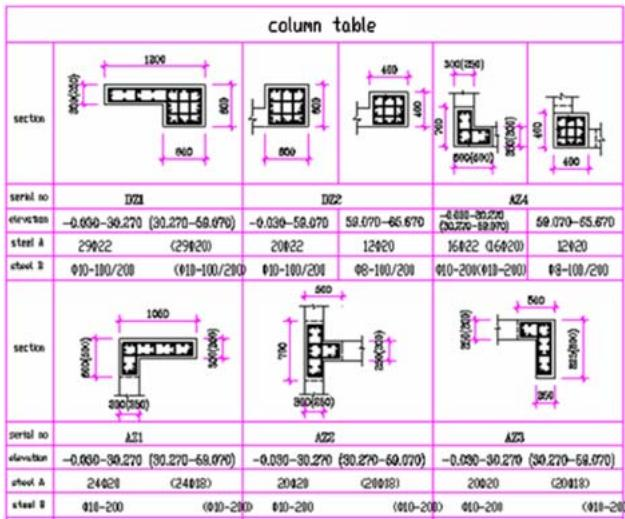  
Fig. 18 A part of a typical column table

3. Integrate the results with corresponding structural objects recognized in 2D drawings.

Despite the semantics of the contents, a table is usually composed of a group of intersected horizontal and vertical line segments. Such perpendicular line segments generate a series of squares, in which the details are described, i.e., attribute texts or complex graphical primitives. We define those squares separated by perpendicular lines in the table as cells. Letting $c _ { i }$ and $c _ { j }$ denote two cells from the same table $T , l$ denotes a line segment, $| ( l _ { i } , l _ { j } )$ denotes a line $l _ { i }$ is simultaneously on the extension of another line $l _ { j }$ , table cells have the following characteristics:

$$
\begin{array} { r l } & { c _ { i } \textsc { i } \textsc { c } _ { j } = \mathrm { n u n t l o r } \{ \imath \} ; } \\ & { \forall c _ { i } ( l _ { i 1 } , l _ { i 2 } , l _ { i 3 } , l _ { i 4 } ) \in T , \exists c _ { j } ( l _ { j 1 } , l _ { j 2 } , l _ { j 3 } , l _ { j 4 } ) \in T ( i \neq j ) } \\ & { \to ( l _ { i 1 } = l _ { j 1 } ) \wedge | ( l _ { i 2 } , l _ { j 2 } ) \wedge | ( l _ { i 3 } , l _ { j 3 } ) } \end{array}
$$

Table cells can be found by two steps. First recognize candidate cells only contain texts, which are surrounded by long horizontal and vertical line segments. Then visit each side of a candidate cell and search its nearing graphical primitives to find candidate neighboring squares recursively.

After candidate cells are recognized, semantic meanings need to be analyzed to extract the table structure. Candidate table cells can be divided into two types (1) name cells that describe the semantic names of the rows or columns, and (2) value cells that give the structural details. For example, the “elevation” cell in Fig. 18 will be identified as a name cell based on the domain knowledge, while its right neighboring $^ { \cdot } - 0 . 0 3 0 { - } 3 0 . 2 7 0 ^ { \circ }$ cell is identified as a value cell. Starting from each name cell, we will gradually find its corresponding value cell group by searching left, right, top or bottom neighbors recursively. After this step, the table structure is represented by

$$
\begin{array} { c } { { T = \{ c _ { n a m e i } ( c _ { \nu a l u e i 1 } , c _ { \nu a l u e i 2 } , \ldots c _ { \nu a l u e i n } ) , } } \\ { { 0 \leq i \leq m , 0 \leq m , 0 \leq n \} } } \end{array}
$$

Next the recognized name and value cells need to be further dealt with by (1) remove those value cells without corresponding name cells, and (2) merge the name cells, denoted by $c _ { n a m e i }$ and $c _ { n a m e j }$ , if the following conditions are met:

Size of $( c _ { n a m e i } ) = 0$ and Size o $\mathrm { f } ( c _ { n a m e j } ) \ne 0$ , where Size of $( c _ { n a m e } )$ is the number of corresponding value cells of $c _ { n a m e }$ . One side line of $c _ { n a m e j }$ is on cnamei.

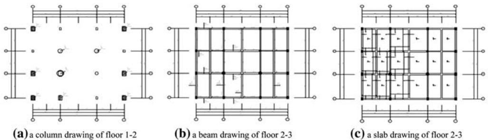  
Fig. 19 Integration of different drawings of the same project. a A column drawing of floor 1–2, b A beam drawing of floor 2–3, c A slab drawing of floor 2–3

For instance, in Fig. 18, the topside name cell “section” will be merged with another name cell “column table”, which makes the other successive name cells be merged, too. Finally, there is only one column of name cells is reserved, i.e., {“column table-section”, “column tableelevation”, …}. Thus the table in Fig. 18 is transformed into a traditional two-dimensional relation table.

The details in each value cell need to be interpreted based on the domain knowledge, i.e., the section text $^ { \circ } - 0 . 0 3 0 - 3 0 . 2 7 0 ^ { \circ }$ implies the length of the column is $3 0 . 3 \mathrm { m }$ . All the interpretation results from tables are then integrated with corresponding 2D drawings which describe the location and orientation of each column.

# 6 Integration of recognized objects and different architectural drawings

Related objects in different drawings need to be integrated for 3D reconstruction. For instance, the columns that appear in the column drawing of the 1–2 floors in Fig. 19a also appear in the beam drawing of the 2–3 floors in Fig. 19b, while the beams of the 2–3 floors also appear in the slab drawing of 2–3 floors in Fig. 19c. Therefore the recognition results of the column drawing will be transformed to the beam drawing to calculate the accurate contours of beams. Furthermore, after beams in Fig. 19b are recognized, they will do help for the analysis of the slab drawing by eliminating the tedious, time-consuming and error-prone blind search.

As shown in Fig. 19a–c, the scales of different drawings may be varied, which makes the drawing coordinates of graphical primitives from different drawings can not be compared. The only way to integrate different 2D drawings depends on the analysis of their logical coordinates calculated from dimensions and grid lines [16].

Suppose a structural object $t$ is recognized from an architectural drawing $A D _ { a }$ , to convert it to another corresponding architectural drawing $A D _ { b }$ , the following steps are needed:

1. Find the coordinate system where the object $t$ is located. A coordinate system can be found by a group of connected grid lines.   
2. Calculate the annotated coordinate system of $A D _ { a }$ , which is represented as $C _ { A d a }$ . The annotated coordinate system is defined as the largest coordinate system of the drawing.   
3. Transform $C _ { t }$ to $C _ { A d a }$ . Suppose the origin of $A D _ { a }$ is $( a _ { x 0 } , a _ { y 0 } ) , \theta _ { 1 }$ is the rotation angle of $C _ { t }$ in $A D _ { a }$ , the transformation matrix is

$$
M 1 = \left( \begin{array} { c c c } { { \cos { \theta _ { 1 } } } } & { { - \sin { \theta _ { 1 } } } } & { { - a _ { x 0 } \cos { \theta _ { 1 } } + a _ { y 0 } \sin { \theta _ { 1 } } } } \\ { { \sin { \theta _ { 1 } } } } & { { \cos { \theta _ { 1 } } } } & { { - a _ { x 0 } \sin { \theta _ { 1 } } - a _ { y 0 } \sin { \theta _ { 1 } } } } \\ { { 0 } } & { { 0 } } & { { 1 } } \end{array} \right)
$$

4. Transform $C _ { A d a }$ to $C _ { A d b }$ . To do this, we need first select the largest annotated coordinate system of the project, denoted by $C _ { A d \operatorname* { m a x } }$ , as the benchmark. Suppose $( \mathrm { d e v } _ { x 1 } , \mathrm { d e v } _ { y 1 } )$ is the offset of $A D _ { a }$ from $C _ { A d \operatorname* { m a x } }$ , $( ( \mathrm { d e v } _ { x 2 } , \mathrm { d e v } _ { y 2 } ) )$ ) is the offset of $A D _ { b }$ from $C _ { A D \operatorname* { m a x } }$ , the transformation matrix is

$$
M 2 = \left( { \begin{array} { c c c } { 1 } & { 0 } & { - \mathrm { d e v } _ { x 1 } } \\ { 0 } & { 1 } & { - \mathrm { d e v } _ { y 1 } } \\ { 0 } & { 0 } & { 1 } \end{array} } \right) \left( { \begin{array} { c c c } { 1 } & { 0 } & { - \mathrm { d e v } _ { x 2 } } \\ { 0 } & { 1 } & { - \mathrm { d e v } _ { y 2 } } \\ { 0 } & { 0 } & { 1 } \end{array} } \right) ^ { - 1 }
$$

Finally, the drawing coordinates of the graphical primitives of $t$ in $A _ { D a }$ will be transformed into $A D _ { b }$ by the matrix $\pmb { M } = \pmb { M 1 } \cdot \pmb { M 2 }$ . Successive analysis can be performed after the objects are transformed to corresponding drawings, i.e., calculation of the accurate shapes of beams after subtracting the transformed column shapes in the beam drawing.

Recognized results from tables also need to be integrated with other drawings. For instance, a column drawing only describes the locations, orientations and their name texts, while the details of each column, including the name, internal steel structure, section and height, are listed in a table. By the name texts, we can integrate those structural objects distributed in different drawings.

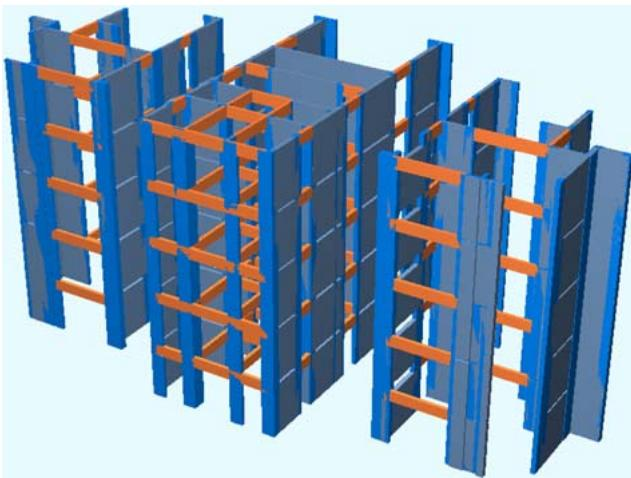  
Fig. 20 An example of reconstructed walls and beams

After all the necessary 3D information has been integrated, the building can be reconstructed. Figure 20 shows an example of reconstructed 3D model after the recognition and integration of a series of 2D architectural drawings.

# 7 Performance evaluation

Our testing data set has 257 plane architectural/structural drawings. Among them, 40 drawings are synthetic data for system test, and another 217 drawings are real data of business projects from different architects.

We first give the definitions of correct, false, missing and suspicious detections. A correct detection shows that the graphics of a target object are properly extracted. For instance, in Fig. 21, the T shape parallel line pairs are correctly recognized as two crossing beams. A false detection is usually caused by three reasons: (1) using the wrong graphics that do not belong to the final target object, (2) wrongly analyzing the semantics of a recognized object, or (3) wrongly recognizing an object that doesn’t exist. In Fig. 21, the left T shape is a false detection under an acceptable threshold. This false detection will cause the final reconstructed beam a little wider. False detections may also be brought by errors of semantic analysis. For instance, an elevation symbol will be easily recognized as a light symbol if the annotation is too far. Sometimes a sharing space in a building is also easily recognized as a room, because they are both enclosed regions surrounded by walls and beams in a 2D drawing and there are not enough hints to distinguish them.

A missing detection means an actually existing target object which is not recognized because of recognition thresholds, manual errors in drawings, or some disturbing graphical primitives. In Fig. 21, the right T shape is not recognized because the distance of the two line pairs is larger than the maximal acceptable distance threshold. Figure 22 shows an example where the left part of a staircase is not recognized because of the disturbing of other graphical primitives. A suspicious detection implies an object which is finally recognized but with a degree of certainty less than $1 0 0 \%$ . The difference between a missing detection and a suspicious detection comes from whether the thresholds, errors or disturbing degrees are acceptable: if acceptable, we create a target object and tag it “suspicious”, otherwise we pass it over.

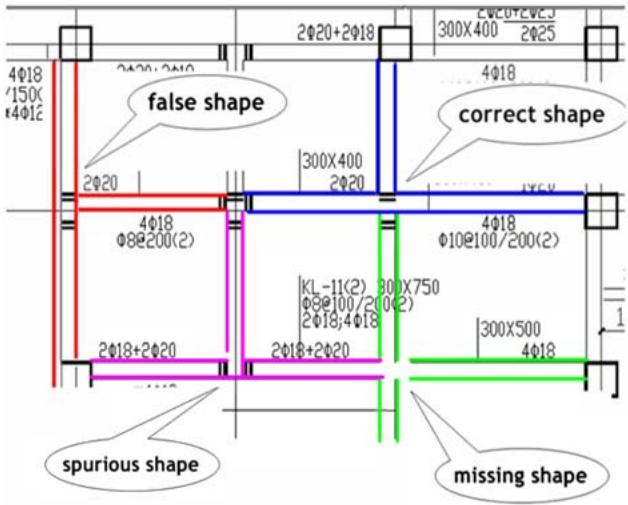  
Fig. 21 Correct, false, missing and suspicious shapes

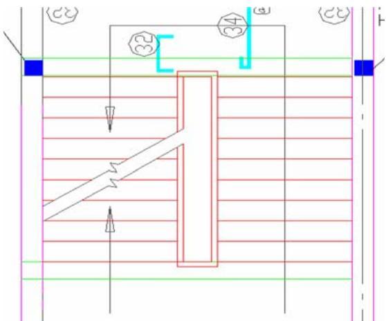  
Fig. 22 The left side of a staircase is not recognized because of the disturbing of other graphical primitives

The numbers and percentages of correct, false, miss and suspicious detections of T, X, L shapes and PP segments on ten typical synthetic drawings are shown in Table 2. In this table, correct shapes represent real structural objects, while false shapes may be generated by overlapped and parallel lines, which do not represent any structural object. The miss shapes are drawn by parallel pairs without any real intersections intentionally to test the robustness of shape-based recognition method. Suspicious shapes are drawn with irregularly intersected parallel pairs.

Table 2 Performance of shape-based PP segments recognition on ten typical drawings of synthetic data set   

<table><tr><td>Ten typical drawings of synthetic data set</td><td>T, X and L shapes</td><td>Total</td><td>Correct</td><td>False</td><td>Missing</td><td>Suspicious</td><td>Average T, X and L shapes recognition rate (%)</td></tr><tr><td rowspan="2"></td><td>Ground truth</td><td>4,140</td><td>2,116 (51.11%)</td><td>1,924 (46.47%)</td><td>50 (1.21%)</td><td>50 (1.21%)</td><td>85.58</td></tr><tr><td>Detected</td><td>3,543</td><td>2,014 (56.84%)</td><td>1,496 (42.22%)</td><td>7 (0.20%)</td><td>26 (0.73%)</td><td></td></tr><tr><td>Ten typical drawings of synthetic data set</td><td>PP segments shapes</td><td>Total</td><td>Correct</td><td>False</td><td>Missing</td><td>Suspicious</td><td>Average PP segments recognition rate (%)</td></tr><tr><td rowspan="2"></td><td>Ground truth</td><td>1,710</td><td>520 (30.40%)</td><td>1,146 (67.02%)</td><td>23 (1.35%)</td><td>21 (1.23%)</td><td>85.79</td></tr><tr><td>Detected</td><td>1,467</td><td>447 (30.47%)</td><td>992 (67.62%)</td><td>10 (0.68%)</td><td>18 (1.23%)</td><td></td></tr></table>

In Table 2, there are altogether $4 { , } 1 4 0 \ \mathrm { T } ,$ , X and L shapes exist in the selected drawings, while only 2,116 shapes are correct. There are 1,924 false shapes which do not represent any final structural objects. Fifty missing shapes and 50 suspicious shapes are drawn to test the robustness of recognition algorithm. As shown in Table 2, the average recognition rate of T, X and L shapes is $8 5 . 5 8 \%$ ; while the recognition rate of PP segments of structural entities is $8 5 . 7 9 \%$ .

Recognition errors of T, X, L shapes and structural PPs are mainly caused by thresholds. In Sect. 3.1.3, we use 0.4 as the minimal empirical scale to check whether two parallel lines are overlapped. However, Fig. 23 shows some different results according to that threshold. In Fig. 23, there are two parallel lines $\mathrm { l i n e } _ { a }$ (with length $a$ ) and ${ \mathrm { l i n e } } _ { b }$ (with length $^ { b , c }$ is the overlapped length).

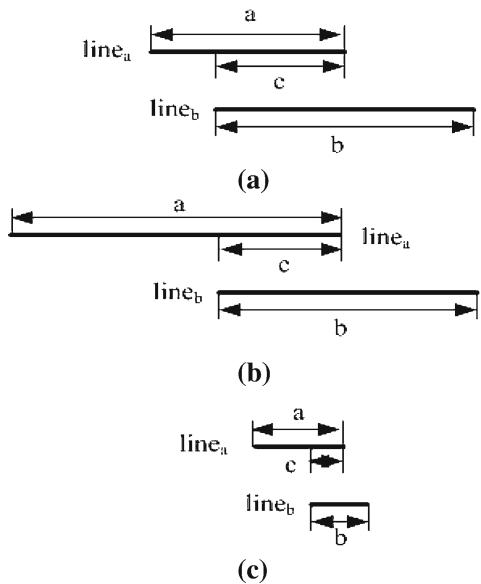  
Fig. 23 Overlap scales of two parallel lines

If $\operatorname* { m i n } ( c / a , c / b ) \ \geq \ 0 . 4$ , we say $\mathrm { l i n e } _ { a }$ and ${ \mathrm { l i n e } } _ { b }$ are two overlapped lines, as shown in Fig. 23a. In Fig. 23b, $\mathrm { l i n e } _ { a }$ changes to be a long line (may be a grid line simultaneously). Although $\mathrm { l i n e } _ { a }$ and ${ \mathrm { l i n e } } _ { b }$ are overlapped, they are ignored to be a candidate parallel line pair because $c / a < 0 . 4 .$ . In other cases, for example in Fig. 23c, the two lines are short and the overlap scale is larger than 0.4, but such lines are not suitable for candidate parallel line pairs of structural entities.

Angle threshold may also cause recognition errors. The same angle threshold to check whether two lines are parallel may generate different results. Given an angle threshold $0 . 1 ^ { \circ }$ , $\mathrm { l i n e } _ { a }$ is considered parallel to ${ \mathrm { l i n e } } _ { b }$ because their angle $\alpha < 0 . 1$ , as shown in Fig. 24a. However, when the two lines are long enough, $\mathrm { l i n e } _ { a }$ and ${ \mathrm { l i n e } } _ { b }$ with the same angle $\alpha$ should not be considered parallel obviously, as shown in Fig. 24b.

Table 3 shows the recognition results of walls and beams from Fig. 2. The recognition of such structural objects starts from the correctly recognized X, T, L shapes and PP segments. Then after the semantic analysis, walls and beams can be finally identified. In Fig. 2, there are altogether 186 walls and 74 beams. 170 walls are recognized correctly. However, there are still four missing walls and 12 false walls. The four missing walls are caused by the unrecognized PP segments during the previous steps. Thus, we can not match any recognized PP segments from the wall name texts and the semantic analysis of such walls fails. Similarly, just because there are PP segment recognition errors, the 12 walls are wrongly recognized. That means, because walls and beams are represented by such PP segments in a 2D drawing, the recognition rate of T, X, L shapes and PP segments affects the recognition results of structural entities. For instance, in Fig. 21, the left false PP segment will make the final recognized wall a litter wider after 3D reconstruction. The average recognition rate of walls and beams of Fig. 2 is $9 0 . 3 0 \%$ .

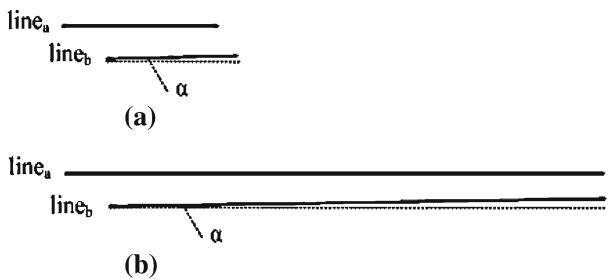  
Fig. 24 Overlap scales of two parallel lines

Table 3 Recognition results of wall segments and beam segments in Fig. 2   

<table><tr><td>Drawing</td><td>Ground truth</td><td>Correct</td><td>False</td><td>Missing</td><td>Suspicious</td><td>Average recognition rate (%)</td></tr><tr><td>Fig. 2</td><td>Walls 186</td><td>170 (91.40%)</td><td>12 (6.45%)</td><td></td><td></td><td></td></tr><tr><td></td><td>Beams 74</td><td>66 (89.19%)</td><td>5 (6.76%)</td><td>4 (2.15%) 0 (0.00%)</td><td>0 (0.00%) 3 (4.05%)</td><td>90.30</td></tr></table>

Table 4 Recognition results of some architectural entities in Fig. 2   

<table><tr><td></td><td>Architectural entities</td><td>Total</td><td>Correct</td><td>False</td><td>Missing</td><td>Suspicious</td><td>Recognition rate (%)</td></tr><tr><td rowspan="4">Fig. 2</td><td>Lift wells</td><td>3</td><td>3</td><td>0</td><td>0</td><td>0</td><td>100</td></tr><tr><td>Staircases</td><td>3</td><td>3</td><td>0</td><td>0</td><td>0</td><td>100</td></tr><tr><td>Doors</td><td>31</td><td>31</td><td>0</td><td>0</td><td>12</td><td>100</td></tr><tr><td>Rooms</td><td>43</td><td>43</td><td>13</td><td>0</td><td>15</td><td>76.79</td></tr></table>

Table 4 shows the recognition results of some functional and decorative entities in Fig. 2. The lift wells and staircases are searched from the enclosures of connected recognized walls and beams; while doors are found by searching the connected graphical primitives of recognized walls. A room is defined as an enclosure area surrounded by walls and beams, and at least one door is found on one of its sides. In our experiment, the recognition rate of rooms is $7 6 . 7 9 \%$ . There are 13 false rooms because some balconies are recognized as rooms, as shown in Fig. 25. Moreover, 15 windowsills are recognized as suspicious rooms because their areas are too small.

Table 5 shows the recognition results of structural objects and architectural symbols on the whole synthetic and real data set. Those final high-level structural entities are created after semantic analysis of the recognized PP segments. For instance, only one beam is finally recognized in Fig. 15, which is made up of three spans and four PP segments. Since there are a great number of such objects based on 257 drawings and projects are varied to each other, we give the average results in Table 5. According to our experiments, there are altogether 184 high-level objects (structural entities and other architectural symbols) need to be recognized in an architectural drawing; while the average recognition rate of such objects is about $8 6 . 4 1 \%$ .

Some useful hints in a plane architectural drawing will help improving the recognition rate of structural objects and decreasing the false or missing rate simultaneously. First, a correct PP segment is usually located by a grid line or a dimension. Thus there are usually auxiliary lines related with PP segments [9] and recognized PP segments can be validated by searching such auxiliary lines. Second, correct shapes can be pre-recognized and the missing or suspicious shapes will be validated by those correct shapes which are more reliable during the succeeding recognition processes. Finally, some disturbing lines, like too short steel lines, single leading lines and too long grid lines may be removed before the recognition.

Architectural symbols recognition is a time-consuming process. Two methods will help improving the efficiency. First, most of the architectural symbols (except windows and doors) are located in the areas surrounded by walls and beams; therefore, all such areas will be firstly analyzed. For each symbol model, only the graphical primitives in candidate areas will be analyzed. Second, the semantics of recognized structural objects will guide the recognition of architectural symbols. For instance, a door is usually used to connecting walls but not beams.

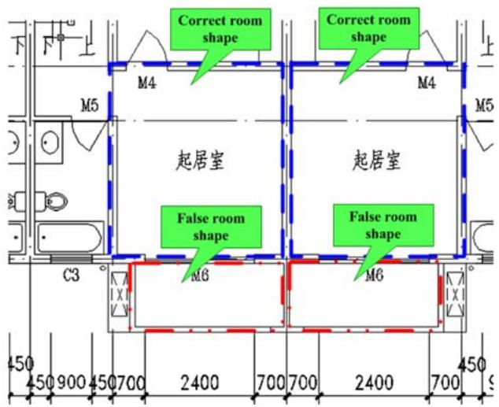  
Fig. 25 Some correct and false rooms recognized from Fig. 2

Table 5 Recognition and integration results of high-level structural objects and architectural symbols after semantic analysis on synthetic and real data set   

<table><tr><td></td><td>Ground truth</td><td>Total</td><td>Correct</td><td>False</td><td>Missing</td><td>Suspicious</td><td>Average recognition rate (%)</td></tr><tr><td>Average results of the synthetic data set</td><td>Detected</td><td>101</td><td>82 (81.19%)</td><td>5 (4.95%)</td><td>11 (10.89%)</td><td>3 (2.97%)</td><td></td></tr><tr><td>Average results of the real data set</td><td>Detected</td><td>266</td><td>236 (88.72%)</td><td>8 (3.01%)</td><td>17 (6.39%)</td><td>5 (1.88%)</td><td>86.41</td></tr><tr><td>Average results of the whole data set</td><td>Detected</td><td>184</td><td>159 (84.96%)</td><td>7 (3.98%)</td><td>14 (8.64%)</td><td>4 (2.43%)</td><td></td></tr></table>

# 8 Conclusions

Recognition and integration of 3D information provide a sound basis for automatic reconstruction from 2D architectural drawings. In this paper, we give a shapebased recognition method for beams and walls from the complex graphical environments, and discuss the recognition of widely used architectural symbols. 3D buildings will be reconstructed based on the integration of the recognition results.

Because of the complexity of architectural drawings, there are still a lot of interesting challenges of the recognition of architectural drawings: (1) More complex drawings, i.e., roofs and basements drawings, need to be automatically analyzed. (2) Other types of representations, i.e., side views or section views of columns and walls, are to be automatically recognized. (3) More types of structural objects and architectural symbols need be recognized.

Acknowledgements This project was supported by Nanjing University Talent Development Foundation.

# References

1. Lewis, R., Séquin, C.: Generation of 3D building models from 2D architectural plans. Comput. Aided Des. 30(10), 765–779 (1998)   
2. Tombre, K.: Graphics recognition – general context and challenges. Pattern Recogn. Lett. 16(9), 883–891 (1995)   
3. Tombre, K.: Ten years of research in the analysis of graphics documents: achievements and open problems. In: Proceedings of 10th Portuguese Conference on Pattern Recognition, Lisbon, Portugal (1998)   
4. Tombre, K.: Graphics documents: achievements and open problems. In: Proceedings of 10th Portuguese Conference on Pattern Recognition, Portugal, pp. 11–17 (1998)   
5. Ah-Soon, C., Tombre, K.: Variations on the analysis of architectural drawings. In: Proceedings of 4th International Conference Document Analysis Recognition (ICDAR), Ulm (Germany), pp. 347–351 (1997)   
6. Ah-Soon, C.: A constraint network for symbol detection in architectural drawings. In: Proceedings of the Graphic Recognition: Algorithms and Systems: 2nd International Workshop, Springer, Berlin Heidelberg New York, pp. 80–90 (1997)   
7. Ah-Soon, C., Tombre, K.: Architectural symbol recognition using a network of constraints. Pattern Recogn. Lett. 22(2), 231–248 (2001)   
8. Messmer, B., Bunke, H: Automatic learning and recognition of graphical symbols in engineering drawing. LNCS 1072, 123–134 (1996)   
9. Park, J., Kwon, Y.B.: Main wall recognition of architectural drawings using dimension extension line. LNCS 3088, 116–127 (2004)   
10. Dosch, P., Masini, G.: Reconstruction of 3D structure of a building from the 2D drawing of its floors. In: ICDAR’99, Proceedings of 5th International Conference on Document Analysis and Recognition, pp. 487–490 (1999)   
11. Dosch, P., Tombre, K., Ah-Soon, C., Masini, G.: A complete system for the analysis of architectural drawings. Int. J. Doc. Anal. Recogn. (IJDAR) 3, 102–116 (2000)   
12. Zhi, G.S., Lo, S.M., Fang, Z.: A graph-based algorithm for extracting units and loops from architectural floor plans for a building evacuation model. Comput. Aided Des. 35(1), 1–14 (2003)   
13. Xi, X.P., Dou, W.C., Lu, T., Cai, S.J.: Research on automated recognizing and interpreting architectural drawings. In: Proceedings of the first International Conference on Machine Learning and Cybernetics (IEEE), Beijing, China, pp. 1000– 1004 (2002)   
14. Su, F., Song, J.Q., Tai, C.L., Cai, S.J.: Dimension recognition and geometry reconstruction in vectorization of engineering drawings. In: IEEE Conference on Computer Vision and Pattern Recognition, Hawaii, pp. 710–716 (2001)   
15. Song, J., Su, F., Tai, C.-L., Cai, S.J.: An object-oriented progressive-simplification-based vectorization system for engineering drawing: model, algorithm, and performance. IEEE Trans. Pattern Anal. Mach. Intell. 24(8), 1048–1060 (2002)   
16. Lu, T., Tai, C.L., Su, F., Cai, S.J.: A new recognition model for electronic architectural drawings. Comput. Aided Des. 37(10), 1053–1069 (2005)   
17. Lu, T., Tai, C.L., Bao, L., Su, F., Cai, S.J.: 3D reconstruction of detailed buildings from architectural drawings. Comput. Aided Des. Appl. 2(1–4), 527–536 (2005)   
18. Valveny, E., Dosch, P.: Symbol recognition contest: a synthesis. GREC 2003, LNCS 3088, 368–385 (2004)   
19. Yang, S.: Symbol recognition via statistical intergration of pixel-level constraint histograms: a new descriptor. IEEE Trans. Pattern Anal. Mach. Intell. 27(2), 278–281 (2005)   
20. Llados, J., Marti, E., Villanueva, J.J.: Symbol recognition by error-tolerant sybgraph matching between region adjacency graphs. IEEE Trans. Pattern Anal. Mach. Intell. 23, 1137–1143 (2001)   
21. Lladós, J., Valveny, E., Sánchez, G., Martí, E.: Symbol recognition: Current advances and perspectives. GREC 2002, LNCS 2390, 104–128 (2002)   
22. Zanibbi, R., Blostein, D., Cordy, J.R.: A survey of table recognition: models, observations, transformations and inferences. Int. J. Doc. Anal. Recogn. 7, 1–16 (2004)   
23. Belaïd, A.: Recognition of table of contents for electronic library consulting. Int. J. Doc. Anal. Recog. 4, 35–45 (2001)   
24. Wang, Y., Phillips, I.T., Haralick, R.M.: Table structure understanding and its performance evaluation. Pattern Recogn. 37, 1479–1497 (2004)