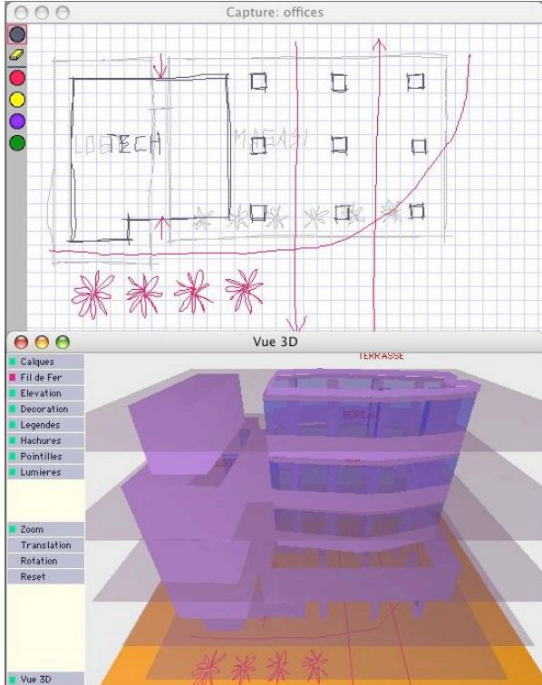
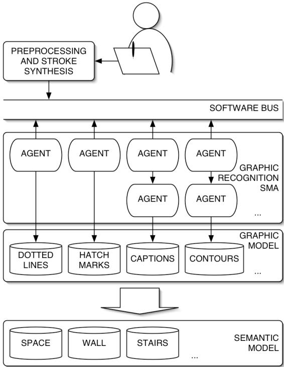
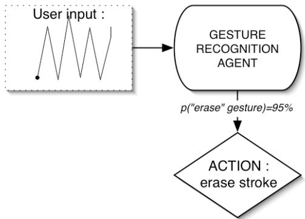
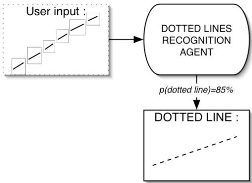
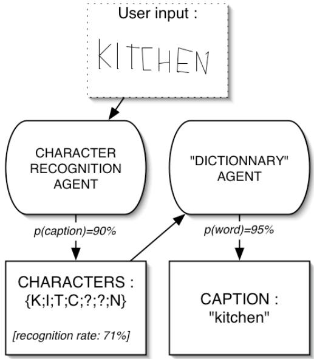
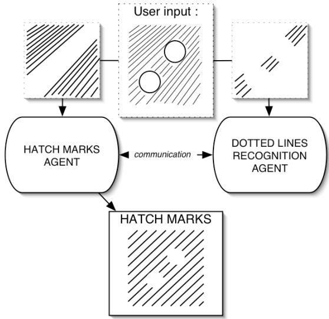
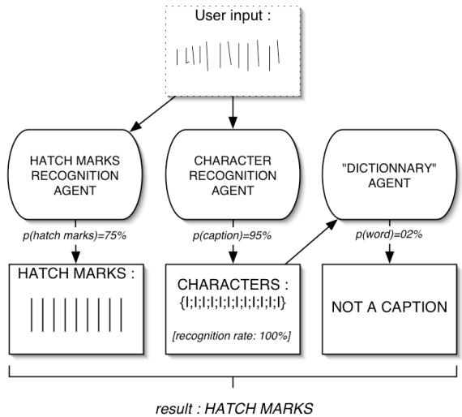
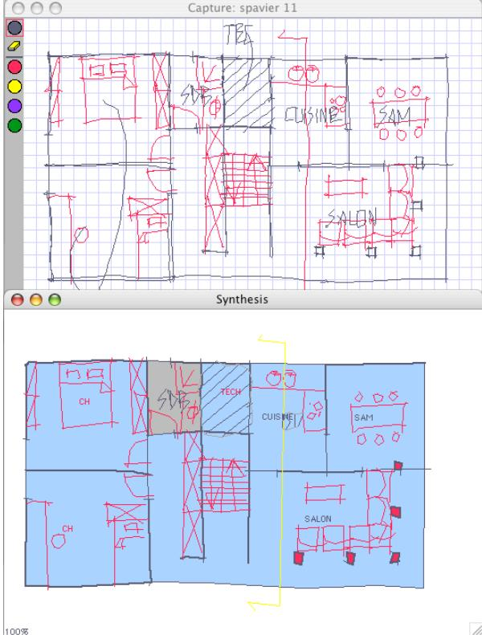
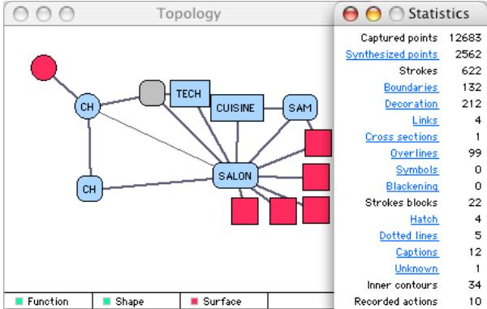
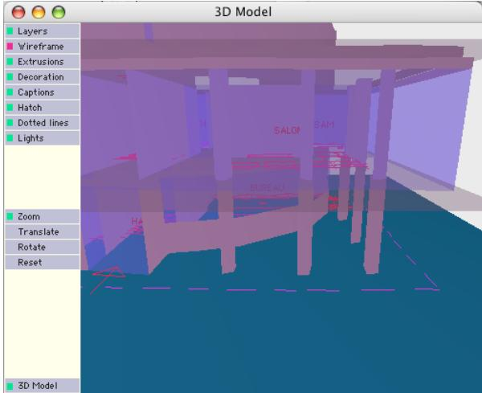

# A Multi-Agent System for the Interpretation of Architectural Sketches

Roland Juchmes, Pierre Leclercq and Sleiman Azar

University of Liège Chemin des cheveuils,1 Bat B52 4000 Liège, Belgium {r.juchmes, pierre.leclercq}@ulg.ac.be azar@lema.ulg.ac.be

# ABSTRACT

Architects widely resort to sketch during their early phase of design, because sketching appears to be the most adapted mean to express and to manipulate creative ideas. In order to assist the designers during this inventive phase of work we have developed EsQUIsE-SMA, an on-line system for capturing and interpreting architectural sketches. This prototype is based on a MAS, MultiAgent System, which enables real time management of recognition scenarios. This paper describes the basic mechanisms involved by EsQUIsE-SMA t o interpret free hand architectural drawings : the sketch as an evolutive environment, the agent types for stroke analysis and the collaboration modes between agents. The conclusions deduce the salient characteristics for a MAS dedicated to sketch analysis.

Categories and Subject Descriptors: I.2.11 [Artificial Intelligence]: Multiagent systems; I.3.6 [Computer Graphics]: Interaction Techniques; J.6 [Computer-Aided Engineering]: Computer-aided design (CAD).

# 1. Introduction

Engineers, stylists, architects and designers all endeavour to formulate creative responses to the problems with which they are faced. In their work, they need t o combine very broad sets of constraints, ranging from technical knowledge to implementational requirements, rules of the thumb, ecological commitments, etc. Machines, clothes, buildings and furniture all begin, before becoming part of the real world, as spatial-visual artefacts, which exist in the mind of their creator through their functional, economic, energetic and aesthetic characteristics.

In this complex exercise, designers are now increasingly aided by a large number of dedicated software applications, which enable them to ascertain quite quickly the behaviour of the future objects before they are made and to optimize their principal performances. However, despite their fantastic potential, these software tools cannot be used during the first phases of the designer’s work: their interfaces require a lengthy modelling stage before the powerful simulation and optimization calculations can be carried out.

That is why, before being able to perform these simulations, designers develop and finalize their ideas using the simplest and most common tool : the freehand sketch. As the closest trace of his or her creative thinking, the sketch is, in effect, the first part of the design process, because it has proved to be the most appropriate aid for the expression and manipulation of rough ideas. The sketch, as the only concrete trace of the thought process, embodies the designer’s thoughts and makes them self-explanatory. It is thus the visible basis of the design process.

Therefore, to aid a designer in his or her inventive work, the tool provided must be compatible with current practice. A tool whose utilization, formalism and semantics facilitate and support the designer’s reasoning. In other words, it must be a means of drawing freehand sketches, having an ergonomic gesture capture system, stroke recognition and a capacity to interpret.

We have evaluated and successfully demonstrated the potential of the graphical sketch as a direct means for acquiring the semantic components of a design drawing, including - and above all - its implicit aspects [Lec94]. This work was concretized in the development of the EsQUIsE software prototype, a program for the drawing, analysis and interpretation of architectural design sketches [Lec99].

In this article, we focus on the operations of the original multi-agent system integrated into the EsQUIsE prototype. This system performs the recognition of the graphic entities that make up a sketch. In part 2, we briefly recall the characteristics and functionalities of EsQUIsE, which we relate to other research carried out i n the field in part 3. In part 4, we describe the operations of the actual multi-agent system: its general operations, the characteristics of the agents and how they interact with each other. Finally, we conclude with a discussion of current and future research.

# 2. The EsQUIsE prototype

The EsQUIsE prototype is an interpretative tool for free-hand sketches to support early architectural design. The EsQUIsE environment (Figure 1) uses pen computer technologies (electronic pen and digital tablet-screen) featuring the “virtual blank sheet”. The prototype is capable of capturing the lines (x-y coordinates of the pen), synthesizing and interpreting them in real time, then progressively composing the technological and functional models of the building being designed. These models can then be used by two demonstration simulation tools, which provide the designer with qualitative information on the performances of the designed product: in this case a preview of the threedimensional virtual model and assessment of the building’s energy requirements.

  
Figure 1. The EsQUIsE prototype.

By being as close as possible to the creative gesture, our prototype aims to capture the designer’s intention, as expressed in a drawing. Exceedingly human in nature, this expression is imprecise, often vague and always incomplete! It is therefore antithetic to current software tools, which require precision, rigor and completeness, thereby hindering the creative spirit of their users.

The concepts that have guided the development of EsQUIsE have been summarized in what we have called the absent interface [LJ02]. This concept is part of the Disappearing Computer movement and suggests that the following 4 complementary principles should be adopted:

- A natural form of interaction, which enables exploitation of spontaneous and versatile means, requires n o specific learning and does not constrain the design process (like the electronic pen that replaces the pencil);

- An adaptive interface, requiring no formal dialogue; i.e. a system capable of adapting to users, able to support their imprecise and incomplete human behaviour, allowing them to work in complete freedom with regard to action and time (acting how they want, when they want);

- A transparent means of interaction, not requiring any announcement of intention but identifying the current operation according to the observed situation (for example that allows the user to draw a dotted line directly rather than expecting him or her to select a particular line tool and the dotted line type);

- An intelligent interface, ensuring the consistency of its own subjacent model, assigning roles and interrelations to the elements that make it up, then capable of completing this model by adding implicit relevant information, a necessary condition for an aid tool worthy of the name.

# 3. Related works

We can classify design assistance tools for sketching on the basis of their objectives :

- Drawing tools, computer-aided to varying degrees, but which do not make any interpretation of the sketch. This category contains a large number of tools ranging from traditional “bitmap” drawing applications to tools that enable drawing in three-dimensional spaces, such as Harold [CHZ00]. The usefulness of these types of software for the designer is very limited since they are not design aids but rather drawing aids.

- Natural communication tools, which use the freehand sketch as a quick way to create graphs and diagrams. Among the drawing tools, we can cite SILK [LM01] which enables rapid conception of GUIs (Graphical User Interfaces), TAHUTI for UML diagrams [HD02], CALI [FPJ02] or Smart Sketchpad [LXZ02]. The SATIN system [HL00], which also belongs to this category, offers a library of software functions to enable programming of applications that support the freehand sketch. These applications have in common that they are based on recognizing a limited number of elementary shapes, then searching for the relations between these items. Therefore, they are not well suited for interpreting free, complex graphical representations such as architectural plans, which, unlike electrical graphs or schemas, cannot be made up entirely from predefined symbols.

- Sketch-based retrieval tools, which use the freehand sketch as a natural way to retrieve graphical information from a database. We can cite for example the Electronic Cocktail Napkin [Gro96], used particularly to access an architectural case base or SBR [FJ03] for the retrieval of mechanical CAD drawings.

- 3D modelling tools based on the interpretation of perspective or projective sketches. EsQUIsE belongs t o this third category. We can cite for example SKETCH [ZHH96], Sketch-3D [EHBE97], VR Sketchpad [Do01] or the works of Igarashi [Iga03] or those of Lipson and Shpitalni [LS02].

The ASSIST prototype [AD01] is not a 3D modelling tool but it is capable of interpreting a sketch of a simple mechanism then simulating the way it works.

To our knowledge, none of these software programs for interpreting sketches is based on a multi-agent system. The research that is the most similar to ours in this field is described in [AJ02]. The goal of their system i s to recognise ‘graphic units’ (grids, etc.) in architectural plans. However, it is not really a sketch recognition tool, because it acts at a higher level, when the primitive graphic items (lines, contours, texts) have already been recognised.

# 4. A multi-agent system for sketch recognition

The agent approach is a very dynamic field of research, which has developed rapidly since the beginning of the 90’s and the work into distributed artificial intelligence, such as that by Minsky [Min88] or Brooks [Bro91]. Since then, the scope of application of agents has greatly expanded, making it difficult to define the limits of this field. In fact, there is not even a consensus within the scientific community concerning the very definition of what constitutes an agent. Depending o n whether one is interested in “computational agents”, “robotic agents”, “mobile agents” browsing the Internet or “artificial life agents” plunged into a hostile environment, the definitions of agent can be very different, even contradictory.

We have chosen to refer to the largely accepted “weak notion of agency”, cited by Wooldridge and Jennings [WJ95]. According to this definition, to be an agent, a system must display the following four properties: autonomy , social activity, reactivity (sensing and acting), and pro-activeness (goal-oriented). In the following sections, we show how the agents present in our system correspond to this definition.

Why a multi-agent system?

Interpreting freehand sketches is a very difficult problem to resolve and a relatively young field of research in which a great deal of progress remains to be made. We believe that the multi-agent approach is one of the paths that will enable researchers to meet the future challenges in this field. Three particularities of this problematic incited us to adopt a multi-agent approach for interpreting sketches:

# - the sketch corresponds to a dynamic and unpredictable environment

As we indicated in part 2, the justification for the absent interface is to allow users to express themselves naturally without constraining either their graphic expression or how they communicate with the machine. The sketch, which constitutes the environment the agents perceive, is therefore not only dynamic (the interpretation takes place in real time on the basis of events occurring continuously), but especially it constitutes an unpredictable environment. The agents can never know if the next stroke drawn will be integrated into the current sequence or traced in a completely different location in the sketch, nor even whether it will be a stroke, a gesture ordering something or simply the user who points to an item in the sketch with a pen. In effect, contrary to traditional assisted sketch software programs, the users never announce the action they intend to perform (no selection in the menus). One of the characteristics of the agents is to be able to act in such environments.

# - A multi-agent system is a system for breaking down a problem

One of the fundamental ideas behind the multi-agent approach is that complex forms of behaviour can emerge from the interaction among simpler forms of behaviour. The interpretation of a sketch is a very complex objective, but the simpler sub-targets can be easily identified: the recognition of isolated graphic symbols i s relatively simple and the complexity in this process arises because there are multiple elements all having different relations among themselves. Likewise, we believe a multi-agent approach is a form of modelling well-adapted to a system for interpreting sketches.

# - A multi-agent system is open to change

Finally, in practical terms, multi-agent architecture i s well adapted to the design of changing systems. Since the number of graphic elements likely to be recognised is almost unlimited, modular software architecture i s necessary so that elements can be connected or disconnected with the least possible repercussions on the system.

# 4.1 General system operations

  
Figure 2. General system operations.

Figure 2 depicts the general system operations. On the top is depicted the user drawing freely on a graphic tablet. The user’s drawing is captured by a first module that converts raw data sent by the input device (x and y coordinates, pressure and tilt according to the x and y axes) into strokes. A stroke begins when the electronic pen presses on the tablet and ends when it no longer presses on it. The stroke is the structure of data used b y recognition agents. This module also performs stroke pre-processing by polygonal approximation. The strokes thus formed are deposited into a “pile” of strokes and a message is sent by bus software to all of the agents to inform them that a new stroke has just been traced on the sketch.

According to their internal state and/or the characteristics of the new stroke, the agents choose whether or not to react to the event. If the new stroke is of interest t o them, they attempt to use it to successfully complete their recognition objective. When an agent uses a stroke, it places a flag next to the stroke in the pile. This flag does not prevent the other agents from using the stroke, but it serves to inform them that another agent i s also interested by the stroke. As we will demonstrate later, this mechanism makes it possible to initiate a direct dialogue between two agents.

When a graphic element is recognised by an agent with a certain probability, it is added to what we call the graphic model. The graphic model is a description of the user’s sketch, no longer based on strokes but instead o n higher level graphic elements: texts, symbols, contours, hatch marks, etc.. If several agents propose incompatible interpretations of the sketch, a dialogue will take place to resolve the conflict. In the remainder of this paper, we will present some more detailed examples of how the agents interact.

This graphic model will be used by EsQUIsE to construct the architectural model, a veritable “semantic” representation of the building on which the different evaluators of the project can work.

# 4.2 Different types of agents

We can classify the agents that make up the system according to the input they need to carry out their objective successfully.

- “One stroke” agents

The simplest behaviour we can identify among the EsQUIsE agents is the immediate reaction to an input (reactive agents). The gesture recognition agents display this behaviour.

  
Figure 3. “One stroke” agents.

The agent in charge of recognising the gesture “erase” for instance (the zigzag of figure 3) monitors all the strokes that are made on the tablet. If the probability that this stroke corresponds to the gesture “erase” i s sufficient, the agent informs all the other agents that this stroke is recognised and therefore they must not attempt to interpret it in another way. As output, the agent sends a message triggering the erasing action.

# - “Multi-stroke” agents

The second type of agent we find in EsQUIsE are those that must attempt to recognise groups of strokes. These strokes may have chronological, topological or geometric relations. The simplest forms of behaviour in this category are the recognition of dotted lines or hatch marks.

When a new stroke is announced, the “dotted line” agent looks to see if this stroke could be the first segment of a dotted line. If this is the case, it adds this stroke to its internal buffer and places a flag next to the stroke in the pile so that the other agents know this stroke is used. Other agents can of course place their own flag by the same stroke. For example, a stroke corresponding to the conditions for a dotted line can also correspond to the conditions for a hatch mark.

When the next stroke is drawn, if it is more or less lined up and sufficiently close to the first, the “dotted line” agent also adds it to its internal buffer. This process continues until a stroke no longer corresponds t o the conditions for a dotted line.

If the probability is sufficient that the sequence of strokes accumulated in this way forms a dotted line, and no other agent is using these strokes for another interpretation (no more flags are attached to the stroke), the agent creates a new graphic entity, the “dotted line” i n the graphic template. In the opposite case (probability too low), the agent simply removes the flags it had placed by the strokes. Later, we will discuss the case i n which flags, which were placed by other agents, remain by the strokes, that is when different interpretations of the sketch co-exist.

  
Figure 4. “Multi-stroke” agents.

- “High level” agents

Some agents do not work directly on the strokes drawn by the user, but use a result produced by other agents as input. This is the case for instance in the recognition of captions.

A “character recognition” agent, which is comparable to the dotted line or hatch mark agents described above, monitors the strokes being input to search for symbols that are aligned and that may be part of a caption (numbers, letters, punctuation marks, etc.).

When a potential caption is found, i.e. when the agent encounters a group of signs that looks like a caption, i t transmits its result to another agent, the “dictionary” agent, which, from the letters recognised and a dictionary, will attempt to interpret the text.

To understand the difference between these two agents well, one can compare with how the human mind is able to recognise words written with alphabets that we are unable to interpret (for instance the Greek or Cyrillic alphabet). This is what the “character recognition” agent does. As for the “dictionary” agent, its role is to feed the graphic model with the recognised words. We should insist that there are two different agents, each of which produces its own results, but that the complementary intervention of the “dictionary” agent greatly increases the rate of text recognition (typically, $60 \%$ of characters are generally recognised by EsQUIsE, while the caption recognition rate is approximately $9 0 \%$ ).

  
Figure 5. “High Level” agents.

# 4.3 Communication between the agents

In the previous part, we described two types of interaction that can occur among agents. The first is the broadcasting of a message to all the other agents (public communication), the second corresponds to the case i n which the result produced by an agent is used as input for another agent (private communication). These are both cases of simple communication. In some cases, several interpretations are possible and the agents must work together to propose a pertinent interpretation of the sketch. We call this "communication for consultation".

Let’s return to the example of dotted lines and hatch marks discussed above and go into more detail.

Sometimes the user makes hatch marks in a zone i n which there are contours that were supposed to remain completely empty (figure 6). In the figure, we can see that the hatch mark is made up of continuous lines as well as dotted lines. The agent in charge of recognising the hatch marks must therefore also take into account dotted lines, although they were supposed to be processed by a dedicated agent. How exactly is this process organised?

As long as the "hatch mark" agent receives straight lines corresponding to the conditions for forming a hatch mark line, it adds them to its buffer. When the person drawing starts one of these dotted lines (see figure), the strokes taken into consideration one by one n o longer correspond to the criteria of the hatch mark being drawn. The "hatch mark" agent would like to ignore the strokes, judging that they do not meet its criteria. However, since the "dotted line" agent has placed a flag b y these strokes, the "hatch mark" agent waits before ignoring all of these strokes. When the user goes on to the next line, the "dotted line" agent has recognised a dotted line. This result is transmitted to the "hatch mark" agent, which remarks that the dotted line considered as a group meets the criteria of the hatch mark currently being drawn. Therefore, it is integrated.

  
Figure 6. Hatch marks and dotted lines.

This example shows how the collaboration between two agents makes it possible to obtain a more pertinent interpretation: without the dialogue between the two agents, only some dotted lines would have been recognised, while in this case, the system is able to recognise a complex hatch mark.

Figure 7 provides another example. A series of short vertical strokes can be interpreted as a hatch mark or as a long word made up of only “i’s”. If we consider the recognition probability, the character recognition agent is very sure of its interpretation and assigns it a probability close to $1 0 0 \%$ (the recognition rate for the letter “i” is very high because it is compared to letters that are much more complex to draw such as $\textrm { E H }$ or M). This probability will very certainly be greater than that returned by the "hatch mark" agent, because all of the strokes are not perfectly aligned since it is a freehand sketch. When the "dictionary" agent receives the character recognition result, it searches for the most probable word in its dictionary. It does not find one and therefore returns a probability near zero: no word is made up of only “i’s”.

In this case, the system would have interpreted the sequence as a hatch mark, and the collaboration of three agents would have been necessary to provide the correct interpretation:

- If we had deactivated only the hatch mark recognition agent, the interpretation given would have been “caption not recognised” (result from the “dictionary” agent).

- If we had deactivated only the “dictionary” agent, the interpretation would have been an unrecognised word made up of only “i’s”, since the character recognition agent would have been highly confident of its result.

- If we had deactivated only the character recognition agent, the interpretation would have been a hatch mark. In this case, the “dictionary” agent would not have participated either, because it would have expected a result from the character recognition agent as its input.

  
Figure 7. Hatch marks and captions.

# 4.4 Characterisation of the EsQUIsE multi-agent system

Our research is carried out using a bottom-up approach to problems, in which the point of departure i s always the expression of a need by the users (in this particular case, the architect-designers). We then attempt to meet their request using the most appropriate techniques to develop relevant software tools. Therefore, the system we have created is not the result of theoretical reflection on software architecture, but rather derives naturally from the recognition objective we set for ourselves. In effect, we have made our solution evolve toward a multi-agent system for the precise purpose of improving its recognition capacity. This change in the prototype led us to work in the multi-agent field, because it seems to offer an interesting approach to meet the challenges involved in sketch recognition.

The following section describes some features generally associated with our agents and their characteristics in our prototype. The EsQUIsE agents are:

- Permanent

Our agents are permanent: they are created when the application is launched and will remain alive until it i s stopped. However, the current prototype provides the user the possibility to manually activate or deactivate the agents according to the graphic elements the software is supposed to recognise.

- Mobile

Our agents are not mobile and they are currently all located on the same machine. A current project will distribute the agents on several machines to spread out the computational load within the framework of an embarked application.

# - Autonomous

Our agents are autonomous because they are capable of acting according to their own objectives with no human intervention. As planned, no general control system drives the recognition application.

# - Located within a dynamic environment

The environment perceived by the agents is the sketch currently being drawn. They can browse this environment searching for information that interests them or reacting to modifications in this environment (a new stroke, the erasure of a stroke, etc.).

# - Reactive: capable of responding on time

Since our system interprets the sketch in real time, the agents are able to respond instantaneously to the events they perceive despite the fact that the EsQUIsE prototype is developed in a symbolic interpreted language (in this case MCL), which is relatively slow compared t o a precompiled language.

# - Sociable: capable of collaborating

We have presented several examples of collaboration among the agents; for instance, between the “hatch mark” agents and the “dotted line” agents. As we have seen, these agents remain completely autonomous (they can even be deactivated), however, the pertinence of the interpretation is dependent on the collaboration among the agents.

- Proactive

The EsQUIsE agents do not act simply in reaction t o the stimuli they perceive. They elaborate strategies, i n particular for interacting, basing their actions on scenarios so as to interpret as pertinently as possible the elements that make up the sketch.

- Adaptive

Today, our agents are not capable of adapting automatically (to the context of the sketch, to the user etc.). However, some agents are capable of learning by examples. This is true for instance of the character recognition agent, which users can train to read their own writing. One of our objectives is to rapidly create agents that self-adapt according to their perception of the environment.

# 5. A concrete example

After having described the system’s operations, we give here a concrete example of an architectural sketch’s interpretation.

Figure 8 presents a real sketch drawn with EsQUIsE : it is the plan of the first floor of a small dwelling house. The first window shows the original drawing made by an architect and the window of bottom shows the graphic entities recognized by the agents and used by the system.

One can note is that the recognized drawing is not "corrected" by the system. The objective of EsQUIsE i s not to neaten the drawing of the architect but to interpret it correctly.

The strokes drawn in red are strokes of decoration without semantics on architectural symbols. By now, they are not interpreted because symbols recognition agents are still under development. All the other strokes are interpreted in real time.

The strokes enclosing spaces are interpreted as walls if they are overlined and as windows if not.

The long vertical stroke, which crosses all the sketch and which is drawn in yellow in the synthesis window, is recognized as a "section stroke". This gesture makes possible to the draughtsman to create a particular layout which enables him to draw a section of the building.

The hatch marks in the technical room on the sketch’s top were correctly interpreted.

One can see that all captions have been recognized. Some were written directly on the space they describe while others are connected to the space by a link.

The small squares drawn in the living room (salon i n french) were represented in red in the synthesis window. This means that they were interpreted as columns.

Figure 9 presents the topological diagram of the building and provides statistics about the recognition of the drawing. We can see in the statistics window that the original sketch is composed of 12683 points (Captured points), distributed on 622 strokes. After the preprocessing phase, there remain 2562 items (approximately $2 0 \%$ ) that will be really used for the later phases. 212 decoration strokes are not used for the interpretation.

Twelve captions have been recognized (for all the floors). One is however classified “unknown”, it is the caption of the bathroom on figure 8 (Salle De Bains or SDB in french). The dictionnary agent did not recognize it because it has been expressly wiped out the semantic knowledge base in order to illustrate the ability of the agent to recognize words even if they don’t belong t o the known vocabulary (here the word is localized but not identified). Some captions were written directly i n the space that they describe but four of them were linked to their space by a “link stroke”.

  
Figure 8. The original sketch and its synthesis.

  
Figure 9. The building topology and the statistics.

  
Figure 10. The generated 3D model.

The topological diagram charts the functional spaces of the building and their relations. They are drawn in blue if the space is identified by a caption and they are grey if the system ignores the function of the space.

Some other elements are also represented. One can see that the columns of the living room have been recognized: the red squares in the diagram. Except the columns, a small contour at the top left corner of the sketch is drawn. This element is due to a little “hook” in the original sketch that has not been deleted during the preprocessing phase. However it was recognised as too small to be a space and was removed from the architectural model.

Finally, figure 10 presents a 3D view of the building. This is not a real 3D but a 2.5D model as the spaces and walls are constructed by extrusion of the plannar elements. This first and reduced approach is often possible in architecture because of the role of gravity which forces building elements to be mainly vertical or horizontal (walls and floors). One of our goal for the future is to extend the model to real 3D by crossing information from different projective views.

# 6. Conclusion and future research

In this article, we have presented a multi-agent system for the on-line interpretation of freehand sketches. We believe that the agent approach is well adapted to this problem. In effect, the autonomy of the agents makes i t possible to handle the free expression characterising the sketch currently being drawn, while the collaboration among the agents enables them to carry out complex tasks (interpreting the sketch) based on simpler subtasks (recognition of symbols).

We believe that the current prototype demonstrates the feasibility and pertinence of the multi-agent approach for interpreting freehand sketches. Today, we would like to further develop the system. Current developments focus on:

- increasing the recognition capacity by implementing new agents;

- integrating a new sketch recognition mode based o n image analysis;

- making the system evolve toward multimodality b y creating agents that monitor other activities besides the sketching itself: a vocal agent and a gesture agent;

- implementing new procedures for cooperation among the agents so as to integrate information coming from different modalities.

- extending communication using bus software in a distributed version: agents located on several cpu’s.

# Acknowledgments

We would like to give special thanks to Henry Lieberman and Tracy Hammond from the MIT AI / Media Lab and to all the participants to the workshop Intelligent Agents in Design, organised by Frances Brazier during AID'02 (Cambridge UK) for all interesting discussions we had about EsQUIsE-SMA.

<table><tr><td colspan="2">References</td></tr><tr><td>[AJ02]</td><td>Achten, H.H. and Jessurun J. : An Agent Framework for Recognition of Graphic Units in Drawings. In K. Koszewski and Wrona, S.(ed.): Proc 20th International Conference on Education and Research</td></tr><tr><td>[AD01]</td><td>in CAAD in Europe (2002). Warsaw Uni- versity of Technology,. pp. 246-253. Alvarado C., Davis R. : Preserving the freedom of paper in a computer-based sketch tool. In Proc HCI International</td></tr><tr><td>[Bro91]</td><td>(2001), pp. 687-691. BROOKS R.A.: Intelligence without representation. Artificial Intelligence,</td></tr><tr><td>[CHZ00]</td><td>47(1-3) (January 1991), pp. 139-159. Cohen, J. M., Hughes, J. F., and Zeleznik, R. C. : Harold: A World Made of Draw- ings. Proc First International Sympo- sium on Non Photorealistic Animation (NPAR) for Art and Entertainment (June</td></tr><tr><td>[Do01]</td><td>2000), Annecy, France June 2000. Do E. : VR Sketchpad - Create Instant 3D Worlds by Sketching on a Transparent Window. In Bauke de Vries, Jos P. van Leeuwen, Henri H. Achten (eds): CAAD Futures 2001, July, 2001, Eindhoven,</td></tr><tr><td>[EHBE97]</td><td>Eggli L., Hsu C., Bruderlin B. and Elber G. : Inferring 3D models from freehand sketches and constraints. Computer- Aided Design, Vol. 29, No. 2, pp.101- 112, 1997.</td></tr><tr><td>[FPJ02]</td><td>Fonseca M. J., Pimentel C. and Jorge J. A.: CALI: An Online Scribble Recog- nizer for Calligraphic Interfaces. Proc AAAI Spring Symposium on Sketch</td></tr><tr><td>[FJ03]</td><td>Understanding (2002), pp 51-58. Fonseca M., Jorge J. A.: Towards con- tent-based retrieval of technical draw- ings through high-dimensional index- ing. Computers &amp; Graphics 27(1): 61-69 (2003)</td></tr><tr><td>[Gro96]</td><td>Gross, M.D.: The Electronic Cocktail Napkin - a computational environment for working with design diagrams. De- sign Studies, 17(1), pp. 53-69.</td></tr><tr><td>[HD02]</td><td>Hammond T. and Davis R.: Tahuti: A Geometrical Sketch Recognition System for UML Class Diagrams. In Proc AAAI Spring Symposium on Sketch Under-</td></tr><tr><td>[HL00]</td><td>standing (2002), pp 59-66 Hong J.I., Landay J.A.: SATIN: A Toolkit for Informal Ink-based Applica- tions. In Proc UIST 2000, ACM Sympo- sium on User Interface Software and Technology (2000), CHI Letters , 2(2), p.</td></tr></table>

[Iga03] Igarashi T. : Freeform User Interfaces for Graphical Computing. In Proc 3rd International Symposium on Smart Graphics, Lecture Notes in Computer Science, Springer, Heidelberg, Germany, July 2-4, 2003, pp.39-48.   
[LM01] Landay J.A., Myers B.A. : Sketching Interfaces: Toward More Human Interface Design. IEEE Computer, vol. 34, no. 3, March 2001, pp. 56-64.   
[Lec94] Leclercq P. : Environment de conception architecturale pré-intégrée. Eléments d'une plate-forme d'assistance basée sur une représentation sémantique. Thèse de doctorat en Sciences Appliquées,1994, $3 0 0 { \mathfrak { p } }$ ., Université de Liège, Belgique.   
[Lec99] Leclercq P. : Interpretative tool for architectural sketches. In Proc 1st International Roundtable Conference on Visual and Spatial Reasoning in Design : computational and cognitive approaches (1999), MIT, Cambridge, USA.   
[LJ02] Leclercq P., Juchmes R. : The Absent Interface in Design Engineering. Artificial Intelligence for Engineering Design, Analysis and Manufacturing, AIEDAM Special Issue: Human-computer Interaction in Engineering Contexts, Cambridge University Press, USA, 2002.   
[LJ02] Leclercq P., Juchmes R. : The Absent Interface in Design Engineering. Artificial Intelligence for Engineering Design, Analysis and Manufacturing, AIEDAM Special Issue: Human-computer Interaction in Engineering Contexts, Cambridge University Press, USA, 2002.   
[LS02] Lipson H., Shpitalni M. : Correlationbased reconstruction of a 3D object from a single freehand sketch. In Proc AAAI Spring Symposium on Sketch Understanding (2002), pp. 99-104   
[LXZ02] Liu W., Xiangyu J., Zhengxing S. : Sketch-Based User Interface for Inputting Graphic Objects on Small Screen Device. Lecture Notes for Computer Science (LNCS), vol.2390, pp. 67-80, Springer, 2002.   
[Min88] Minsky M.: The Society of Mind, Simon & Schuster, New York,1988.   
[WJ95] Wooldridge M., Jennings N.R. : Intelligent agents: theory and practice. Knowledge Engineering Review, 10(2), 1995, pp. 115-152.   
[ZHH96] Zeleznik R.C., Herndon K.P., Hughes J.F.: SKETCH: An Interface for Sketching 3D Scenes. In Computer Graphics. In Proc. SIGGRAPH 96 (1996),pp.163-170.