# A System to Detect Rooms in Architectural Floor Plan Images

Conference Paper · June 2010

DOI: 10.1145/1815330.1815352 · Source: DBLP

# 4 authors:

Sébastien Macé

Script&Go

28 PUBLICATIONS   289 CITATIONS

SEE PROFILE

Hervé Locteau

17 PUBLICATIONS   280 CITATIONS

SEE PROFILE

# Ernest Valveny

Autonomous University of Barcelona

165 PUBLICATIONS   5,529 CITATIONS

Salvatore Antoine Tabbone

Lorraine Research Laboratory in Computer Science and its Applications

213 PUBLICATIONS   4,238 CITATIONS

# A System to Detect Rooms in Architectural Floor Plan Images

Sébastien Macé, Ernest Valveny Centre de Visió per Computador Edifici O, Campus UAB, Bellaterra (Cerdanyola) 08193 Barcelona, Spain {sebastien,ernest}@cvc.uab.cat

Hervé Locteau, Salvatore Tabbone Université Nancy 2 – Loria UMR 7503 615, rue du jardin botanique – B.P. 101 54602 Villers-lès-Nancy Cedex, France {locteau,tabbone}@loria.fr

# ABSTRACT

In this article, a system to detect the rooms in architectural floor plan images is described. We first present a primitive extraction algorithm for line detection. It is based on an original coupling of classical Hough transform with image vectorization in order to perform robust and efficient line detection. We show how the lines that satisfy some graphical arrangements are combined into walls. We also present the way we detect some door hypothesis thanks to the extraction of arcs. Walls and door hypothesis are then used by our room segmentation strategy; it consists in recursively decomposing the image until getting nearly convex regions. The notion of convexity is difficult to quantify, and the selection of separation lines between regions can also be rough. We take advantage of knowledge associated to architectural floor plans in order to obtain mainly rectangular rooms. Qualitative and quantitative evaluations, performed on a corpus of real documents, show promising results.

# 1. INTRODUCTION

For the last few years, there has been a significant increase of software for furniture and interior design. Their goal is to permit a user to virtually visualize, usually thanks to a three dimensional rendering, the impact of some modifications in the building (change of furnitures, modification of wallpaper, etc.). A problem with such software is the necessity to accurately reflect the structure of the building. This can be done thanks to floor plan design systems that can however be difficult to handle or at least discouraging for the inexperienced user.

An interesting alternative would be to offer users the possibility to scan a floor plan they have on paper and let the system automatically interpret it. This would limit as much as possible the intervention of the user. This is the main goal of the ScanPlan research project which is partially presented in this paper. More specifically, our goal is to design a document analysis system that automatically detects the different rooms in architectural floor plan images.

The interpretation of architectural floor plans is a problem that has been a lot studied recently [2, 4, 7, 9, 10, 15]. However, it is far from being solved, mainly because of the variability of the notations that can be used in these documents. There is no standard from one country to another, and the graphical conventions can even differ in the same country from one architect to another. This concerns, on the one hand, the nature of the information (indications of dimensions, areas, name of the rooms, projection of roof, etc.) and, on the other hand, the way they are visually represented (a wall is sometimes depicted as a thick line, two thin parallel lines possibly separated by some specific texture, one thin line and one thick line that are parallel, etc.). The consequence is that many existing approaches presented in the literature are dedicated to one specific type of graphical conventions. Moreover, we note that these approaches often focus on one specific step of floor plan interpretation, and do to provide a complete, usable system.

The long term goal of our works is to propose a floor plan interpretation system that is both generic, i.e. able to deal with as much graphical conventions as possible, and complete, i.e. from the source image to the correct digital floor plan. In the first step of our research, we have chosen to focus on a subset of graphical conventions (figure 1 shows one example), while still keeping in mind our generic objective. In spite of this specificity, we have tried as much as possible to design a complete system.

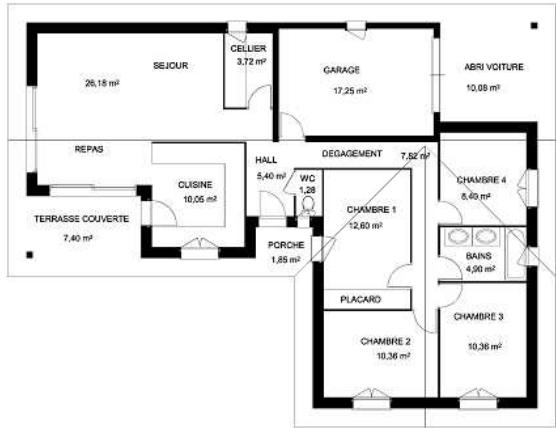  
Figure 1: Example of an architectural floor plan.

In this paper, we present the first results of the ScanPlan project. Our approach is divided into two main steps. The first one is the extraction of the primitives that form the document and that will be necessary for room detection. In our case, it is essential to detect lines, because some of them correspond to the walls that constitute the building. For this step, we propose an original approach based on the combination of the classical Hough transform with a standard method for image vectorization. The main idea is to avoid some of the drawbacks of the Hough transform applying it not to the whole image, but rather on those areas raised by the results of the vectorization. The combination of both approaches permits to develop a robust method for the detection of long lines. We also detect arcs, because they are likely to correspond to doors, which are interesting hints about the room separation. The second step is a logical analysis that consists in identifying the segmentation into rooms of the floor plan using the primitives that have been extracted. The principle is to recursively decompose the floor plan until getting almost convex regions. We take into account some knowledge associated with floor plans in order to get a set of rooms that are mainly rectangular. So far, we do not exploit textual information that are likely to exist in the document (such as the name of the rooms, their area, etc.) nor some graphical information (furnitures, etc.) that are often very different from one document to another.

The structure of this paper follows the workflow of our analysis system. First, we present some preprocessing steps that we perform to extract the information that will be used in the continuation of the analysis process. Then, we focus on line detection and show how we identify the walls that constitute the floor plan thanks to simple graphical relations. In section 4, we show how we extract some door hypothesis thanks to an arc detection method. In the next section, we present how we detect rooms from the informations that have been extracted from the image. In section 6, we present some evaluation, both qualitative and quantitative, of this method. The experiments are performed on a corpus of real documents. Finally, we conclude and present some perspective to these works.

# 2. IMAGE PRE-PROCESSING

Architectural floor plan images contain information of very different natures. The first step of our document analysis system is to identify each class of information. Then, each class can have a special treatment depending on the graphical conventions we want to deal with. Most of these preprocessing steps do not depend on the graphical conventions and can be exploited on any floor plan image.

The first step is a text/graphic separation. In the first system that we have designed, we do not take text into account (because many floor plans do not contain any text) and only focus on the graphical layer. The second step is closely related to the graphical conventions that we have chosen to focus on. In our case, a wall is represented as a line thicker than any other information in the image. As a consequence, we use a thick/thin separation algorithm to extract the walls from the document. When dealing with other graphical conventions, other texture extraction should be designed. As for other graphical information (for instance doors), they are located in the thin layer.

For all these pre-processing steps, we have used some classical algorithms (actually, we have used the implementations proposed in the Qgar library [12]).

# 3. LINE AND WALL DETECTION

Our line detection algorithm is based on the coupling of Hough Transform (HT) with image vectorization (IV). The principle is to couple the theorically opposite principles of these techniques (HT permits to detect long lines, whereas IV approximates the image with many small lines) in order to perform robust and efficient line detection. In this section, we first present the classical HT as well as its drawbacks, and then focus on the benefits of using this process on the result of IV. Finally, we show how we used this techniques in the context of architectural floor plan interpretation.

# 3.1 Classical Hough Transform

HT is a well-known method for finding features in images and has been largely exploited for line detection. It consists in defining a parameter space, or accumulator. As a line can be represented by two parameters (in the case of classical HT, its distance $\rho$ from the origin and the angle $\theta$ of the vector from the origin to its closest point), this accumulator is an array where each bin represents a potential line in the document. Each black pixel of the image (or feature points, such as edges or medial points) votes for all the lines $( \rho , \theta )$ that are in adequacy with its position; the principle is that points that are aligned will all vote for the same line. At the end of this accumulation process, a peak detection process identifies local maxima in the accumulator: they should correspond to lines.

Classical HT has several drawbacks. The first one is the complexity that is associated to its exhaustive nature. This can lead to a very long analysis when the images are big and complex. The second one is the need of a line verification process to validate the line hypothesis and to detect the extremities of the lines (only the direction $( \rho , \theta )$ of these lines is computed by classical HT). The third drawback is its intrinsic sensitiveness to noise: a black pixel will vote for all the lines that could go through it, increasing the votes for some inconsistent lines, which can lead to annoying side effects.

# 3.2 Coupling HT with image vectorization

The principle of our approach is to limit these three drawbacks by computing the HT on the result of the IV process. The idea is that the segments resulting from IV include several information that give very significant hints about the lines of the document. For instance, it is unlikely that an horizontal segment is part of a vertical line: therefore, its points should not vote for it. To do so, we keep the general accumulation process: we consider the points constituting the segments resulting from IV (the Bresenham algorithm for straight line is used to compute them) and their vote is used to fill in the parameter space. However, a given point will not vote for all lines that are in adequacy with its position, but only for the ones that are also in adequacy with the angle of the segments it belongs to. For a segment of angle $a$ , we have chosen to limit the voting to the angles $a \pm \pi / 8$ (see figure 2). This is the first advantage of this new method. On the one hand, the complexity of the process is significantly reduced (in this case, we divide by 4 the number of considered angles for each point); on the other hand, the noise created by a pixel is reduced, because it will not vote for inconsistent lines with regards to the segment it belongs to.

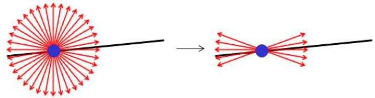  
Figure 2: Exploiting the angles of the segments reduces the complexity of HT.

The second advantage of applying HT on the result of IV is to make it possible to validate a line hypothesis by detecting the segments that are associated to a direction corresponding to a peak in the accumulator. To do so, we define an area around the detected direction and look for the segments inside it (see figure 3(a)). In order to reduce the complexity of this process, a data structure is used to quickly access the segments having an extremity at given coordinates. Only segments with a valid angle are kept. A sequence of valid segments can be either connected or not; at this point, it is necessary to evaluate the gap between two successive segments to decide whether they belong to the same line or not (a threshold is needed). Finally, the resulting line coordinates are the orthogonal projection coordinates of the extremities of the segment sequence on the detected direction. A post-processing step can be exploited to discard lines that are not long enough (another threshold is needed). This process is illustrated on figure 3(b).

of the process, detecting the “next” line simply consists in finding the “new” local maximum in the parameter space. This technique, coupled with the limitation of the accumulation process, reduces in a significant manner the impact of a point on the line detection method.

# 3.3 Dealing with architectural floor plans

As introduced before, in the case of the graphical conventions we are dealing with, the pre-processing steps basically extract the walls of the image. Instead of performing a line detection on these data (IV is often unable to deal correctly with thick lines), we perform it on their contours.

A general difficulty when detecting the lines in architectural floor plans is the existence of many small lines that sometimes carry significant information in the context of room detection. As introduced previously, a line must be long enough to be kept; a decrease of the associated threshold would undoubtedly increase the number of detected lines, but also the number of irrelevant hypothesis. Because of the strong properties in terms of alignment that exist in floor plans, we have chosen a slightly different approach: we fix a threshold for the minimum length of the concatenation of all the lines that are on a same direction. This mechanism permits, as presented on figure 4, to detect small lines that are collinear with longer ones without keeping “isolated” small lines. The result of the corresponding line detection is presented on figure 5(c).

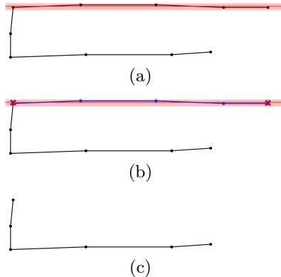  
Figure 3: Once a direction is detected, an area is defined to locate the corresponding segments (a); they are used to deduce the coordinates of the lines (b) and can be removed from the document (c).

The third advantage of this new method is to limit the impact of the votes of the points belonging to already detected lines. This is based on the fact that we know how the points of the segments that constitute the line have voted and that it is therefore straightforward to “remove” these votes from the accumulator; as a consequence, after detecting a line, we can also remove all the votes of the points belonging to the segments that constitute that line. Thus, at each step

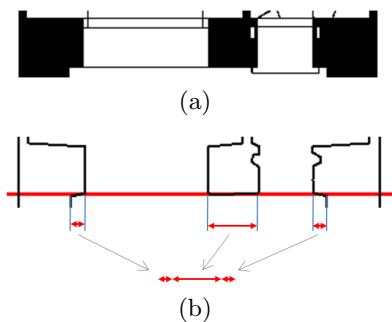  
Figure 4: Some small lines are difficult to detect without taking their context into account, in this case their direction.

# 3.4 Wall detection

The goal of the wall detection process is to detect wall candidates among the lines that have been extracted. In our case, these lines are supposed to be the contours of the walls. Therefore, the first step of this process consists in detecting close and parallel $( \rho , \theta )$ directions and in comparing the positions of the lines that are on these directions: if two lines are aligned, they are likely to be a wall (figure 6(b) illustrates this). The second step consists then in validating of not an hypothesis by considering the texture located between the two lines: in our case, we just ensure that the pixels are indeed black (see figure 6(c)). We would like to emphasize that this process has been designed in order to be easily extended to other kinds of textures.

In order to limit the impact of undetected lines as well as to deal with crossing walls (for instance, the presented method does not detect the parts of walls constituting angles because some lines are implicit, see figures 6(b) and 6(c)), we have designed a third step: it consists in determining if the extremities of a detected wall are correct. For such purpose, we exploit our knowledge on wall texture (in our case, we know that the interior of a wall is black): we consider both extremities of a wall and check, directly on the image, in the continuity of the wall, if the texture actually ends at the detected coordinates (see figure 6(d)). If it does not, we scan this direction as long as the texture exists and then extend the wall accordingly. Figure 6(e) illustrates the result of this process.

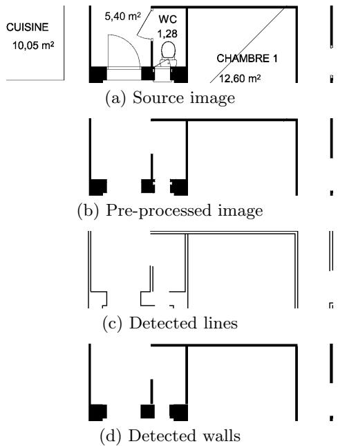  
Figure 5: Results of the different steps of our wall detection method.

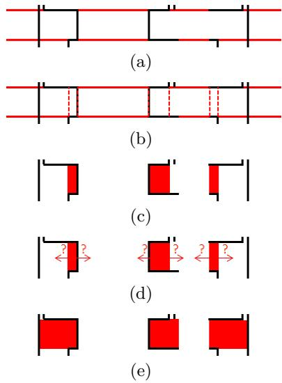  
Figure 6: Illustration of the wall detection method.

The result of our wall detection method on the image in figure 1 is presented with black lines on figure 7. On this example, all the walls have been detected. It is in particular interesting to note that in spite of imperfect line detection (see figure 5(c)), our wall detection method limits their impact by finding missing information.

# 4. ARC AND DOOR HYPOTHESIS DETECTION

Knowing the existence of a door is very interesting in the context of room detection, because it generally explicits a separation between two rooms. Once again, there is no visual standard to represent doors, but they are usually depicted with an arc, possibly with one or two segments on one or two external radii (depicting the door itself as well as the entrance of the room, see for example figure 5(a)). As a consequence, extracting arcs in the image is a good starting point for a generic door detection method. In the first version of our system, we do not take care of their context regarding the walls that have been detected. This means that once an arc is detected, we do not know if it indeed depicts a door and which one of its external radii actually is the entrance of the room.

So far, we have not focused on this door detection step, because it is not of utmost importance in the context of room detection. As we will show in the continuation of this paper, these door hypothesis are used by the system as hints for the separation into rooms. One interesting point is that a missed detection may have little consequence; moreover, a false detection will not have any impact at all if it is not located in a context where a separation between rooms is likely to appear. One advantage of this approach is to avoid any special treatment for doors of cupboards: they will be detected but will just not be exploited.

A very classical approach is used for arc detection [14]. In our case, this detection is performed on the thin layer that has been extracted during pre-processing. The result of door hypothesis detection on the image in figure 1 is presented with gray lines in figure 7, each arc being represented by its two external radii. In this image, there is one missed detection but no false detection. All the information presented in this figure (walls and door hypothesis) are the input of the room detection algorithm we present in the following section.

# 5. ROOMS DETECTION

The second main step of our system is a logical analysis of the result of wall and door hypothesis extraction in order to detect the rooms in the floor plan. We first present the general problem that we are dealing with, and then show how we recursively split the image into smaller regions. Finally, we present some post-processing steps.

# 5.1 Problem statement

Identifying a room on a floor plan consists in identifying the location of the walls depicting its outer boundary. Thus, the problem falls into retrieving the partition of the analyzed image for which each region corresponds to a room.

Segmenting an image can be roughly obtained using a bottomup or a top-down approach. For both of them, iterative procedures may be applied to replace step by step a partition of the image by another one that is supposed to be more relevant, until the convergence of a given criterion. The main drawback that methods belonging to the bottom-up category have to face is that they can only use extremely local information. After having over-segmented voluntarily an image, seeds have to be selected in order to initiate a region growing process that merges at each step the couple of adjacent regions that are the most similar. The selection of seeds and the strategy to discard some merging operations or determine the convergence both play a crucial role. Moreover, when the initial segmentation is too fine, and the homogeneous criterion can be inefficient in determining the best fusion. Thus, many errors are likely to appear from the very beginning of the process.

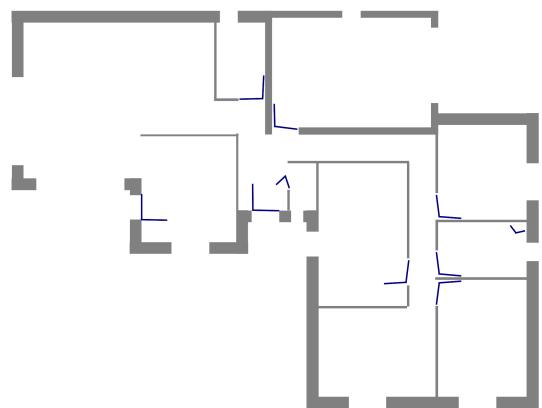  
Figure 7: Result of the wall and door hypothesis detection.

Contrary to the previous ones, top-down techniques are initially applied on a single region and sub-regions are obtained by splitting the least homogeneous region. In the context of architectural floor plans, the number of rooms is usually small, convergence should be quickly achieved with such approaches. Moreover, they permit to propose different levels of perception of a same building by keeping several segmentations thanks to Binary Partition Tree [16].

We have chosen to exploit a top-down approach that consists in progressively finding the separation between the rooms, by linking walls at the location of gaps, potentially represented by doors or windows, or even of undetected walls. This problem appears in the literature as shape partitioning. By considering the walls (extracted from the image by the process presented in the previous sections) as rectangles, we can approximate the shape of the dwelling by the convex hull of the scene. This polygon can be refined removing connected walls to this outer boundary. Next, we adopt a polygonal representation of the scene to consider and have chosen a geometrical approach.

# 5.2 Partitioning a polygon

To detect the rooms constituting a building, we make the assumption that a room has to be a region approximatively convex. Following the strategy described in [8], such a decomposition can be obtained removing recursively the most visually noticeable features (local irregularities), that is to

Polygon: $\{ V _ { 1 } , \ldots , V _ { 2 0 } \}$ , its Convex hull: $\{ V _ { 1 } , V _ { 2 } , V _ { 6 } , V _ { 7 } , V _ { 9 }$ , $V _ { 1 0 } , V _ { 1 1 } , V _ { 2 0 } \} \textrm { - O n }$ e pocket (among 3): $\{ V _ { 1 1 } , \ldots , V _ { 2 0 } \}$ and its associated bridge: $\left\{ V _ { 1 1 } , V _ { 2 0 } \right\}$

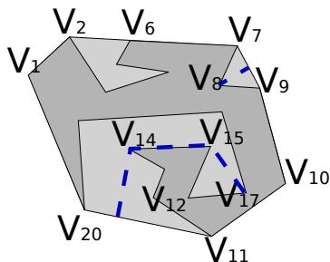  
Figure 8: Concepts used for decomposition of a polygon: convex hull, pocket, bridge and shortest path.

say, to introduce boundaries issued from those singular vertices.

To introduce the basic principles of the chosen polygon partitioning technique1, let us consider that the input polygon $P = \{ v _ { i } \} _ { i \in [ 1 , N ] }$ of $N$ vertices has no hole. For each vertex $v _ { i }$ of the polygon, a concavity measure is computed. If a vertex is located on the convex hull $C H ( P )$ , the smallest convex polygon containing $P$ , this value is null. Quantifying the concavity only arises for concave parts of the polygon, called pockets. A pocket is defined by all consecutive vertices that do not belong to the convex hull. A bridge is a convex hull edge that connect two non-adjacent vertices $v _ { i }$ and ${ v } _ { k }$ with $\operatorname* { m i n } \left\{ | i - k | _ { m o d \ N - 1 } , | k - i | _ { m o d \ N - 1 } \right\} > 1$ . Figure 8 illustrates these concepts.

# 5.2.1 Measuring concavity

Popular measures of the convexity of a polygon include ratio of its perimeter or area with respect to the one of its convex hull. They can be viewed as similarity measures. Nevertheless, none of these two measures are good enough for the present application since they characterize the global convexity of the shape while we aim to identify local irregularities. An alternative solution consists in characterizing how deep are its pockets. The concavity of a polygon is defined by the maximum value of the distance from one point of the bridge to the points of the corresponding pocket.

We can characterize this distance with the euclidean distance between this vertex and its orthogonal projection on the bridge associated to the pocket. However, while being more expensive to evaluate, the shortest path between the vertex and the bridge really seems to better fit our needs.

# 5.2.2 Diagonal selection

Whenever a polygon $P$ is regarded as non-convex (i.e. its convexity measure is above a given threshold), we split this polygon using a segment issued from the vertex $v _ { b } \in P$ that gets the maximum concavity value. The other extremity $v _ { e } \in \mathcal Ḋ P Ḍ$ of this diagonal is chosen by optimizing a function which is domain dependent. For our purpose, since rooms are supposed to be rectangular shapes, we propose in this paper to set $v _ { e }$ as the vertex that maximizes the following expression :

$$
\frac { 1 + \gamma ( b , k ) } { 1 + \sin ( \operatorname* { m a x } \left\{ \theta _ { b - 1 , b , k } , \theta _ { k , b , b + 1 } , \theta _ { b , k , k + 1 } , \theta _ { b , k , k - 1 } \right\} ) \| \overrightarrow { v _ { k } v _ { b } } \| }
$$

where $\left[ v _ { k } v _ { b } \right] \cap P = \emptyset$ and

$$
\theta _ { a , b , c } = \operatorname* { m i n } \left\{ \pi \pm { \widehat { v _ { a } , v _ { b } , v _ { c } } } , { \frac { \pi } { 2 } } \pm { \widehat { v _ { a } , v _ { b } , v _ { c } } } , \right\}
$$

$$
\gamma ( b , k ) = \left\{ \begin{array} { l l } { \begin{array} { r } { \mathrm { ~ 0 ~ } \qquad \mathrm { i f ~ } [ v _ { k } v _ { b } ] \mathrm { ~ d o e s ~ n o t ~ i n t e r s e c t ~ a r } } \\ { \mathrm { ~ d o o r ~ h y p o t h e s i s ~ c o m p o n e n t ~ } d h } \\ { \frac { [ | P _ { \perp } ( b ) P _ { \perp } ( k ) ] \cap [ d h _ { j } ] | } { | b k | } \frac { | d h _ { j } | } { | d h _ { j } | + | m i d ( d h _ { j } ) , ( v _ { b } v _ { k } ) | } } \end{array} } \end{array} \right.
$$

Omitting the function $\gamma ( , )$ , such an expression enables to favor close point and straight or right angles around extremities of the separation. Using the function $\gamma ( , )$ , a diagonal that is both nearly parallel to and of the same length than, one of the segment defining a door hypothesis appears to be a more attractive solution.

# 5.2.3 Resolving holes

Whenever holes exist, the preliminary step is to link them to the outer boundary of the polygon. Intuitively, an appealing simplification of a polygon with one hole $H$ may be obtained making this hole growing along the main directions observed at its two extremities. Those extremities correspond to the couple of vertices that leads to the geodesic of the shape $H$ . We estimate these points by identifying the longest path in the tree associated to the straight skeleton of $H$ . Figure 9 illustrates this process when a single hole exists. After resolution, we obtain a pocket for which the bridge is degenerated (its extremities are equals). When multiple holes are given, the ranking of hole resolutions is obtained considering the concavity measure associated to the potential pockets in ascending order.

Regarding computational cost, ignoring the concavity evaluation, decomposing a polygon $P$ of $N$ vertices having $k$ holes into $m$ components takes $\mathcal { O } ( N r )$ with $r = m + k$ . The approach has been implemented using the algorithm described in [6] to compute visibilities and adapted, especially to deal with degenerated cases (e.g. collinear vertices and non simples polygons) with the CGAL library [3].

As Lien and Amato specified in their paper, the quality of the decomposition heavily relies on the ranking of nonconvex vertices. Because this process is applied on data obtained from a vectorization process, some intuitive separations may be missing (e.g. at figure 10). Indeed, once the first extremity of the diagonal has been selected, the only vertices evaluated as the second extremity are those initially present in the definition of $P$ . Instead of introducing additional points in the polygon during this process, we have defined some post-processing steps to recover nearly rectangular shapes corresponding to the rooms.

# 5.3 Post-processing

Rooms have mainly rectangular shapes, from which some small components – corresponding often to cupboards – may have been removed or added. Thus, identifying the fitting rectangle of a region enables us to introduce new measures to evaluate whether a room has been over-segmented or not. The computation of a shape’s orientation can be used to define a local frame of reference. Among existing approaches, techniques relying on geometric moments and principal component analysis are popular solutions when working on arbitrary shapes, that is to say, when no reference shapes are available [13]. In this study, we identify the encasing rectangle of a region to establish the quality of the segmentation.

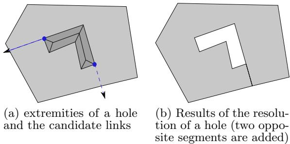

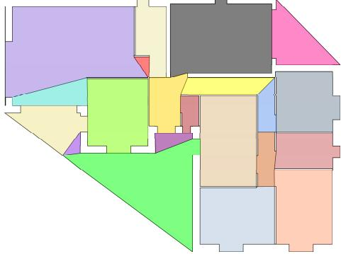  
Figure 9: Simplification of a polygon having a hole.   
Figure 10: Results of the polygon partitioning method.

We adapt the principle of Minimum Area Encasing Rectangle ([5]) optimizing the following formula over $\mathcal { V } = \{ v _ { i } \} \subseteq \mathcal { S }$ to recover the orientation of the encasing rectangle:

$$
\arg \operatorname* { m a x } _ { { v _ { i } } } \sum _ { v _ { j } \in \mathcal { V } } \operatorname* { m i n } \{ | \overrightarrow { w _ { i } } . \overrightarrow { v _ { j } } | , \left| \overrightarrow { h _ { i } } . \overrightarrow { v _ { j } } \right| \}
$$

where $\overrightarrow { w _ { i } }$ , respectively $\overrightarrow { h _ { i } }$ , stands for the collinear, respectively orthogonal, vector to $\overrightarrow { v _ { i } }$ obtained identifying the encasing rectangle of $s$ from which one side is parallel to $\overrightarrow { v _ { i } }$ . Using such a formulation, we select the coordinates system on which the total sum of the length of visible boundary’s segments projections is maximal. The purpose of restricting $s$ to $\nu$ is two-fold : i. inner parts of a room are regarded as spurious details and ii. outer boundary components of a room are only reliable if we are confident on their location. Since the previous decomposition may leads to an over-segmentation of the building, the only outer boundary components involved in this computation are those obtained from the wall detection.

We characterize i. the area-ratio of a polygon and ii. the length of the longest virtual segment w.r.t. the fitted rectangle for external regions. We recursively removed those that do not seem to be well approximated by the reference shape.

# 6. EVALUATION

In this section, we focus on the experimental evaluation of our room detection method. We first present the corpus of documents that we have used for this evaluation. Then, we show some qualitative results. Finally, we highlight the experimental protocol we have chosen for quantitative evaluation and discuss the performances of our method.

6.1 Corpus of architectural floor plan images In order to evaluate our method on a realistic way, we have obtained a set of documents from an architectural office2. These documents cover a period of more than ten years and are supposed to represent the variations that have appear in terms of graphical conventions and construction (at least for that office). The corpus contains floor plans images from both houses and flats.

Sources images are in color; in fact, these colors are used to locate the rooms in the floor plan. In order to design a system that is as generic as possible, we have not exploited this information in our room detection method (colors are usually rare in floor plan images) and have worked directly on the result of the binarisation of the images. However, we have exploited these colors for our labeling process, because they explicit our ground truth. We have manually labeled each image of the database (about 90) by defining, with a sequence of clics, the polygon defining the interior sides of each room. Thanks to this manual process, we are fully aware of the difficulty and the subjectivity of the task: it is sometimes impossible, without using the color information, to deduce the limits between one room and another. We believe that it is essential to keep this in mind when considering the results of a room detection method.

# 6.2 Quantitative evaluation

In this study, the semi-automatic interpretation task of architectural documents may lead to a predefined set of the main objects users deal with, that is to say rooms. In a perfect way, the overall set of rooms has to be extracted automatically. Both the number of rooms and theirs individual descriptions (location of walls, doors and windows) can be inaccurate. User may have to correct them manually. To evaluate the errors of our proposal, we have followed the protocol of Phillips and Chhabra [11] that has been adapted by several authors for evaluation tasks (e.g. [1]). This one fits our needs since individual errors are enumerated. Indeed, overlapping area criteria is confined to the search of the best alignment between ground truth regions defined manually and the ones of our prototype. In this ongoing project, we currently think that the number of error-correcting interactions of users is the only feature to be evaluated, leaving from outside the cost of each of the edit operation. From a series of 80 summary plans, from which cotations are notably missing, we obtain the performances summarized in table 1 from the identification task of rooms’ boundaries. As this table reads, we over-segmented most of the floor plans. While being interesting to reduce this kind of error, we believe it is easier for a user to merge regions rather than specifying manually the separation between two distinct rooms. Filtering regions, located outside of a dwelling, that is to say regions that do not correspond to any room, is error-prone: true-positive are deleted (figure 11). We recall that, without any colorimetric information, splitting open rooms may fall into subjective decisions. For some floor plans, the text layer, on which dimensioning informations are provided, may help us to select the right separation.

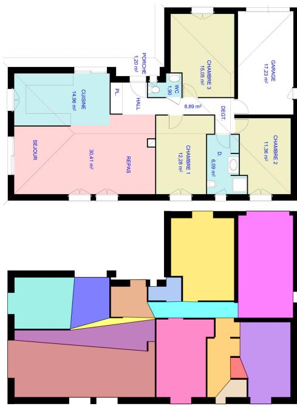  
Figure 11: Examples of results: on the top, the original floor plan images; on the bottom, the room $\&$ wall segmentation.

<table><tr><td rowspan=1 colspan=1></td><td rowspan=1 colspan=1>Average</td><td rowspan=1 colspan=1>Standarddeviation</td></tr><tr><td rowspan=1 colspan=1>Numberof rooms</td><td rowspan=1 colspan=1>9.32</td><td rowspan=1 colspan=1>0.32</td></tr><tr><td rowspan=1 colspan=1>Numberof regions</td><td rowspan=1 colspan=1>15.32(19.00)</td><td rowspan=1 colspan=1>0.58(0.64)</td></tr><tr><td rowspan=1 colspan=1>1- *×-1</td><td rowspan=1 colspan=1>2 (1.94)0.76 (0.88)</td><td rowspan=1 colspan=1>0.15 (0.17)0.14 (0.17)</td></tr><tr><td rowspan=1 colspan=1>DetectionRate</td><td rowspan=1 colspan=1>85 %(87.9 %)</td><td rowspan=1 colspan=1>1.6 %(1.3%)</td></tr><tr><td rowspan=1 colspan=1>RecognitionRate</td><td rowspan=1 colspan=1>69 %(53.8 %)</td><td rowspan=1 colspan=1>1.8 %(1.7%)</td></tr></table>

Table 1: Performances obtained following the protocol in [11] on the overall dataset. Results between parenthesis concern performances obtained without post-processing.   
Table 2: Performances obtained following the protocol in [11] on floor plan having a single floor.   

<table><tr><td rowspan=1 colspan=1></td><td rowspan=1 colspan=1>Average</td><td rowspan=1 colspan=1>Standarddeviation</td></tr><tr><td rowspan=1 colspan=1>Numberof rooms</td><td rowspan=1 colspan=1>9.89</td><td rowspan=1 colspan=1>0.4</td></tr><tr><td rowspan=1 colspan=1>Numberof regions</td><td rowspan=1 colspan=1>20.68</td><td rowspan=1 colspan=1>0.89</td></tr><tr><td rowspan=1 colspan=1>1- **- 1</td><td rowspan=1 colspan=1>2.160.94</td><td rowspan=1 colspan=1>0.290.27</td></tr><tr><td rowspan=1 colspan=1>DetectionRate</td><td rowspan=1 colspan=1>91.6 % %</td><td rowspan=1 colspan=1>1.8 %</td></tr><tr><td rowspan=1 colspan=1>RecognitionRate</td><td rowspan=1 colspan=1>56.6 % %</td><td rowspan=1 colspan=1>2.1 %</td></tr></table>

On figure 11, we provide a sample floor plan for which some walls are missing (vertical walls between the rooms located at the bottom-right of the plan). As reader may see, the proposed segmentation enables to retrieve almost the separation between them $:$ one error in the earliest step of the approach may be corrected later. To highlight the behaviour of the used protocol, we obtain on this image : 2 ”1 - $\star ^ { * }$ , $2 \textrm { -- } 1 \div \dots$ , a detection rate of $1 0 0 \ \%$ and a recognition accuracy of 68.75 $\%$ . As one can see, results are quite good but the recognition accuracy does not reach $7 0 \%$ . Without further knowledge, non-convex rooms may be over-segmented. In table 2, we report an other experiment yielded on a floor plans corresponding to a dwelling having a single floor. Though, no staircase is represented. Most of them are mainly ’U’ shapes in our database and a wall is detected in the concave part. While recognition rate is even lower, detection rate reaches $9 2 \ \%$ . This reads our post-processing has to be extended by a split-and-merge strategy to recover as most as possible rectangular shape.

# 7. CONCLUSION

In this article, we have presented a new method for the interpretation of architectural floor plans, and more specifically for the detection of the rooms it contains. Our approach is based on two main steps, that are the extraction of the primitives in the image (the lines and the arcs that constitute respectively the walls and the doors of the building) and the detection of the rooms that constitute it. As far as line detection is concerned, we rely on an original technique consisting in coupling a classical method based on Hough transform with a vectorization of the image. The goal is that these methods help each other in order to perform robust and efficient line detection. Some graphical properties are then exploited to deduce, from these lines, the localization of the walls in the floor plan. For room detection, we have exploited a recursive descending decomposition of the image, consisting in identifying the regions that are not homogeneous and then segment them; this process is repeated until getting quasi convex regions.

This document analysis system has been evaluated on a corpus of real documents from professional architects. We have performed a labeling of the rooms in these documents, and we have performed some experiments that show the pertinence of the method we have designed.

There are many perspectives to these works. The first one is of course to evaluate and improve their genericity in order to increase the graphical conventions our method is able to deal with. The second perspective is to take more strongly into account the final user of the system. This will first require the design of a graphical interface in order to allow a user to correct the errors of the system. The performances of such a system should be quantified depending on the effort asked to the user on post-processing.

# 8. REFERENCES

[1] Antonacopoulos, A., Gatos, B., Bridson, D.: Icdar2007 page segmentation competition. In: Proc. of the Int. Conference on Document Analysis and Recognition (ICDAR’07), pp. 1279–1283 (2007)   
[2] Aoki, Y., Shio, A., Arai, H., Odaka, K.: A prototype system for interpreting hand-sketched floor plans. In: Proc. of the Int. Conference on Pattern Recognition (ICPR ’96), pp. 747–750 (1996)   
[3] CGAL: Computational Geometry Algorithms Library. Http://www.cgal.org   
[4] Dosch, P., Tombre, K., Ah-Soon, C., Masini, G.: A complete system for the analysis of architectural drawings. Int. Journal on Document Analysis and Recognition 3(2), 102–116 (2000)   
[5] Freeman, H., Shapira, R.: Determining the minimum-area encasing rectangle for arbitrary closed curve. Communications of ACM 18, 409–413 (1975)   
[6] Hipke, C.A.: Computing visibility polygons with leda (1996)   
[7] Koutamanis, A., Mitossi, V.: Automated recognition of architectural drawings. In: Proc. of the Int. Conference on Pattern Recognition (ICPR’92), pp. 660–663 (1992) [8] Lien, J.M., Amato, N.M.: Approximate convex decomposition of polygons. Computational Geometry 35, 100–123 (2006)   
[9] Llad´os, J., L´opez-Krahe, J., Mart´ı, E.: A system to understand hand-drawn floor plans using subgraph isomorphism and hough transform. Machine Vision and Applications 10(3), 150–158 (1997)   
[10] Lu, T., Tai, C.L., Su, F., Cai, S.: A new recognition model for electronic architectural drawings. Computer Aided Design 37(10), 1053–1069 (2005)   
[11] Phillips, I., Chhabra, A.K.: Empirical performance evaluation of graphics recognition systems. IEEE Trans. Pattern Anal. Mach. Intell. 21(9), 849–870 (1999)   
[12] Rendek, J., Masini, G., Dosch, P., Tombre, K.: The search for genericity in graphics recognition applications: Design issues of the qgar software system. In: Proc. of the IAPR Int. Workshop on Document Analysis Systems, LNCS, vol. 3163, pp. 366–377. Springer Verlag (2004)   
[13] Revaud, J., Lavoue, G., Baskurt, A.: Improving zernike moments comparison for optimal similarity and rotation angle retrieval. IEEE Trans. Pattern Anal. Mach. Intell. 31(4), 627–636 (2009)   
[14] Rosin, P.L., West, G.A.W.: Segmentation of edges into lines and arcs. Image Vision Comput. 7(2), 109–114 (1989)   
[15] Ryall, K., Shieber, S., Marks, J., Mazer, M.: Semi-automatic delineation of regions in floor plans. In: Int. Conference on Document Analysis and Recognition (ICDAR’95), pp. 964–969 (1995)   
[16] Salembier, P., Garrido, L.: Binary partition tree as an efficient representation for image processing, segmentation, and information retrieval. IEEE Trans. Image Processing 9(4), 561–576 (2000)