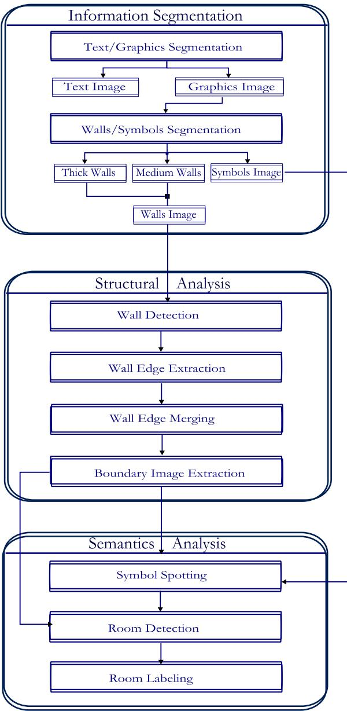
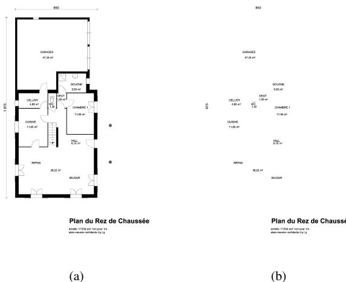
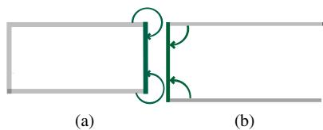
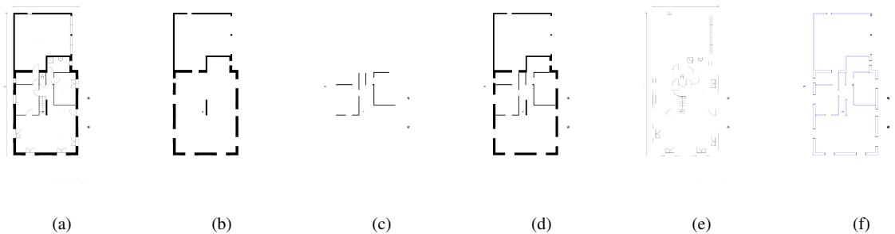
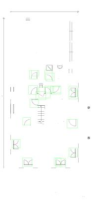
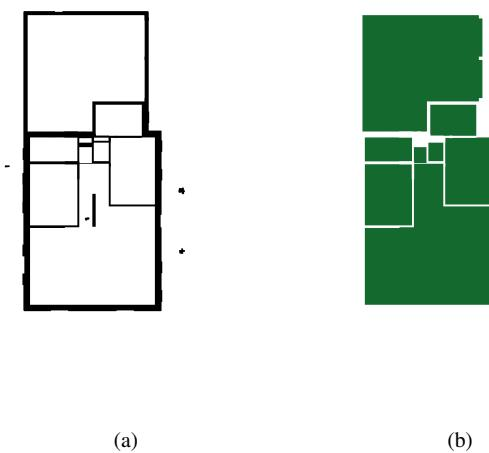

# Improved Automatic Analysis of Architectural Floor Plans

Sheraz Ahmed∗†, Marcus Liwicki∗, Markus Weber∗†, Andreas Dengel∗† ∗ German Research Center for AI (DFKI) Knowledge Management Department, Kaiserslautern, Germany {firstname.lastname}@dfki.de † Knowledge-Based Systems Group, Department of Computer Science, University of Kaiserslautern, P.O. Box 3049, 67653 Kaiserslautern,Germany

Abstract—This paper proposes a novel complete system for automated floor plan analysis. Besides applying and improving state-of-the-art processing methods, we introduce novel preprocessing methods, e.g., the differentiation between thick, medium, and thin lines and the removal of components outside the convex hull of the outer walls. Especially the latter method increases the performance of the final system. In our experiments on a reference data set we compare our approach to other approaches available in the literature. We show that our system outperforms previous systems. The final room recognition accuracy is $79 \%$ that is $10 \%$ higher than the $69 \%$ achieved by a state-of-the-art approach from the literature.

# I. INTRODUCTION

Floor plan analysis is an extensive process where the task is to analyze a given 2D floor plan image to finally retrieve the corresponding semantic information. Usually, floor plan analysis systems consist of information segmentation, followed by structural analysis and finally, semantic information extraction and alignment. The retrieved structural and semantic information can be saved in a repository for later access depending on the desired application.

Typical application areas are the generation of 3D models of the considered floor plan [1], [2]. The main motivation of our work is to enable the search in a large repository of floor plans as described in [3]. However, the methods described in this paper can be used for any other purpose as well.

The approach described in this paper improves previously introduced approaches at several parts. It starts with a fine segmentation of different types of information available in the floor plans, so that only the required information is used by each step. Besides several improvements of the extraction and segmentation methods applied, we introduce the removal of components outside the outer walls, which significantly improves the performance.

The remainder of this paper is organized as follows. First, Section II briefly summarizes works related to this paper. Second, Section III gives an overview of the proposed method and describes the specific processing steps in more detail. Subsequently, experimental results are described in Section IV. Finally, Section V concludes the paper and gives

an outlook to future work.

# II. RELATED WORK

This section provides an overview of related work to the different techniques used in this paper. Related work can be categorized into three fields: text/graphics segmentation, symbol spotting, and complete floor plan analysis systems.

The pattern recognition community has already put a lot of effort into the segmentation of text and graphics. Several different methods have been proposed to work for different purposes [4]. For the purpose of technical drawings, [5] proposed a method to extract text strings from mixed text/graphics images. An area/ratio filter is used on the connected components and then collinear components are grouped together. Subsequently, a logical grouping is performed to combine strings into words and phrases. Finally, a text string separation is performed. This method has been extended by [6], where additional filters were applied on the connected components. Furthermore, [6] split the images into three layers, i.e., text, graphics, and small elongated components layer.

However, a drawback of these methods is that many text components touching graphics are marked as a graphical component rather than as text. In most technical drawings, images, text, and graphics overlay, which especially holds for map images. Therefore, [7] further improved the approach of [6] by using color information. This method can be used where text and graphics are occurring in different colors.

In this work, we decided to adopt the approach of [6], because no color information is available. In addition, we introduce some improvements to take advantage from specific properties of architectural floor plans.

Symbol spotting can be viewed as a specialized case of Content Based Image Retrieval (CBIR), where documents are retrieved given a query image. Symbol spotting does not only retrieve the document, but also aims to find the specific locations where the query image is likely to be found.

In the past, different pattern recognition techniques have been applied for symbol spotting. For example, feature based description is used by [8]. Similarly, symbol spotting based on structural representation of documents has been used by [9] and [10]. Another approach is to use a vectorial image to spot the symbol rather than using a raster image as done in [11] and [12]. A key idea of symbol spotting for specific applications is to segment the image into several parts where the desired symbols are likely to occur.

In summary different methods have been proposed for symbol spotting. Currently, there is a trend to use segmentation free rotation, scale, and translation invariant approaches as proposed in [13]. In this paper the very prominent Speeded Up Robust Features (SURF) [14] are used. This method provides a good discriminative translation, rotation, and scale invariant representation of symbols.

The specific task of floor plan analysis has been addressed already for more than 20 years. [15] proposed a method of interpreting a hand-sketched floor plan. This method focuses on understanding the hand sketched floor plan and converting it into a CAD representation. Similarly, [16] proposed a method for understanding hand drawn floor plans using subgraph isomorphism and Hough transform.

[17] presented a complete system for the analysis of architectural diagrams. Numerous automated graphics recognition processes are applied for recognizing the basic primitives. Also human feedback is used throughout the analysis phase.

[18] proposed a method to detect rooms in the architectural floor plan images. This method is adopted and expanded in this paper. We introduce new processing steps like wall edges extraction, and boundary detection. The main application area of our approach is the retrieval of similar floor plans as described in [3], where only a simple room detection method has been applied. However, the methods can be applied to any application area in the context of architectural floor plans.

# III. PROPOSED METHOD

The input data of our system is available in binary format.1

Figure 1 depicts the complete floor plan analysis process which will be described in the following. First, segmentation algorithms are applied to separate the various types of information firm one another (see Section III-A). Second, the structure of the extracted information is analyzed to retrieve the structure of the rooms (see Section III-B). Finally, a semantic analysis is applied to retrieve the functions of the rooms, respectively (see Section III-C). Note that due to space limitations this section only summarizes the main aspects of the applied approaches and those aspects which are newly introduced.. Further information about existing approaches can be found in the literature presented in Section II.

  
Figure 1: Automatic Floor Plan Analysis Workflow

# A. Information Segmentation

Floor plans contain information that collectively help an architect to express the actual dynamics of the building. During floor plan analysis, different types of information need to be interpreted at different points of time. Based on the divide and conquer strategy a process of information segmentation is performed. This division is required because information, which is not required for a specific step, is just noise and might lead to incorrect results.

The information segmentation process starts with wall detection followed by text/graphics segmentation. The initial wall detection is needed because external walls are sometimes marked as a text, creating errors during the structural analysis. External walls are removed by successively applying erosion and dilation with a $3 \times 3$ square mask. Note, that this process not only removes the external wall components but also the main title text of floor plan, which is not needed during this step. After the removal of external walls from the floor plan image, the remaining image contains only the text, medium lines, and thin lines.

The text/graphics segmentation analyzes the floor plan image and converts it into two images, i.e., one containing text only and one containing graphics. Our proposed method is based on [5] and [6]. We split the image into two layers as in [5].

The main parts of text/graphics segmentation are: thin line removal, where lines possibly overlapping with text components are removed; initial text component extraction, where small and huge connected components are eliminated based the average size the connected components; noise removal, where small components far away from other possible text components are removed; restoration of text bounding boxes, where the content of bounding boxes around text component candidates are restored; large components elimination, where components are eliminated which are two time higher and wider than the average component size; text string extraction, where text strings touching graphics are extracted; and title area restoration, where the title area which was outside the external walls is restored. Note that no further details on the text/graphics segmentation appear in this paper since this is a major topic of a second submission for this conference.

The final retrieved text extracted from Fig. 2a appears in Fig. 2b. In the following, this image is referred to as text image. In order to get the graphics image, the text image is subtracted from the original floor plan image. Figure 3a shows the graphics image extracted by the text/graphics segmentation process.

After extracting the text, our method tries to find the walls and separate them from building elements like doors, windows, etc. [17] and [18] used a thick/thin line separation algorithm for the separation of walls from the symbols. This algorithm separates the image into two images, i.e., a thick lines image containing the walls and a thin lines image containing the symbols.

We have enhanced this method by adding a third kind of lines, i.e., medium lines. This helps to retrieve the outer walls of the floor plan (as needed for the process described above). This is achieved by sequentially performing erosions followed by dilations. First it is performed three times to remove everything but the thick walls. On the resulting image it is performed only once resulting in an image of the medium walls. Figure 3 show the thick, medium, and thin walls image of the graphics image in Figure 3a.

  
Figure 2: Original floor plan image (a) and extracted text image (b)

  
Figure 4: A concave (a) and a convex (b) wall edge.

# B. Structural Analysis

Structural analysis begins with the detection of the walls from the wall image as mentioned above. Subsequently, in our proposed system contours of the walls image are extracted using the method proposed by [19], i.e., by following the borders of connected components. After contour extraction, a polygonal approximation is used to get the polygonal representation of each contour. Each polygon then represents a wall in a walls image.

The wall edges are then extracted from the detected walls to close the gaps between the walls. These gaps occur at elements like doors, windows, or sometime at gates. The process extracts all edges where those elements are likely to be found. Our approach is based on the hypothesis that those elements occur at short edges, which are convex or concave (see Figs. 4a and 4b). Figure 3f shows the extracted short wall edges from the walls image.

As a next step the gaps between the extracted edges are closed. Note, that not every gap was intended to be closed, i.e., only those gaps where windows or doors are likely to be found should be closed. Just we close only gaps according to a empirically defined thresholds $T _ { m e r g e }$ . However, gaps at the outer walls are often larger than gaps occurring at doors inside the building.

In order to merge even those larger gaps we compute the outer wall image and use boundary image of the building. To extract the building boundary a convex hull of the wall image is created, and that portion of the floor plan image is extracted which is inside the convex hull, neglecting everything outside. After extraction of this image a horizontal and vertical smearing is performed to fill the gaps between the lines corresponding to windows and gates. Then erosion and dilation is performed $n$ times. This removes all the lines, which are not part of the building structure (often they correspond to measurements). After removal of these lines we can directly extract the external contours of the image. These contours approximate the building boundary, i.e., the external walls. In our experiments described in Section IV we show the influence of this particular processing step.

  
Figure 3: Walls/symbols segmentation of the floor plan illustrated in Fig. 2a: graphics image (a), extracted thick walls (b), medium walls (c), and combined walls (d); extracted symbols (e) and walls after contour and wall edge detection (f)

# C. Semantic Analysis

The aim of semantic analysis is to extract the semantic information of the floor plan. While it is easy for a human to gather this information, its automation involves a high complexity. Semantic analysis spots different building elements in the floor plan and interprets them with respect to their context.

First, we apply a symbol spotting technique in order to detect the doors of the floor plan. In this paper we use the speeded up robust features (SURF) [14], which is a robust, translation, rotation, and scale invariant representation method. It first extracts the key points/points of interest from the image. Then each key point is represented by a discriminative descriptor. A standard door image serves as a reference template for SURF. Mainly arc is detected by SURF, therefore it able to detect both left and right doors .

  
Figure 5: Spotted door and window symbols.

Figure 5 shows the extracted positions of windows and doors. Note that some erroneous symbols have been extracted by our approach. At a later step these symbol positions are matched with the gaps found during wall edge detection. Only those results which overlap with gates are taken into account as actual doors. Figure 6a shows the image where the gaps at the doors are closed.

To detect the rooms, the image with the closed gaps is inverted. Each connected component refers to a room. The detected rooms can be found in Figure 6b.

The rooms are finally labeled by using the text labels which have been extracted during text/graphics segmentation. Therefore we perform $\mathrm { O C R } ^ { 2 }$ on the texts which are inside the detected rooms. If there is no text found in the room then it is marked as unknown room. In the case of two text labels, only this one is chosen which is closer to the center of the room. Note that at this point there is room left for improvements for future systems, i.e., the room might be split into two parts.

# IV. EVALUATION

Our system is evaluated using a data set containing original floor plan images. This data set was introduced in [18] and contains the floor plan images from the period of more the ten years. The size of each floor plan image in the data set is $2 4 7 9 \times 3 5 0 8$ . All floor plans are binarized to ensure that only structural information of the floor plans is used for the analysis (and not the color information).

  
Figure 6: Room detection: floor plan image after closing the gaps at doors and windows (a) and the final room detection result (b)

Table I: Room Detection results   

<table><tr><td></td><td>[18]</td><td>Proposed</td><td>Without boundary det.</td></tr><tr><td>Detection rate (%)</td><td>85</td><td>89</td><td>70.63</td></tr><tr><td>Rec. accuracy (%)</td><td>69</td><td>79</td><td>82.32</td></tr><tr><td>One to many count</td><td>2</td><td>1.50</td><td>0.96</td></tr><tr><td>Many to one count</td><td>0.76</td><td>1.65</td><td>1.11</td></tr></table>

In order to report the accuracy of our system, we use the protocol introduced by [20]. It allows reporting exact match (one to one) as well as partial matches (one to many and many to one). For further details refer to [20].

Table I shows the results of rooms detection over the series of 80 floor plan images dataset. The overall detection rate is $89 \%$ which is $4 \%$ higher than the $8 5 \%$ achieved in the reference system by [18]. More remarkably, the recognition accuracy has been improved by $10 \%$ . For around $20 \%$ of the images we received the recognition accuracy and detection rate both greater then $90 \%$ . In the worst case, the recognition accuracy and detection rate of our system were still $50 \%$ and $6 1 . 5 3 \%$ respectively.

A further analysis shows the influence of the boundary detection (last column in Tab. I) which was introduced in this paper. The detection rate is significantly improved.

The analysis of results in Table I reveals that our system has a good recognition accuracy and detection rate, along with less one to many count on average. This is because, a region is split in to sub region wherever a door or physical partition is found. To further reduce this over segmentation, gap closing due to doors need to be improved.

If there is no door, window, or physical partition found in the region, no division is performed, which leads to under segmentation. This trend of under segmentation can be seen in Table I, where many to one count is higher. To avoid this under segmentation a detailed semantic analysis is required, so that a large region can be split based on the measurement and text information available in the floor plan.

# V. CONCLUSION AND FUTURE WORK

In this paper we proposed a complete system for automatic floor plan analysis. Our system builds on stateof-the-art methods and improves them at several steps in order to benefit from the specific properties of floor plans. Furthermore, we introduced novel processing steps, like the outer wall detection and a novel medium line extraction.

Our system has been evaluated on a database from the literature. We outperform previous state-of-the-art methods and achieve a perfect recognition rate on several documents. Our experiments have shown that the proposed method works very well on a large corpus of 90 floor plans. However, in practice more different types of floor plans exist. We will adopt our methods to other types of plans in our future work.

Possible improvements for future work consist of normalization of the contours and removing graphical elements outside the outer walls. Furthermore, a weak point of our approach is that it is only able to find the physical existent rooms. This means that if there is a large region and there is no wall with in this region, it will be marked as single room. However, architects tend to divide those rooms still into several functional rooms. This division can be achieved by a more sophisticated semantic analysis.

# ACKNOWLEDGMENT

The authors of this paper like to thank Joseph Llados and the members of the CVC for providing us the reference data set. This work was financially supported by the ADIWA project.

# REFERENCES

[1] P. Dosch and G. Masini, “Reconstruction of the 3d structure of a building from the 2d drawings of its floors,” Document Analysis and Recognition, International Conference on, vol. 0, p. 487, 1999.   
[2] T. Lu, H. Yang, R. Yang, and S. Cai, “Automatic analysis and integration of architectural drawings,” International Journal on Document Analysis and Recognition, vol. 9, pp. 31–47, 2007, 10.1007/s10032-006-0029-6.   
[3] M. Weber, M. Liwicki, and A. Dengel, “a.SCAtch - A Sketch-Based Retrieval for Architectural Floor Plans,” in 12th International Conference on Frontiers of Handwriting Recognition., 2010, pp. 289–294.   
[4] T. V. Hoang and S. Tabbone, “Text extraction from graphical document images using sparse representation,” in Proceedings of the 9th IAPR International Workshop on Document Analysis Systems, ser. DAS ’10. New York, NY, USA: ACM, 2010, pp. 143–150.

[5] L. Fletcher and R. Kasturi, “A Robust Algorithm for Text String Separation from Mixed Text/Graphics Images,” IEEE Transactions on Pattern Analysis and Machine Intelligence, vol. 10, pp. 910–918, 1988.

[6] K. Tombre, S. Tabbone, L. Plissier, B. Lamiroy, and P. Dosch, “Text/graphics separation revisited,” in Document Analysis Systems V, ser. Lecture Notes in Computer Science, D. Lopresti, J. Hu, and R. Kashi, Eds. Springer Berlin / Heidelberg, 2002, vol. 2423, pp. 615–620.

[7] P. P. Roy, J. Llados, and U. Pal, “Text/Graphics Separation in Color Maps,” International Conference on Computing: Theory and Applications, vol. 0, pp. 545–551, 2007.

[18] S. Mace, H. Locteau, E. Valveny, and S. Tabbone, “A ´ system to detect rooms in architectural floor plan images,” in Proceedings of the 9th IAPR International Workshop on Document Analysis Systems, ser. DAS ’10. New York, NY, USA: ACM, 2010, pp. 167–174.

[19] S. Suzuki and K. be, “Topological structural analysis of digitized binary images by border following,” Computer Vision, Graphics, and Image Processing, vol. 30, no. 1, pp. 32 – 46, 1985.

[20] I. Phillips and A. Chhabra, “Empirical performance evaluation of graphics recognition systems,” Pattern Analysis and Machine Intelligence, IEEE Transactions on, vol. 21, no. 9, pp. 849 –870, Sep. 1999.

[8] S. Belkasim, M. Shridhar, and M. Ahmadi, “Pattern recognition with moment invariants: A comparative study and new results,” Pattern Recognition, vol. 24, no. 12, pp. 1117 – 1138, 1991.

[9] J. Lladoos, E. Mart ´ ´ı, and J. J. Villanueva, “Symbol recognition by error-tolerant subgraph matching between region adjacency graphs,” IEEE Trans. Pattern Anal. Mach. Intell., vol. 23, pp. 1137–1143, October 2001.

[10] L. Yan and L. Wenyin, “Engineering drawings recognition using a case-based approach,” in Proceedings of the Seventh International Conference on Document Analysis and Recognition - Volume 1, ser. ICDAR ’03. Washington, DC, USA: IEEE Computer Society, 2003, pp. 190–.

[11] B. T. Messmer and H. Bunke, “Automatic learning and recognition of graphical symbols in engineering drawings,” in Selected Papers from the First International Workshop on Graphics Recognition, Methods and Applications. London, UK: Springer-Verlag, 1996, pp. 123–134.

[12] M. Rusinol, J. Llad ˜ os, and G. S ´ anchez, “Symbol spotting ´ in vectorized technical drawings through a lookup table of region strings,” Pattern Analysis and Applications, vol. 13, no. 3, pp. 321–331, 2010.

[13] H. Y. Kim and S. A. de Arajo, “Rotation, scale and translation-invariant segmentation-free shape recognition,” 2006.

[14] H. Bay, A. Ess, T. Tuytelaars, and L. Van Gool, “Speededup robust features (surf),” Comput. Vis. Image Underst., vol. 110, pp. 346–359, June 2008.

[15] Y. Aoki, A. Shio, H. Arai, and K. Odaka, “A prototype system for interpreting hand-sketched floor plans,” in Pattern Recognition, 1996., Proceedings of the 13th International Conference on, vol. 3, Aug. 1996, pp. 747 –751 vol.3.

[16] J. Llads, J. Lpez-Krahe, and E. Mart, “A system to understand hand-drawn floor plans using subgraph isomorphism and hough transform,” Machine Vision and Applications, vol. 10, pp. 150–158, 1997, 10.1007/s001380050068.

[17] P. Dosch, K. Tombre, C. Ah-Soon, and G. Masini, “A complete system for the analysis of architectural drawings,” International Journal on Document Analysis and Recognition, vol. 3, pp. 102–116, 2000, 10.1007/PL00010901.