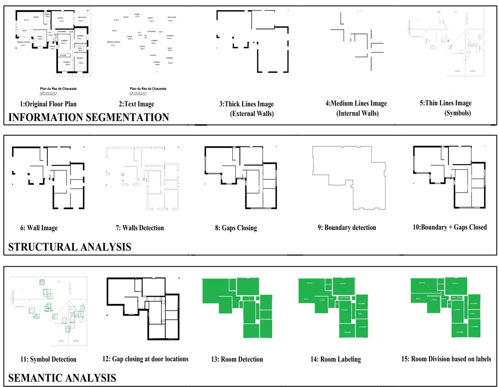
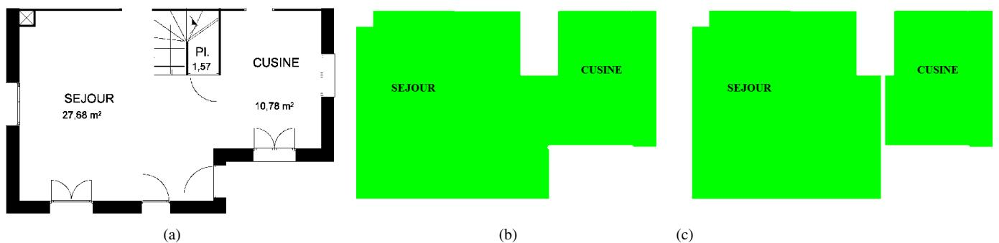
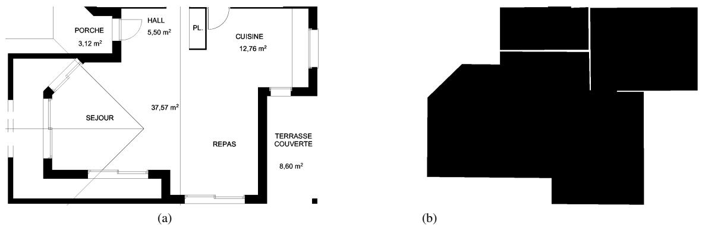

# Automatic Room Detection and Room Labeling from Architectural Floor Plans

Sheraz Ahmed∗†, Marcus Liwicki∗, Markus Weber∗†, Andreas Dengel∗† \* German Research Center for AI (DFKI) Knowledge Management Department, Kaiserslautern, Germany {firstname.lastname}@dfki.de † Knowledge-Based Systems Group, Department of Computer Science, University of Kaiserslautern, P.O. Box 3049, 67653 Kaiserslautern,Germany

Abstract—This paper presents an automatic system for analyzing and labeling architectural floor plans. In order to detect the locations of the rooms, the proposed systems extracts both, structural and semantic information from given floor plans. Furthermore, OCR is applied on the text layer to retrieve the meaningful room labeling. Finally, a novel post-processing is proposed to split rooms into several sub-regions if several semantic rooms share the same physical room. Our fullyautomatic system is evaluated on a publicly available dataset of architectural floor plans. In our experiments, we could clearly outperform other state-of-the-art approaches for room detection.

Keywords-floor plan analysis; structure analysis; architecture; wall detection; symbol spotting; room detection;

# I. INTRODUCTION

Image analysis and image understanding are considered as important areas of research in the pattern recognition community. Floor plan analysis can be viewed as a special case of image analysis and image understanding. In floor plan analysis the goal is to extract different structural and semantic aspects of a building by analyzing the 2D image of the floor plan. In the past, various efforts have been made to analyze a given floor plan for different purposes, e.g., [1], [2], [3] analyze the floor plans for generation of 3D models, [4] focused generation of corresponding CAD format for a given floor plan. In [5], [6] floor plan analysis is performed to detect rooms and their connectivity topology. Similarly, in [7] the aim is to enable the search in a large repository of floor plans.

This paper presents an extension of the work presented in [8] with an emphasis on semantic analysis. First, the semantics are extracted taking also the room labels into account in order to find the functions of the detected rooms. This information is finally used for correction of room detection errors.

The remainder of this paper is organized as follows. First, Section II briefly summarizes other work related to this paper. Second, Section III gives an overview of the proposed method and describes the specific processing steps in more detail. Subsequently, experimental results are described in

Section IV. Finally, Section V concludes the paper and gives an outlook to future work.

# II. RELATED WORK

The specific task of floor plan analysis has been addressed already for more than 20 years. [4] proposed a method of interpreting a hand-sketched floor plan. This method focuses on understanding the hand sketched floor plan and converting it into a CAD representation. Similarly, [9] proposed a method for understanding hand drawn floor plans using subgraph isomorphism and Hough transform. [10] presented a complete system for the analysis of architectural diagrams. Numerous automated graphics recognition processes are applied for recognizing the basic primitives. Also human feedback is used throughout the analysis phase.

[5] proposed a method to detect rooms in the architectural floor plan images. This method is adopted and expanded in this paper. We introduce new processing steps like wall edges extraction, and boundary detection. The main application area of our approach is the retrieval of similar floor plans as described in [7], where only a simple room detection method has been applied. However, the methods can be applied to any application area in the context of architectural floor plans. [11] focused on detection of walls from floor plan image. These detected walls can be used for different purposes during the complete floor plan analysis like 3D reconstruction or building boundary construction.

# III. FLOOR PLAN ANALYSIS SYSTEM

The input data of our system is available in binary format.1 Figure 1 depicts the complete flow of our floor plan analysis system which will be described in the following. The analysis process starts with fine segmentation which separate the various types of information from one another (see Section III-A). Leading to information segmentation is structural analysis which aims to retrieve the structure of the rooms (see Section III-B). Finally, a semantic analysis is applied to enhance the results of structural analysis and to find functions of detected rooms, respectively (see Section III-C). Note that due to space limitations this section only summarizes the main aspects of the applied approaches and elaborates more on aspects which are newly introduced in this work. Further information about the existing approach can be found in [8].

  
Figure 1: Automatic Room Detection and Room Labeling Workflow

# A. Information Segmentation

Floor plans contain information that collectively help an architect to express the actual dynamics of the building. During floor plan analysis, different types of information need to be interpreted at different points of time. Information segmentation perform fine segmentation of different type of information available in floor plan images e.g., walls, symbols, text etc. First, text/graphics segmentation is performed using the methods presented in [12]. Figure 1.2 shows the text image extracted by the text/graphics segmentation process. The graphics image resulted from text/graphics segmentation is then further segmented into thick (Figure 1.3), medium (Figure 1.4) and thin (Figure 1.5) lines image as described in [8]. Thick line image is later used to construct the boundary of the building (Figure 1.9). However, the overall building structure is represented by the walls, therefore thick and medium lines are grouped together to get the walls image (Figure 1.6).

# B. Structural Analysis

The aim of structural analysis is to extract as much structural information as possible using previously segmented information. Wall detection is performed on the walls image by extracting the contours using method proposed by [13] and performing polygonal approximation. The wall edges (Figure 1.7) are then extracted from the detected walls to close the gaps between the walls, which occur due to doors, windows, or sometime at gates. To extract these edges convex/concave hypothesis [8] is used.

As a next step the gaps between the extracted edges are closed. Note, that here focus is to close only those gaps where windows or doors are likely to be found based on empirically defined thresholds $T _ { m e r g e }$ . Boundary image is mergethen generated using the thick lines image from information segmentation. Combining boundary image with the gaps closed walls image give us an overall structure of the complete building, where almost all the gaps on the outer walls as well as most of the gaps due to doors and windows inside the building are closed. Still the gaps greater then $T _ { m e r g e }$ were not closed. To get the actual bounds of rooms mergeit is necessary to close all the gaps, especially due to doors. The focus of this paper is on semantic analysis, for more details on structural analysis see [8]. In Section III-C semantic analysis is used to close these remaining gaps.

# C. Semantic Analysis

The aim of semantic analysis is to extract the semantic information of the floor plan. Semantic analysis spots different building elements in the floor plan and interprets them with respect to their context. To close the remaining gaps from structural analysis, we apply a symbol spotting technique in order to detect the doors in the floor plan. The speeded up robust features (SURF) [14], which is a robust, translation, rotation, and scale invariant representation method is used to locate the door symbols in the floor plans.

Figure 1.11 shows the extracted positions of windows and doors. Note that some erroneous symbols have been extracted by our approach. At a later step these symbol positions are matched with the gaps found during wall edge detection. Only those results which overlap with edges are taken into account as actual doors. Figure 1.12 shows the image where the gaps at the doors are closed.

To detect the actual bounds of rooms, the image with the closed gaps is inverted and connected component analysis is performed on it. Each of the connected component is referred as room. The detected rooms can be found in Figure 1.12.

After detection of rooms the next step is to define there functions like WC, Living room etc. In order to find the function of each room, the text layer from the information segmentation as well as the connected component of the room is used. In particular, all text components which lie in the boundary of a room are taken into account. After extraction of the room text, horizontal and vertical smearing is performed on the extracted text to merge the neighboring characters, resulting in the bounds for words. Using the bounding boxes all the words are rotated to a horizontal direction and OCR is performed on them. The $\mathrm { O C R } ^ { 2 }$ result is then compared to rooms title dictionary and the closest title according to the Levenshtein distance is assigned to the room. Note that before applying dictionary, all the digits and special characters are removed from the OCR result.

After assigning label to rooms, novel post-processing is performed. This post-processing splits rooms into several sub-regions based on detected labels. The rooms which do not have any physical partition may contain more than one label. Some of these labels represent the function of rooms whereas other refer to items in rooms, e.g., cupboard/lockers etc. Rooms which contain more than one function label are selected for further splitting, e.g., the detected room in Figure 2b has two function labels. To further split rooms into several regions we select one label and look for a label in its neighborhood. Both horizontal and vertical distances between the selected labels are calculated. If the horizontal distance between labels is greater, horizontal splitting is performed at the middle of both labels, otherwise vertical splitting is performed. This process of partitioning is repeated until all rooms have one label.

Splitting of room with more than one function labels into several regions is very subjective. The room in Figure 3 has more than one function labels, but still in ground truth it is marked as single room, whereas Figure 2 shows the case where the ground truth is divided into several rooms.

After splitting rooms into several sub-regions, the next step is to merge those regions which do not have any room label. Each region which do not have any label is merged with neighboring room which is aligned with it. Figure 1.15 shows the rooms after splitting and merging.

# IV. EVALUATION

Our system is evaluated using a data set containing original floor plan images. This data set was introduced in [5] and contains the floor plan images from the period of more than ten years. The size of each floor plan image in the data set is $2 , 4 7 9 \times 3 , 5 0 8$ . All floor plans are binarized to ensure that only structural information of the floor plans is used for the analysis (and not the color information).

In order to report the accuracy of our system, we use the protocol introduced by [15]. It allows reporting exact match (one to one) as well as partial matches (one to many and many to one). For further details refer to [15].

Table I shows the results of rooms detection over the series of 80 floor plan images dataset. The overall detection rate when no semantic division is performed is $89 \%$ which is $4 \%$ higher than the $8 5 \%$ achieved in the reference system by [5]. More remarkably, the recognition accuracy has been improved by $10 \%$ . For around $20 \%$ of the images we received the recognition accuracy and detection rate both greater then $90 \%$ . In the worst case, the recognition accuracy and detection rate of our system were still $50 \%$ and $6 1 . 5 3 \%$ respectively.

In case of semantic division the overall detection rate is the same as in [5], whereas recognition accuracy is improved by $13 \%$ . In this case our detection rate is decreased from $89 \%$ to $8 5 \%$ because of the subjective nature of rooms which do not have any partition. Figure 3 shows the case where more function labels are present but still in ground truth it is marked as single room.

  
Figure 2: Room Spliting: Room part from original floor plan image(a) Room detection and labeling (b) Room Spliting using labeling results(c)

  
Figure 3: Room Spliting: Ambigous case. Original image with more than one label(a) Ground truth with no partition(b)

Further analysis of results in Table I reveals that our system has a good recognition accuracy and detection rate, along with less one to many count on average. This is because, a region is split in to sub region wherever a door or physical partition is found. Our one to many count is further reduced by performing the semantic division, because now the rooms which have more than one function are split in to several sub regions. Our many to one count is higher because of ambiguous nature of rooms with more than one label. To further reduce it floor plan ontologies can be used.

Table II shows the results of room labeling over the series of 80 floor plan images dataset. Manual evaluation is performed for room labeling, as no ground truth was available for it. The results show that more than $80 \%$ o f the rooms were correctly labeled. The mislabeling are some times due to the erronus results for the text which is touching some graphic components. To reduce this mislabeling some preprocessing is required before performing OCR.

<table><tr><td>Room Labels</td><td>Numbers</td><td>Percentage(%)</td></tr><tr><td>Correct</td><td>736</td><td>82.33%</td></tr><tr><td>Wrong</td><td>158</td><td>17.67%</td></tr><tr><td>Total</td><td>894</td><td>100%</td></tr></table>

Table II: Room Labeling results

# V. CONCLUSION AND FUTURE WORK

A complete system for automatic room detection and room labeling from architectural floor plans was presented in this paper. The system applies several structural and semantic analysis steps in order to retrieve the room information. Furthermore, the system extracts the room labels to identify the functions of the rooms. The label information is also used to further split the room into functional rooms even if no physical segmentation exists.

Our system has been evaluated on a database from the literature. We outperform previous state-of-the-art methods and achieve a perfect recognition rate on several floor plans. Our experiments have shown that the proposed method works very well on a large corpus of 80 floor plans. In addition to the structural information, the text information is used to define the functions of room. Room labeling is done by using OCR results and rooms title dictionary. To improve room labeling, some preprocessing steps can be applied to remove graphic components touching text. Note that the drop of the detection rate compared to without semantic division can be explained by the ambiguity of the room splitting in the ground truth as in Section III-C.

Table I: Room Detection results   

<table><tr><td></td><td>[5]</td><td>without semantic division</td><td>with semantic division</td></tr><tr><td>Detection rate (%)</td><td>85</td><td>89</td><td>85</td></tr><tr><td>Rec. accuracy (%)</td><td>69</td><td>79</td><td>82</td></tr><tr><td>One to many count</td><td>2</td><td>1.50</td><td>1.25</td></tr><tr><td>Many to one count</td><td>0.76</td><td>1.65</td><td>1.79</td></tr></table>

We are working on using floor plan ontologies in combination with the room labeling results to correct the wrong labels, as well as to increase the overall recognition and detection accuracy and to decrease many to one count. To accommodate those floor plans which do not have any text information about the room functions, symbol spotting can be used to define the function of room.

# ACKNOWLEDGMENT

The authors of this paper like to thank Joseph Llados and the members of the CVC for providing us the reference data set. This work was financially supported by the ADIWA project.

# REFERENCES

[1] P. Dosch and G. Masini, “Reconstruction of the 3d structure of a building from the 2d drawings of its floors,” Document Analysis and Recognition, International Conference on, vol. 0, p. 487, 1999.   
[2] T. Lu, H. Yang, R. Yang, and S. Cai, “Automatic analysis and integration of architectural drawings,” International Journal on Document Analysis and Recognition, vol. 9, pp. 31–47, 2007.   
[3] S.-H. Or, K. hong Wong, Y. kin Yu, and M. M. yuan Chang, “Abstract highly automatic approach to architectural floorplan image understanding & model generation,” 2008.   
[4] Y. Aoki, A. Shio, H. Arai, and K. Odaka, “A prototype system for interpreting hand-sketched floor plans,” in Pattern Recognition, 1996., Proceedings of the 13th International Conference on, vol. 3, Aug. 1996, pp. 747 –751 vol.3.   
[5] S. Mace, H. Locteau, E. Valveny, and S. Tabbone, “A ´ system to detect rooms in architectural floor plan images,” in Proceedings of the 9th IAPR International Workshop on Document Analysis Systems, ser. DAS ’10. New York, NY, USA: ACM, 2010, pp. 167–174.   
[6] R. Wessel, I. Blumel, and R. Klein, “The room connectivity ¨ graph: Shape retrieval in the architectural domain,” in The 16- th International Conference in Central Europe on Computer Graphics, Visualization and Computer Vision’2008, V. Skala, Ed. UNION Agency-Science Press, Feb. 2008.

[7] M. Weber, M. Liwicki, and A. Dengel, “a.SCAtch - A Sketch-Based Retrieval for Architectural Floor Plans,” in 12th International Conference on Frontiers of Handwriting Recognition., 2010, pp. 289–294.

[8] S. Ahmed, M. Liwicki, M. Weber, and A. Dengel, “Improved Automatic Analysis of Architectural Floor Plans,” in 11th International Conference on Document Analysis and Recognition., 2011.

[9] J. Llados, J. Lopez-Krahe, and E. Marti, “A system to understand hand-drawn floor plans using subgraph isomorphism and hough transform,” Machine Vision and Applications, vol. 10, pp. 150–158, 1997.

[10] P. Dosch, K. Tombre, C. Ah-Soon, and G. Masini, “A complete system for the analysis of architectural drawings,” International Journal on Document Analysis and Recognition, vol. 3, pp. 102–116, 2000.

[11] G. S. Lluis-Pere de las Heras, Joan Mas and E. Valveny, “Wall Patch-Based Segmentation in Architectural Floorplans,” in 11th International Conference on Document Analysis and Recognition., 2011.

[12] S. Ahmed, M. Weber, M. Liwicki, and A. Dengel, “Text / Graphics Segmentation in Architectural Floor Plans,” in 11th International Conference on Document Analysis and Recognition., 2011.

[13] S. Suzuki and K. be, “Topological structural analysis of digitized binary images by border following,” Computer Vision, Graphics, and Image Processing, vol. 30, no. 1, pp. 32 – 46, 1985.

[14] H. Bay, A. Ess, T. Tuytelaars, and L. Van Gool, “Speededup robust features (surf),” Comput. Vis. Image Underst., vol. 110, pp. 346–359, June 2008.

[15] I. Phillips and A. Chhabra, “Empirical performance evaluation of graphics recognition systems,” Pattern Analysis and Machine Intelligence, IEEE Transactions on, vol. 21, no. 9, pp. 849 –870, Sep. 1999.