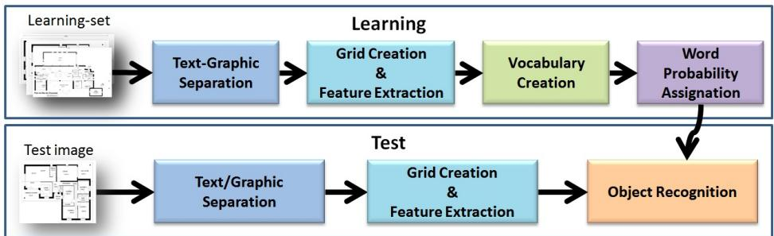
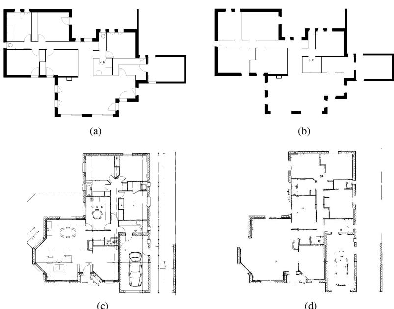

# Wall Patch-Based Segmentation in Architectural Floorplans

Llu´ıs-Pere de las Heras, Joan Mas, Gemma Sanchez and Ernest Valveny ´ Computer Vision Center – Dept. Ciencies de la Computaci \` o´ Universitat Autonoma de Barcelona \` Bellaterra, Barcelona, Spain Email: {lpheras,jmas,gemma,ernest}@cvc.uab.es

Abstract—Segmentation of architectural floorplans is a challenging task, mainly because of the large variability in the notation between different plans. In general, traditional techniques, usually based on analyzing and grouping structural primitives obtained by vectorization, are only able to handle a reduced range of similar notations. In this paper we propose an alternative patch-based segmentation approach working at pixel level, without need of vectorization. The image is divided into a set of patches and a set of features is extracted for every patch. Then, each patch is assigned to a visual word of a previously learned vocabulary and given a probability of belonging to each class of objects. Finally, a post-process assigns the final label for every pixel. This approach has been applied to the detection of walls on two datasets of architectural floorplans with different notations, achieving high accuracy rates.

Keywords-Graphics Recognition, Patch-Based Image Segmentation, Architectural Floorplans.

# I. INTRODUCTION

The interpretation of architectural drawings is an interesting topic in the domain of graphical document analysis. Many works have been addressed to this topic in the last ten years. Some of them are focused on the interpretation of the complete plan from printed designs to be able to reconstruct them in 3D, as the one presented by Dosch et al. [1]. Others, with the same purpose, are doing 3D reconstructions from sketches, as the one presented by Juchmes et al. [2]. But all of them need to vectorize the images to extract the basic components of the walls, that are the basis of the plan structure. That points out the importance of the wall notation in all the recognition process. The problem in this domain is the non-existence of a standard notation. This implies a great variability in the notation of walls in different plans. They can be formed by a single line of different widths, two or many parallel lines or even hatched patterns. Then, traditional techniques need to reformulate the whole wall segmentation process for each new notation. In this paper we propose a totally different approach to the segmentation of the structural elements of a floorplan. The approach is based on recent works on patch-based image segmentation and object localization [3], [4], [5], [6]. In this kind of approaches, the image is usually divided into a set of patches. Every patch is described with a set of visual features and these feature vectors are clustered into a visual codebook. Then, using this representation, to every patch is assigned a probability of belonging to each of the possible objects according to some probability distribution learned over a training set. Finally, this initial segmentation can be refined taking into account the neighborhood of the patch generally using Markov Fields.

In the domain of document analysis this kind of methods have been applied to the problem of page segmentation [4]. We have taken this work as a reference to develop a method for the segmentation of architectural floorpans that can overcome some of the problems of previous approaches concerning variability on the notation of the floorplans. Thus, the method can be easily adapted to work with several notations, as the visual appearance of every structural element under each different notation is automatically learned by the codebook and the probability distribution of patches. We only need to re-train the system with images of every notation without need of changing the method itself, as it happened in previous approaches. In the experiments section we will show this adaptability of the method with two different datasets of images with different notations.

This paper is organized as follows. In section II we present our patch-based approach for three different grid topologies. Then, in section III, we discuss the results obtained in two datasets specifically created to evaluate our method. Finally, the overall work is concluded.

# II. METHODOLOGY

We have implemented a bag-of-patches approach for object detection and recognition in architectural floorplans. The pipeline of the process, which is shown in figure 1, is slightly different for learning and testing. In both cases there is a preprocessing step – that consists of binarization and text graphic separation – and a common step for patch extraction based on defining a grid over the whole image. Three different topologies of grids have been considered. After extracting features for every patch, in the learning phase, a dictionary of representative patches is created by clustering feature vectors. Then, to each word is assigned a probability of belonging to every class of objects. In the testing phase, each patch is assigned to the nearest word in the dictionary, inheriting the class probabilities of the word.

All the modules of our approach are explained extensively below.

# A. Image pre-processing – text-graphic separation

Textual information is likely to be found in architectural floorplan documents as part of the building modeling, e.g. name of the rooms, lengths, areas, etc. But at the moment, we are not interested in text segmentation. Moreover, results obtained experimentally have shown that our method performs better on plans where text has been previously extracted. Therefore, using the well-known text graphic separation algorithm presented in [7], textual information is removed as a pre-processing step.

# B. Grid topologies creation and feature extraction

Our main objective is to perform a pixel-level object segmentation. However, using pixels as elementary units involves a high computational cost, sometimes making the problem infeasible in terms of speed. Thus, considering patches of neighboring pixels not only increases the speed of the proposed method, but also allows to encapsulate local redundancy which could be used as feature statistics. Nevertheless, these techniques have the drawback of abandoning pixel accuracy. For that reason, we have defined three different grid topologies to study which is the one that leans better to the final solution.

1) Non-overlapped regular grid: This grid is composed of squared non-overlapped patches directly defined over the image. The main advantage of this topology is its simplicity. However, since each pixel of the image belongs to only one patch, final pixel class assignment will be only affected by its patch label. This means that final pixel category assignation would strongly depend on how patches fall into the image.

2) Overlapped regular grid: In order to avoid the strong dependence on the grid location over the image, we also define a squared patched grid, but with overlapping. In this grid, each pixel is contained in several patches according to the parameter $\phi _ { o v }$ , which specifies, in pixels, the separation from one patch to its neighbors. Therefore, final class assignment of a pixel is weighted up between the class probabilities of all its patches. This process is explained in section II-E.

3) Deformable grid: With this topology we aim at adapting the grid to center the cells on the objects. We have defined a deformable squared patched grid which follows the concept of deformable model presented in [8]. By the time the regular grid is constructed, for each of its cells, we move its center (within a deformation area) to the point that maximizes the total amount of intensity of pixels in the 9-neighboring patches and the patch itself.

Once the grid is created, Principal Component Analysis is calculated over the row-wise vectors of all the patches generated by the grid, and for all learning images. Every resulting descriptor maintains the $9 5 \%$ of the information contained in the patch while reducing considerably their dimensionality.

# C. Vocabulary creation

Vocabulary creation is a very simple step. All the descriptor vectors are clustered into codewords using the K-Means algorithm proposed in [9]. Finally, from each center of the clusters, its representative visual word is obtained.

# $D$ . Class probability assignment to visual words

Once the vocabulary is created, the probability that a given word belongs to each of the classes has to be calculated. To do so, each patch pt extracted from the training images is assigned to the closest word of the dictionary $w _ { j } \in W = \{ w _ { 1 } , . . . , w _ { j } , . . . , w _ { N } \}$ . Moreover, according to the ground-truth of the training images, each patch is assigned to the class $c _ { i } \in C \ = \ \{ c _ { 1 } , . . . , c _ { i } , . . . , c _ { M } , c _ { B a c k g r o u n d } \}$ it belongs to. Notice that, those patches that do not fall into any object according to the ground-truth would be assigned to the extra category Background, which assures that all patches are assigned at least to one class. Moreover, it is worth to say that, since our ground-truth is labelled at pixel level and patches do not preserve boundaries, a patch would be assigned to an object category whether it contains a $n P$ minimum amount of pixels of a certain class. Finally, the conditional probability of a class $c _ { i }$ for a given codeword $w _ { j }$ , is calculated as follows:

$$
p ( c _ { i } | w _ { j } ) = \frac { \# ( p t _ { w _ { j } } , c _ { i } ) } { \# p t _ { w _ { j } } } , \forall i , j ,
$$

where $\# ( p t _ { w _ { j } } , c _ { i } )$ is the number of patches assigned to the codeword $w _ { j }$ that have label $c _ { i }$ , and $\# p t _ { w _ { j } }$ stands for the number of patches assigned to this codeword. Of course, the summation of the probabilities of a codeword for all the classes is one:

$$
\sum _ { i = 1 } ^ { M + 1 } p ( c _ { i } | w _ { j } ) = 1 , \forall j .
$$

# E. Object Recognition

Finally, in the object recognition step, the grid creation process is also done for every input image of the testset. Once all the patches have been generated, each patch inherits the class probabilities of the closest codeword in the Euclidean space by means of nearest neighbor (1-NN). Therefore, each patch has a probability of belonging to every class, which can be considered as the classification confidence of assigning a patch into a class. Since a pixellevel categorization is desired, the transition process from patch to pixel classification would depend on the grid topology chosen.

  
Figure 1. Process pipeline

In the case of non-overlapped, pixels $p x$ take directly the class probabilities of their patch $p t$ . Their final classification is that one that maximizes the conditional probability:

$$
c l a s s ( p x ) = \arg \operatorname* { m a x } _ { i } ( P ( c _ { i } | p t ) ) .
$$

On the other hand, in deformable and overlapped grids, pixels are contained in several patches. Since every patch has its own probability of belonging to every class, pixels would acquire a definite number of classification probabilities per object category. In other words, different classification results are obtained for a single pixel which leans us towards a combination of classifiers problem. Therefore, adapting the Mean Rule presented in the theoretical framework for combining classifiers of Kittler et al. [10], the final pixel classification is obtained as:

$$
c l a s s ( p x ) = \arg \operatorname* { m a x } _ { i } m e a n ( P ( c _ { i } | p t ) ) , \forall p t \mid p x \in p t .
$$

# III. EXPERIMENTS

Even though our system is oriented to multi-class object detection, we tested its suitability to discriminate walls over background. Thus, our system evaluation is performed over two classes: Wall, composed by both, inner and exterior walls; and Background, which contains the rest of the elements. In this section, we firstly introduce the document dataset used in the experiments. Secondly, the evaluation protocol chosen for measuring the correctness of our approach is explained. Finally, we present the quantitative results obtained for different grid configurations.

# A. Architectural Floorplan Dataset

In order to evaluate the performance of our system for wall segmentation in floorplans, and due to the lack of any public corpus regarding this topic, we have enlarged the dataset used by Mace et al. in [11] for room detection, to ´ 90 real architectural drawings. The pixel-level ground-truth has been manually done and is composed of two classes: Wall and Background. The complete dataset has been divided into two subsets: validation-set and test-set. The former is composed of 30 plans to perform the evaluation of different parameters, e.g. patch-size or dictionary dimension, using a 5-fold cross-validation strategy. On the other hand, the evaluation of our system is performed using a 10-fold crossvalidation over the remaining 60 plans of the test-set. For clarity, this set will be called as Dataset-1. A floorplan drawing of this collection is shown in figure 2a

In addition to that, we also compiled a second corpus of real floorplans composed of low-resolution documents which contain a completely different notation for walls: variable hatched lines for exterior walls, and dotted lines not uniformly defined for interior ones. Our intention is to confirm whether the system is capable to segment walls in plans with a completely different graphical convention. Due to the small amount of plans in this dataset – only 10 – all the documents have been used for training and testing following Leave-One Out strategy. This set is called Dataset-2 and a floorplan example is shown in figure 2c.

# B. Evaluation Protocol

In the majority part of floorplans – is the case of our two datasets – all its elements, such as walls, doors, furniture, etc. are modeled by black lines over a white background. Since the goal of our approach is to segment walls, which can be understood as a process to discriminate lines that model walls from the rest ones, it make sense that only black pixels in the original binary image would be taken into account in the evaluation process of our method.

# C. Results

Several experiments have been performed in order to show the suitability of our method, using the three types of grid topologies, for wall segmentation in both datasets presented. Due to the lack of a specific quantitative evaluation for floorplans wall segmentation in the state-of-the-art, we express our results using the Jaccard Index $J I ,$ , also known as VOC score [12], which has become an evaluation standard in Computer Vision for segmentation tasks when a groundtruth is available. This index takes values from 0 to 1 and the higher it is, the better segmentation is performed. It is computed as:

$$
J I = \frac { T r u e P o s } { ( T r u e P o s + F a l s e P o s + F a l s e N e g ) } .
$$

Basically, our approach is affected by three global parameters: the size of the grid-patch $( P S )$ , the number of words in the dictionary $( D S )$ , and the number of pixels needed in a patch to consider it as a certain class in the learning step $( n P )$ . In the case of $n P$ , this parameter has fixed experimentally to 0, which means that only one pixel in a patch labeled as Wall in the ground-truth, is needed to label the patch as this class in the learning step. Contrarily, $P S$ and $D S$ are studied separately for each dataset.

• Dataset-1: The parameters have been tuned performing different experiments using the validation-set created over this dataset, which are summarized in table I. The Best results for this collection are obtained with a small grid size using the overlapping strategy. The main reason of this is that walls are modeled with thick stroked lines, and thus, become clearly highlighted over the rest of the elements expressed with thiner ones. The patch size is $8 \times 8$ pixels, that is able to capture the information of thiner and thicker walls meanwhile it discards most of the remainder lines corresponding to symbols and other elements. In addition to that, as there is not a huge intra-variability for this class, a large vocabulary is not needed; only 100 words are enough to discriminate walls escaping from over-fitting. Final results for the test-set using the best configurations regarding the grid and vocabulary size for the three grid topologies are shown in table II.

• Dataset-2: Given the weak number of plans in this dataset, the suitable parameters have been tuned using the whole collection as explained in III-A. In this dataset, wall segmentation is a great deal more challenging than in previous one. This is mainly because this collection contains low-resolution documents, and because there exists a great intra-class variability for walls: there are different notations for exterior walls and they are also completely differently modeled from interior ones. Therefore, best performance for this set is achieved using either an overlapping or a deformable grid with bigger patches and a larger vocabulary. The size of the patch that leans to the best solution is $P S =$ $2 0 \times 2 0$ , which is able to compile the texture information of thicker and thiner walls. A vocabulary of 2000 words is used to encapsulate the large class-variability. The results for the best configurations using the three grids topologies are also shown in table II.

# D. Discussion of the results

Best results in both datasets are obtained with overlapped and deformable grids. The main reason is that, unlike nonoverlapped grid, these topologies are able to incorporate in the classification process contextual information contained in neighbor patches. In the case of overlapping grid, each pixel is influenced by several overlapped patches according to $\phi _ { o v }$

Table IRESULTS IN THE VALIDATION-SET OF Dataset-1 FOR DIFFERENTPARAMETERS AND GRID TOPOLOGIES. HERE WE EXPLORE THE IMPACTOF $P S$ AND $D S$ COMBINED WITH PROPOSED GRID TOPOLOGIES. FOROVERLAPPING GRID, $\phi _ { o v } = 4$ FOR $P S = 8 \times 8$ ; $\phi _ { o v } = 5 $ FOR $P S = 1 0 \times 1 0$ ;AND $\phi _ { o v } = 5 $ FOR $P S = 1 5 \times 1 5$ . BEST CONFIGURATION RESULTS FOREVERY GRID TOPOLOGY ARE HIGHLIGHTED  

<table><tr><td rowspan=1 colspan=1>Grid topology</td><td rowspan=1 colspan=1>DS</td><td rowspan=1 colspan=1>PS = 8×8</td><td rowspan=1 colspan=1>PS = 10× 10</td><td rowspan=1 colspan=1>PS = 15×15</td></tr><tr><td rowspan=3 colspan=1>non-overlapped</td><td rowspan=1 colspan=1>100</td><td rowspan=1 colspan=1>0.9513</td><td rowspan=1 colspan=1>0.9516</td><td rowspan=1 colspan=1>0.9492</td></tr><tr><td rowspan=1 colspan=1>300</td><td rowspan=1 colspan=1>0.9509</td><td rowspan=1 colspan=1>0.9491</td><td rowspan=1 colspan=1>0.9502</td></tr><tr><td rowspan=1 colspan=1>500</td><td rowspan=1 colspan=1>0.9509</td><td rowspan=1 colspan=1>0.9501</td><td rowspan=1 colspan=1>0.9485</td></tr><tr><td rowspan=3 colspan=1>deformable</td><td rowspan=1 colspan=1>100</td><td rowspan=1 colspan=1>0.9545</td><td rowspan=1 colspan=1>0.9560</td><td rowspan=1 colspan=1>0.9525</td></tr><tr><td rowspan=1 colspan=1>300</td><td rowspan=1 colspan=1>0.9583</td><td rowspan=1 colspan=1>0.9566</td><td rowspan=1 colspan=1>0.9573</td></tr><tr><td rowspan=1 colspan=1>500</td><td rowspan=1 colspan=1>0.9582</td><td rowspan=1 colspan=1>0.9557</td><td rowspan=1 colspan=1>0.9561</td></tr><tr><td rowspan=3 colspan=1>overlapped</td><td rowspan=1 colspan=1>100</td><td rowspan=1 colspan=1>0.9648</td><td rowspan=1 colspan=1>0.9641</td><td rowspan=1 colspan=1>0.9630</td></tr><tr><td rowspan=1 colspan=1>300</td><td rowspan=1 colspan=1>0.9639</td><td rowspan=1 colspan=1>0.9620</td><td rowspan=1 colspan=1>0.9623</td></tr><tr><td rowspan=1 colspan=1>500</td><td rowspan=1 colspan=1>0.9633</td><td rowspan=1 colspan=1>0.9616</td><td rowspan=1 colspan=1>0.9618</td></tr></table>

Table II BEST CONFIGURATION RESULTS FOR Dataset-1 AND Dataset-2 FOR DIFFERENT GRID COMPOSITIONS.   

<table><tr><td rowspan=1 colspan=1>grid topology</td><td rowspan=1 colspan=1>Dataset</td><td rowspan=1 colspan=1>PS</td><td rowspan=1 colspan=1>DS</td><td rowspan=1 colspan=1>φov</td><td rowspan=1 colspan=1>JI score</td></tr><tr><td rowspan=2 colspan=1>non-overlapped</td><td rowspan=1 colspan=1>Dataset-1</td><td rowspan=1 colspan=1>10×10</td><td rowspan=1 colspan=1>100</td><td rowspan=1 colspan=1>-</td><td rowspan=1 colspan=1>0.9543</td></tr><tr><td rowspan=1 colspan=1>Dataset-2</td><td rowspan=1 colspan=1>20×20</td><td rowspan=1 colspan=1>2000</td><td rowspan=1 colspan=1>-</td><td rowspan=1 colspan=1>0.7085</td></tr><tr><td rowspan=2 colspan=1>deformable</td><td rowspan=1 colspan=1>Dataset-1</td><td rowspan=1 colspan=1>8×8</td><td rowspan=1 colspan=1>300</td><td rowspan=1 colspan=1>-</td><td rowspan=1 colspan=1>0.9615</td></tr><tr><td rowspan=1 colspan=1>Dataset-2</td><td rowspan=1 colspan=1>20×20</td><td rowspan=1 colspan=1>2000</td><td rowspan=1 colspan=1>-</td><td rowspan=1 colspan=1>0.8259</td></tr><tr><td rowspan=2 colspan=1>overlapped</td><td rowspan=1 colspan=1>Dataset-1</td><td rowspan=1 colspan=1>8×8</td><td rowspan=1 colspan=1>100</td><td rowspan=1 colspan=1>4</td><td rowspan=1 colspan=1>0.9673</td></tr><tr><td rowspan=1 colspan=1>Dataset-2</td><td rowspan=1 colspan=1>20×20</td><td rowspan=1 colspan=1>2000</td><td rowspan=1 colspan=1>5</td><td rowspan=1 colspan=1>0.8241</td></tr></table>

Conversely, in deformable grid, patches are adapted to walls; every patch center is moved regarding the pixel intensity of its neighbors. This contextual information allows, for instance, to increase the classification rate of pixels that are located in the borders of the walls. A correct classification of these pixels using a non-overlapped grid would depend on how patches fall into the image.

Two qualitative examples of walls detected for the best configuration using an overlapped grid in both datasets are shown in figures 2b and 2d. We can observe that, for Dataset-1, the segmentation is almost perfect. For Dataset2, we are able to recover most of the wall information but including other extra elements that are not walls. These extra elements could be removed with some post-process that considers contextual information.

# IV. CONCLUSIONS

We have presented a bag-of-patches method for wall segmentation in floorplans. This approach, unlike traditional segmentation methods based on vectorization, is able to deal with the variability on the notation of floorplans. For a new notation, only the parameters of the method need to be retrained, without changing the method itself.

We have shown that our model achieves high segmentation rates at pixel level on two datasets with a completely different notations and resolutions. These results encourage us to improve the performance of our approach by extracting more relevant features from patches. Moreover, we are also studying to incorporate some spatial consistency postprocess, such as MRF, in order to refine our classification results. At the moment, our approach is being improved to move from the current pixel-level segmentation to Wall recognition as entity. On top of that, our intention in a longterm is to use an improvement of our method not only to segment walls and other objects for many different notations, but also to apply it to new frameworks as engineering drawings.

  
Figure 2. Qualitative result examples of Wall Segmentation for both datasets. (a) and (c) Plan examples of Dataset-1 and Dataset-2 respectively. (b) and (d) Walls detected and segmented using the best overlapped grid configuration for each dataset.

# ACKNOWLEDGMENT

This work has been partially supported by the Spanish projects TIN2008- 04998, TIN2009-14633-C03-03, TSI-020400-2010-94 and CONSOLIDERINGENIO 2010(CSD2007-00018) and by a research grant of the Universitat Autonoma de Barcelona (471-02-1/2010). \`

# REFERENCES

[1] P. Dosch, K. Tombre, C. Ah-Soon, and G. Masini, “A complete system for the analysis of architectural drawings,” International Journal on Document Analysis and Recognition, vol. 3, pp. 102–116, 2000.   
[2] J. Juchmes, P. Leclercq, and S. Azar, “A multi-agent system for the interpretation of architectural sketches,” in Eurographics Workshop on Sketch-Based Interfaces and Modeling, 2004, pp. 53–61.   
[3] D. Larlus, J. Verbeek, and F. Jurie, “Category level object segmentation by combining bag-of-words models with dirichlet processes and random fields,” International Journal of Computer Vision, vol. 88, pp. 238–253, 2010.   
[4] T. Burns and J. Corso, “Robust unsupervised segmentation of degraded document images with topic models,” Computer Vision and Pattern Recognition, IEEE Computer Society Conference on, vol. 0, pp. 1287–1294, 2009.   
[5] D. Liu and T. Chen, “Unsupervised image categorization and object localization using topic models and correspondences between images,” in Computer Vision, IEEE 11th International Conference on, oct. 2007, pp. 1 –7.   
[6] L. Fei-Fei and P. Perona, “A bayesian hierarchical model for learning natural scene categories,” in Computer Vision and Pattern Recognition, IEEE Computer Society Conference on, vol. 2, june 2005, pp. 524 – 531 vol. 2.   
[7] K. Tombre, S. Tabbone, L. Plissier, B. Lamiroy, and P. Dosch, “Text/graphics separation revisited,” in Document Analysis Systems V, ser. Lecture Notes in Computer Science. Springer Berlin / Heidelberg, 2002, vol. 2423, pp. 615–620. [8] D. Keysers, T. Deselaers, C. Gollan, and H. Ney, “Deformation models for image recognition,” IEEE Transactions on Pattern Analysis and Machine Intelligence, vol. 29, pp. 1422– 1435, 2007.   
[9] C. Elkan, “Using the triangle inequality to accelerate kmeans,” in the Twentieth International Conference on Machine Learning, 2003, pp. 147–153.   
[10] J. Kittler, M. Hatef, R. Duin, and J. Matas, “On combining classifiers,” Pattern Analysis and Machine Intelligence, IEEE Transactions on, vol. 20, no. 3, pp. 226 –239, mar 1998.   
[11] S. Mace, H. Locteau, E. Valveny, and S. Tabbone, “A ´ system to detect rooms in architectural floor plan images,” in Proceedings of the 9th IAPR International Workshop on Document Analysis Systems, 2010, pp. 167–174.   
[12] M. Everingham, L. Van Gool, C. Williams, J. Winn, and A. Zisserman, “The pascal visual object classes (voc) challenge,” International Journal of Computer Vision, vol. 88, pp. pp. 303–338, 2010.