# Statistical Segmentation and Structural Recognition for Floor Plan Interpretation

Notation Invariant Structural Element Recognition

Llu´ıs-Pere de las Heras · Sheraz Ahmed · Marcus Liwicki · Ernest Valveny · Gemma S´anchez

Received: date / Accepted: date

Abstract A generic method for floor plan analysis and interpretation is presented in this article. The method, which is mainly inspired by the way engineers draw and interpret floor plans, applies two recognition steps in a bottom-up manner. First, basic building blocks, i. e., walls, doors, and windows are detected using a statistical patch-based segmentation approach. Second, a graph is generated and structural pattern recognition techniques are applied to further locate the main entities, i. e., rooms of the building. The proposed approach is able to analyze any type of floor plan regardless of the notation used. We have evaluated our method on different publicly available datasets of real architectural floor plans with different notations. The overall detection and recognition accuracy is about $9 5 \%$ , which is significantly better than any other state-of-the-art method. Our approach is generic enough such that it could be easily adopted to the recognition and interpretation of any other printed machine-generated structured documents.

# 1 Introduction

Automatic floor plan analysis is at the core of a number of applications in the architectural domain such as re-utilization of previous designs, 3D reconstruction, assistance in decoration, etc. Thus, it has been an active research topic within the graphics recognition field. Several sub-problems related to floor plan analysis have been investigated, ranging from simple raster to vector conversion [20, 34] to the full interpretation of the whole plan [10, 26, 37] going through intermediate tasks such as symbol recognition [24], symbol spotting in large libraries [11] or room detection and segmentation [2, 27].

A common problem for automatic floor plan analysis systems is the lack of a standard notation for the design of a floor plan1. Thus, they must face a high variability in: the visual representation of a building, the nature of the information contained in a floor plan, and the way this information is visually represented (for instance, a wall can be depicted as a thick line or as a specific textured pattern or as two thin parallel lines, etc.) Some information (for instance, dimensions, textual annotations, furniture, the projection of the roof, etc.) can appear or not depending on the drawing style. The consequence is that existing approaches in the literature tend to be very ad-hoc, and very specific for a particular type of graphical convention. Most of them are based on vectorizing the images in order to extract the basic linear components. Then, interpretation is done by applying a set of rules that permit to group these basic components into high-level entities (walls, doors, etc.). These methods need to completely reformulate the segmentation process to deal with every different notation.

In this paper we focus on the automatic detection and segmentation of rooms in any kind of floor plan, with any type of graphical notation. The proposed method is a combination of two different steps. The pipeline of the method is shown in Fig. 1.

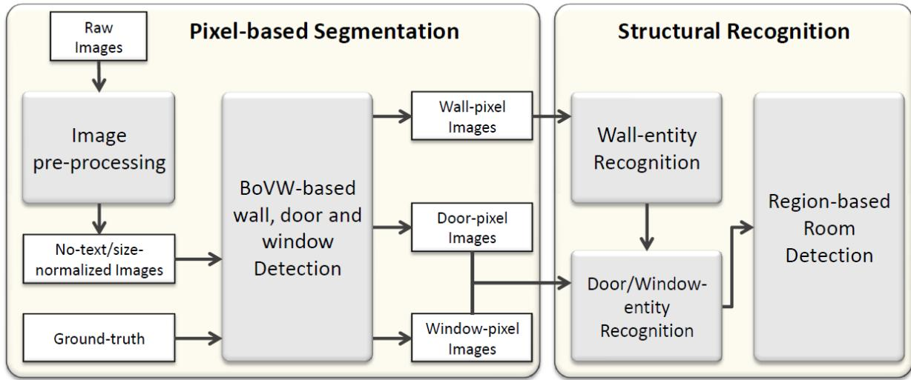  
Fig. 1: Pipeline of the method.

First, an extended and improved version of the statistical patch-based segmentation for walls introduced in [16] is used to segment the graphical entities in the floor plans (walls, door, and windows). It works at the pixel level permitting to deal with any kind of graphical notation. Only an off-line learning process is required to adapt the system to a new notation.

Second, a structural approach works independently from the notation by grouping the graphical entities, obtained as a result of the segmentation, into rooms. Firstly, wall entities are extracted by vectorizing the zones of the image containing pixels segmented as walls. Then, the door and window segmentation and the structural context of walls are combined to search, using the $\mathrm { A ^ { * } }$ algorithm, the final door and window entities on a vectorized image graph. Finally, rooms are detected as the cycles in the entity plane graph of walls, doors, and windows using the method introduced in [21] .

The whole system is applied on recently published datasets of real architectural floor plans with different graphical notations. The system is evaluated using two evaluation protocols; one for the segmentation of walls and another one for the recognition of rooms. They are explained in detail in this paper with the aim of becoming standards for the evaluation of interpretation systems for architectural floor plans. Evaluation results show that the system is able to perform well on all datasets obtaining better results than previous approaches.

The rest of the paper is organized as follows. The related work for the different floor plan analysis techniques is summarized in Sect. 2. The Pixel-based approach for wall, window, and door segmentation at the level of pixels is explained in Sect. 3. Subsequently, the Structural-based approach to recognize the entity elements out from the pixel detections is explained in detail in Sect. 4. The datasets used to evaluate our method, the two different evaluation protocols and the final results obtained are shown in Sect. 5. Finally, the paper is concluded in Sect. 6.

# 2 Related Work

Researchers from document analysis community has already put many efforts to analyze and transfer data from paper or on-line input to digital form, Architectural floor plans are one example of application. The conversion of these diagrams, printed or hand drawn, from paper to digital form usually needs vectorization and document preprocessing, while the on-line input needs to manage hand drawn strokes and distortions. The analysis of these diagrams allows the recognition of different structural elements (doors, windows, walls, etc.), recognition of furniture or decoration (tables, sofas, etc.), generation of corresponding CAD format, 3D reconstruction, or finding the overall structure and semantic relationship between elements.

The work of Tombre’s group in [1], [9]. and [10] tackle the problem of floor plan 3D reconstruction. In these works, they have as input scanned printed plans. First a preprocess separates text and graphics information. In the graphical layer thick and thin lines are separated and vectorized. Walls are detected from thick lines whereas the rest of the symbols, including doors and windows, are detected from the thin ones. In this process they consider two kinds of walls: ones represented by parallel thick lines and others by a single thick line. Doors are seek by detecting arcs, windows by finding small loops, and rooms are composed by even bigger loops. At the end, they can perform 3D reconstruction of a single level [1], or put in correspondence several floors of the same building by finding special symbols as staircases, pipes, and bearing walls [9]. Either in [9] and [10] it is indicated the need of human feedback when dealing with complex plans. Moreover, the symbol detection strategies implemented are oriented to one specific notation. An hypothetical change of the floor plan drawing style might imply the reconsideration of part of the method.

Or et al. in [28] focus on 3D model generation from a 2D plan. Using QGAR tools [31], they preprocess the image by separating graphics from text and vectorizing the graphical layer. Subsequently, they manually delete the graphical symbols as cupboards, sinks, etc. and other lines disturbing the detection of the plan structure. Once the remaining lines belong to walls, doors, and windows, a set of polygons is generated using each polyline of the vectorized image. At the end, each polygon represents a particular block, walls are represented by thick lines, windows by rectangles inside walls, and doors by arcs, which simplify their final detection. This system is able to generate a 3D model of one-story buildings for plans of a predefined notation. Again, the modification of the drawing style lead to the redefinition of the method.

Cherneff in [8] presents a knowledge-based interpretation method for architectural drawings: KBIAD. His aim is to extract the structure of the plan, that means walls, doors, windows, rooms, and the relations between them. The input is an already vectorized plan with vectors, arcs, and text that is preprocessed to obtain special symbols as doors. The system has two models: the semantic and the structural one. The semantic model represents the plan with building components as walls, doors, and windows, and their relations that arrange in composite structures as rooms. The structural one represents the geometry of the plan, including two dimensional spatial indexing of primitives. A predefined Drawing Grammar represents the drawing syntax of a plan describing its symbols and components as a set of primitives and their geometrical relationships. The rules have to be general enough to accept all the variations in a symbol but specific enough to distinguish between symbols. For example, they define walls as parallel segments that can have windows or doors at the end. This fact strongly restricts the interpretation possibilities, since walls in real floor plans can be curved or even not be modeled by parallel lines.

The work presented by Ryall in [32] is focused on segmenting rooms in a building. They propose a semiautomatic method for finding regions in the machine printed floor plan image, using a proximity metric based on a proximity map. This method is an extension of the area-filling approach that is able to split rooms when there is a lack of physical separation. Nevertheless, the method retrieves many false positives given by objects that are also drawn by closed boundaries, such as tables, doors, and staircases. Once more, the method is predefined to work with a single notation.

Mac´e in [27] also focused on the extraction of the structure from scanned plans. As in [1], [9], and [10] a text/graphic separation is done followed by a thin/thick separation from graphic components. In that way the authors look for walls among the set of thick lines. Then, they look for parallel lines extracted from contours, expecting walls to be formed by very thick lines. Afterwards, doors and windows are found to finally detect rooms based on a recursive decomposition of images until convex regions are found. The wall detector strongly depends on the wall notation, and should be re-designed to be able to cope with different floor plans.

Ahmed in [2, 4] starts with the classical text/graphics separation to later separate graphic components into thin, thick lines and, as a novelty, medium lines. Lines forming walls are extracted from thick and medium ones while thin lines are considered forming symbols. Then symbol spotting is applied using SURF to detect doors and windows and extract the rooms from the plan. At the end, text inside the rooms is used to label each of them. This method is further enhanced by the same authors in [3] by splitting rooms in as many parts as labels are inside them, just splitting them vertically or horizontally according to the distribution of their labels. These works take into account some structural and semantic information as they are labeling rooms with their name and are verifying their composition using the position of their doors and windows. But, as before, the method might have to be revisited when dealing with floor plans of different graphical conventions.

Some works have as an input a CAD file format, that contain the real non-distorted original polylines and lines. This is the case of the work of Lu in [26], where 3D reconstruction is performed from CAD floor plans. First they extract parallel overlapped lines to find T, X, and L shapes. Later they find their connections to construct walls and then the 3D reconstruction of the structure. Once the structure is extracted their lines are deleted in order to segment graphical symbols as furniture or stairs. Their method is based on the recognition of typical features as geometrical ones, attributes of the lines, relational attributes among components, etc. The 3D building model is reconstructed based on the integration of the recognition results and are specific for a single CAD file notation.

Also, the work of Zhi et al. in [37] takes as input a CAD file. It extracts automatically the geometrical and topological information from a 2D architectural drawing and transforms it into a building fire evacuation simulator. Firstly, they semiautomatically filter out redundant information such as furniture, text, specification notes, and dimensions, and only keep the essential entities: walls, doors, windows, lifts, etc. Then, they transform the plan into an attributed graph and look for loops, that accordingly to their attributes, are classified into different types: spatial loops (rooms, corridors), physical loops (walls, columns), door loops, window loops, and unidentified loops. Even this procedure is easy to use, leads to some classification errors and further reasoning is needed. Finally, plan units (compartments) are identified and the system is integrated in a model that simulates emergency evacuations from complex buildings.

Works based on hand-sketched input like [5] and [23] analyze hand-sketched floorplans. In [5] a handsketched floorplan is analyzed to transform it into a CAD file. They extract the lines that model the building structure, that are sketched on a preprinted paper with a grid of lines in drop out color. The method describes line elements, such as walls and windows, and closed region elements, such as doors. On the other hand, [23] uses subgraph isomorphism and Hough transform to recognize different building elements and their topological properties. Subgraph isomorphism is used to recognize symbols and Hough transform to detect walls made by hatched patterns. It is worth to mention that in both, [5] and [23], the drawing conventions are set beforehand.

Floor plan structural retrieval is one of the recent interests for architects. The works of Weber et al. in [4, 35] and Wessel et al. in [36] are two examples in this domain. In the case of [35], the query is a sketch drawn on-line by the user. Their system allows the user to sketch a schematic abstraction of floor plan and searches for floor plans that are structurally similar. The sketch is translated into a graph enclosing the structure of the plan and it is compared with the graphs representing plans in a repository using subgraph

matching algorithms. In [36] the input is a polygon soup representing a 3D plan, so they do not need to vectorize the plan. From this polygon soup, the authors extract the structural polygons of each floor stage by grouping that ones that are parallel to the floor at a determined height. The rest are considered furniture. Then, the rooms, doors, and windows are detected by cutting the horizontal plane of each floor. Finally a graph is constructed where attributed nodes are rooms and attributed edges are connections between them: doors or windows. Based on this connectivity graph a fast and efficient shape retrieval from an architectural database can be achieved.

All these systems, either focused on interpretation, 3D reconstruction, or floor plan retrieval, need to extract the structure of the buildings at some point of the process. These techniques are very specific to a predefined graphical styles and useless for completely different drawing styles. Our group has been working in the last years to obtain a style drawn invariant method to extract structure and semantics from a floor plan. A first approach is presented in [18] where a structural, hierarchical, and semantic interpretation of a floor plan is done using a set of labeled plans. First, the model is learned automatically generating both: the stochastic grammar represented by an And-Or graph modeling the whole plan and the set of patches forming the structural components of the plan (walls, doors, and windows). The model of structural elements is learned using a patch based approach combined with Conditional Random Fields. In a first stage of the recognition approach, a bottom-up process is done to detect structural elements and relate them to construct a candidate And-Or graph. In a second step, a top-down process is done to prune the graph leading to the most probable representation of the floor plan. In [16] an improved way to detect walls in a plan independently of their style is presented. There, a patch based approach (Bag-of-Visual-Words) is used. A visual vocabulary of the graphical notation for walls is learned, from annotated data also and, this vocabulary is used to detect patches containing walls in a floor plan. Although some works exist that apply the BoVW framework to symbol recognition [7, 33], to the best of our knowledge, this is the first time that is applied to the segmentation of structural elements in floor plans. In both approaches we use the binarization and text-graphic separation presented in [34]. A modification of our wall detector [17], to also detect doors and windows, combined with a post-structural process to detects rooms, arrange into our new floor interpretation system that is able to deal with multiple drawing styles.

# 3 Pixel-based segmentation

This section explains in detail the pixel-based method used for the detection of walls, doors, and windows. Firstly, images are pre-processed to filter out the non-relevant information and to normalize the scale of the symbols of interest in the different plans. Then, the patch-based recognition works at pixel level and permits to segment those pixels that correspond to the three basic entities involved in room detection (walls, doors, and windows). This method, whose pipeline is shown in Fig. 2, is an extension of the wall segmentation method [16], that not only is used to segment walls, but also doors and windows.

# 3.1 Image pre-processing

In real floor plans, textual information (dimensions, annotations, etc.) might appear or not. We cannot rely on it for room detection. Therefore, text is separated from the graphical layer using the text/graphic separation method proposed by Tombre et al. [34] (see Fig. 3b and Fig. 3c).

In addition to that, some of the recently presented works on room detection [2, 18, 27] assumed that all floor plan images have the same resolution and line thickness. This was the case of the datasets used to evaluate these methods. However, this is not necessarily true. Resolution and line thickness will strongly depend on the device used to capture the images (scanner or camera) and on the resolution of acquisition. This can result in a larger variability that can be a problem for approaches working at pixel level as it is the case of our system. For this reason, images are automatically normalized regarding their line thickness.

This process is based on regularizing the resolution of the floor plans regarding the most basic structural element: the thinnest line. A histogram based on counting the consecutive black pixels in both vertical and horizontal directions, is created for each floor plan. Assuming that the thinnest line is the most common type of structural element, the histograms maxima should indicate the width of the thinnest lines in each image. Finally, all plans are resized taking the plan with the thinnest lines as a reference and using bilinear interpolation. In this way we get more similar symbol representations for all the plans.

# 3.2 BoVW-based wall, door, and window detection

In order to be able to extract the rooms of a floor plan, first we focus on the detection of the basic structural elements: walls, door, and windows.

Most of the approaches in the literature concerning this task are based on the extraction of primitives after vectorization. These strategies have demonstrated to work fine only if two critical issues are assumed a priori:

– The notation of the floor plans is invariable and known.

– The resolution and/or image quality of the input images is acceptable and constant from plan to plan.

If these assumptions do not hold, it is necessary to redefine the primitive extraction techniques used in this kind of approaches in order to adapt to the change of notation and/or quality of the images.

To skip over the assumptions that vectorizationbased methods bear in mind, the authors presented an in deep study in [17] of a statistical-based system inspired on the Bag of Visual Words pipeline (BoVW) to extract walls when a ground-truth is available for training. The method used in this paper is the best configuration according to the conclusions of that analysis in [17]. After image preprocessing, firstly, images are divided into overlapped squared patches. Secondly, every patch is described with local features. In the learning stage, these features are clustered into a vocabulary of visual words. Each of the visual words defines the probability of a patch of belonging to each of the classes (in our case, wall, door or window). Finally, the input patches of the test images are classified using the vocabulary and assigned to the class with the highest probability. The method is summarized in the following for clarity. However, we address the reader to the original paper for further details.

# 3.2.1 Grid Creation

All the images are split into overlapped squared patches in order to extract and describe common information concerning neighbor pixels. The use of an overlapping grid provides two main advantages with respect to a non-overlapped one. Firstly, context is added. Every pixel is contained into several image patches and consequently, its classification will be determined by the class probabilities of all them. Secondly, since patches are denser than in a non-overlapped grid, there is a fewer dependency on how the grid is placed into the image and, therefore, how symbols are distributed along the patches. This results in a better detection of symbol boundaries. It is worth to say that in contrast, as images are represented with more patches, the computation time is also higher. The overlapping of the grid is defined by the parameter $\phi$ , which specifies the pixel distance between the centers of neighbor patches and it has to be a natural factor of the patch size. The smaller $\phi$ , the higher overlapping among the patches. In our experiments this parameter is determined by crossvalidation.

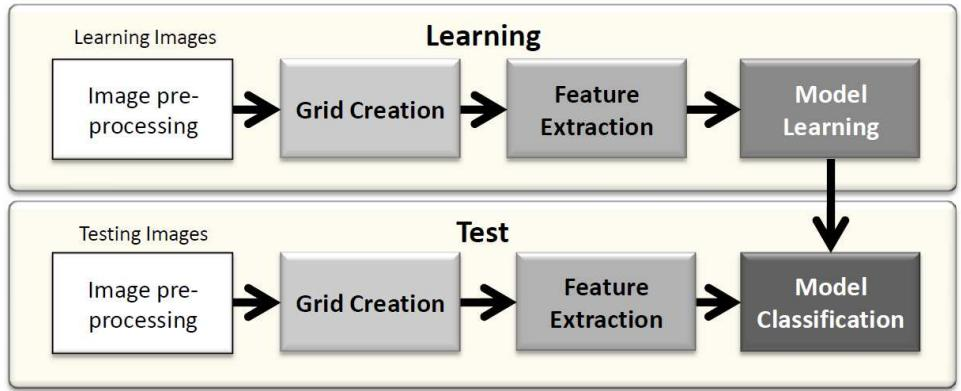  
Fig. 2: Pixel-based segmentation pipeline.

# 3.2.2 Feature Extraction

The use of different patch descriptors have been analyzed in the original paper – Pixel Intensity Descriptor (PID), Principle Component Analysis (PCA), and Blurred Shape Model (BSM) [13] – being BSM the one which obtains the best performance. In addition to that, the authors have also studied the performance of the system using current state-of-the-art descriptors such as SIFT [25] and SURF [6]. These descriptors are based on key-point detection for a later local description of the surrounding areas. However, symbols in plans are mainly composed of structured straight lines, where no keypoints can be found. On the contrary, BSM is able to take into consideration the linear structure of the elements since it is based on pixel density description. Basically, the BSM descriptor divides the patch into a set of cells and counts the pixel density of every cell, but taking also into account the pixels of the neighboring cells. Consequently, BSM is used as patch-descriptor in the system.

# 3.2.3 Model Learning

Once all of the patch-descriptors for training images are obtained, those which belong to complete white pieces of the images are ruled out from the training set. The rest are clustered using a fast version of K-means [12] to create a vocabulary of representative visual words.

Then, to every word is assigned a probability of representing each of the object classes. The learning of the probabilities for each word $w _ { j } \in W = \{ w _ { 1 } , . . . , w _ { N } \}$ regarding every object class $c _ { i } \in C =$ {Wall, Door, Window, Background $\}$ is computed as follows. Initially, every pixel in the training images is labeled with one of the object classes. Note, however, that patches do not necessarily respect object boundaries and therefore, a patch pt can contain pixels belonging to more than one class. Besides, classes can be overlapped in the groundtruth causing one single pixel to be assigned to more than one class. In both cases, every patch contributes to the probability of all the classes that its pixels are labeled by. Taking into account that every patch is assigned to the closest word in the dictionary, we can compute the conditional probability for a class given a word in the following way:

$$
p ( c _ { i } | w _ { j } ) = \frac { \# ( p t _ { w _ { j } } , c _ { i } ) } { \# p t _ { w _ { j } } } , \forall i , j ,
$$

where $\# ( p t _ { w _ { j } } , c _ { i } )$ states for the total number of patches assigned to the codeword $w _ { j }$ which contain pixels of class $c _ { i }$ according to the ground-truth. $\# p t _ { w _ { j } }$ is the number of patches assigned to $w _ { j }$ . The summation of the class conditional probabilities given a codeword is one:

$$
\sum _ { i = 1 } ^ { M } p ( c _ { i } | w _ { j } ) = 1 , \forall j .
$$

For walls, doors, and windows only one pixel of that class is needed to consider the patch as belonging to the class. Contrarily, a patch is only considered as background if all of its pixels belong to the class Background.

# 3.2.4 Model Classification

In the classification step, all the input images are also divided into overlapped patch-descriptors using the same strategy explained in Sect. 3.2.1 and Sect. 3.2.2. Each one of these patch-descriptors is classified to the nearest codeword, using hard assignment 1-NN, and inheriting the class probabilities of the corresponding codeword. Due to the overlapped grid, every pixel in the image belongs to a definite number of image patches. Thus, after patch classification every pixel is assigned different probabilities for every patch it belongs to. Therefore, in order to get a final classification of every pixel all probabilities are combined using the Mean Rule as proposed by Kittler et al. in [22]. Every pixel $p x$ contained in different patches $p t$ is classified to class $c _ { i }$ by:

$$
C ( p x ) = \arg \operatorname* { m a x } _ { i } { \Big ( } m e a n ( P ( c _ { i } | p t ) ) { \Big ) } , \forall p t \mid p x \in p t .
$$

As a result of this process, three different binary images for each plan are created depending on the final labels of the pixels: the wall-image (with pixels labeled as wall), the door-image (pixels labeled as door) and the window-image (pixels labeled as window). An example of a wall-image is shown in Fig. 3d.

# 4 Structural Recognition

Up to here, the pixel-based approach has segmented and labeled the image pixels as belonging to walls, doors and windows. The structural-based recognition, whose pipeline is shown in Fig. 4, firstly groups the basic graphical segmentation into these three types of structural entities – walls, doors, and windows entities–. Then rooms are detected by finding cycles in a plane graph of entities.

# 4.1 Wall recognition

A wall-entity is the semantic definition of a real wall in a building: a continuous structure which is used to divide the space into different areas. It is usually delimited by windows, doors, and intersections with other walls. Thus, in order to extract a realistic structure of a floor plan, the system should be able to detect these entities from the wall-images obtained after Sect. 3.2.

The reader might wonder at this point why wall entities are sought before door and window entities. There are mainly two reasons for this. Firstly, walls –and rooms– are the elements which mainly define the structure of a building. Almost all the rest of elements can be easily located using semantic assumptions based on wall location, e.g. usually doors and windows are placed between walls. This will lead to an easier door and window entity recognition afterwards. Secondly, walls are usually modeled by a highlighted uniform texture, which makes them a big deal easier to detect than doors and windows.

This process is divided in three different stages. Firstly, wall-images are vectorized and post-processed to reduce the noise. Secondly, a planar graph is built out from the vectorization. Finally, wall-entities are extracted after analyzing the wall-graph.

# 4.1.1 Wall-image vectorization

In this step we want to extract a vectorial representation of the wall-image in Fig. 3d. Since this image is obtained after classifying squared structures –patches– to detect linear elements –walls–, a raw vectorization of the image leads to encounter multiple corners and small unaligned segments for completely straight walls. This issue is solved by applying a morphological opening after closing the wall-image, which allows to delete small noise and join unconnected pixels, and a logical AND with the original opened image to make borders straighter. The result is shown in 3e. This modified wallimage is vectorized over its skeleton using QGAR Tools [31].

# 4.1.2 Wall-segment-graph creation

After vectorization, an attributed graph of line segments is created using the open source graph library called JGraphT $^ { 1 2 }$ , which is based on JAVA and includes a sort of complete modules for graph management already implemented.

In this attributed graph, the nodes are the segments obtained from the vectorization, and the edges represent binary junctions among connected nodes. The attributes of the nodes are the thickness of the line segment extracted from the skeletonization and the geometrical coordinates of the end-points of the segment. In this way, geometric computations among nodes – such as distances or angles – can be performed easily. On the other hand, edges contain two attributes: the coordinate of the junction point between the two segments, and the relative angle between them. This graph is called wall-segment-graph.

# 4.1.3 Wall entity recognition

The final task for wall entity recognition is based on the grouping of nodes that presumably belong to the same wall in the wall-segment-graph. With this aim, three different kind of junctions within nodes are considered as being natural borders among walls:

1. $N$ -junctions for $N \ > \ 2$ : The intersection of three or more different wall-segments at a certain point can be considered as the intersection of $N$ different walls.   
2. $L$ -junctions: Two wall-segments that are connected by a rectangle angle with a certain tolerance margin are considered to belong to two different walls.

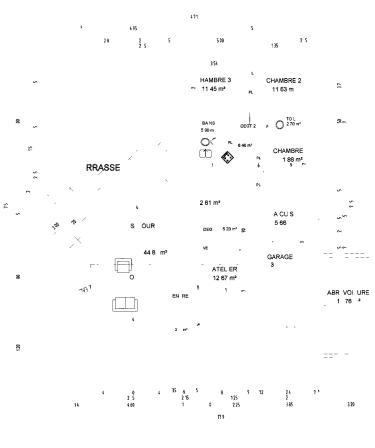  
VEE PAN

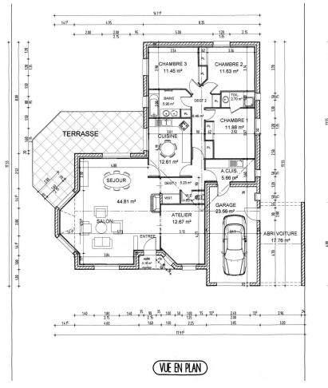  
(b) Text-layer after Text/Graphics segmentation.

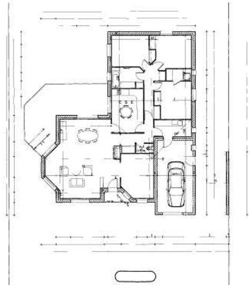  
(c) Graphic-layer after Text/Graphics segmentation.

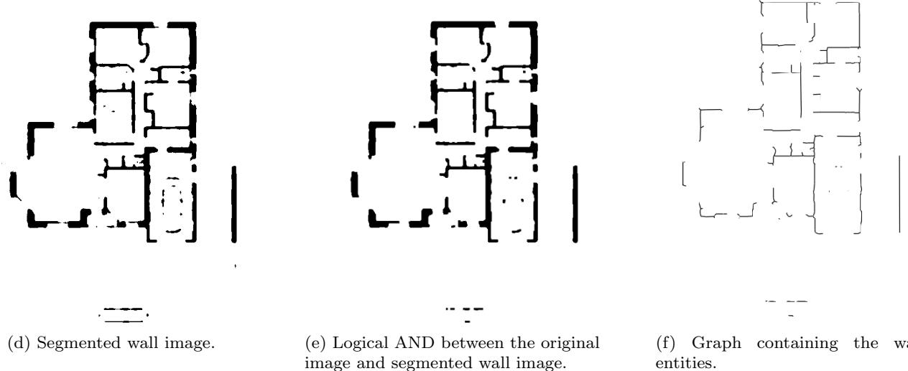  
Fig. 3: Complete flow of wall recognition process.

3. 0-junctions: Any wall-segment which is not connected to any other in one of its end-points is considered as a natural delimiter for a wall.

The algorithm for wall-entity recognition firstly deletes the edges from the wall-segment-graph which are involved in $N$ -junctions and $L$ -junctions. $N$ -junctions are easily found by consulting the degree of connectivity of the nodes at their ending points. If the connectivity degree is higher than 2, then that point is a $N$ -junction. Regarding $L$ -junctions, the process performed is the same but, this time, the degree has to be equal to 1, and also the angle attribute of the edge has to be close to $9 0 ^ { \circ }$ . Finally, the disconnected subgraphs are found using the Depth First Search (DFS) algorithm. The complete process is shown in algorithm 1 and the result is visually shown in Fig. 5.

The graph obtained after this process is called for clarity wall-graph. Here, nodes are wall-entities, which can be seen as groups of connected wall-segments, attributed with the geometric coordinates of their endpoints. Edges are connections among walls at these endpoints.

# 4.2 Door and Window entity recognition

It is hard to imagine in the real world that a door or a window is not located between, at least, two walls. In floor plan documents, door and window symbols are modeled by lines that are incident with wall lines. If we take a look at the graph obtained after vectorizing the original floor plan image, and we focus our attention on a window –or a door– and the surrounding walls, it exists at least one path that only contains window –or door– line-nodes connecting one terminal of each wall, see Fig. 6. Hence, we can take advantage out from this assumption in order to enhance the detection of these entities. Here, graph connections between walls are explored in the locations where doors and windows have been found after Sect. 3. This search is driven by the algorithm A $^ *$ . Lately, a post-process heuristically seeks for windows and doors between well-aligned walls.

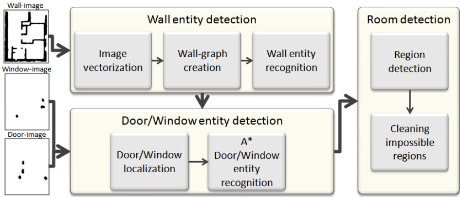  
Fig. 4: Structural recognition pipeline

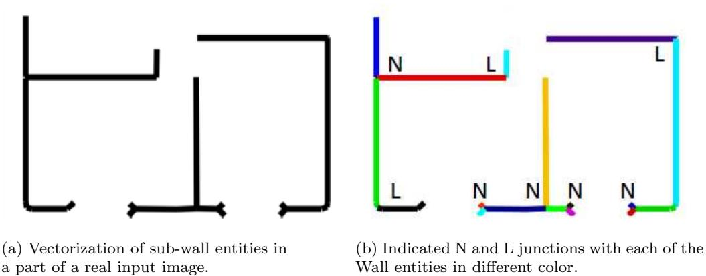  
Fig. 5: Wall entity recognition.

<table><tr><td>Algorithm 1 Wall-entity recognition</td></tr><tr><td>auxWallGraph := wallGraph interestEdges ← searchEdges(auxWallGraph,Njuctions U Ljuctions)</td></tr><tr><td>delete(auxWallGraph,interestEdges)</td></tr><tr><td>for all Ojunction ∈ aux WallGraph do if notContains(visitedNodes,0junction) then</td></tr><tr><td>var newWall := {} while DFSiterator.hasNextNode do</td></tr><tr><td>add(visitedNodes, nextNode) add(newWall, nextNode)</td></tr><tr><td>end while</td></tr><tr><td>createWall(wallGraph,newWall)) end if</td></tr></table>

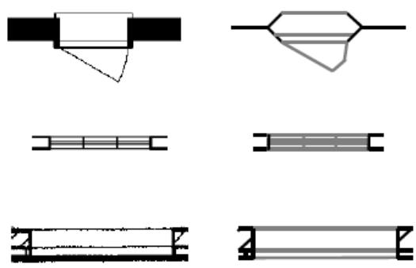  
Fig. 6: Left: three different windows from real floor plans with dissimilar notations. Right: the respective vectorization. Black vectors belong to walls and gray to windows.

# 4.2.1 A\* for Door and Window detection

As it is shown in Fig. 7a, every vector in the original vectorized image which overlaps a region classified as door3, by the system explained in Sect. 3, is considered as candidate door entity vector. For each of these regions, the center of mass (centroid) is computed, and taken as a reference point, see Fig. 7b. Then, the closest wall entities to the centroid of the region in the wall-graph are retrieved. For each couple of walls close to a centroid, the respective lines in the original image graph, obtained after vectorization, are found. Then, a path between the two walls is optimally searched using $\mathrm { A ^ { * } }$ , see Fig. 7c.

There are mainly two reasons that explain the use of $\mathrm { A ^ { * } }$ . First, we need an efficient search algorithm under the consideration that multiple paths between two wall nodes are possible, but only few of them are of real interest. A $^ *$ is a path finder algorithm which is optimal when an appropriate monotonic heuristic is used. Second, we need to define an extra-cost of traversing nodes which are not candidates of being door vectors according to the areas of interest. This extra-cost can be easily added to the already traversed path at a certain point in A\*.

Assume that we have detected two walls which are sufficiently close to a centroid that defines an area of interest. We consider arbitrarily one wall to be the starting node $s$ and the other to be the goal node $q$ . Then, the heuristic considered as the expected path distance from any node $n$ to $q$ is the Euclidean Distance:

$$
h ( n ) = d ( n , q ) ,
$$

Since the distance from a node $m$ to itself is $h ( m ) =$ $d ( m , m ) = 0$ , then we can assert

$$
h ( n ) \leq d ( n , m ) + h ( m ) ,
$$

where $m$ is any adjacent node to the actual node already explored $n$ . The equation 5 implies that $h$ is monotonic and thus, the search is optimal.

The goal function to be minimized at each certain node $n$ in the search is defined by the summation of the real cost of the traversed path $g ( n )$ and the expected distance to the goal $h ( n )$ :

$$
f ( n ) = g ( n ) + h ( n ) .
$$

The cost function $g ( n )$ is given by summation of the cost traversed till its father $p$ , and its own length $| n |$ . Nevertheless, an extra-cost is given when crossing over

those nodes which are not in the area of interest or are already labeled as walls:

$$
g ( n ) = \left\{ \begin{array} { l l } { g ( p ) + \left( | n | * W \right) \mathrm { i f } n \notin \{ N _ { i n t e r e s t a r e a } \cup N _ { w a l l } \} } \\ { \qquad } \\ { g ( p ) + | n | \qquad \mathrm { o t h e r w i s e } , } \end{array} \right.
$$

where $W$ is an heuristically defined cost. This extra-cost pushes the algorithm to prioritize the search on nodes which are door candidates and allows to avoid problematic situations as the one shown in Fig. 8. In addition to that, a experimentally defined threshold allows a maximum number of node expansions to keep the memory use under control. This is of a great importance when there is not a real path between two walls.

Finally, for each resulting connection between walls, a virtual node is added to the wall-graph with the respective attribute; door or window. This process is shown graphically in Fig. 7d. The resulting graph, since it contains nodes attributed as walls, doors, and windows, is now called wdw-graph.

# 4.2.2 Wall well-aligned connections

The loss of any door or window entity at this point is a critical issue for the later room detection. Rooms are detected by finding closed regions in a wdw-graph. Therefore, when a door or a window is lost, the supposed room formed by these elements is lost. For this reason, a post-process to reduce the impact of losing any of these elements is carried out.

This process firstly looks for couples of walls that have a geometric gap between them and are sensibly well-aligned in orientation; the tolerance on both, gap distance and orientation angle, is experimentally learned from the ground-truth. A path among each of these couples of walls is searched using the $\mathrm { A ^ { * } }$ , as explained in 4.2.1, but with a slightly modified cost function $g ( n )$ . Now, an extra-cost is given only to that nodes which already belong to walls:

$$
g ( n ) = { \left\{ \begin{array} { l l } { g ( p ) + ( | n | * W ) { \mathrm { ~ i f ~ } } n \not \in N _ { w a l l } } \\ { { } } \\ { g ( p ) + | n | } & { { \mathrm { o t h e r w i s e } } } \end{array} \right. }
$$

If a path exists, a new node of type connection is added to the graph and connected to the two correspondent wall terminals. The use of this technique not only results in a better room detection, but also helps on finding abstract boundaries between rooms that have no physical separation. The final graph is called wdwcgraph.

# 4.3 Room detection

Finally, closed regions are found from the plane wdwcgraph using the optimal algorithm from Jiang et al. in [21]. Before applying the algorithm, all the terminals of the graph are erased recursively. This leads to a better computation of the closed regions as unnecessary terminal paths are not taken into account when searching for closed regions. After obtaining the regions, their area is calculated and used to rule out impossible rooms regarding their absolute size, such as small regions representing holes for pipes in the plan.

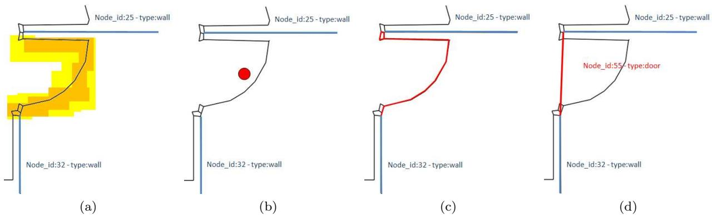  
Fig. 7: Process for finding a door entity. In (a) shows the detection of the door by the statistical approach presented in Sect. 3 over the real image. The centroid of the area where the door is found is shown as a red point in (b). The node expansion by A $^ *$ for finding the path between the two walls in the graph is shown in red in (c). Finally, both walls are connected in (d) by means of a door node.

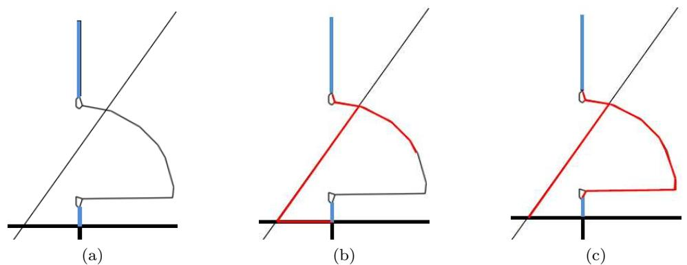  
Fig. 8: A problematic situation is shown in (a) for finding door lines between the blue wall candidates. In this case a ceiling line traverses the door symbol. The nodes expanded (red) by a pure implementation of $\mathrm { A ^ { * } }$ algorithm in (b) shows that the final retrieved path does not traverses the complete door lines. Contrarily, in (c), additional cost for traversing wall nodes is added, and the final retrieved path is correct.

# 5 Results

One of the two main drawbacks on the evaluation of floor plans is that there is not any public dataset available to perform evaluation neither comparison among the existing methodologies, according to the knowledge of the authors. Thus, the impartial evaluation of the approaches existing in the literature becomes an extremely difficult task. Therefore, and with the aim of giving a solution to this problem, we have recently created four datasets of groundtruthed floor plans which are shared $^ 4$ freely for research purposes. All of them have been already used in the evaluation of previous systems [2, 3, 15–19, 27]. We present these datasets in this section.

The second big issue in floor plan analysis is that, the big majority of the systems in the literature do not show clear quantitative results or use unspecific evaluation protocols. This issue turns the objective comparison between approaches into a really hard task. In this section, we describe in deep the two different protocols adopted respectively for the evaluation of wall and room extraction. Our intention is that these protocols could be used by any researcher to easily evaluate new contributions and establish a fair comparison of the results.

Finally, we conclude the section presenting our quantitative and qualitative results for wall and room detection including an in deep analysis and discussion of the whole system.

# 5.1 The dataset

Four datasets of real floor plans, each one containing documents from different single architecture offices, are used to evaluate our method. Among these datasets, the graphical notation varies substantially due to the standards of each office. Two of these collections are completely groundtruthed at pixel level for the structural elements Wall, Door, Window, and Room, and they are used to evaluate both, wall and room detection. The other two have been recently collected and labeled at pixel level for walls. Therefore, they will be used to evaluate wall detection.

The ground-truth has been manually generated by an upgraded version of the tool used in [27] and [18], in which a sequence of clicks allows to select the filled area of the element to be labeled. This process has been headed by several experts and the average time on generating the complete groundtruth for an image, that is to label the walls, the doors, the windows, and the rooms, is up to 30 minutes. The specific characteristics of each dataset are summarized below:

– BlackSet contains 90 fully groundtruthed documents from a period of more than ten years. It was primarily introduced for floor plan analysis in [27]. The size of the images is 3508x2480 and as a significant issue, most of the walls are modeled with thick black lines. A plan example of this dataset is shown in Fig. 9a. TexturedSet contains 10 real images that are fully groundtruthed. Even if the plans contained have the same notation, elements are modeled at different sizes depending on the global image resolution: the smallest image is 1098 $\times$ 905 pixels meanwhile the largest is 2218 $\times$ 2227. This dataset was firstly introduced in [16]. The notation is barely different from Blackset in the case of walls, which here are modeled with textured lines. An example of a floor plan of this dataset is shown in Fig. 9c.

– TexturedSet2 is only labeled for walls. It contains 18 high resolution (7383 $\times$ 5671 pixels) floor plans that are downscaled for efficiency purposes to 3600 $\times$ 2766 pixels using a bicubic interpolation. Its walls contain multiple thickness for interior, exterior, and main walls. All of them are drawn by a hatched pattern between two parallel lines. This dataset has been very recently introduced by the authors in [15, 19] for unsupervised wall segmentation. An example image of this dataset is shown in Fig. 9e.

Table 1: Definition of True-positives, False-positives and False-Negatives for Wall segmentation evaluation. Black pixels in an image are considered as 1 and white ones as 0   

<table><tr><td></td><td>Original-image</td><td>GT-image</td><td>Output-image</td></tr><tr><td>TP</td><td>1</td><td>1</td><td>1</td></tr><tr><td>FP</td><td>1</td><td>0</td><td>1</td></tr><tr><td>FN</td><td>1</td><td>1</td><td>0</td></tr></table>

– ParallelSet is also labeled for walls only. It consists of 4 real floor plans of 2500 $\times$ 3300 pixels whose walls are drawn by parallel lines, without any textual pattern in between. As TexturedSet2, this dataset has been recently introduced in [15, 19]. One instance of this dataset is shown in Fig. 9g.

All floor plans are binarized using [29] to ensure that only structural information of the floor plans is used for the analysis (and not the color information).

# 5.2 Evaluation Method for Wall detection

The protocol used for the evaluation of wall detection is the same used in some previous papers about wall extraction [16, 17]. This evaluation, which is at pixel level, is calculated over the three images obtained for a plan: the result-wall-image, the ground-truth-image, which contains the labeled wall bounding-boxes, and the original-image. The use of the original image is justified because we only consider in the score those pixels that are black in the original-image, since only black pixels convey relevant information for segmentation.

The results of our experiments in wall segmentation are expressed using the Jaccard Index (JI). JI is currently popular in Computer Vision since it is used in the well-known Pascal Voc segmentation challenge [14] as evaluation index. It is an objective manner of presenting the results because it takes into account both, false positives and negatives, experimented by the system. It is compressed in the interval [0,1] and the closer to 1, the better is the segmentation. JI is calculated as:

$$
J I = \frac { T r u e P o s } { T r u e P o s + F a l s e P o s + F a l s e N e g } ,
$$

where TruePos, FalsePos and FalseNeg are defined in Table 1 regarding the three images used in the evaluation.

# 5.3 Evaluation Method for Room detection

In order to report the accuracy of room detection, an adaptation of the protocol introduced by [30] for the evaluation of vectorization is used. It allows to present an in deep analysis of the recognition system by reporting exact as well as partial match.

First, a match score table is constructed using the ground truth and the detected rooms. Each entry in the match score table provides the overlapping between a room in the ground truth and a room detected by the system. The degree of overlapping is calculated using equation 9 as specified in [30]:

$$
m a t c h \mathrm { . } s c o r e ( i , j ) = \frac { a r e a ( d [ i ] \bigcap g [ j ] ) } { m a x ( a r e a ( d [ i ] ) , a r e a ( g [ j ] ) ) }
$$

where match score $( i , j )$ represent the overlapping between $i ^ { t h }$ detected room and $j ^ { t h }$ ground truth room ( $1 =$ maximum overlap, $0 = \mathrm { n o }$ overlap).

In addition, a match count table is constructed to calculate the exact match between detected and ground truth rooms using the following rule;

For each pair $( i , j )$ where $m a t c h \mathrm { - } c o u n t ( i , j ) \mathrm { > ~ 0 ~ }$ , we set match score( $i , j ,$ =0. This substitution is necessary to make sure that the rooms with an exact match, do not contribute in the calculation of partial matches. The partial matches are divided into the following categories.

– g one2many: A room in the ground truth overlaps with more than one detected rooms. – g many2one: More than one room in the ground truth overlaps with a detected room. – d one2many: A detected room overlaps with more than one room in the ground truth. – d many2one: More than one detected rooms overlap with a room in the ground truth.

The values for each of the above-mentioned category can be calculated using the match score table as specified in [30].

Finally, detection rate and recognition accuracy is calculated using the equation 10 and 11 respectively.

$$
R a t e = \frac { o n e 2 o n e } { N } + \frac { g _ { - } o n e 2 m a n y } { N } + \frac { g _ { - } m a n y 2 o n e } { N }
$$

$$
x . ~ A c c u r a c y = { \frac { o n e 2 o n e } { M } } + { \frac { d . o n e 2 m a n y } { M } } + { \frac { d . m a n y 2 o n e } { M } }
$$

where $N$ and $M$ be the total number of ground truth and detected rooms respectively.

Table 2: Quantitative parameters on wall detection   

<table><tr><td></td><td>Patch-size</td><td>Voc. Size</td><td>Overlapping</td></tr><tr><td>BlackSet</td><td>10×10</td><td>100</td><td>5</td></tr><tr><td>TexturedSet</td><td>18×18</td><td>2000</td><td>3</td></tr><tr><td>TexturedSet2</td><td>20×20</td><td>1000</td><td>5</td></tr><tr><td>ParallelSet</td><td>42×42</td><td>1000</td><td>12</td></tr></table>

# 5.4 Results on wall detection

The system is only influenced by three parameters, the patch-size, the overlapping-factor $\phi$ , and the size of the vocabulary, all three learned in validation time. For BlackSet, 30 images are used for validation following a 5-fold strategy, while the 60 remaining are used for testing, with a 10-fold strategy. This procedure is repeated by exchanging some of the validation images for testing ones until all the 90 images in the dataset are tested. Similarly, the parameter validation in TexturedSet2 has been performed using 6 images following a Leave-One-Out strategy. The rest are used for learning and testing using a 3-fold procedure. On the other hand, regarding the TexturedSet and ParallelSet, due to the low number of instances, all of the images are used at once for parameter validation and testing following a Leave-One-Out strategy.

When we analyze the influence of the parameters in the different datasets it turns out that three aspects require the addition of more context to the final wall pixel-based classification: a low resolution, a big intraclass variability, and a hight similarity with other floor plan elements. These are the cases of TexturedSet, TexturedSet2, and ParallelSet respectively, in which bigger patches and more overlapped among them are used to deal with their respective problems. Moreover, a bigger vocabulary is needed to represent accurately the different textures existing for modeling exterior and interior walls in the TexturedSet. In contrast, in BlackSet a small vocabulary constructed from small patches is able to cope with the regularity of the black walls contained in this dataset. In Table 2, the parameters used in each dataset are shown numerically.

Our results on Wall segmentation are shown numerically in Table 3 and graphically in Fig 9. They are compared with the recent works on floor plan analysis in [2] and in floor plan wall detection in [16]. Since [2] is based on thick, medium, and thin line separation for walls detection, the method is useless in its baseline for textured wall segmentation, as it is the case of TexturedSet, TexturedSet2 and ParallelSet. On BlackSet, walls are almost perfectly detected by our system, outperforming the approach from Ahmed et al. [2] in $7 \%$ . On the other hand, wall segmentation on the rest o the datasets is a big deal more challenging and therefore, not that accurate. The lower resolution and the slightly different notation for exterior and interior walls increase the false positives rate, mainly given by the detection of symbols that are modeled similarly to interior walls in the TexturedSet. Again, the lack of texture in ParallelSet leads to wrongly segment other symbols that are also modeled by parallel lines. In the case of the TexturedSet2, the downscaling procedure brakes the original regularity of the hatched pattern producing multiple textural possibilities for a single wall. With all, the results are still satisfactory. The JI score is over 0.8 in TexturedSet and TexturedSet2 and up to 0.71 in ParallelSet. The recall scores for all the datasets are very high –almost 1 for BlackSet, TexturedSet and TexturedSet2 and 0.86 for ParallelSet–, a fact that is strongly desirable since false positives are easily treated in a postprocess than false negatives.

Table 3: Wall detection results   

<table><tr><td></td><td>[2]</td><td>[16]</td><td>Proposed</td></tr><tr><td>BlackSet</td><td>0.90</td><td>0.97</td><td>0.97</td></tr><tr><td>TexturedSet</td><td>一</td><td>0.83</td><td>0.86</td></tr><tr><td>TexturedSet2</td><td>—</td><td>0.81</td><td>0.82</td></tr><tr><td>ParallelSet</td><td></td><td>0.70</td><td>0.71</td></tr></table>

In summary, our system is able to detect walls in four completely different collections of floor plans regardless their wall notation. This notation invariance is achieved at relatively low cost: the short time to label the data and the few images needed for learning $-$ only 3 in ParallelSet while achieving good results– leads the generation of the groundtruth to be a big deal shorter and more straightforward step than reformulating traditional techniques based on vectorization for every new notation. In addition to that, walls are not supposed to be aligned –diagonal and curved walls are also detected as it can be seen in Fig. 9–, and they do not need to be at the same resolution –plans are rescaled automatically regarding line thickness–.

# 5.5 Results on room detection

The quantitative results obtained on BlackSet and TexturedSet for room detection based on the evaluation strategy explained in 5.3 are shown in Table 4. This Table reports both, the exact matches (one to one) in terms of accuracy and detection rate, and the partial matches (one to many and many to one) for BlackSet and TexturedSet. The performance of the system can be directly compared with the systems described in [2] and [27] on BlackSet, since only the 80 images from this dataset used in the evaluation of these methods are considered here.

An example illustrating the rooms detected in a BlackSet image is shown in Fig. 10b. Each one of the isolated regions corresponds to a detected room. According to Table 4 on this dataset, our approach highly outperforms the reference system [27] and achieves almost the same performance as [2] regarding detection rate. At the same time, it remarkably surpasses the recognition accuracy for both systems; more than $2 5 \%$ compared to [27] and almost 13% compared to [2]. In addition to that, our approach presents a lower one to many score, which confirms that the system is able to detect correctly the doors and windows that act as natural boundaries among rooms. Nevertheless, the many to one count score is higher than [27] and almost the same as [2]. The reason is that, as in [2], rooms are not separated when there is a lack of physical boundary between them.

On TextureSet, which is more challenging due to the lower and multiple resolution of images and the different notations for walls, the system performs slightly worse but still satisfactory, see Fig. 10d. The detection rate is 4% lower than the one obtained for the BlackSet, mainly caused by loops generated by false detected walls that are finally considered as rooms. On the other hand, recognition accuracy is 4 points higher than [2], but still moderately far from the one obtained on the BlackSet. The main critical point is the high many to one score. Since inner walls are poorly recognized, some of the doors closing the room regions are not detected, provoking that some neighbor rooms are not well separated.

There are several key reasons, beyond the performance and notation independence, which make our system even more attractive for floor plan interpretation. Firstly, the big majority of the existing techniques assume that walls, doors, and windows are oriented horizontally and vertically and they are not supposed to be curved shaped, which obviously, does not fit into the real world of architectural drawings. Contrarily, our approach does not consider any of these assumptions, and walls, doors, and windows are detected independently of whether they are diagonally oriented or curved shaped. Secondly, in previous approaches, windows and doors are usually detected by filling gaps between relatively close walls according to an experimental threshold. On the contrary, our method provides a fuzzy approximation of the locations for doors and windows in the statistical step, with an automatic learning step, and are confirmed by an heuristic search in the structural phase. Finally, rooms are regions in the graph formed by walls, doors, windows and abstract connections. Therefore, under a taxonomically point of view, it is straightfor(a) Original image from BlackSet.

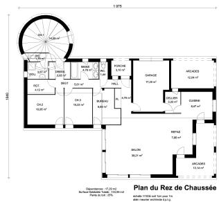

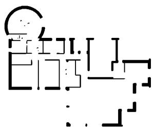

(b) Segmented walls from BlackSet.

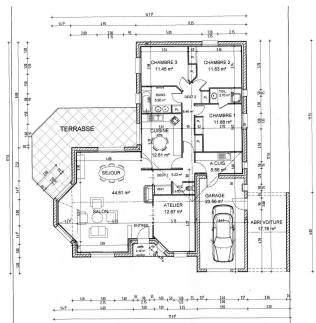  
(c) Original image from TexturedSet.

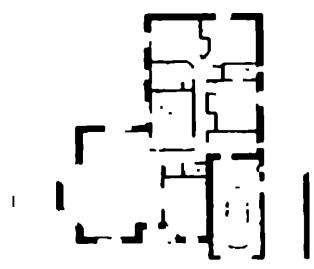

(d) Segmented walls from TexturedSet.

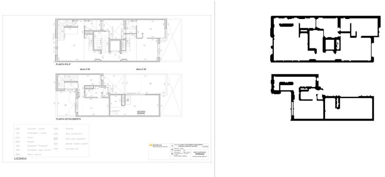  
(e) Original image from TexturedSet2. (f) Segmented walls from TexturedSet2.

(g) Original image from Parallel.

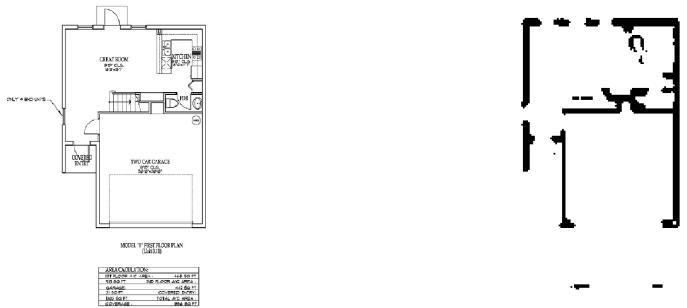  
(h) Segmented walls from ParallelSet.   
Fig. 9: Wall segmentation results for the 4 different datasets.

Table 4: Room Detection results   

<table><tr><td rowspan="2"></td><td colspan="3">BlackSet</td><td>TexturedSet</td></tr><tr><td>[27]</td><td>[2]</td><td>Proposed</td><td>Proposed</td></tr><tr><td>Detection rate (%)</td><td>85</td><td>94.88</td><td>94.76</td><td>90.74</td></tr><tr><td>Rec. accuracy (%)</td><td>69</td><td>81.3</td><td>94.29</td><td>85.65</td></tr><tr><td>One to many count</td><td>2</td><td>1.48</td><td>1.34</td><td>1.4</td></tr><tr><td>Many to one count</td><td>0.76</td><td>2.14</td><td>2.24</td><td>3.4</td></tr></table>

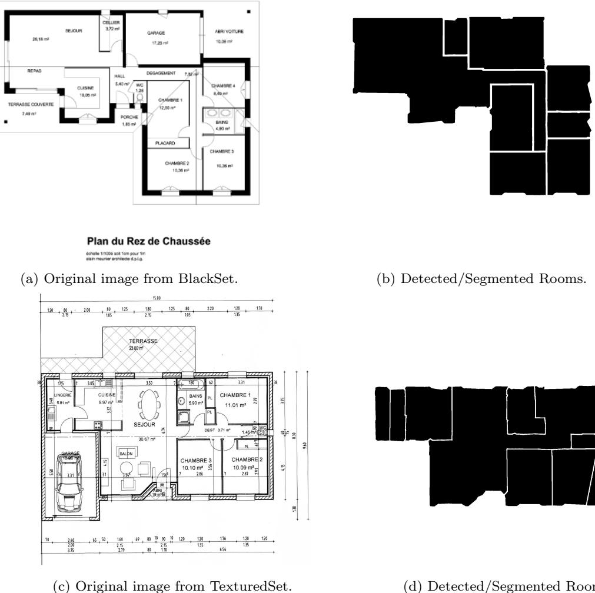  
Fig. 10: Room segmentation Results.

ward to retrieve the structural elements which belong to a certain room and vice-versa.

# 6 Conclusion and Future work

In this paper we present a system to automatically extract the structure of floor plans. Contrarily to the big majority of the existing approaches, the main contribution of our method is that it is not oriented to any specific graphical notation; it is able to extract the structural elements without any prior knowledge of the graphical modeling convention for the floor plans. It only needs a little corpus of ground-truthed documents for learning each new notation. Moreover, our system does not assume the floor plans to be aligned, nor oriented, nor having structural elements only modeled by straight shapes, as many of the literature approaches do. This is achieved thanks to the benefits of combining statistical and structural approaches. The statistical approaches allow high flexibility on learning new floor plan notations, whereas structural context is used to finally recognize the element entities.

On top of that, the results on room detection, which is the element which better defines the structural composition of buildings, highly outperforms the recent published approaches in this framework.

In addition to that, due to the difficulty of objectively comparing different floor plan interpretation approaches, mainly due to the lack of a public corpus, we present four groundtruthed datasets which are shared freely for research purposes. Furthermore, two evaluation protocols, for wall and room detection, are in detail described and automatically implemented, to facilitate the comparison among systems for new researchers working in this topic.

Concerning the future work, we have multiple possible directions for improving our system. In a short term, we will add textual information to the system not only to improve the room detection, specifically, those ones that are not physically separated, but also to be able to label each room according to their semantic functionality. In a middle term, symbol spotting for furniture would be combined with OCR information to improve the room labeling problem. Finally, in a long term, we already started to introduce to the system a syntactic model over an And-Or-Graph, combined with structural stochastic models, which will drive the system to an improved interpretation in terms of the hierarchical, structural and semantic information contained in these documents.

Finally, due to the generality of our system, we plan to adopt it to solve in further challenges when dealing with line-drawing structured documents, such as electrical circuit recognition or map interpretation.

# Acknowledgement

This work has been partially supported by the Spanish projects TIN2009-14633-C03-03 and TIN2011-24631, and by the research grant of the Universitat Aut\`onoma de Barcelona (471-02-1/2010).

# References

1. Ah-soon, C., Tombre, K.: Variations on the analysis of architectural drawings. In: Proceedings of Fourth International Conference on Document Analysis and Recognition, pp. 347–351 (1997)   
2. Ahmed, S., Liwicki, M., Weber, M., Dengel, A.: Improved automatic analysis of architectural floor plans. In: Proceedings of the International Conference on Document Analysis and Recognition, pp. 864–869 (2011) 3. Ahmed, S., Liwicki, M., Weber, M., Dengel., A.: Automatic room detection and room labeling from architectural floor plans. In: Proceedings of the IAPR International Workshop on Document Analysis Systems, pp. 339–343. IEEE (2012) 4. Ahmed, S., Weber, M., Liwicki, M., Langenhan, C., Dengel, A., Petzold, F.: Automatic analysis and sketch-based retrieval of architectural floor plans. Pattern Recognition Letters pp. pre–print (2013)   
5. Aoki, Y., Shio, A., Arai, H., Odaka, K.: A prototype system for interpreting hand-sketched floor plans. In: Proceedings of the 13th International Conference on Pattern Recognition, vol. 3, pp. 747–751 (1996)   
6. Bay, H., Tuytelaars, T., Van Gool, L.: Surf: Speeded up robust features. In: Proceedings of the European Conference on Computer Vision, pp. 404–417 (2006) 7. Boumaiza, A., Tabbone, S.: Impact of a codebook filtering step on a galois lattice structure for graphics recognition. In: Pattern Recognition (ICPR), 2012 21st International Conference on, pp. 278–281 (2012) 8. Cherneff, J., Logcher, R., Connor, J., Patrikalakis, N.: Knowledge-based interpretation of architectural drawings. Research in Engineering Design 3, 195–210 (1992)   
9. Dosch, P., Masini, G.: Reconstruction of the 3d structure of a building from the 2d drawings of its floors. In: Proceedings of the International Conference on Document Analysis and Recognition, pp. 487–490 (1999)   
10. Dosch, P., Tombre, K., Ah-Soon, C., Masini, G.: A complete system for the analysis of architectural drawings. International Journal on Document Analysis and Recognition 3, 102–116 (2000)   
11. Dutta, A., Llad´os, J., Pal, U.: Symbol spotting in line drawings through graph paths hashing. In: Proceedings of the 11th International Conference on Document Analysis and Recognition, pp. 982–986 (2011)   
12. Elkan, C.: Using the triangle inequality to accelerate kmeans. In: Proceedings of the 20th International Conference on Machine Learning, pp. 147–153 (2003)   
13. Escalera, S., Fornes, A., Pujol, O., Escudero, A., Radeva, P.: Circular blurred shape model for symbol spotting in documents. In: Proceedings of the 26th IEEE International Conference on Image Processing, pp. 2005–2008 (2009)   
14. Everingham, M., Van Gool, L., Williams, C., Winn, J., Zisserman, A.: The pascal visual object classes (voc) challenge. International Journal of Computer Vision 88, 303– 338 (2010)   
15. de las Heras, L.P., Fern´andez, D., Valveny, E., Llad´os, J., S´anchez, G.: Unsupervised wall detector in architectural floorplans. In: Proceedings of the 12th International Conference on Document Analysis and Recognition, pp. 1277–1281 (2013)   
16. de las Heras, L.P., Mas, J., S´anchez, G., Valveny, E.: Wall patch-based segmentation in architectural floorplans. In: Proceedings of the 11th International Conference on Document Analysis and Recognition, pp. 1270–1274 (2011)   
17. de las Heras, L.P., Mas, J., S´anchez, G., Valveny, E.: Notation-invariant patch-based wall detector in architectural floor plans. In: Graphic Recognition, Lecture Notes in Computer Science, vol. 7423, pp. 79–88 (2012)   
18. de las Heras, L.P., S´anchez, G.: And-or graph grammar for architectural floorplan representation, learning and recognition. a semantic, structural and hierarchical model. In: Proceedings of the 5th Iberian Conference on Pattern Recognition and Image Analysis, vol. 6669, pp. 17–24 (2011)   
19. de las Heras, L.P., Valveny, E., S´anchez, G.: Combining structural and statistical strategies for unsupervised wall detection in floor plans. In: Proceedings of the 10th IAPR International Workshop on Graphics Recognition, pp. 123–128 (2013)   
20. Hori, O., Tanigawa, S.: Raster-to-vector conversion by line fitting based on contours and skeletons. In: Proceedings of the Second International Conference on Document Analysis and Recognition, pp. 353–358 (1993)   
21. Jiang, X., Bunke, H.: An optimal algorithm for extracting the regions of a plane graph. Pattern Recognition Letters 14(7), 553–558 (1993)   
22. Kittler, J., Hatef, M., Duin, R., Matas, J.: On combining classifiers. Pattern Analysis and Machine Intelligence, IEEE Transactions on 20(3), 226–239 (1998)   
23. Llad´os, J., L´opez-Krahe, J., Mart´ı, E.: A system to understand hand-drawn floor plans using subgraph isomorphism and hough transform. Machine Vision and Applications 10, 150–158 (1997)   
24. Llad´os, J., S´anchez, G., Mart´ı, E.: A string based method to recognize symbols and structural textures in architectural plans. In: Graphics Recognition Algorithms and Systems, Lecture Notes in Computer Science, vol. 1389, pp. 91–103. Springer Berlin Heidelberg (1998)   
25. Lowe, D.: Object recognition from local scale-invariant features. In: Proceedings of the Seventh IEEE International Conference on Computer Vision, pp. 1150–1157 vol.2 (1999)   
26. Lu, T., Yang, H., Yang, R., Cai, S.: Automatic analysis and integration of architectural drawings. International Journal on Document Analysis and Recognition 9, 31–47 (2007)   
27. Mac´e, S., Locteau, H., Valveny, E., Tabbone, S.: A system to detect rooms in architectural floor plan images. In: Proceedings of the 9th IAPR International Workshop on Document Analysis Systems, DAS ’10, pp. 167–174 (2010)   
28. Or, S.H., Wong, K.H., Yu, Y.K., Chang, M.M.Y.: Highly automatic approach to architectural floorplan image understanding & model generation. Proceedings of the Vision, Modeling, and Visualization p. 2532 (2005)   
29. Otsu, N.: A threshold selection method from gray level histograms. IEEE Transactions of Systems, Man and Cybernetics 9, 62–66 (1979)   
30. Phillips, I., Chhabra, A.: Empirical performance evaluation of graphics recognition systems. Pattern Analysis and Machine Intelligence, IEEE Transactions on 21(9), 849–870 (1999)   
31. Rendek, J., Masini, G., Dosch, P., Tombre, K.: The search for genericity in graphics recognition applications: Design issues of the qgar software system. In: Document Analysis Systems VI, Lecture Notes in Computer Science, vol. 3163, pp. 366–377 (2004)   
32. Ryall, K., Shieber, S., Marks, J., Mazer, M.: Semiautomatic delineation of regions in floor plans. In: Proceedings of the Third International Conference on Document Analysis and Recognition, pp. 964–983 (1995)   
33. Santosh, K., Lamiroy, B., Wendling, L.: Integrating vocabulary clustering with spatial relations for symbol recognition. International Journal on Document Analysis and Recognition (IJDAR) pp. 1–18 (2013)   
34. Tombre, K., Tabbone, S., P´elissier, L., Lamiroy, B., Dosch, P.: Text/graphics separation revisited. In: Document Analysis Systems V, Lecture Notes in Computer Science, pp. 615–620 (2002)   
35. Weber, M., Liwicki, M., Dengel, A.: a.SCAtch - A SketchBased Retrieval for Architectural Floor Plans. In: Proceedings of the 12th International Conference on Frontiers of Handwriting Recognition, pp. 289–294 (2010)   
36. Wessel, R., Bl¨umel, I., Klein, R.: The room connectivity graph: Shape retrieval in the architectural domain. In: Proceedings of the 16th International Conference in Central Europe on Computer Graphics, Visualization and Computer Vision (2008)   
37. Zhi, G., Lo, S., Fang, Z.: A graph-based algorithm for extracting units and loops from architectural floor plans for a building evacuation model. Computer-Aided Design 35(1), 1–14 (2003)